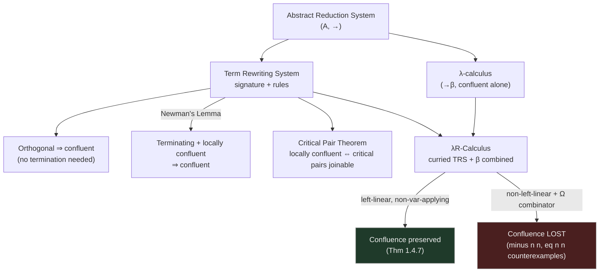

[[book-guidelines|↩ Back to guidelines]]

## Why a type-checker needs a theory of rewriting before it needs a theory of types

Skip ahead to Chapter 2 for a moment and you'll find a type system whose conversion rule says two types are interchangeable whenever they're *equal modulo some rewrite system* — not just equal by β-reduction, but equal because the user declared, say, `plus Z n → n` as a computation rule. That's the whole point of the λΠ-Calculus Modulo (and of DEDUKTI, the checker it's designed for): instead of hard-wiring one fixed notion of computation into the kernel, you let the user supply arbitrary rewrite rules as part of the program, and the type-checker treats them as definitionally-equal-generating machinery, on par with β-reduction itself.

But the moment you let a type-checker treat "reduces to the same normal form" as its equality test, you've made the checker's soundness depend entirely on a property of the rewrite relation that has *nothing to do with types yet*: **confluence** — if a term can reduce two different ways, do those two paths eventually reconverge? If they don't, your equality test stops being well-defined: term $A$ could rewrite to two "final" forms $B$ and $C$ that are themselves irreducible and different, and now the checker has no principled way to decide whether $A \equiv B$ or $A \equiv C$ — worse, it can be tricked into proving `0 = 1` are the same type. So before the thesis can say one word about types, contexts, or judgments, it needs a self-contained toolbox for reasoning about rewriting *in the abstract* — no types, no syntax, just "things that reduce to other things." That toolbox is Chapter 1, and this article covers it.

Think of it as the compiler-engineer's equivalent of proving your term-rewriting-based constant-folding pass is confluent before you trust it to fire in any order the optimizer feels like.

## Abstract Reduction Systems: rewriting with all the syntax stripped away

**What problem this solves.** Confluence, termination, and normalization are properties you want to reuse across wildly different reduction relations — first-order term rewriting, β-reduction, graph rewriting, even abstract state-transition systems. If you prove "a terminating, locally confluent relation is confluent" once, at the most abstract level possible, you get to reuse that theorem (Newman's Lemma) for every concrete rewriting system you'll ever define, instead of re-proving it each time from scratch.

An **Abstract Reduction System (ARS)** throws away everything except a set and a binary relation on it:

$$\text{ARS} = (A, \to) \quad \text{where } {\to} \subseteq A \times A$$

From this alone you can define the vocabulary that will recur for the rest of the thesis:

| Notation | Meaning |
|---|---|
| $x \to y$ | one reduction step |
| $x \to^* y$ | reflexive-transitive closure (zero or more steps) |
| $x \equiv y$ | reflexive-symmetric-transitive closure ("convertibility") |
| $x \downarrow y$ | **joinable**: $\exists z.\ x \to^* z \land y \to^* z$ |

And the two families of properties that everything downstream cares about:

- **Local confluence**: if $x \to y$ and $x \to z$ (one step each, a single "fork"), then $y \downarrow z$.
- **Confluence**: if $x \to^* y$ and $x \to^* z$ (any number of steps), then $y \downarrow z$.
- **Normalizing**: every element reaches *some* normal (irreducible) form.
- **Terminating** (strongly normalizing): no infinite reduction chain exists at all.

**What breaks without confluence.** If $\to$ is not confluent, then $\equiv$ (its symmetric-transitive closure) is not decidable via "reduce both sides to normal form and compare" — because there might be no shared normal form to reduce to, even though the terms are formally convertible. This is exactly the failure mode Chapter 2's type-checking algorithm depends on avoiding: `check` works by normalizing two types and comparing — silently assuming confluence guarantees that normalization order doesn't matter.

```rust
// The abstraction, made concrete: an ARS is just a step relation.
// Confluence is a property of `step`, not of any particular term.
trait ReductionSystem {
    type Term: PartialEq + Clone;
    fn step(&self, t: &Self::Term) -> Vec<Self::Term>; // all one-step reducts
}

fn is_normal<R: ReductionSystem>(sys: &R, t: &R::Term) -> bool {
    sys.step(t).is_empty()
}
```

In Lean, the closures `→*` and `≡` are exactly `Relation.ReflTransGen` and the equivalence closure of a relation — this is not an analogy, it's the same object:

```lean
-- →* is the reflexive-transitive closure; ≡ is its symmetric-transitive extension
def Joinable (r : α → α → Prop) (x y : α) : Prop :=
  ∃ z, Relation.ReflTransGen r x z ∧ Relation.ReflTransGen r y z
```

### Newman's Lemma: the bridge from local to global

Confluence, as defined, quantifies over *arbitrarily long* reduction sequences — not something you can check by inspection. Local confluence only requires checking single-step forks, which for a rule-based system is often a finite, enumerable check (this is exactly what Section 1.2's critical pairs will exploit). **Newman's Lemma** is the theorem that lets you get away with only ever checking the easy, local property:

> **Theorem 1.1.6 (Newman's Lemma).** A *terminating* ARS is confluent if and only if it is locally confluent.

The termination hypothesis is not decoration — it's what rules out an infinite regress in the proof (by well-founded induction on the reduction relation, you can always "close the diamond" one level at a time because you know the recursion bottoms out). This is the connecting bridge the guidelines' key question points at: local confluence is a *statement about one step*, confluence is a statement about a whole reduction relation, and only termination lets you climb from one to the other. Whenever you see a rewriting-system proof in this thesis structured as "show it terminates, then show local confluence via critical pairs," Newman's Lemma is the machine making that pattern valid.

## Term Rewriting Systems: giving rewriting a syntax

An ARS has no notion of *why* $x \to y$ — that's supplied by a **Term Rewriting System (TRS)**, which builds the reduction relation out of a signature and a finite set of rewrite rules.

- A **signature** $\Sigma$ is constants with arities; **terms** $\mathcal{T}(\Sigma, V)$ are built the usual inductive way (variables, or $f(t_1,\dots,t_n)$).
- A **substitution** $\sigma$ is a finite-domain map from variables to terms.
- A **rewrite rule** $(l \hookrightarrow r)$ requires $l$ not be a variable and $\mathrm{Var}(r) \subseteq \mathrm{Var}(l)$ — you can't rewrite *to* a variable that wasn't already bound on the left. (This constraint is exactly the property Chapter 3 will spend an entire chapter learning to relax for the dependently-typed setting.)
- The TRS's step relation closes a rule under substitution and under subterm congruence:
$$\sigma(l) \to_R \sigma(r) \qquad \frac{t_i \to_R s_i}{f(\dots,t_i,\dots) \to_R f(\dots,s_i,\dots)}$$

```rust
// A first-order rewrite rule and one matching step, Rust-shaped.
#[derive(Clone)]
enum Term { Var(String), App(String, Vec<Term>) }

struct Rule { lhs: Term, rhs: Term }

fn match_rule(rule: &Rule, t: &Term) -> Option<Subst> {
    // structural matching of `rule.lhs` against `t`, binding rule's variables
    unify_pattern(&rule.lhs, t)
}
```

If this smells like *pattern matching in a functional-language compiler*, that's not a coincidence — Chapter 4's decision-tree compilation of rewrite rules (§4.8) is precisely the industrial-strength version of this matching problem, extended to match modulo β.

### Critical pairs: making local confluence checkable

Two rules can only "conflict" at a single step if their left-hand sides can literally overlap — one rule's LHS unifies with a non-variable subterm of another's LHS. That overlap, captured formally, is a **critical pair**:

> **Definition 1.2.9.** If $p \in \mathrm{Pos}(l_1)$, $l_1|_p$ is not a variable, and $\sigma$ most-generally unifies $l_1|_p$ with $l_2$, then $\big((\sigma(l_1))[\sigma(r_2)]_p,\ \sigma(r_1)\big)$ is a critical pair.

The payoff is the **Critical Pair Theorem**: *a TRS is locally confluent iff all its critical pairs are joinable.* Since a TRS typically has finitely many rules, it has finitely many critical pairs (up to overlap position) — so this converts an unbounded universal statement ("for every pair of one-step forks...") into a finite, mechanically checkable list. Combined with Newman's Lemma:

$$\text{terminating} + \text{critical pairs joinable} \implies \text{confluent}$$

This exact combination — termination check plus a finite critical-pair check — is the algorithmic template Chapter 6's `is_confluent` oracle (§6.6) will eventually approximate for the full dependently-typed calculus, where termination and full joinability are no longer guaranteed to be decidable.

### Orthogonality: confluence for free, no critical pairs required

The cheapest sufficient condition for local confluence is to have *no* critical pairs at all, plus **left-linearity** (no repeated variable in a rule's LHS — think `f x x → ...`, which is *not* left-linear because `x` repeats):

> **Definition 1.2.13 (Orthogonality).** Left-linear and no critical pairs.
> **Theorem 1.2.14.** Orthogonal systems are confluent.

Notice this theorem needs **no termination hypothesis at all** — orthogonality gives you confluence directly, which matters because plenty of useful rewrite systems (including ones with non-terminating reduction, like unrestrained recursion) are still orthogonal and hence confluent. This is why the guidelines' key question — "why does orthogonality suffice, and why does dropping left-linearity break confluence once β enters the mix?" — cuts right to the heart of the chapter's punchline (see the fixed-point-combinator counterexamples below): left-linearity is doing real, load-bearing work, not just tidying up the definition.

A slightly more permissive criterion, the **Parallel Closure Theorem**, drops "no critical pairs" down to "critical pairs must be joinable via *parallel* reduction $\Rightarrow_R$" (reducing many redexes simultaneously) — still left-linear required, still no termination hypothesis. And **Modularity of Confluence** lets you combine two confluent TRSs over *disjoint* signatures and keep confluence "for free," which is the kind of compositionality result you want if you're building up a library of rewrite rules incrementally (as DEDUKTI users do).

## The untyped λ-calculus, confluent on its own

Section 1.3 recaps the λ-calculus purely as an ARS-with-binders: terms, free/bound variables via $FV$, capture-avoiding substitution $t[x/u]$, and **head β-reduction** $\to_{\beta h}$: $(\lambda x{:}A.t)\, u \to_{\beta h} t[x/u]$, with general β-reduction $\to_\beta$ closing that under application and abstraction congruence.

The landmark result, **Church–Rosser confluence of $\to_\beta$**, is stated without proof here (it's a classical result, not something this thesis needs to re-derive) — but it's the load-bearing fact the rest of Chapter 1 exists to threaten: β-reduction alone is perfectly well-behaved. Everything that follows is about what happens when you *combine* it with a term-rewriting system.

```python
# β-reduction as a substitution step, illustrative only
def beta_step(term):
    if is_application(term) and is_abstraction(term.func):
        x, body = term.func.var, term.func.body
        return substitute(body, x, term.arg)
    return None
```

## Combining TRS and λ-calculus: where confluence gets fragile

This is the section the whole chapter has been building toward, because the λΠ-Calculus Modulo *is*, at its untyped core, exactly this combination: a λ-calculus plus a user-supplied TRS of rewrite rules, mixed together.

**Currification** first strips away first-order arity: a signature is re-encoded with a single binary application symbol $\bullet$, so `plus(m,n)` becomes `•(•(plus, m), n)` — this is precisely how the λΠ-calculus itself has no notion of "arity," only iterated application, so any TRS destined to live inside it must first go through this translation. Currification alone preserves confluence.

Once curried, first-order terms embed into λ-terms via $|\cdot|_\lambda$, and you can define $\to_{\beta R}$: β-reduction plus rewriting by $R$'s rules (curried, embedded), combined into one relation.

**The good case — Theorem 1.4.7:** if $R$ is left-linear *and non-variable-applying* (no rule's left side has the shape $\bullet(x, t)$ with $x$ a variable — i.e., you're never pattern-matching by "applying a variable to something"), then $R$ confluent $\implies$ $\to_{\beta R}$ confluent. Left-linearity survives the combination with β.

**What breaks without left-linearity.** Drop left-linearity and confluence collapses almost immediately, and Chapter 1 doesn't just assert this — it *proves it with a concrete, damning counterexample*, using Turing's fixed-point combinator:

$$Z = \lambda z{:}A.\lambda x{:}A.\, x\,(z\,z\,x) \qquad \Omega = ZZ \qquad \Omega\, t \to_\beta^* t\,(\Omega\, t)$$

$\Omega$ is a term that "unfolds forever, reproducing itself as an argument." Now take the deliberately non-left-linear rule set $R = \{\, \texttt{minus}\; n\; n \hookrightarrow 0,\ \ \texttt{minus}\;(S\,n)\;n \hookrightarrow S\,0 \,\}$ (note: `minus n n` repeats the variable `n` — that's the non-linearity). The proof of **Theorem 1.4.9** exploits $\Omega$ to build one single term, $\texttt{minus}\,(\Omega\,S)\,(\Omega\,S)$, that reduces two genuinely different, irreconcilable ways:

$$\texttt{minus}\,(\Omega S)(\Omega S) \to_{\beta R} 0 \qquad\text{but also}\qquad \texttt{minus}\,(\Omega S)(\Omega S) \to_\beta^* \texttt{minus}\,(S(\Omega S))(\Omega S) \to_{\beta R} S\,0$$

$0$ and $S\,0$ are two distinct normal forms — not joinable, so $\to_{\beta R}$ is **not confluent**. The trick is entirely about $\Omega$'s self-duplicating unfolding interacting with the *repeated occurrence* of `n` in `minus n n`: because the two occurrences of $\Omega S$ can be β-reduced independently and at different rates before the rewrite rule fires, the non-linear rule can "see" the two copies in inconsistent states. A second example (Theorem 1.4.10, using `eq n n → true`) shows the same failure with an even subtler, self-referential $\Omega$-based term.

**Why this is the chapter's real payoff.** For a type-checker builder, this is not abstract nonsense — it is the precise, mechanized reason that *dependent pattern matching with repeated variables* is dangerous once you have general computation in your type theory (β-reduction is always present once you have functions at all). Any language design that allows something like `eq n n → true`-style rules as user-level rewrite rules is one $\Omega$-shaped term away from provable inconsistency. This is exactly why Chapter 3 will spend so much effort characterizing *when* non-left-linearity is safe (only when it's an artifact of typing constraints, never when it's semantically intended) — and why Chapter 5 has to build an entirely separate "weak typing" apparatus just to recover confluence-adjacent guarantees once genuine non-left-linearity is unavoidable.



## Where this leads

Chapter 2 will introduce the λΠ-Calculus Modulo's own reduction relation, $\to_{\beta\Gamma}$ — β-reduction plus a global context's user-declared rewrite rules — as a direct instance of the $\to_{\beta R}$ combination studied here, and its central meta-theoretic property, **Product Compatibility**, is proved (Theorem 2.6.11) as a *consequence of confluence*, exactly mirroring the pattern established in this chapter. Chapter 4 exists specifically to recover a usable notion of confluence once rewrite rules need λ-abstractions on their left-hand side (matching "under binders"), which the naive treatment here cannot support — it does so by importing an entirely different confluence toolkit (Higher-Order Rewrite Systems) rather than extending this chapter's first-order one. And Chapter 5's whole apparatus of "black" and "white" positions exists precisely to salvage product compatibility in the presence of the kind of genuine, unavoidable non-left-linearity whose danger this chapter first demonstrates with $\Omega$.

For the standing goal of building a Rust-based dependently-typed verifier: this chapter is the ancestor of your unifier's and elaborator's most basic soundness obligation. Every time your kernel's `isDefEq`-equivalent normalizes two terms and compares them, it is silently relying on confluence of the underlying reduction relation (`type-theory`) — and the moment your language admits user-extensible computation rules (rewrite rules, recursors, `match` compiled to rules), you inherit this chapter's exact burden: proving orthogonality, or termination-plus-joinable-critical-pairs, or accepting the more surgical criteria later chapters develop for cases where neither holds outright.
