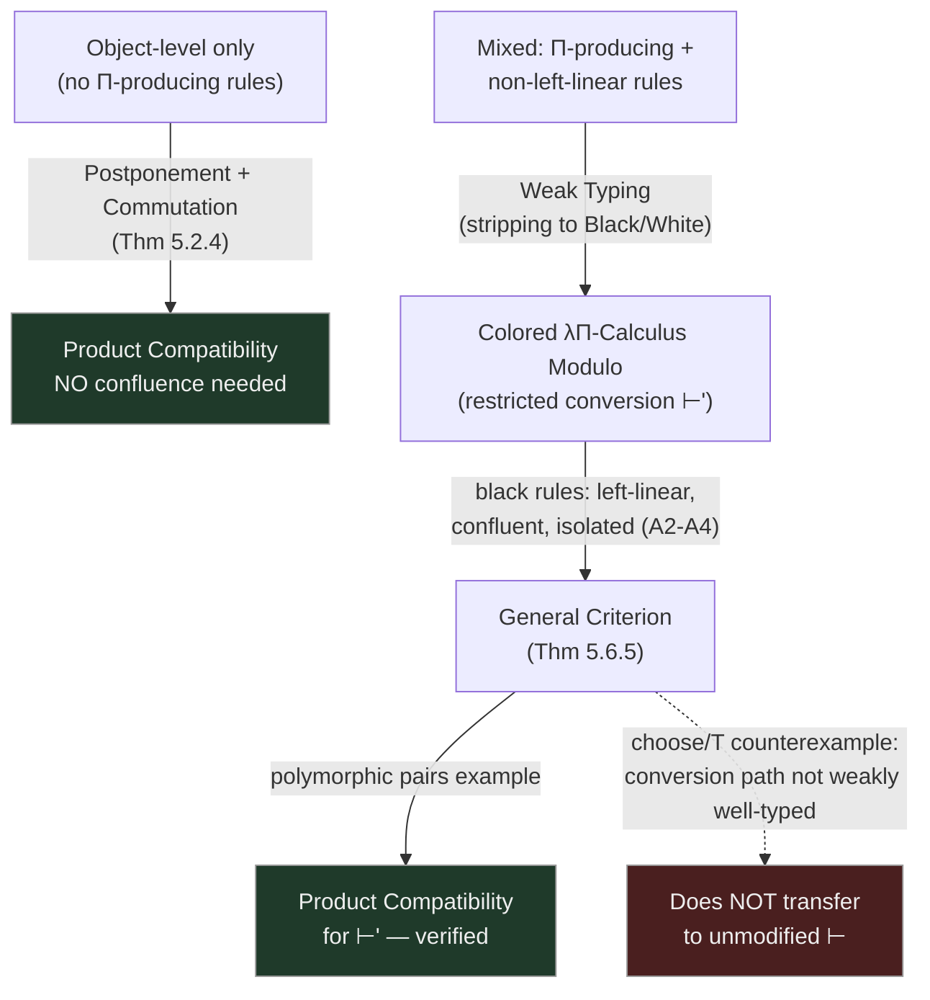

[[book-guidelines|↩ Back to guidelines]]

## Why some non-linearity can't be linearized away

[[Well-Typedness-of-Rewrite-Rules|Chapter 3]] taught us how to *linearize* a non-left-linear rewrite rule when the non-linearity is a mere artifact of dependent typing — `tail n (vcons n e l) → l` becomes `tail n1 (vcons n2 e l) → l`, and both rules behave identically on well-typed terms because typing constraints already force $n_1 \equiv n_2$ whenever a redex is well-typed. But this trick has a hard boundary. Consider `eq n n ,→ true` — a rule whose entire *point* is to test whether two terms are syntactically the same. Linearizing it to `eq n1 n2 ,→ true` doesn't preserve behavior — it destroys it, turning "equality test" into "always true." **Some non-linearity is semantically load-bearing, not a typing artifact**, and Chapter 3's toolbox has nothing to say about it.

This is exactly the failure mode [[Abstract-Rewriting-and-Confluence-Theory|Chapter 1]] demonstrated with Turing's $\Omega$: genuinely non-left-linear rules combined with β-reduction are "almost always" non-confluent. Since confluence has been the thesis's primary route to product compatibility ever since Theorem 2.6.11, and product compatibility is the linchpin of subject reduction ([[Subject-Reduction-Product-Compatibility-and-Uniqueness-of-Types|Chapter 2]]), losing confluence looks like losing everything. **This chapter's entire project is to prove product compatibility can survive even when confluence itself cannot** — by finding a route around confluence rather than trying to force it.

## First win: object-level rewriting gets product compatibility for free

**The key structural distinction, motivated by a real difference in danger level:** a rewrite rule is **Π-producing** if its right-hand side contains a product type not hidden inside an abstraction's own type annotation — i.e., the rule can *manufacture* a new $\Pi$-type as its result. Object-level rules (computing on values like naturals or vectors) are never Π-producing; the danger is specifically rules that compute *types themselves*.

> **Theorem 5.2.4.** Global contexts without any Π-producing rewrite rules satisfy product compatibility — **with no confluence hypothesis at all.**

The demonstration is concrete and striking: the following rule set is genuinely, provably **non-confluent** (via the exact $\Omega$-based argument from Chapter 1 — `minus (Ω S) (Ω S)` reduces both to `0` and, via a β-unfolding first, to `S 0`) —

```
minus : nat → nat → nat.
minus n 0        ,→ n.
minus (S n1) (S n2) ,→ minus n1 n2.
minus 0 n        ,→ 0.
minus n n        ,→ 0.        -- genuinely non-left-linear, intentionally
minus (S n) n    ,→ S 0.
```

— **yet it still satisfies product compatibility**, because none of these rules produce a $\Pi$-type. Confluence and product compatibility have quietly come apart: the former fails, the latter survives, because there's a whole class of terms (object-level values) for which type equality never has to consult these rules in the first place.

**What breaks the moment you add a type-level rule that depends on the non-confluent computation:**

```
A : Type.
T : nat → Type.
T 0     ,→ nat → A.
T (S 0) ,→ nat → nat.
```

Since `minus`-style non-confluence lets `0 ≡_{βΓ} S 0` hold in some derived sense (through the object-level system's own quirks — actually here it's more direct: any non-confluent equating of `0` and `S 0` at the object level), `T`'s output type — a genuine $\Pi$-type — becomes ambiguous: `(nat → A) ← T 0 ≡_{βΓ} T (S 0) → (nat → nat)`, yet `A \not\equiv nat`. **Non-confluence at the object level has *propagated* into the type level through a rule whose behavior depends on that object-level computation.** This single example crystallizes the chapter's whole problem statement: object-level non-confluence is containable in isolation, but it leaks the instant a type-level rule "watches" the non-confluent computation and reacts differently to different results.

### The proof technique: postponement + commutation, the load-bearing pattern for the whole chapter

Theorem 5.2.4's proof (and every subsequent confluence-avoiding proof in this chapter) follows a two-lemma template worth internalizing, because it recurs almost verbatim in §5.6:

- **Postponement Lemma (5.2.6):** $\Gamma$-reductions toward a product type can always be *postponed* until after the head-β-reductions that expose that product type — i.e., you can always reorder a reduction sequence so all the "safe" ($\Gamma$) steps happen last.
- **Commutation Lemma (5.2.7):** $\to_\Gamma$ and head-β-reduction $\to_{\beta h}$ **commute** — reducing in either order reaches a common point.

```rust
// The template, abstractly: two independently-checkable lemmas replace one global confluence proof.
trait ProductCompatibilityProof {
    fn postponement(&self) -> bool;  // Γ-steps can be deferred past exposing head-β steps
    fn commutation(&self) -> bool;   // Γ and βh commute
    // Together these substitute for full confluence when proving product compatibility
}
```

Together these two lemmas let the proof "close the diamond" on a $\Pi$-type convertibility *without ever needing global confluence* — a genuinely different proof strategy from Theorem 2.6.11's "reduce both sides to a common normal form."

## Weak typing: an approximate type system built to make subject reduction trivial

**Why the chapter needs a new type system at all**, rather than just extending the postponement/commutation argument to handle Π-producing rules directly: as shown above, once a Π-producing rule's behavior is entangled with a non-confluent object-level computation, **conversions between well-typed terms can pass through genuinely ill-typed intermediate terms** (`T (choose (Ω S) (Ω S) a1 a2)` in the eventual counterexample below is exactly such a term). No argument based on ordinary typing can be applied to intermediate steps that aren't themselves typeable — a direct consequence of the calculus's foundational choice of **untyped** rewriting (see [[The-lambda-Pi-Calculus-Modulo|the very first chapter on this calculus]]).

**The fix: build a strictly weaker, simply-typed approximation of the type system, one so weak that subject reduction is *easy* to prove for it (rather than something requiring product compatibility, confluence, or any of the machinery this chapter is trying to avoid).**

### Weak types: collapsing dependent types down to two colors

$$A, B ::= \mathrm{Kind} \mid \mathrm{Type} \mid \mathrm{Black} \mid \mathrm{White} \mid A \to B$$

The **stripping function** $\|.\|$ erases all object-level dependencies from a λΠ-type or kind, collapsing every declared type *constant* into just one of two colors via a fixed `Color(.)` function:

$$\|C\| = \mathrm{Color}(C) \qquad \|At\| = \|A\| \qquad \|\Pi x{:}A.B\| = \|A\| \to \|B\|$$

**Why exactly two colors, not one per constant?** Saillard is explicit: collapsing everything to just Black/White (rather than preserving each type constant as its own weak-type constant) *maximizes* the chance of proving **weak subject reduction** later — the coarser the classification, the more likely reduction preserves it. But you need *at least* two colors, because §5.6 will use the black/white split to separate "terms allowed to be non-confluent" from "terms that must stay confluent" — a single collapsed color would erase exactly the distinction the whole strategy depends on.

```python
# The stripping function, illustrative: types become one of two colors, arrows compose.
def strip(t):
    if t == "Type": return "Type"
    if t == "Kind": return "Kind"
    if is_constant(t): return color_of(t)         # Black or White, per a fixed assignment
    if is_pi(t): return strip(t.domain) + " -> " + strip(t.codomain)
    if is_app(t) or is_lam(t): return strip(t.body_type)  # object-level info is discarded
```

A rewrite rule is **non-confusing** if it preserves the color of its result — $\mathrm{Color}(\|U\|) = \mathrm{Color}(\|V\|)$ for a type-level rule $(U \hookrightarrow V)$ — the discipline that ensures a whole *weak-type-level* rewrite relation ($\to_{\Gamma w}$, operating purely on the collapsed Black/White skeleton) is itself well-behaved. Crucially, this ground (variable-free) system's confluence is **decidable in polynomial time** — a striking contrast with the undecidability results littered throughout Chapters 2–3, because stripping away dependencies removes exactly the substitution-driven complexity that made those problems hard.

### Weak typing rules: mirroring the simply-typed λ-calculus, almost exactly

The weak typing judgment $\Gamma;\Delta \vdash^w t : T$ (Figure 5.3) mirrors ordinary typing but with an (Application) rule requiring literally `A → B` (not a $\Pi$-type with a dependency), and a (Conversion) rule using the *weak* congruence $\equiv_{\Gamma w}$ instead of $\equiv_{\beta\Gamma}$. **Lemma 5.4.11** confirms this really is an *approximation*: $\Gamma;\Delta \vdash t : T \implies \Gamma;\Delta \vdash^w t : \|T\|$ — every ordinarily-well-typed term is weakly well-typed at the stripped type. But the converse genuinely fails: `plus 0 true` is *obviously* ill-typed ordinarily, yet weakly well-typed the moment `Color(nat) = Color(prop)` — the whole point of the approximation is that it's coarser, accepting some terms ordinary typing would reject.

**The payoff, stated as the section's actual goal:** **Weak Subject Reduction (Theorem 5.4.25)** holds under hypotheses dramatically weaker than the ordinary version needed — just *weak product compatibility* (itself trivially implied by confluence of the tiny, decidable $\to_{\Gamma w}$ relation — Lemma 5.4.17) and *weakly well-typed rewrite rules* (a criterion, Theorem 5.4.27, that is a direct weak analogue of Chapter 3's Theorem 3.3.3, requiring only that the left-hand side be algebraic and both sides share a weak type). None of Chapter 1's confluence-of-the-full-system machinery, none of Chapter 3's pre-solution apparatus — weak typing was engineered from the start to sidestep all of that.

## The Colored λΠ-Calculus Modulo: constraining conversion to stay inside the safe zone

With weak typing established, Saillard defines a genuine **variant calculus**: restrict the (Conversion) rule so it only licenses steps through terms that are themselves *weakly well-typed* along the way.

> **Definition 5.5.1 (Weakly Well-Typed Conversion).** $\Gamma;\Delta \vdash^w t_1 \equiv t_2$ — reflexive-symmetric-transitive closure of steps $t_1 \to_{\beta\Gamma} t_2$ where $t_1$ (hence, by weak subject reduction, every intermediate term) is weakly well-typed.

This gives a strictly **weaker** typing relation $\vdash'$ (Definition 5.5.5 — ordinary typing rules, but with (Restricted Conversion) replacing (Conversion)): $\vdash' \subseteq \vdash$ always (Lemma 5.5.6), and — reassuringly — **$\vdash' = \vdash$ exactly when the underlying rewrite relation happens to be confluent** (Lemma 5.5.7). This is the key design property: the Colored calculus is a *conservative* variant. In the well-behaved (confluent) case, nothing is lost; the restriction only bites in exactly the non-confluent cases where ordinary typing's guarantees were already in jeopardy.

## The general criterion: black rules stay safe, white rules are free to misbehave

Every type constant's color (via `Color(.)`) now gets promoted to a genuine safety classification: a rewrite rule is **black** if its head symbol's weak return type is Black, **white** otherwise, and this extends to positions in a term (a position is black if the subterm there is headed by a black-typed constant, or is an argument slot whose expected type is Black).

> **Theorem 5.6.5 (General Criterion for Product Compatibility).** Under four hypotheses:
> - **(A1)** $\Gamma$ is weakly well-typed;
> - **(A2)** black rewrite rules are left-linear;
> - **(A3)** black rules together with β-reduction are confluent;
> - **(A4)** every non-variable subterm of a black rule's left-hand side occurs only at black positions;
>
> product compatibility holds — **for the Colored λΠ-Calculus Modulo.**

The intuition: **black is the "must stay safe" zone** — black rules are required left-linear and confluent-with-β, exactly the discipline that made Chapters 1–4's machinery work. **White is the "may be non-confluent" zone** — white rules (like a genuinely intentional `eq n n → true`, or the `choose`-style rule below) are allowed to do whatever they like, *as long as their non-confluent behavior never leaks into a black (type-relevant) computation*. (A4) is precisely the leak-prevention condition: a black rule's pattern is never allowed to inspect a white subterm, so white non-confluence structurally cannot influence which black rule fires.

### Internal vs. external reduction: the postponement/commutation template, generalized

To prove Theorem 5.6.5, Saillard defines two new relations replacing $\to_{\beta h}$/$\to_\Gamma$ from §5.2's proof:

- **$\to_{in}$ (Internal Reduction):** any $\to_{\beta\Gamma}$ step occurring *inside a white subterm*, regardless of the reducing rule's own color.
- **$\to_{out}$ (External Reduction):** everything else — the complement, which Lemma 5.6.14 confirms is contained in $\to_\beta \cup \to_{Black}$ (i.e., outside white territory, only β and black rules can fire).

The same two-lemma structure from §5.2 reappears, now relativized to this internal/external split: a **Postponement Lemma** (internal-then-external reorders to external-then-internal), a **Commutation Lemma** (external and internal reductions commute on black terms), and a new **Product Types Lemma** (internal reduction alone can never manufacture a $\Pi$-type at the root — since white terms can't have $\Pi$-type by the color partition, only black-headed reduction paths can expose one). Stitching these three together reproduces exactly Theorem 5.2.4's diamond-closing argument, but now correctly accounting for the fact that reduction can cross between black and white territory in either direction.

### Worked example: polymorphic pairs, verified against all four hypotheses

Returning to §5.3's motivating example — polymorphic pairs encoded via a reified universe $U_T$ (à la [[The-lambda-Pi-Calculus-Modulo-as-a-Logical-Framework|Chapter 2's Calculus of Constructions encoding]]) plus a genuinely non-left-linear surjectivity rule `mk_pair a b (π1 a b p) (π2 a b p) ,→ p`:

```
UT : Type.  ε̇ : UT → Type.  Π̇ : Πa:UT.Πx:(ε̇ a → UT).UT.
ε̇ (Π̇ a b) ,→ Πx:ε̇ a. ε̇ (b x).            -- the only type-level rule
Pair : UT → UT → Type.
mk_pair a b (π1 a b p) (π2 a b p) ,→ p.    -- non-left-linear, intentional
```

Coloring `Color(UT) = Color(ε̇) = Black`, `Color(Pair) = White` makes the verification mechanical: the single type-level rule is non-confusing (Black → Black), the tiny weak rewrite system `Black ,→ Black → Black` is trivially confluent, so weak product compatibility holds (A1). The one black rule (`ε̇ (Π̇ a b) ,→ ...`) is left-linear and confluent-with-β via ordinary Theorem 1.4.7 (A2, A3). And its left-hand side's only non-variable subterm sits at a black position (A4). **All four boxes check** — product compatibility holds for the Colored calculus, mixing a Π-producing rule with a genuinely, intentionally non-left-linear one, exactly the combination Theorem 5.2.4 alone couldn't touch.

## The counterexample: why the criterion cannot transfer back to the unmodified calculus

Saillard is candid about the theorem's real limitation: it's proved *for the Colored calculus's restricted conversion* ($\vdash'$), not the original unmodified calculus's $\vdash$ — and §5.6.4 shows this gap isn't a proof-technique artifact but a genuine mathematical boundary.

```
nat : Type.  A : Type.  B : Type.  a1 : A.  a2 : A.
T : A → Type.
T a1 ,→ A → A.        -- black, Π-producing
T a2 ,→ B → B.
choose : nat → nat → nat → nat → nat.
choose n n x y     ,→ x.      -- white, non-left-linear, intentional
choose (S n) n x y ,→ y.
```

With `Color(nat) = White`, `Color(A) = Color(B) = Color(T) = Black` — the only viable coloring — **all four hypotheses of Theorem 5.6.5 verifiably hold.** Yet:

$$T(\mathtt{choose}(\Omega S)(\Omega S)\,a_1\,a_2) \to_\Gamma T\,a_1 \to_\Gamma A \to A$$
$$T(\mathtt{choose}(\Omega S)(\Omega S)\,a_1\,a_2) \to_\beta^* T(\mathtt{choose}(S(\Omega S))(\Omega S)\,a_1\,a_2) \to_{\beta\Gamma} T\,a_2 \to_{\beta\Gamma} B \to B$$

Two convertible-looking derivations reach $A \to A$ and $B \to B$ — genuinely different types (`nat` $\not\equiv_{\beta\Gamma}$ `A`), so **product compatibility fails for the unmodified calculus.** The precise failure point: to link these two derivations at all, you must pass through $T(\mathtt{choose}(\Omega S)(\Omega S)\,a_1\,a_2)$ — and this intermediate term is **not weakly well-typed**, because `a1`/`a2` (black-typed) are being consumed at what the criterion needs to be a *white* argument position of `choose`. The very conversion path that would witness $A \to A \equiv B \to B$ is precisely the one the Colored calculus's restricted (Conversion) rule refuses to traverse — which is exactly why $\vdash' \subsetneq \vdash$ here (rather than $\vdash' = \vdash$, as it would be if $\to_{\beta\Gamma}$ happened to be confluent). This is a genuinely instructive negative result: **the criterion's restriction to weakly-well-typed conversions is doing essential, load-bearing work**, not an incidental technical convenience.



## Where this leads

Chapter 5's conclusion is unusually candid about the limits of what's been shown: the Colored calculus and Theorem 5.6.5 don't directly rescue the *unmodified* λΠ-Calculus Modulo — but they're not wasted, because [[Type-Inference-and-Type-Checking-Algorithms|Chapter 6]] uses exactly this theorem to prove the *type-inference algorithm's* soundness with respect to both the unmodified and Colored calculi simultaneously (Theorem 6.2.4), turning this chapter's seemingly narrower result into a genuinely load-bearing piece of the final algorithmic story. The chapter also flags two explicit open directions: whether confluence-of-black-rules-alone suffices for *termination* (not just product compatibility) via a Newman's-Lemma-style argument, and whether a genuinely *typed* notion of conversion (à la Martin-Löf Type Theory) could sidestep this whole black/white apparatus — deliberately left as future work, since it "deeply modifies the type system."

For the standing compiler project (`static-analysis`, `type-theory`): the black/white **stratification-by-safety** technique here is a directly transferable pattern for a Rust-based verifier that must mix a trusted, confluence-checked kernel reduction (analogous to "black") with user-extensible, potentially non-confluent computation rules or unverified oracle calls (analogous to "white") — the discipline of "never let a trusted computation's pattern inspect an untrusted subterm" (A4) is exactly the kind of soundness boundary a CSP/abstract-interpretation kernel needs when mixing a sound over-approximating analysis with an unsound-but-useful heuristic search for counterexamples. More narrowly, weak typing's "collapse to a coarse but *provably* well-behaved approximation, verify the real system respects it" strategy is a reusable proof pattern any time full precision makes a soundness argument intractable.
