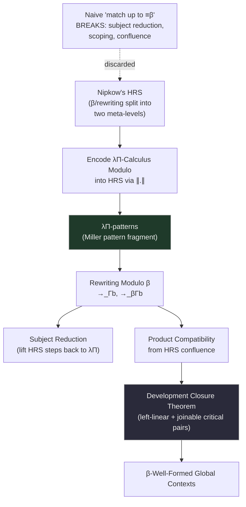

[[book-guidelines|↩ Back to guidelines]]

## Why matching under binders breaks everything Chapter 3 built

[[Well-Typedness-of-Rewrite-Rules|Chapter 3]] gave a rich toolbox for justifying dependent rewrite rules — but it quietly sidestepped one whole category of useful rules: those with a **λ-abstraction directly on the left-hand side**, needed whenever you want to pattern-match "under a binder." A canonical example (the differentiation rule $(e^{f})' = f' \cdot e^{f}$, encoded as a rewrite rule over a `D` operator):

$$D\,(\lambda x{:}\mathbb{R}.\,\mathrm{Exp}(f\,x)) \hookrightarrow \mathtt{fMult}\,(D\,(\lambda x{:}\mathbb{R}.f\,x))\,(\lambda x{:}\mathbb{R}.\mathrm{Exp}(f\,x))$$

Here the pattern `λx:R. Exp(f x)` inspects *inside* an abstraction, matching against the function `f` applied to the bound variable. This is exactly the kind of rule a real proof assistant needs for symbolic differentiation, logical connective manipulation (see the negation-normal-form example below), or any rewriting that has to "see through" a binder rather than treat it as opaque.

**The problem, concretely.** [[Abstract-Rewriting-and-Confluence-Theory|Chapter 1's central warning]] was that combining rewriting with β-reduction is fragile. This rule demonstrates the fragility directly: it introduces a **non-joinable critical peak** against ordinary β-reduction. If you first β-reduce the identity-composed subterm `(λy:R.y) x` inside the pattern, you get `D (λx:R.Exp x)` — but the rewrite rule, matched *syntactically*, can no longer fire on this simplified term, because its left-hand side literally expects `f x` for some free `f`, and `x` alone doesn't unify with `f x` syntactically. Two legitimate reduction paths from the same starting term reach genuinely different, non-reconcilable results — confluence is lost, and with it (via Theorem 2.6.11) product compatibility, and with that, subject reduction itself.

**The fix, in one sentence:** define a generalized rewriting relation where **matching itself happens modulo β-equivalence**, so that `D (λx:R.Exp x)` is recognized as matching the pattern anyway (being β-equivalent to `D (λx:R.Exp((λy:R.y) x))`), closing the peak. This chapter is entirely about making that one sentence rigorous, sound, and — crucially — *efficiently implementable*.

## Why a naive definition of "matching modulo β" fails, three ways

The obvious first attempt — "$t_1$ rewrites to $t_2$ if $\sigma(u) \equiv_\beta t_1$ and $\sigma(v) \equiv_\beta t_2$ for some rule and substitution" — fails for three independent, instructive reasons:

1. **It breaks subject reduction.** Take $\sigma = \{f \mapsto \lambda y{:}\Omega.y\}$ for some deliberately *ill-typed* $\Omega$. The redex $D(\lambda x{:}\mathbb{R}.\mathrm{Exp}\,x)$ is well-typed, but under this naive relation it can rewrite to a result containing $\lambda y{:}\Omega.y$ as a subterm — ill-typed, since $\Omega$ isn't a real type. **Because β-equivalence up to arbitrary substitution can smuggle in an ill-typed witness for a free variable that never actually appears in the visible redex**, well-typedness of the result is no longer guaranteed by well-typedness of the input.
2. **It may introduce free variables.** The same substitution can leave $\Omega$'s own free variables dangling in the output — a basic well-scopedness violation.
3. **It does not even provide confluence** — the very property the whole exercise was meant to recover! A variant rule with two *different*, non-convertible instantiations for the same metavariable (`A₁` vs `A₂`) produces two irreconcilable reducts, defeating the entire point.

**Why this shouldn't be surprising:** the naive definition tries to let β-equivalence "reach into" a substitution's choices with zero structural discipline — exactly the kind of unrestricted higher-order matching that's well known to be intractable (general higher-order unification is undecidable). The fix Saillard adopts instead is to **borrow an entire, independently-developed theory of matching-under-binders** — Nipkow's Higher-Order Rewrite Systems (HRS) — rather than trying to patch the naive definition from scratch.

## Higher-Order Rewrite Systems: a meta-language for rewriting-with-binders

**The core design idea of HRS**, as distinct from the λΠ-Calculus Modulo itself: **β-reduction and rewriting operate at two separate levels.** HRS rewriting is a relation between the *βη-equivalence classes* of simply-typed λ-terms — the λ-calculus here is purely a **meta-language** for representing binders cleanly, not itself the object of rewriting. This separation is precisely what makes "matching modulo β" a solved, well-understood problem rather than something you have to invent from scratch: you push all your β-reduction bookkeeping down into the meta-language's own normal-form machinery (βη-normal forms), and define your *actual* object-level rewrite rules purely between these fixed, canonical representatives.

Concretely: **preterms** are simply-typed λ-terms (using underlined $\underline\lambda$ and $t(u)$ notation to visually distinguish HRS-level binding from the λΠ-calculus's own), and a **term** is a preterm already in **βη-normal form**. Crucially, HRS abstraction variables carry no type annotations at all — they don't need to, because in a simply-typed setting types are recoverable from the fixed signature, unlike the dependently-typed λΠ-calculus where annotations are load-bearing.

### Patterns: the tractable fragment of higher-order unification

**What problem this solves.** General higher-order unification is undecidable — you cannot, in general, decide whether two arbitrary higher-order terms unify. Miller's landmark observation rescues a large, practically useful fragment: **patterns**.

> **Definition 4.3.5 (Pattern).** A term $t$ is a pattern if every free occurrence of a metavariable $F$ appears in a subterm $F\,\vec u$ where $\vec u$ is η-equivalent to a list of *pairwise distinct bound variables*.

This is precisely **Miller's pattern unification fragment** — the exact concept the standing compiler project's learning goals flag by name as central to elaborator design (`type-theory`, `automated-reasoning`): a metavariable applied only to distinct bound variables is guaranteed a *unique, computable most general unifier* whenever it unifies at all — this is the tractability boundary any Lean-style elaborator's unifier is engineered to stay inside, and it's the same underlying mathematical fact showing up here, decades earlier, as the mechanism making HRS-based rewriting decidable at all.

An HRS rewrite rule $(l \hookrightarrow r)$ requires $l$ to be a pattern (not a bare metavariable), $FV(r) \subseteq FV(l)$, and both sides share a base type — restrictions that guarantee matching, when it succeeds, behaves essentially like ordinary first-order syntactic matching, just at the meta-level. The canonical worked example — untyped λ-calculus itself, encoded as an HRS with a single base type `Term`, constants `Lam`/`App`, and one rule `(beta) App(Lam(λx.X(x)), Y) ,→ X(Y)` — is worth internalizing on its own: it's the blueprint for the encoding the next section performs on the *λΠ-Calculus Modulo itself*.

## Encoding the λΠ-Calculus Modulo into HRS: making the calculus its own meta-language client

The encoding $\|.\|$ (Definition 4.4.2) is a straightforward structural translation with one clever trick: a *single* base type `Term` represents everything — objects, types, kinds all become HRS-terms of this one type — with `Lam`, `Pi`, `App` as HRS constants representing λΠ-abstraction, product, and application respectively:

```
∥Kind∥         := Kind
∥x∥            := x
∥u v∥          := App(∥u∥, ∥v∥)
∥λx:A.t∥       := Lam(∥A∥, λx.∥t∥)
∥Πx:A.B∥       := Pi(∥A∥, λx.∥B∥)
```

**Lemma 4.4.3** confirms this is a genuine bijection between *untyped* λΠ-terms and well-typed HRS-terms of type `Term` — and it's compositional with substitution (Remark 4.4.5), which is exactly what's needed for the encoding to interact sensibly with rewriting.

The `(beta)` HRS rule — `App(Lam(w, λx.y(x)), z) ,→ y(z)` — simulates the λΠ-calculus's own β-reduction inside the HRS, and Lemmas 4.4.6/4.4.7 establish this correspondence is *exact* in both directions: a β-step at the λΠ level corresponds precisely to a `(beta)`-step at the HRS level, and vice versa. This bidirectional correspondence is the technical linchpin that lets every subsequent confluence result transfer cleanly between the two levels.

### Uniform terms and λΠ-patterns: encoding rewrite rules requires more care

Encoding *terms* was straightforward; encoding *rewrite rules* needs an extra restriction, because HRS variables need a single, fixed simple type, while a λΠ metavariable's applied arity might vary across occurrences. A term is **uniform** for a set of variables if every free occurrence of each of those variables is applied to the *same number* of arguments — this arity-consistency is exactly what licenses assigning each variable one fixed simple type $\mathrm{Term}^{n+1} \to \mathrm{Term}$.

A **λΠ-pattern** (Definition 4.4.11) is then a uniform term where every free-variable occurrence is applied to a vector of pairwise-distinct *bound* variables — directly mirroring Miller's HRS pattern condition, transplanted onto λΠ-terms. Definition 4.4.13 requires a rewrite rule's left-hand side be a λΠ-pattern (with matching arity constraints between both sides) before it can be encoded at all — this is the precise technical gate a rewrite rule must pass to be eligible for "matching modulo β" in the first place.

```rust
// The arity-uniformity check, directly:
fn is_uniform(term: &Term, vars: &HashSet<Var>) -> bool {
    // every free occurrence of a variable in `vars` must be applied
    // to exactly the same number of arguments throughout `term`
    check_consistent_arity(term, vars)
}
```

## Rewriting modulo β: the actual definition, and why it works

With the encoding in place, the definition is now almost anticlimactic in its simplicity:

> **Definition 4.5.1.** $t_1 \to_{\Gamma b} t_2$ (rewriting modulo β) if $\|t_1\|$ rewrites to $\|t_2\|$ in $\mathrm{HRS}(\Gamma)$ — the encoded rule set. Similarly $\to_{\beta\Gamma b}$ uses $\mathrm{HRS}(\beta\Gamma) = \mathrm{HRS}(\Gamma) \cup \{(\mathrm{beta})\}$.

All the naive definition's failures vanish, because the encoding's discipline (uniform terms, patterns, matching modulo the HRS's own well-understood βη-machinery) rules them out structurally rather than needing to be patched post-hoc. Re-examining the introductory example confirms the fix: `D (λx:R.Exp x)` now *does* rewrite (via `→_{Γb}`) to `fMult (D(λx:R.x)) (λx:R.Exp x)` directly — the previously-non-joinable critical peak closes, because matching happens up to the HRS's βη-normalization, which silently absorbs the `(λy:R.y) x → x` step that used to block the match.

**Key properties, each closing a loop back to earlier chapters:**

- **Lemma 4.5.2**: $\to_{\beta\Gamma b} = \to_{\Gamma b} \cup \to_\beta$ — rewriting modulo β genuinely subsumes ordinary β.
- **Theorem 4.5.4 (Subject Reduction for $\to_{\Gamma b}$)**: proved by a beautiful "lifting" argument (Lemma 4.5.5) — any HRS-level modulo-β step can be *pulled back* to an ordinary $\Gamma$-step preceded and followed by ordinary β-steps ($t_1 \leftarrow^*_\beta t_1' \to_\Gamma t_2' \to^*_\beta t_2$), and if $t_1$ is well-typed, the intermediate $t_1'$ can be chosen well-typed too. This means subject reduction for the new relation reduces entirely to subject reduction for the relations *already* proved sound in Chapters 2–3 — no new soundness machinery needed, just a careful bridging lemma.
- **Theorem 4.5.6**: the *congruence* generated by $\to_{\beta\Gamma b}$ coincides exactly with $\equiv_{\beta\Gamma}$ — rewriting modulo β adds new *reduction paths* (useful for confluence) without changing which terms end up considered equal. This is reassuring: extending the calculus's rewriting mechanism doesn't silently strengthen or weaken definitional equality itself.
- **Theorem 4.5.7 (Product Compatibility from Confluence, generalized)**: if $\mathrm{HRS}(\beta\Gamma)$ is confluent, product compatibility holds for $\Gamma$ — the exact analogue of Theorem 2.6.11, but now with a strictly *weaker* hypothesis (confluence only needs to hold at the HRS-encoded level, which is easier to establish given the tools in the next section).

This cluster of results lets Saillard define **β-well-formed global contexts** (Figure 4.1) — Chapter 3's weakly-well-formed contexts, but with the confluence requirement downgraded to confluence *of the HRS encoding* — and Theorem 4.5.10 confirms these remain safe and well-typed, by literally the same proof as Theorem 3.6.9 with Theorem 4.5.7 slotted in for the confluence step. This is a strong signal of how well the earlier chapters' architecture was designed: swapping in a strictly more permissive confluence criterion required essentially zero re-derivation elsewhere.

## Proving confluence modulo β: reusing (and adapting) HRS machinery

Nipkow's own confluence theorem for HRS (terminating $\Rightarrow$ confluent iff critical pairs joinable — the higher-order Critical Pair Theorem, a direct lift of [[Abstract-Rewriting-and-Confluence-Theory|Chapter 1's first-order version]]) is **useless here**, because `(beta)` itself is non-terminating (β-reduction alone can loop, e.g. via $\Omega$), and there's no modularity theorem for HRS analogous to Theorem 1.2.18 that would let you handle `(beta)` and $\mathrm{HRS}(\Gamma)$ separately.

The tool that *does* apply is **van Oostrom's Development Closure Theorem** (Theorem 4.6.6): a **left-linear** HRS is confluent if every **root critical pair** is joinable by **simultaneous reduction** (a generalized parallel-reduction relation, directly analogous to Chapter 1's $\Rightarrow_R$) and every **inner critical pair** commutes with it. **Corollary 4.6.7** applies this directly to $\to_{\Gamma b}$: since `(beta)` is itself left-linear and provably cannot overlap with any encoded user rule (by construction of the encoding), the criterion reduces to checking joinability just among the *user's own* rewrite rules' critical pairs — a checkable, finite condition, exactly mirroring Chapter 1's Critical-Pair-Theorem-plus-Newman's-Lemma pattern, just lifted one level up to accommodate binders.

The three applications in §4.7 — parsing/solving linear equations via a `to_expr` function with genuinely binder-inspecting patterns, negation normal form (pushing `not` through quantifiers, which *needs* `not (forall (λx:Term.p x)) ,→ exists (λx:Term.not (p x))` — a rule that matches under `forall`'s binder), and Assaf's universe reflection for the Calculus of Constructions — are not decoration; each is a concrete case where an abstraction-on-the-left-hand-side rule is *unavoidable* for the intended semantics, and each is discharged mechanically via the Development Closure Theorem plus Theorem 3.2.1 (strongly well-formed rules from Chapter 3), showing the two chapters' machinery composes cleanly.



## Compiling matching-modulo-β to decision trees: making this actually fast

**Why this section matters for an implementation, not just a theory.** Naively testing a redex against every rewrite rule in sequence — re-inspecting the same subterm repeatedly across different rules — is wasteful. `plus`'s four rules (covering the `0`/`0`, `Sn`/`0`-style combinations of two arguments) already show the problem: matching `plus u v` against all four rules naively can inspect `u` and `v` each up to twice. **Decision-tree compilation** (following Maranget's classical technique for ordinary syntactic pattern matching, extended here to matching-modulo-β) restructures this into a single pass that inspects each argument's shape exactly once, branching on what it finds.

Two changes are needed relative to ordinary decision-tree compilation, both because bound variables and β-normalization are now in the picture:

1. **Bound variables must be tracked explicitly** — a `Switch(λ)` branch descends *into* an abstraction, extending the tracked variable set $V$, since matching modulo β needs to know which variables are "under a binder" versus globally free.
2. **Leaves carry flexible-rigid equations, not solved-form ones.** Ordinary pattern matching's leaves are simple substitutions $\{x_i = t_i\}$ with a unique, trivial solution. Here, a leaf instead records equations of the shape $x_i\,\vec y_i = t_i$ (a metavariable applied to bound variables, equated to a term) — a genuine **higher-order pattern-unification problem**, solvable uniquely *only if* $t_i$'s free variables are confined to $\vec y_i$ (exactly Miller's pattern condition surfacing again, now at the level of implementation rather than theory).

The formal apparatus — **matrices** representing batches of same-arity rules for one constant (rows = rules, columns = argument positions, entries = patterns or wildcard `∗`), and specialization operators $S_{(u,n)}$ (specialize on a constant-headed argument), $S_\lambda$ (specialize by descending under a binder), and a default matrix $D$ (rows that don't discriminate on this column) — is a direct generalization of the classical `match`-compilation algorithm used in every ML-family compiler's pattern-match desugaring, extended with one new case ($S_\lambda$) for binder-inspection.

**Theorem 4.8.20 (Soundness)** and **Theorem 4.8.22 (Completeness)** together prove the compiled decision tree computes *exactly* the same `Match` relation as the direct rewrite-rule semantics — every successful decision-tree reduction corresponds to a genuine head-step of $\to_{\Gamma b}$ (Corollary 4.8.21), and every genuine head-step is reproducible by running the compiled tree (Corollary 4.8.23). This soundness-and-completeness pairing is the exact assurance a real implementation needs before trusting a compiled artifact (the decision tree) in place of the rules it was compiled from — precisely the kind of correctness-of-compilation argument you'd want for any pattern-compiler you write for a Rust-based verifier's own `match` desugaring.

## Where this leads

This chapter closes the loop the guidelines flag as its central question: encoding into HRS lets the thesis **import** an entire pre-existing confluence toolkit (critical pairs, Development Closure Theorem) rather than reinventing higher-order confluence theory from scratch — the payoff of choosing the right foundational encoding rather than patching a naive definition ad hoc. [[Non-Left-Linear-Rewriting-and-Weak-Typing|Chapter 5]] picks up where this leaves off: rewriting modulo β solves the *matching-under-binders* confluence problem, but says nothing about *genuinely* non-left-linear rules (as opposed to Chapter 3's typing-artifact non-linearity) — that's a structurally different failure mode needing an entirely different device (weak/colored typing). Chapter 6's actual `check`/`infer` algorithms use β-well-formedness (via `is_confluent`, approximating the Development Closure Theorem) as one of their soundness preconditions, making this chapter's theory directly executable.

For the standing compiler project: Miller's pattern fragment (`type-theory`, `automated-reasoning`) reappears here in a second, independent guise — first as the tractability boundary for metavariable unification in an elaborator, now as the tractability boundary for compiling dependent pattern matching with binder-inspection. Seeing the *same* mathematical restriction solve two superficially different engineering problems (elaboration and pattern-match compilation) is a strong signal that pattern unification is a genuinely fundamental primitive worth implementing once, correctly, and reusing across your kernel's unifier and its `match`-compilation pass — exactly the architecture Agda's own optimizer independently converged on (cited directly in Chapter 3's §3.6.5).
