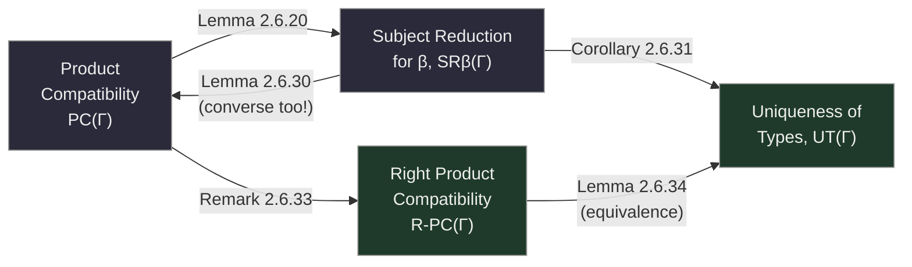

[[book-guidelines|↩ Back to guidelines]]

## Why "it type-checks" needs its own theory of correctness

Suppose you've written a type checker and it accepts a program. What have you actually learned? Not "the program is well-typed forever" — only "this particular term, at this particular moment, has this particular type." If your checker then *reduces* that term (say, to normalize it before comparing against another type), you're implicitly betting that the reduced term is *still* well-typed at the same type. That bet is called **subject reduction**, and Saillard's opening line in this section is worth taking literally: "a type system that does not satisfy such property is not interesting" — you cannot use a type system that lacks subject reduction to prove *anything* about a program's runtime behavior, because the type could simply vanish partway through execution.

The previous topic ([[The-lambda-Pi-Calculus-Modulo|The λΠ-Calculus Modulo]]) explained *why* subject reduction isn't automatic here: because rewriting is untyped, nothing in the calculus's definition guarantees it. This article is where that IOU gets paid — Saillard proves subject reduction reduces to exactly two hypotheses (well-typed rewrite rules, and **product compatibility**), then goes one step further and shows product compatibility, subject reduction, and a third key property — **uniqueness of types** — are all secretly *the same problem* wearing different clothes, and that problem is **undecidable**.

## Product compatibility: the one property that makes β-reduction safe

Recall the definition from before: a global context $\Gamma$ satisfies **product compatibility** ($PC(\Gamma)$) if convertible $\Pi$-types have convertible domains and codomains:

$$\Pi x{:}A_1.B_1 \equiv_{\beta\Gamma} \Pi x{:}A_2.B_2 \implies A_1 \equiv_{\beta\Gamma} A_2 \ \land\ B_1 \equiv_{\beta\Gamma} B_2$$

**What breaks without it.** Picture the (Application) typing rule firing on a redex $(\lambda x{:}A_2.u)\,v$ that's typed via (Conversion) as having a *different-looking* function type $\Pi x{:}A_1.B_1$ (convertible to, but not syntactically identical to, $\Pi x{:}A_2.B_2$). When you β-reduce this to $u[x/v]$, you need $v$'s type $A_1$ to actually match what $u$ expects, $A_2$ — and the only bridge between $A_1$ and $A_2$ is $A_1 \equiv_{\beta\Gamma} A_2$, which is *exactly* product compatibility. Without it, β-reduction could silently substitute a value of the "wrong" type into a function body and the type system would have no way to notice.

The cheapest way to get product compatibility is the theorem you'd expect after reading Chapter 1:

> **Theorem 2.6.11 (Product Compatibility from Confluence).** If $\to_{\beta\Gamma}$ is confluent, then $PC(\Gamma)$ holds.

*Proof sketch:* if the two $\Pi$-types are convertible, confluence lets you reduce both to a **common** term $\Pi x{:}A_0.B_0$ — and since reduction cannot change a $\Pi$-type's head shape (by the stratification you saw in the previous topic), $A_1 \to^* A_0 \leftarrow^* A_2$ forces $A_1 \equiv_{\beta\Gamma} A_2$, and likewise for the codomains. This is precisely why [[Abstract-Rewriting-and-Confluence-Theory|Chapter 1's confluence toolbox]] exists: every criterion proved there (orthogonality, parallel closure, modularity) is now directly usable as a route *into* product compatibility, hence into subject reduction.

```rust
// The chain of reasoning as data dependencies (not a real proof, but the shape of one):
// Confluence(→βΓ) ⟹ ProductCompatibility(Γ) ⟹ SubjectReduction(β, Γ)
struct Confluent;
struct ProductCompatible;
struct SubjectReductionBeta;

fn from_confluence(_: Confluent) -> ProductCompatible { ProductCompatible }
fn from_product_compat(_: ProductCompatible) -> SubjectReductionBeta { SubjectReductionBeta }
```

A useful side lemma (2.6.12): adding a fresh object constant `c : U` to an already-well-typed, product-compatible context *preserves* product compatibility for free — you don't have to reprove confluence from scratch every time you extend a signature with a new declared symbol (though the analogous statement for adding a *type* constant is left as an open conjecture, since the proof technique relies on being able to substitute a fresh object-level variable for `c`, and there's no type-level analogue of an object variable in this calculus).

## Subject reduction splits cleanly along β and Γ

Because $\to_{\beta\Gamma} = {\to_\beta} \cup {\to_\Gamma}$, subject reduction for the combined relation decomposes into two independent lemmas, each needing a *different* hypothesis — this decomposition is the real payoff of untyped rewriting, and it's worth sitting with:

- **Lemma 2.6.20 (SR for $\to_\beta$)** needs *product compatibility* (plus well-typed rewrite rules, needed elsewhere in the derivation). The proof is a direct induction on the typing derivation; the interesting case is exactly the (Application)/redex case sketched above, where product compatibility is invoked to bridge $A_1 \equiv_{\beta\Gamma} A_2$.
- **Lemma 2.6.21 (SR for $\to_\Gamma$)** needs *only* well-typedness of the individual rewrite rules — **not** product compatibility at all, since a user-declared rule's own well-typedness (Definition 2.4.6: "if $\Gamma;\Delta \vdash \sigma(u) : T$ then $\Gamma;\Delta \vdash \sigma(v):T$" for *any* substitution $\sigma$) already carries all the type-preservation guarantee needed.

Combine them and you get the headline theorem:

> **Theorem 2.6.22 (Subject Reduction).** If $\Gamma$ is well-typed, then $t_1 \to_{\beta\Gamma} t_2$ and $\Gamma;\Delta \vdash t_1 : T$ implies $\Gamma;\Delta \vdash t_2 : T$.

Notice the caveat right after Lemma 2.6.21: even though *proving SR for $\to_\Gamma$ alone* doesn't need product compatibility, that doesn't mean product compatibility is dispensable overall — because *proving a dependently-typed rewrite rule is well-typed in the first place* (Lemma 2.6.18, deferred to Chapter 3) itself typically needs product compatibility. The two conditions are entangled at a deeper level than the clean two-lemma split initially suggests.

## Uniqueness of types: why type-checking can be "infer, then compare"

**What problem this solves.** In an untyped or simply-typed setting, "the type of an expression" is unambiguous by construction. In a dependent type theory with a (Conversion) rule, the *same* term can be assigned many different-looking, but convertible, types — `refl 4 : eq (plus 2 2) 4` and `refl 4 : eq 4 4` are both valid derivations of the same term. **Uniqueness of types** ($UT(\Gamma)$) is exactly the guarantee that this multiplicity is harmless — *any* two types you can derive for the same term are always $\equiv_{\beta\Gamma}$-convertible:

$$\Gamma;\Delta\vdash t:T_1 \ \land\ \Gamma;\Delta\vdash t:T_2 \implies T_1 \equiv_{\beta\Gamma} T_2$$

**The payoff, stated up front in the guidelines' framing question, is algorithmic**: once you know $UT(\Gamma)$ holds, checking "does $t$ have type $T$?" reduces to *inferring* some type $T'$ for $t$ (structurally, no guessing) and then running a single *convertibility* check $T \equiv_{\beta\Gamma} T'$ — you never need to consider whether $t$ might have some *other* valid type that happens to match $T$ better. This is precisely the algorithmic backbone of `infer`/`check` in Chapter 6, and it's the exact mechanism a bidirectional elaborator needs: type inference (synthesis mode) plus one convertibility test at the boundary with checking mode, standing in for what would otherwise be an open-ended search over all possible types.

Theorem 2.6.25 proves $UT(\Gamma)$ for any well-typed $\Gamma$ — the (Application) case is the interesting one, and it needs full product compatibility (bridging two possibly-different function types found for the same head `u`) to conclude the two argument-substituted codomains are convertible.

### Right product compatibility: exactly as strong as uniqueness of types

Product compatibility $\Rightarrow$ uniqueness of types, but *not* conversely — a genuinely weaker property suffices for $UT(\Gamma)$. Saillard isolates it as **right product compatibility**:

> **Definition 2.6.32.** Same $\Pi$-types on the *left* ($A$ shared, not just convertible): if $\Pi x{:}A.B_1 \equiv_{\beta\Gamma} \Pi x{:}A.B_2$, then $B_1 \equiv_{\beta\Gamma} B_2$.

This drops the requirement that the *domains* themselves be shown convertible when they already start out syntactically identical — a strictly easier obligation. And the thesis proves this weaker property is *exactly equivalent* to uniqueness of types:

$$R\text{-}PC(\Gamma) \iff UT(\Gamma)$$

The forward direction adapts the uniqueness-of-types proof directly (you never actually needed the domains-differ case). The reverse direction is a slick one-line trick: to derive $B_1 \equiv_{\beta\Gamma} B_2$ from two convertible $\Pi$-types sharing domain $A$, apply a fresh function variable $f : \Pi x{:}A.B_1$ to a fresh $x:A$ — this term has type $B_1$ by the typing rules directly, *and* type $B_2$ by using $f$'s convertible-but-different type $\Pi x{:}A.B_2$ — so uniqueness of types (applied to this one synthetic application term) forces $B_1 \equiv_{\beta\Gamma} B_2$. Constructing a witness term whose two independently-derivable types happen to coincide with exactly the properties you want to relate is a recurring proof pattern worth internalizing — it appears again in Chapter 3's characterization of well-typedness as constraint-set inclusion.

## The equivalence web: three properties, one undecidable core

Putting the pieces together, Saillard proves a tight equivalence and implication structure among all four notions introduced so far (for a context $\Gamma$ with well-typed declarations):



The genuinely surprising result is **Lemma 2.6.30**: $PC(\Gamma) \iff SR_\beta(\Gamma)$ — not just an implication, an *equivalence*. The forward direction was already Lemma 2.6.20; the converse is the hard direction, and its proof is a masterclass in "use subject reduction on a carefully rigged term to extract exactly the equation you need." It builds explicit terms like $(\lambda x{:}A_1. f((\lambda y{:}A_1.y)x))\,a$ — engineered so that subject-reduction-driven reduction *forces* the desired convertibility between domains (and a second, similarly rigged term forces convertibility between codomains). Each of these constructions leans on **Corollary 2.6.29**, itself derived by applying subject reduction to $(\lambda x{:}A.x)\,a$ and using inversion: a strikingly small "identity-function-applied-to-something" gadget that keeps reappearing as the load-bearing trick throughout §2.6.

So: **product compatibility, subject reduction for β, and (via right product compatibility) uniqueness of types are, in a precise sense, all restatements of one underlying property** — whether the calculus's conversion relation is well-enough-behaved on $\Pi$-types.

## Undecidability: the property you actually want is unattainable in general

Given that all these properties collapse to essentially one, it should not be shocking that this one property is **undecidable** — but the *proof technique* is worth understanding, because it is the template for every undecidability result in the thesis (this one, and later, well-typedness of rewrite rules in Chapter 3).

The strategy: **reduce an already-undecidable word problem to product compatibility.**

> **Theorem 2.6.35 (Matijasevitch).** The word-equality problem generated by a specific fixed set $E$ of six equations over $\{a,b\}^*$ (Figure 2.7) is undecidable.

Given any pair of words $(w_1, w_2)$, Saillard builds a global context $\Gamma_p$ that:
1. Declares a type `Word` with constructors $\dot\epsilon, \dot a, \dot b$, letting any word $w$ be encoded as a closed term $|w|$.
2. Adds *both directions* of each equation in $E$ as rewrite rules on these encoded words — so $|w_1| \equiv_{\beta\Gamma} |w_2|$ in the calculus exactly when $w_1 =_E w_2$ in the word problem.
3. Adds one more gadget: a type family `B : Word → Type`, a fresh type constant `T`, and **two conflicting rewrite rules** for `T`: $T \hookrightarrow \mathtt{Word} \to B\,|w_1|$ and $T \hookrightarrow \mathtt{Word} \to B\,|w_2|$.

Since both rules rewrite the *same* symbol `T`, they force $\mathtt{Word}\to B\,|w_1| \equiv_{\beta\Gamma} \mathtt{Word}\to B\,|w_2|$ — two $\Pi$-types (non-dependent arrows) that are convertible by construction. **Right** product compatibility for $\Gamma_p$ would then force $B\,|w_1| \equiv_{\beta\Gamma} B\,|w_2|$, which (since the word-rewriting layer is confluent on its own, being orthogonal to β) is equivalent to $|w_1| \downarrow |w_2|$ — i.e., $w_1 =_E w_2$. Conversely, if $w_1 =_E w_2$, the word-layer rewriting is confluent, so by Theorem 2.6.11 product compatibility holds outright for $\Gamma_p$.

The upshot: **(right) product compatibility holds for $\Gamma_p$ if and only if $w_1 =_E w_2$** — and since the latter is undecidable, so is the former. Corollaries immediately extend this to subject reduction (Corollary 2.6.37, via the $PC \iff SR_\beta$ equivalence) and to uniqueness of types (Corollary 2.6.38, via $R\text{-}PC \iff UT$).

**Why this shouldn't be surprising, and why it matters anyway.** Saillard is upfront that this "is not really surprising" — product compatibility is deeply entangled with confluence, and confluence is *already* undecidable for ordinary first-order term rewriting systems (a classical fact this proof directly adapts). But the significance for a type-checker implementer is not the surprise value — it's that **you cannot write a general algorithm that decides whether an arbitrary global context is well-typed.** Every subsequent chapter's real contribution is therefore not "solve the undecidable problem" but "carve out large, syntactically-recognizable, checkable *sufficient* fragments" — exactly the strategy [[Well-Typedness-of-Rewrite-Rules|Chapter 3]] pursues for well-typedness of individual rules, and [[Rewriting-Modulo-beta-and-Higher-Order-Rewrite-Systems|Chapters 4 and 5]] pursue for product compatibility itself.

## Where this leads

This section is the theoretical center of gravity for the entire thesis: every later chapter's "sufficient criterion" is a criterion for one of the two conditions decomposed here (well-typed rewrite rules, or product compatibility), precisely because §2.6 has already shown that trying to decide either condition in full generality is hopeless. Chapter 3 attacks well-typedness of rewrite rules head-on. Chapters 4 and 5 attack product compatibility, first by importing a richer confluence theory (rewriting modulo β) and then by inventing an entirely new device (weak/colored typing) for the cases where confluence itself can't be recovered.

For the standing compiler-and-elaborator project: the **infer-then-convert** pattern licensed by uniqueness of types (`type-theory`, `automated-reasoning`) is exactly the shape a bidirectional elaborator's `check` function should take — synthesize a type structurally, then discharge a single `isDefEq`-style obligation, rather than attempting an open-ended search. And the undecidability result here is the concrete reason your own kernel's confluence and well-typedness checks (for any user-extensible rewrite/reduction mechanism you add — recursors, custom `iota`-rules, refinement obligations) will necessarily be *sound but incomplete* approximations, never full decision procedures — the same trade-off Chapter 6's `is_confluent` oracle makes explicit.
