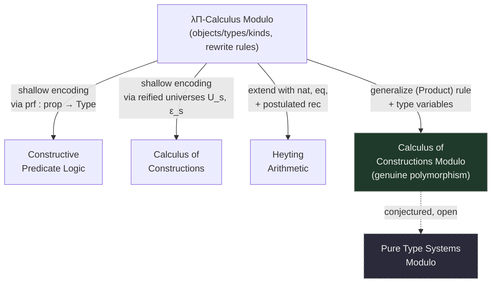

[[book-guidelines|↩ Back to guidelines]]

## Why one type theory can host many logics

A **logical framework** is a meta-language whose entire purpose is to *host* other logics — not by writing an interpreter for them, but by finding a translation under which "provable in the source logic" becomes "well-typed (or typeable at a specific type) in the framework." The λΠ-calculus itself was already used this way (LF, the Edinburgh Logical Framework), via the well-known **judgments-as-types, proofs-as-programs** correspondence. But the ordinary λΠ-calculus can only encode logics *deeply* — representing each inference rule as an explicit constructor for a "proof object" datatype, and writing a separate evaluator/typing function that interprets those proof objects. That's workable, but it throws away the source logic's own computational content: a `β`-reduction inside a source-logic proof doesn't correspond to anything the target type-checker can see happening.

**Shallow encodings avoid this.** The idea is to represent a source-logic proof directly as a λΠ-Calculus Modulo term, engineered so that *the target calculus's own definitional equality* (β-reduction *plus the user's rewrite rules*, from [[The-lambda-Pi-Calculus-Modulo|the previous topic]]) does the work that would otherwise require a separate evaluator. This is exactly why the rewrite-rule extension over plain λΠ matters here: rewrite rules give you the extra "knob" needed to make an encoding shallow rather than deep, because you can now declare computation rules that fire during type-checking itself, mirroring the source logic's own reduction steps.

> **Shallow vs. deep, precisely:** a reduction step in the source language should correspond to one or more $\beta(\Gamma)$-reduction steps in the target; a judgment form in the source (e.g. natural-deduction provability) should correspond directly to the target's own typing judgment. An encoding that doesn't preserve this correspondence is called *deep*.

This article covers three worked shallow encodings — Constructive Predicate Logic, the Calculus of Constructions, Heyting Arithmetic — each following the same three-step recipe, then the **Calculus of Constructions Modulo**, an extension mixing the rewrite-rule machinery with genuine polymorphism.

## The recipe, stated once

Every encoding in this chapter follows an identical pattern, and recognizing the pattern is more valuable than memorizing any one instance of it:

1. **Global context.** Declare constants and rewrite rules capturing the source logic's syntax and its proof-construction rules (each elimination/introduction rule of the source logic becomes a rewrite rule computing what a "proof" of a given connective *is*, as a type).
2. **Embedding functions.** Define translation functions from the source language's terms/propositions/proofs into λΠ-Calculus-Modulo terms.
3. **Soundness and conservativity.** Prove two theorems in each direction:
   - **Soundness**: if the source logic proves $P$, the encoding of $P$ is inhabited (a well-typed proof term exists).
   - **Conservativity**: conversely, if the encoding of $P$ is inhabited, the source logic actually proves $P$ — ruling out the encoding accidentally being "too permissive" and admitting spurious proofs that don't correspond to real source-logic derivations.

Soundness alone is cheap (you can always encode *some* logic unsoundly by making everything trivially provable); **conservativity is the hard, meaningful direction**, because it says the encoding faithfully mirrors the source system with nothing lost and nothing added.

```rust
// The recipe as a trait contract — three obligations, always in this order.
trait ShallowEncoding {
    type SourceTerm;
    type TargetTerm;
    fn embed(&self, source: &Self::SourceTerm) -> Self::TargetTerm;
    // Soundness: source_provable(p) ⟹ ∃ π. Γ;Δ ⊢ π : embed(p)
    // Conservativity: (∃ π. Γ;Δ ⊢ π : embed(p)) ⟹ source_provable(p)
}
```

## Encoding 1: Constructive Predicate Logic — proofs as functions, connective by connective

**Global context.** Two base types, `prop` (propositions) and `term` (first-order terms), the usual logical connectives as constants (`imp`, `and`, `or`, `forall`, `exists`, `true`, `false`), and — the key move — a type family `prf : prop → Type` mapping each proposition to *the type of its proofs*. This is the judgments-as-types correspondence made completely explicit: a proposition is data (`prop`); a proof is a program whose type witnesses which proposition it proves.

Then, instead of writing typing rules for `prf`, you declare **rewrite rules that compute what `prf` unfolds to**, mirroring natural deduction's elimination rules directly as function types:

```
prf (imp P Q)  ,→  prf P → prf Q                              -- implication: a function P-proofs → Q-proofs
prf true       ,→  ΠP:prop. prf P → prf P                      -- ⊤: the polymorphic identity function
prf false      ,→  ΠP:prop. prf P                               -- ⊥: ex falso, produces a proof of anything
prf (and P1 P2) ,→ ΠQ:prop. (prf P1 → prf P2 → prf Q) → prf Q   -- ∧ via its own eliminator, Church-pair style
prf (or P1 P2)  ,→ ΠQ:prop. (prf P1 → prf Q) → (prf P2 → prf Q) → prf Q
prf (exists P)  ,→ ΠQ:prop. (Πx:term. prf (P x) → prf Q) → prf Q
```

If the shape of `prf (and P1 P2)` looks familiar, that's not a coincidence — **this is exactly the Church encoding of a product type**, and `prf (or P1 P2)` is exactly the Church encoding of a sum: the encoding isn't inventing new machinery, it's recognizing that natural-deduction's proof terms for $\wedge$ and $\vee$ *are* the same shape as functional-programming's product and sum eliminators. For anyone who has implemented `Pair`/`Either` via continuation-passing in a functional language, this is the identical trick, run in reverse: propositional connectives *become* their CPS-style eliminators.

The `prf false` rule deserves a second look: it says a proof of `false` is a function producing a proof of *any* proposition `P` — i.e. `ΠP:prop. prf P` — which is precisely *ex falso quodlibet*, encoded not as an axiom but as a **type**, whose inhabitants (functions of that type) are automatically checked by the ordinary typing rules.

**Soundness (Theorem 2.7.10)** is a completely mechanical induction over natural-deduction proof trees — each inference rule of Figure 2.8 gets mapped, case by case, to an explicit λΠ-term construction, invoking (Conversion) at each step to line up the rewrite-unfolded `prf` type with the actually-inferred type. This is long but unsurprising, and the proof pattern is the same one you'd write for a mechanized natural-deduction-to-lambda-calculus translation in any proof assistant.

**Conservativity (Theorem 2.7.14) is the genuinely interesting direction**, and it works by a technique worth internalizing: take an arbitrary well-typed proof term $\pi$ of type $|P|$, use **subject reduction** (this chapter's earlier centerpiece — see [[Subject-Reduction-Product-Compatibility-and-Uniqueness-of-Types|Subject Reduction, Product Compatibility and Uniqueness of Types]]) to reduce $\pi$ to *normal form* without changing its type, then do a **structural case analysis on the shape of the normal form** (it's either a $\lambda$-abstraction headed toward some connective's unfolding, or a variable/hypothesis applied to a spine of arguments). Each case reconstructs, by induction, a genuine natural-deduction proof — the crucial move each time is invoking **product compatibility** to extract, from the convertibility $|P| \equiv_{\beta\Gamma} \Pi x{:}U.V$, that $U$ and $V$ must themselves be convertible to specific expected shapes. This is a direct, concrete payoff of the previous topic's abstract machinery: without product compatibility, this case analysis simply wouldn't go through, because you couldn't conclude anything about $U$ and $V$ from a convertibility between two $\Pi$-types.

**Why weak normalization matters here specifically:** Lemma 2.7.11 asserts $\to_{\beta\Gamma}$ is *weakly* normalizing on well-typed terms for this particular context (not a general theorem — it's specific to this encoding's rule set) — this is what licenses "assume $\pi$ is already in normal form" at the start of the conservativity proof. Termination is doing real, load-bearing work in a proof that otherwise has nothing to do with confluence or type-checking algorithms per se.

## Encoding 2: The Calculus of Constructions — universes as data

The Calculus of Constructions (CoC) adds a second sort `Kind` and lets `Πx:A.B` quantify over *types themselves*, not just objects — this is genuine polymorphism (`∀X:Type. X → X`), which the plain λΠ-calculus cannot express (its `Π` only binds object-level variables). The λΠ-Calculus Modulo, lacking this polymorphism natively, encodes CoC by **reifying the two sorts as data**:

- Two universe types, $U_{\mathrm{Type}}$ and $U_{\mathrm{Kind}}$, whose elements are *codes* standing in for actual CoC types/kinds.
- Two decoding functions, $\epsilon_{\mathrm{Type}} : U_{\mathrm{Type}} \to \mathrm{Type}$ and $\epsilon_{\mathrm{Kind}} : U_{\mathrm{Kind}} \to \mathrm{Type}$, turning a code back into an actual λΠ-type.
- Four "reified $\Pi$" constants $\dot\Pi_{(s_1,s_2)}$ — one per combination of the two sorts a dependent product's domain and codomain can inhabit — each producing a *code* for the corresponding product type, together with rewrite rules unfolding $\epsilon$ applied to a reified product into the actual $\Pi$-type it represents: $\epsilon_T(\dot\Pi_{(T,T)}\,x\,y) \hookrightarrow \Pi z{:}(\epsilon_T x).\epsilon_T(y\,z)$.

This is the classic **Russell-vs-Tarski universe** design question, made concrete: rather than having a genuine "type of types" (which the object/type/kind stratification from [[The-lambda-Pi-Calculus-Modulo|the previous topic]] deliberately rules out), you get a *coded* universe with an explicit decoding function — the same technique used in Coq's and Agda's universe hierarchies, and directly relevant if your compiler project ever needs to represent a universe hierarchy inside a stratified kernel that otherwise refuses to conflate `Type` and ordinary types.

The soundness/conservativity pair here (Theorems 2.7.23/2.7.24) is stated abstractly — citing the original Cousineau–Dowek results rather than re-proving them — because this encoding *is*, essentially, the original motivating example for the whole λΠ-Calculus Modulo project. Termination (Theorem 2.7.22, *strong* normalization this time, a strictly stronger property than the weak normalization used for predicate logic) is again the linchpin the conservativity proof leans on.

## Encoding 3: Heyting Arithmetic — reusing the framework, adding an induction principle

Heyting Arithmetic just **extends** the Constructive Predicate Logic context with Peano naturals, a decidable equality (via rewrite rules directly comparing successor structure: `eq (S n1) (S n2) ,→ eq n1 n2`), arithmetic operations, and — the one genuinely new ingredient — an explicit **induction principle** declared as a single typed constant, not a rewrite rule:

```
rec : Πp:(nat → prop). prf(p 0) → (Πn:nat. prf(p n) → prf(p (S n))) → Πn:nat. prf(p n)
```

This is precisely the type of the `Nat.rec`/`Nat.recOn` induction combinator you'd find in any dependently-typed kernel's built-in recursor for a natural-number inductive type — same shape, same three arguments (base case, inductive step, target), same conclusion. Its presence *as a declared constant rather than a rewrite rule* is a design choice worth noting: unlike `plus`, `mult`, or `eq`, induction has no computational unfolding rule attached in this presentation — it's simply *postulated* as an axiom-shaped constant whose type happens to be the induction schema, and soundness (Theorem 2.7.28) discharges the induction-axiom case of Heyting Arithmetic by directly supplying `rec (λx:nat. ⌜Q⌝)` as the witness term.

The three encodings, side by side, show the encoding-recipe's flexibility: same base predicate-logic scaffold, but Constructive Predicate Logic uses only rewrite rules, CoC needs reified universes plus rewrite rules, and Heyting Arithmetic layers a postulated constant on top of otherwise-ordinary rewrite rules.

## The Calculus of Constructions Modulo: mixing rewriting with real polymorphism

Where the previous three encodings each *simulated* one feature of a richer calculus inside the plain λΠ-Calculus Modulo, §2.8 does the more direct thing: it **extends the calculus itself** to genuinely support polymorphism and type operators natively, by generalizing the grammar to allow types to depend on types (not just via reified universes) — new variable categories $\mathcal{V}_T$, new production rules letting types apply to types and abstract over kinds, and a single generalized typing rule replacing (Product):

$$\text{(CoC-Product)}\quad\frac{\Gamma;\Delta \vdash A : s_1 \qquad \Gamma;\Delta(x{:}A) \vdash B : s_2}{\Gamma;\Delta \vdash \Pi x{:}A.B : s_2}$$

— note the old (Product) rule fixed $s_1 = \mathrm{Type}$; this generalization allows *either* sort in the domain, which is exactly what licenses quantifying over `Type` itself, giving genuine polymorphic definitions like:

```
PList  : Type → Type.
PNil   : ΠX:Type. PList X.
PCons  : ΠX:Type. X → PList X → PList X.
Plength : ΠX:Type. PList X → nat.
Plength X (PNil X)      ,→ 0.
Plength X (PCons X x l) ,→ S (Plength X l).
```

None of these three declarations are expressible in the plain λΠ-Calculus Modulo — they all quantify over `Type` — which is exactly the gap the reified-universe encoding of §2.7.2 exists to paper over; the Calculus of Constructions Modulo simply removes the need for that workaround by making polymorphism a first-class citizen of the syntax and typing rules.

**What makes this section reassuring rather than alarming:** almost every property proved for the plain calculus **transfers with essentially no new proof work** — subject reduction, uniqueness of types, product compatibility from confluence, undecidability of product compatibility, even the previously-open Conjecture 2.6.13 (product compatibility survives adding a *type*-level declaration) becomes provable now that type variables actually exist to substitute a fresh one in the same style as the object-level proof. Only the Inversion lemma needs real restating (a `Π`'s domain can now live at either sort, so the lemma has to track which). This is a strong signal about how *robust* the meta-theory built in §2.6 actually is — it wasn't accidentally tied to the specific object/type/kind stratification, but to the deeper structural facts (stratified syntax exists, conversion respects it, confluence gives product compatibility) that survive the generalization.

**§2.8.5, Toward Pure Type Systems Modulo**, is explicitly a conjecture, not a theorem: the natural next step is dropping the object/type/kind classification entirely and working with an arbitrary Pure Type System plus rewrite rules. Saillard flags honestly that the syntactic stratification trick (central to Lemma 2.3.5 in the very first topic of this book) has no *a priori* analogue in a general PTS, so "extra assumptions may be needed" — an open problem the thesis explicitly declines to solve, rather than papering over.



## Where this leads

This chapter's related-work section (§2.9) situates the thesis's untyped-rewriting choice within a long lineage — Breazu-Tannen's original confluence-preservation theorem for simply-typed λ-calculus plus TRS, through the General Schemata and HORPO termination criteria, to Blanqui's Calculus of Algebraic Constructions (the first system to mix object-level *and* type-level rewriting, the exact frontier this thesis pushes further). The chapter's own conclusion (§2.10) is candid about what's been accomplished: a full meta-theoretic study "which was lacking in [the] original presentation," organized entirely around the two properties — product compatibility and well-typedness of rewrite rules — that every remaining chapter exists to find sufficient criteria for.

For the standing compiler project: the shallow-encoding recipe here (`automated-reasoning`, `type-theory`) is the direct blueprint for how your own elaborator should represent Hoare-logic judgments or refinement-type obligations as literal types in the kernel, rather than as a separate side-channel verification pass — if a Hoare triple's proof obligations can be encoded as `prf`-style dependent types with rewrite-rule-driven unfolding, your kernel's ordinary type-checking *is* your verification condition discharge, with no separate VC-generator needed. And the reified-universe technique from the Calculus of Constructions encoding is precisely the pattern to reach for if your own kernel ever needs a `Type : Type`-adjacent universe hierarchy without sacrificing a stratified, Russell-paradox-safe kernel.
