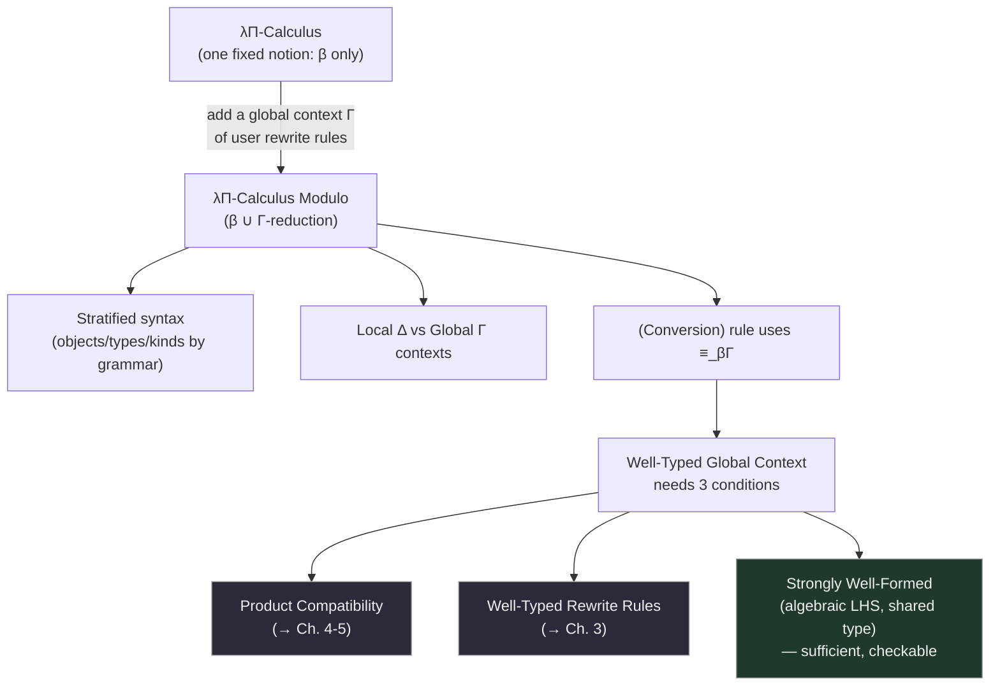

[[book-guidelines|↩ Back to guidelines]]

## Why dependent types alone aren't enough for DEDUKTI

Ordinary dependent type theory (the λΠ-calculus, a.k.a. `LF`) gives you exactly one built-in notion of computation: β-reduction. Two types are "the same" precisely when they reduce to the same normal form under β. That's already powerful — it's what lets `Vec Nat (2 + 2)` and `Vec Nat 4` unify without an explicit proof term — but it hard-wires *one specific* reduction relation into the kernel's notion of equality.

Now suppose you want your kernel to also know that `plus (S n) m` reduces to `S (plus n m)`, or that some encoding of first-order logic satisfies its own domain-specific computation rules. In the λΠ-calculus, these facts have to be smuggled in as *propositional* equalities — proof terms you carry around and manually rewrite with, cluttering every derivation. **The λΠ-Calculus Modulo's founding idea (Cousineau–Dowek) is to let the user extend the kernel's own built-in notion of equality with arbitrary declared rewrite rules** — so `plus (S n) m ≡ S (plus n m)` becomes *definitional*, checked automatically by the kernel exactly the way `(λx.x) a ≡ a` already is. This is precisely what makes the calculus (and DEDUKTI, its implementation) into a **logical framework**: a single type theory expressive enough to host other logics as "just more rewrite rules" [[The-lambda-Pi-Calculus-Modulo-as-a-Logical-Framework|→ see that topic for the encodings themselves]].

This article covers Saillard's *new presentation* of that calculus (§2.1–2.5) — not because the original Cousineau–Dowek version was wrong, but because it wasn't close enough to what a real implementation like DEDUKTI actually does, and that gap is exactly what makes later meta-theory (subject reduction, decidability) hard to state cleanly.

## Two departures from the original presentation

Saillard's version differs from Cousineau–Dowek's original in two ways that matter a great deal for anyone implementing a checker:

1. **Untyped rewriting.** In the original presentation, a rewrite rule is a *quadruple* $(\Delta, l, r, T)$ — left side, right side, the context they were both checked in, and their shared type — and a rewrite step is only licensed by a *well-typed substitution* from that context. This makes rewriting and typing **mutually recursive definitions**: to rewrite, you first need to know the substitution is well-typed, but well-typedness itself depends on the conversion relation, which depends on rewriting. That's elegant on paper but catastrophic for an implementation: **no real type checker re-verifies well-typedness of a substitution on every single reduction step** — DEDUKTI, like every practical checker, just rewrites syntactically and worries about typing separately. Saillard's calculus makes this choice explicit by defining rewrite rules as bare *pairs of terms*, with no context or type attached at all (Definition 2.2.5). The price is that subject reduction — "if a well-typed term reduces, the result is still well-typed at the same type" — is no longer trivially built into the definition; it becomes a real theorem that has to be *proved*, with extra hypotheses.

2. **Rewrite rules as citizens of the global context, added iteratively.** Rewrite rules live in the same context alongside constant declarations, and — crucially — rules added later can be typed *using* rules added earlier. This matches how you'd actually build up a DEDUKTI file: declare `nat`, then `plus`'s rewrite rules, then `mult`'s rules (which use `plus`), and so on.

This is a case where "closer to the real implementation" and "easier to reason about formally" turn out to be in tension, and much of the rest of the thesis is spent recovering the formal guarantees that the original presentation got "for free" but that untyped rewriting gives up.

```rust
// The tension in one signature: an untyped rewrite step knows nothing about types.
struct RewriteRule { lhs: Term, rhs: Term }   // no context, no shared type — Saillard's choice

// vs. the original (Cousineau-Dowek) quadruple:
struct TypedRewriteRule { ctx: LocalContext, lhs: Term, rhs: Term, ty: Term }
```

## Stratified syntax: objects, types, kinds

**What problem this solves.** In an untyped-rewriting world, you can no longer rely on the type system to police what counts as "a term of type `Type`" versus "a type" versus "a value" — because rewriting itself might, in principle, blur those lines before typing ever gets a chance to check them. Saillard's fix is to **build the object/type/kind distinction into the grammar itself**, so it's a syntactic fact, always true, checkable without any typing derivation at all:

$$
\begin{aligned}
t, u, v &::= x \mid c \mid u\,v \mid \lambda x{:}U.t & \text{(Object)}\\
T, U, V &::= C \mid U\,v \mid \lambda x{:}U.T \mid \Pi x{:}U.T & \text{(Type)}\\
K &::= \mathrm{Type} \mid \Pi x{:}U.K & \text{(Kind)}
\end{aligned}
$$

with objects, types, and kinds together comprising the full set of **terms** $\Lambda$ (plus the special symbol `Kind` itself, at the very top).

Compare this to the *typed* alternative (kinds are terms whose type is `Kind`; types are terms whose type is `Type`) — which is how the untyped λ-calculus-with-a-`*`-sort presentation usually works. The syntactic approach costs you a slightly more complex grammar but buys you **Lemma 2.3.5, the Stratification of the Conversion**: *rewriting can never cross between these categories* — you never get "an object convertible with a type" or "a type convertible with a kind" — proved purely by induction on the reduction relation, with zero dependence on whether the reduction relation happens to be confluent. This is the guidelines' first key question in miniature: an *untyped* notion of rewriting pushes real proof obligations elsewhere, and stratification-by-grammar is Saillard paying that cost up front so it doesn't resurface later as an unprovable mess.

```lean
-- The syntactic stratification, made literal as three mutually-recursive inductives.
-- Objects can never "become" a Type or Kind via reduction — it's ruled out by construction.
mutual
  inductive Obj where
    | var : String → Obj
    | const : String → Obj
    | app : Obj → Obj → Obj
    | lam : String → Typ → Obj → Obj
  inductive Typ where
    | tconst : String → Typ
    | tapp : Typ → Obj → Typ
    | pi : String → Typ → Typ → Typ
end
```

## Local vs. global contexts: a distinction Cousineau–Dowek didn't make

Ordinary presentations of dependent type theory have exactly one kind of context: a list of variable-type pairs. Saillard's calculus splits this into two:

- A **local context** $\Delta ::= \varnothing \mid \Delta(x:T)$ — ordinary variable typing declarations, scoped to a single derivation, exactly like the λΠ-calculus's context.
- A **global context** $\Gamma ::= \varnothing \mid \Gamma(c:T) \mid \Gamma(C:K) \mid \Gamma\Xi$ — persistent declarations of *constants* (both object-level `c : T` and type-level `C : K`), plus batches of rewrite rules $\Xi$.

**What breaks without this split.** In the original presentation, "there are only variables" — no separate notion of constant. But a rewrite rule needs to fire on a *fixed, global* symbol regardless of which local scope you're currently type-checking in (`plus` means the same thing whether you're three lambdas deep or at the top level) — conflating that with locally-scoped variables would make it impossible to "dynamically add [rewrite rules] in a type-safe manner" as the file grows, one declaration at a time, the way a real DEDUKTI source file is processed top to bottom.

```rust
// The local/global split, directly:
struct LocalContext(Vec<(String, Term)>);          // scoped to one derivation
struct GlobalContext {
    obj_consts: Vec<(String, Term)>,                // c : T
    type_consts: Vec<(String, Term)>,                // C : K
    rules: Vec<Vec<RewriteRule>>,                    // batches Ξ, added incrementally
}
```

Notice rewrite rules are added **in batches** ($\Xi = R \mid \Xi R$), not one at a time — Remark 2.4.11 flags this as deliberate: only the *whole batch's* confluence needs to hold (not confluence after each individual addition), but each rule in the batch must be independently well-typed *without* relying on the other rules in the same batch. This is a genuinely subtle design point: it lets you declare a set of mutually-recursive-looking rewrite rules together (as you'd naturally want to for, say, a recursive function with multiple equations) while still keeping the well-typedness check for each rule local and simple.

## Two kinds of rewriting, unified into one relation

The calculus's reduction relation is built from two independently-defined pieces:

- **β-reduction** $\to_\beta$: the usual $(\lambda x{:}A.u)\,v \to_\beta u[x/v]$, closed under subterm reduction — completely standard, and completely independent of any global context.
- **Γ-reduction** $\to_\Gamma$: generated by a global context's declared rewrite rules, closed under *both* substitution *and* subterm reduction: $u \to_\Gamma v$ for each rule $(u \hookrightarrow v) \in \Gamma$, and this closes under substitution instances and congruence.

These combine into $\to_{\beta\Gamma} = {\to_\beta} \cup {\to_\Gamma}$, with $\equiv_{\beta\Gamma}$ its symmetric-transitive closure — **this is the calculus's actual notion of type equality**, replacing the plain $\equiv_\beta$ of the ordinary λΠ-calculus. Everything downstream — the (Conversion) typing rule, decidability of type-checking, DEDUKTI's actual `check` implementation — reduces to understanding $\equiv_{\beta\Gamma}$.

This is exactly the $\to_{\beta R}$ combination studied abstractly in [[Abstract-Rewriting-and-Confluence-Theory|Abstract Rewriting and Confluence Theory]] — Chapter 1's warning that combining a TRS with β-reduction can silently destroy confluence is not academic here: it's a live threat to *this specific relation*, and the calculus's entire meta-theory (Section 2.6 onward, and Chapters 3–5) exists to characterize exactly when $\to_{\beta\Gamma}$ stays well-behaved.

## The typing judgment: one new rule, five old ones

The judgment $\Gamma;\Delta \vdash t : A$ (term $t$ has type $A$ in global context $\Gamma$, local context $\Delta$) has exactly the shape you'd expect from the λΠ-calculus:

$$
\text{(Sort)}\ \frac{}{\Gamma;\Delta \vdash \mathrm{Type} : \mathrm{Kind}}
\qquad
\text{(Variable)}\ \frac{(x{:}A)\in\Delta}{\Gamma;\Delta\vdash x:A}
\qquad
\text{(Constant)}\ \frac{(c{:}A)\in\Gamma}{\Gamma;\Delta\vdash c:A}
$$

$$
\text{(Application)}\ \frac{\Gamma;\Delta\vdash t:\Pi x{:}A.B \quad \Gamma;\Delta\vdash u:A}{\Gamma;\Delta\vdash t\,u : B[x/u]}
\qquad
\text{(Product)}\ \frac{\Gamma;\Delta\vdash A:\mathrm{Type}\quad \Gamma;\Delta(x{:}A)\vdash B:s}{\Gamma;\Delta\vdash \Pi x{:}A.B:s}
$$

$$
\text{(Abstraction)}\ \frac{\Gamma;\Delta(x{:}A)\vdash t:B \quad \Gamma;\Delta\vdash \Pi x{:}A.B:s}{\Gamma;\Delta \vdash \lambda x{:}A.t : \Pi x{:}A.B}
\qquad
\boxed{\text{(Conversion)}}\ \frac{\Gamma;\Delta\vdash t:A \quad \Gamma;\Delta\vdash B:s \quad A\equiv_{\beta\Gamma} B}{\Gamma;\Delta\vdash t:B}
$$

The *only* change from the ordinary λΠ-calculus, per Remark 2.4.2, is replacing $\equiv_\beta$ with $\equiv_{\beta\Gamma}$ in the boxed (Conversion) rule — one substitution, with enormous consequences, since every rewrite rule the user declares now silently participates in every single type check performed anywhere in the program via this one rule. If you're building a bidirectional elaborator (as the learning-goals project intends), (Conversion) is the rule your `isDefEq`/unification routine is standing in for at runtime — inference never invokes it explicitly, but every call to your normalizer-and-compare routine *is* an appeal to it.

Local-context well-formedness ($\Gamma \vdash^{ctx} \Delta$) is just the expected recursive check that each declared variable's type itself has type `Type` in the preceding prefix of the context.

## Well-typed global contexts: three conditions, one axiom

Because Saillard's rewriting is untyped, *nothing* automatically guarantees that a rewrite rule you write down preserves typing, or that convertible product types have convertible domains and codomains. These become explicit hypotheses baked directly into the definition of a well-typed global context:

> **Definition 2.4.9 (Well-Typed Global Context).** $\Gamma$ is well-typed if:
> 1. **Well-Typed Declarations** — every $(c:T) \in \Gamma$ has $\Gamma;\varnothing \vdash T : s$ for some sort $s$;
> 2. **Product Compatibility** ($PC(\Gamma)$) — convertible $\Pi$-types have convertible domains and codomains;
> 3. **Well-Typed Rewrite Rules** — every declared rule $\Gamma \vdash u \hookrightarrow v$ preserves typing under any substitution.

The reason conditions (2) and (3) exist at all — rather than being provable lemmas as in an ordinary type theory — is precisely the price of untyped rewriting: since rewriting no longer "knows" about types, subject reduction for $\to_{\beta\Gamma}$ (Theorem 2.6.22, previewed here and proved in full later in the chapter) *decomposes* into exactly these two independent conditions, each of which the rest of the thesis is devoted to finding sufficient criteria for:

- **Product Compatibility** underwrites subject reduction *specifically for β* — see [[Subject-Reduction-Product-Compatibility-and-Uniqueness-of-Types|Subject Reduction, Product Compatibility and Uniqueness of Types]] for why, and Chapters 4–5 for the actual sufficient criteria.
- **Well-Typedness of Rewrite Rules** underwrites subject reduction *for the user's own rules* — the entire subject of [[Well-Typedness-of-Rewrite-Rules|Well-Typedness of Rewrite Rules]] (Chapter 3).

Both are, in general, **undecidable** — flagged already here (§2.4.3) even though the undecidability proofs themselves come later (§2.6.6, §3.7.5). This is why the thesis's actual contribution is not "decide these properties" but "find syntactic, checkable *sufficient* criteria" for each — a familiar move for anyone who has designed a type checker around a decidable fragment of a fundamentally undecidable problem.

### A checkable sufficient criterion: strongly well-formed contexts

Since well-typedness itself is given only *axiomatically* (an existential over a shared type $T$, a product-compatibility property quantified over all $\Pi$-types — not something you can directly run as an algorithm), Section 2.4 immediately supplies the first of several increasingly permissive **inductive**, rule-based sufficient conditions. A rewrite rule is **strongly well-formed** (Definition 2.4.8) if its left-hand side $u$ is **algebraic** (built purely from constants, variables, and application — no bare-variable heads, no lambdas) and both sides can be checked at a *common, shared type* $T$ in some context $\Delta$ whose domain is exactly $u$'s free variables. A whole global context is then **strongly well-formed** (Figure 2.6) by structural induction: start from the empty context, add well-typed declarations, and add rewrite-rule batches whose combined reduction relation is confluent and whose individual rules are all strongly well-formed *relative to the context before the batch was added*.

This is deliberately the most conservative, easiest-to-verify criterion in the whole thesis — every subsequent chapter is a study in how much of "algebraic left-hand side" and "shared type" you can relax while still recovering a well-typed context. Chapter 3's entire arc (bidirectional inference on left-hand sides, pre-solutions, weak well-formedness) is the story of progressively weakening exactly this definition.

## Worked examples: Peano arithmetic, `map`, Brouwer ordinals

The three examples in §2.5 aren't decoration — they're the concrete objects the rest of the chapter's theorems get tested against, and they establish the notational conventions (`nat`, `plus`, `mult`) used throughout the thesis.

**Peano arithmetic**, declared as constants plus rewrite rules:

```
nat : Type.          0 : nat.          S : nat → nat.
plus : nat → nat → nat.
plus 0 n         ,→ n.
plus (S n1) n2   ,→ S (plus n1 n2).
mult : nat → nat → nat.
mult 0 n         ,→ 0.
mult (S n1) n2   ,→ plus n2 (mult n1 n2).
```

This system is **orthogonal** — left-linear, no critical pairs — hence confluent by Chapter 1's Theorem 1.2.14, with zero extra work. Add a weak propositional-style equality via `eq : nat → nat → Type` and `refl : Πn:nat. eq n n`, and the single closed term `refl 4` has type `eq (plus 2 2) 4` — the kernel has just verified $2+2=4$ *purely by computation*, no proof term needed for the arithmetic itself. This single sentence is the entire selling point of "definitional equality modulo a rewrite system" in one line.

The section then deliberately **breaks orthogonality on purpose**: adding symmetric rules (`plus n 0 ,→ n`, commutativity `plus n1 n2 ,→ plus n2 n1`) destroys left-linearity-plus-no-critical-pairs, but Theorem 1.4.7 (left-linear, non-variable-applying, confluent) still applies — so the augmented system stays confluent by a *different* route. The punchline, though, is a warning: the commutativity rule alone is **non-terminating** (`plus n1 n2 → plus n2 n1 → plus n1 n2 → ...`), and non-terminating rewrite rules make type-checking undecidable in general — a practical concern the thesis flags immediately, well before formalizing it.

**`map` on lists** and **addition on Brouwer's ordinals** (`o_plus`, with a case for the limit constructor `lim`) round out the examples — the latter especially useful later because Brouwer ordinals are a classic example of a genuinely infinitary inductive type, foreshadowing how far this "just declare rewrite rules" style of definition can be pushed.



## Where this leads

The rest of Chapter 2 (§2.6 onward) proves the meta-theoretic payoff this section only sets up: subject reduction, uniqueness of types, and their undecidability — covered in [[Subject-Reduction-Product-Compatibility-and-Uniqueness-of-Types|the next topic]]. Section 2.7's logical-framework encodings, and the Calculus of Constructions Modulo extension of §2.8, both build directly on the calculus defined here — see [[The-lambda-Pi-Calculus-Modulo-as-a-Logical-Framework|The λΠ-Calculus Modulo as a Logical Framework]]. And every later chapter's "sufficient criterion for X" (Chapters 3 through 6) is a criterion stated *in the vocabulary this chapter defines* — algebraic terms, strongly well-formed rules, product compatibility — so this article's definitions are the fixed reference point for everything that follows.

For the standing compiler project (`type-theory`): the local/global context split, the stratified syntax, and above all the (Conversion) rule's dependence on $\equiv_{\beta\Gamma}$ are the direct blueprint for how a Rust kernel should represent terms and implement `is_def_eq` once user-extensible computation (not just β) needs to participate in type checking — exactly the situation a refinement-type or rewrite-rule-based verifier will be in.
