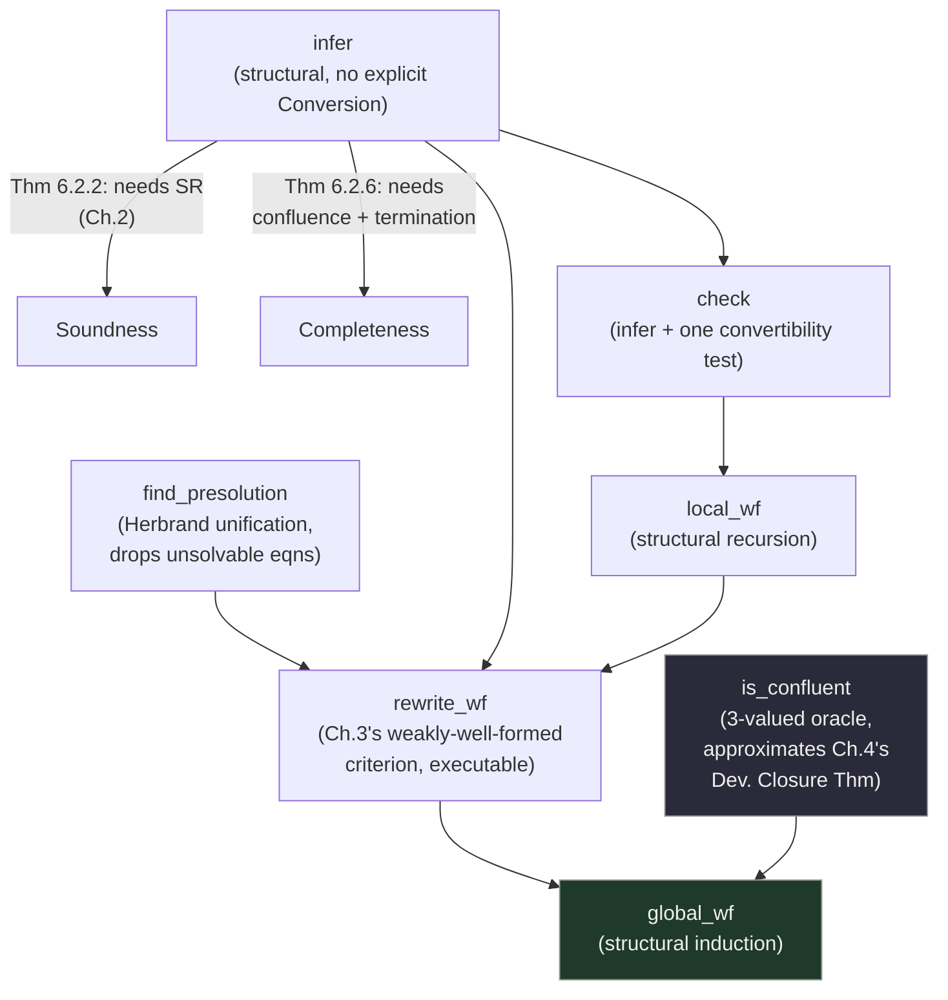

[[book-guidelines|↩ Back to guidelines]]

## Why five chapters of theory finally cash out as pseudocode

Every earlier chapter proved something *about* the λΠ-Calculus Modulo — subject reduction holds under these conditions, product compatibility follows from confluence, well-typedness of rewrite rules reduces to this unification problem. None of that theory, on its own, tells you how to *implement a type checker*. This chapter is where the payoff finally arrives: concrete, OCaml-flavored pseudocode for `infer`, `check`, `local_wf`, `rewrite_wf`, and `global_wf` — the actual algorithms DEDUKTI runs — each one accompanied by a soundness, termination, and (where possible) completeness theorem that cashes in a specific earlier chapter's result. If you're building a Rust-based type checker yourself, this chapter is the most directly transferable material in the entire thesis: it's the part that becomes your kernel's source code almost verbatim.

**A structural convention worth internalizing up front:** every algorithm here is proved sound *unconditionally* (soundness never assumes the properties the algorithm is trying to check — it just says "if this returns an answer, that answer is correct"), but *completeness* (the converse — "if the property genuinely holds, the algorithm will find it") is only provable under confluence-and-termination assumptions that are themselves, per Chapters 2–3, undecidable in general. This is the honest, load-bearing trade-off any dependently-typed checker's implementer has to accept: you can build a checker that never lies, but you cannot build one that's guaranteed to always give an answer.

```rust
// The shape every algorithm in this chapter takes: total, sound, conditionally complete.
enum InferResult<T> { Ok(T), Fail }
fn infer(gamma: &GlobalCtx, delta: &LocalCtx, t: &Term) -> InferResult<Term> {
    // ALWAYS terminates (given termination of the underlying reduction);
    // if it returns Ok(T), that's a real proof — Γ;Δ ⊢ t : T;
    // if it returns Fail, that's not necessarily because t is ill-typed —
    // it might just be a case the algorithm can't handle without confluence.
    unimplemented!()
}
```

Two supporting primitives are assumed as black boxes: `normalize` (reduces a term to normal form w.r.t. $\to_{\beta\Gamma}$ — only guaranteed to terminate on well-typed terms under strong normalization) and `bounded_normalize` (a fuel-limited variant used specifically when a term *might be ill-typed*, sacrificing completeness in exchange for guaranteed termination — a direct engineering answer to the fact that reduction on arbitrary, possibly-ill-typed terms need not terminate at all).

## `infer`: the bidirectional algorithm, made executable

The core algorithm implements the ordinary typing rules of Figure 2.4 directly, structurally, with **one deliberate omission**: the (Conversion) rule is never invoked as its own case. Instead, wherever a typing rule's premise needs a *specific shape* of type (the (Application) rule needs its function's type to already look like a $\Pi$-type), `infer` normalizes the already-inferred type until that shape appears:

```
let infer Γ Δ t =
  match t with
  | Kind          → fail
  | Type          → Kind
  | c             → Γ(c)
  | x             → Δ(x)
  | u v →
      let Tu = infer Γ Δ u in
      let Tv = infer Γ Δ v in
      match normalize Γ Tu with
      | Πx:A.B → if term_eq A (normalize Γ Tv) then B[x/v] else fail
      | _      → fail
  | λx:A.u →
      match infer Γ Δ A with
      | Type → let B = infer Γ (Δ(x:A)) u in Πx:A.B
      | _    → fail
  | Πx:A.B →
      match infer Γ Δ A with
      | Type → (match infer Γ (Δ(x:A)) B with Kind → Kind | Type → Type | _ → fail)
      | _    → fail
```

**Why (Conversion) can stay implicit.** Every place ordinary typing would need to invoke (Conversion) to bridge two convertible-but-syntactically-different types, `infer` instead *normalizes and structurally matches* — the algorithm is betting that convertibility, when it matters, will show up as syntactic equality after normalization. This is exactly the "infer, then convertibility-check" pattern that [[Subject-Reduction-Product-Compatibility-and-Uniqueness-of-Types|uniqueness of types]] licensed back in Chapter 2 — here it's not just a theoretical convenience, it's the literal control-flow of the algorithm.

> **Remark 6.2.1.** You don't actually need to fully normalize $T_u$ on the application case — just reduce until a product type surfaces (head normalization would do). But you *do* need to fully normalize $A$ before comparing it against $T_v$'s normal form via `term_eq`, since `term_eq` only checks syntactic (α-)equality, not convertibility.

### Soundness — leaning directly on subject reduction

> **Theorem 6.2.2 (Soundness of `infer`).** If $\Gamma$ is well-typed, $\Delta$ well-formed, and `infer Γ Δ t = T`, then $\Gamma;\Delta \vdash t : T$.

The proof's interesting step is exactly the application case: having inferred $u : T_u$, we know $T_u \equiv_{\beta\Gamma} \Pi x{:}A.B$ (its normal form) — but to conclude $u$ actually has type $\Pi x{:}A.B$ *itself* (not merely something convertible to it), the proof invokes **subject reduction** (Theorem 2.6.22) plus (Conversion) explicitly, once, at the meta-level. **The algorithm never calls (Conversion) itself — the proof of the algorithm's soundness does**, on the algorithm's behalf. This is the precise sense in which subject reduction is *silently* present in every accepted program: `infer`'s correctness is only as good as the calculus's own type preservation guarantee.

### `safe_infer`: dropping subject reduction as an assumption, at a cost

Because soundness relied on subject reduction, `infer`'s theorem needs $\Gamma$ well-typed as a hypothesis — awkward if you're trying to *verify* well-typedness in the first place (you'd need it already established to trust the checker that establishes it). `safe_infer` closes this gap by *re-checking* the normalized function type is itself well-typed (`Type` or `Kind`) via a recursive call, rather than trusting subject reduction to guarantee it implicitly:

```
| u v →
    let Tu = safe_infer Γ Δ u in
    let Tv = safe_infer Γ Δ v in
    match normalize Γ Tu with
    | Πx:A.B →
        (match safe_infer Γ Δ (Πx:A.B) with
         | Kind | Type → if term_eq A (normalize Γ Tv) then B[x/v] else fail
         | _ → fail)
    | _ → fail
```

**Theorem 6.2.3** proves `safe_infer` sound with *zero* preconditions on $\Gamma$ or $\Delta$ — a genuinely stronger guarantee. But the thesis is candid about the trade-off: "the extra recursive call may be costly and it is, in most cases, useless" — a real DEDUKTI implementation prefers `infer`, accepting subject reduction as a standing invariant the checker maintains throughout a session, rather than re-verifying it defensively on every single application. This is a concrete instance of a recurring engineering trade-off: a stronger, assumption-free guarantee bought at a real, avoidable runtime cost, versus a cheaper algorithm resting on an invariant the system is structured to maintain anyway.

### The unexpected payoff from Chapter 5: `infer` is *also* sound for the Colored calculus

> **Theorem 6.2.4.** If $\Gamma$ is well-typed *for $\vdash'$* (the Colored calculus's restricted typing — see [[Non-Left-Linear-Rewriting-and-Weak-Typing|Non-Left-Linear Rewriting and Weak Typing]]), then `infer Γ Δ t = T` implies $\Gamma;\Delta \vdash t : T$ — for the **unmodified** calculus.

The proof is a one-line trick worth savoring: literally rerun Theorem 6.2.2's proof but concluding $\vdash'$ instead of $\vdash$ (everything goes through identically, since the Colored calculus's typing rules are structurally the same), then invoke Lemma 5.5.6 ($\vdash' \subseteq \vdash$, always) to upgrade the conclusion for free. **This is the concrete payoff Chapter 5 promised but couldn't deliver on its own terms**: even in the counterexample-riddled cases where full product compatibility for $\vdash$ can't be established directly, Theorem 5.6.5's *weaker* criterion for the Colored calculus is still enough to certify `infer`'s soundness for the *real*, unmodified calculus. A theorem that seemed to only apply to an artificial variant turns out to be exactly what's needed to prove something about the calculus everyone actually cares about.

### Termination and completeness: the two dials that must both be turned

**Termination (Theorem 6.2.5)** is nearly free: `infer`'s own recursive calls are always on strict subterms, so the *only* possible non-termination source is `normalize` — and if $\to_{\beta\Gamma}$ terminates on well-typed terms, `normalize` always halts.

**Completeness (Theorem 6.2.6)** needs strictly more: **both confluence and termination** of $\to_{\beta\Gamma}$. Without confluence, normal forms aren't unique, so `normalize Γ Tu` might land on a form that simply isn't a $\Pi$-type even when $T_u$ genuinely is convertible to one — `infer` would then wrongly `fail` on a term that really is well-typed. Without termination, `normalize` might not halt at all. The proof itself is a clean induction combining uniqueness of types (to pin down *which* type `infer` will find, up to convertibility) with confluence (to guarantee the normalized function type in the application case actually surfaces the right shape). **This is the sharpest illustration in the whole thesis of the difference between soundness and completeness as engineering properties**: soundness needs almost nothing (subject reduction, baked into the calculus), completeness needs everything (confluence and termination, both individually undecidable — see [[Subject-Reduction-Product-Compatibility-and-Uniqueness-of-Types|Chapter 2]] and [[Well-Typedness-of-Rewrite-Rules|Chapter 3]]).

## `check`: type-checking as inference plus one convertibility test

This is [[Subject-Reduction-Product-Compatibility-and-Uniqueness-of-Types|uniqueness of types]] made executable, almost word for word:

```
let check Γ Δ t T =
  if term_eq T Kind then term_eq (infer Γ Δ t) Kind
  else match infer Γ Δ T with
       | Type | Kind → term_eq (normalize Γ T) (normalize Γ (infer Γ Δ t))
       | _ → false
```

**Why this reduction is sound at all, restated precisely for the algorithm:** infer a type $T_2$ for $t$; separately confirm the *expected* type $T$ itself has some sort (i.e., is a legitimate type, not garbage); if $T \equiv_{\beta\Gamma} T_2$, conclude $\Gamma;\Delta \vdash t : T$ by (Conversion) — the exact algorithmic mirror of Theorem 2.6.25's proof strategy. **Theorem 6.3.1** bundles soundness (needs nothing beyond `infer`'s own soundness plus a stratification fact about `Kind` only converting to itself), termination (inherits directly from `infer`'s), and completeness (inherits `infer`'s confluence-and-termination requirement, plus stratification to handle the `Kind` case cleanly).

## `local_wf` and the general pattern: soundness is compositional, completeness is fragile

`local_wf` (checking a local context's well-formedness) is a one-line structural recursion — check the prefix is well-formed, the variable is fresh, and its declared type infers to `Type`:

```
let local_wf Γ Δ =
  match Δ with
  | ;         → true
  | Δ0(x:T)   → local_wf Γ Δ0 ∧ (x ∉ dom Δ0) ∧ term_eq (infer Γ Δ0 T) Type
```

Its theorem (6.4.1) is a template you'll see recur throughout the rest of the chapter: **soundness composes almost automatically** (each layer's soundness borrows the previous algorithm's soundness theorem — here, `infer`'s), **termination composes automatically too** (bounded by the previous layer's termination), but **completeness requires re-deriving the same confluence-and-termination precondition at every layer**, because each new algorithm calls the underlying `infer`/`check` machinery whose completeness was never unconditional to begin with.

## `rewrite_wf`: Chapter 3's weakly-well-formed criterion, finally executable

This is where the thesis's most theoretically dense chapter ([[Well-Typedness-of-Rewrite-Rules|Well-Typedness of Rewrite Rules]]) gets turned into runnable code — and it needs three separate pieces working together.

### `find_presolution`: a Herbrand-style unification algorithm for permanent pre-solutions

Recall Chapter 3 needed **permanent pre-solutions** — substitutions guaranteed to remain valid across any *safe* extension of the global context, precisely to license the linearization of typing-artifact non-linearity. `find_presolution` computes one via a syntactic decomposition algorithm that **drops constraints it doesn't know how to solve** rather than failing on them:

```
let find_presolution Γ V C =
  match C with
  | ; → id
  | C0 (t1, t2) →
      match bounded_normalize Γ t1, bounded_normalize Γ t2 with
      (* atomic terms already equal: drop and continue *)
      | Kind, Kind | Type, Type | c1, c2 when c1 = c2 | ... → find_presolution Γ V C0
      (* solved-form equation: bind and substitute through the rest *)
      | x, t | t, x when x ∈ V →
          if x ∉ FV(t) then (find_presolution Γ V C0[x/t]) ⊎ {x → t}
          else fail                                    (* occur check *)
      (* rigid/rigid, same static head: decompose structurally *)
      | c u⃗1, c u⃗2 when c = c ∧ ¬(is_definable c) → find_presolution Γ V (C0, u⃗1 = u⃗2)
      (* structural recursion into binders *)
      | λx:A1.u1, λx:A2.u2 → find_presolution Γ V (C0, A1=A2, u1=u2)
      | Πx:A1.B1, Πx:A2.B2 → find_presolution Γ V (C0, A1=A2, B1=B2)
      (* genuinely unsolvable-but-ignorable equations: just drop them *)
      | x u⃗, t | c, t | c u⃗, t when x∈V ∨ is_definable(...) → find_presolution Γ V C0
      | _, _ → fail
```

The crucial design insight, stated explicitly in the source: **"we do not need to compute a solution of the unification problem but only a prefix to all solutions."** Because a pre-solution only needs to be *more general than* every actual solution — not itself a solution — the algorithm can safely **discard** any equation it can't decompose (an equation involving a *definable* symbol's unfolding, say, which might resolve any number of unpredictable ways depending on future extensions) rather than getting stuck or guessing. This is precisely why `bounded_normalize` (not `normalize`) is used here: the terms being unified are the left-hand sides of rewrite rules under construction, which are not yet known to be well-typed — full normalization could simply loop.

**Lemma 6.5.1** proves the algorithm always terminates (via a well-founded ordering on variable-count and subterm structure) and that its result is genuinely a *permanent* pre-solution — the proof's key step exploits exactly the same static-symbol confluence argument from Chapter 3's Definition 3.6.3 (a static symbol's head can only be equal across a safe extension if its arguments already are, by confluence).

### `infer_lhs`/`check_lhs`: a partial implementation of Chapter 3's bidirectional system

These implement the constraint-recording bidirectional relations $\Rightarrow_i / \Rightarrow_c$ from Chapter 3's §3.5 — but *deliberately partially*: abstractions on a left-hand side never need their type annotation checked or inferred, "since abstractions always occur as arguments in left-hand sides of rewrite rules, their type is always known in advance" from the surrounding context. **This is a genuine engineering simplification licensed by a structural fact about how left-hand sides are actually used**, not a shortcut that sacrifices correctness — Lemma 6.5.2 confirms both functions remain sound with respect to the full bidirectional relations.

### Assembling `rewrite_wf`

```
let rewrite_wf Γ (f u⃗ ,→ v) =
  let (Δ, C, T) = infer_lhs Γ ∅ ∅ ∅ (f u⃗) in
  let σ = find_presolution Γ (FV(f u⃗)) C in
  if is_definable f ∧ local_wf Γ σ(Δ) then check Γ σ(Δ) v σ(T) else false
```

Three previously-independent pieces of machinery — bidirectional constraint inference, Herbrand-style permanent-pre-solution computation, and the `check` algorithm from earlier in this chapter — compose into one function whose soundness theorem (Lemma 6.5.3) simply chains their individual soundness proofs. This composability is a strong argument, in retrospect, for why Chapter 3 built its theory the way it did: each conceptual layer (bidirectional inference, then pre-solutions, then the safe-extension discipline) maps onto one clean, independently-testable function here.

## `global_wf`: closing the loop with an honest confluence oracle

The final piece needs to decide $\beta$-well-formedness ([[Rewriting-Modulo-beta-and-Higher-Order-Rewrite-Systems|Chapter 4's]] Definition 4.5.8) — and the one genuinely undecidable ingredient is confluence itself. Saillard doesn't pretend otherwise:

```
type ext_bool = ext_true | ext_false | maybe
val is_confluent : global_context → ext_bool
```

**The three-valued return type is the whole point.** `is_confluent` is explicitly described as implementing "a simplification of van Oostrom's Development Closure Theorem" ([[Rewriting-Modulo-beta-and-Higher-Order-Rewrite-Systems|Chapter 4's confluence criterion]]) — a **sound but incomplete** approximation: `ext_true` means confluence is genuinely certified (safe to trust), `ext_false` and `maybe` both mean "the oracle couldn't establish it," collapsing an undecidable three-way distinction (definitely confluent / definitely not / genuinely unknown) into a decision procedure that only ever *asserts* the positive case with certainty. This is precisely the honest algorithmic stance an undecidable property demands: a decision procedure that only rules affirmatively when it has a real proof, and otherwise conservatively refuses.

```
let global_wf Γ =
  match Γ with
  | ;          → true
  | Γ0(c:T)    → global_wf Γ0 ∧ c ∉ dom(Γ0) ∧ term_eq (infer Γ0 ∅ T) Type
  | Γ0(C:K)    → global_wf Γ0 ∧ C ∉ dom(Γ0) ∧ term_eq (infer Γ0 ∅ K) Kind
  | Γ0 Ξ       → global_wf Γ0 ∧ (is_confluent Γ = ext_true)
                              ∧ (∀(u,→v) ∈ Ξ. rewrite_wf Γ0 (u,→v))
```

**Theorem 6.6.1** proves soundness by structural induction directly mirroring Figure 4.1's inference rules for $\beta$-well-formed contexts — each case of `global_wf` is a literal transcription of the corresponding inference rule, checked against the algorithms already built (`infer` for declarations' well-typedness, `rewrite_wf` for each batch's individual rules, `is_confluent` for the batch's joint confluence). This is the thesis's final demonstration that the entire proof-theoretic apparatus — five chapters of definitions, lemmas, and undecidability results — bottoms out in one recursive function whose correctness argument is, structurally, just "each case matches a rule; each rule was already proved sound."



## Where this leads

The thesis's Conclusion (p. 152) states plainly that these are the exact algorithms implemented in DEDUKTI — this chapter is not a theoretical afterthought but the literal specification of a working proof-checker, closing the loop the Introduction opened: everything from Chapter 1's abstract confluence theory to Chapter 5's black/white typing discipline exists ultimately to make *this* chapter's five functions provably correct.

For the standing compiler project (`type-theory`, `automated-reasoning`): this chapter is close to a direct blueprint for your own Rust kernel's `infer`/`check` pair — the "infer structurally, normalize only where a specific shape is needed, never call Conversion explicitly" discipline is exactly how a bidirectional elaborator's core type-checking loop should be written, and the `safe_infer`-vs-`infer` trade-off is a genuine design decision you'll face (trust an invariant your elaborator maintains, or re-verify it defensively at cost). `find_presolution`'s "unify syntactically, drop equations you can't decompose, keep only a *prefix to* all solutions" strategy is directly the shape your own metavariable-constraint solver should take when discharging Miller-pattern unification problems that arise from dependent pattern matching. And `is_confluent`'s three-valued, sound-but-incomplete oracle design is the honest template for any decision procedure your CSP/theorem-prover kernel builds around an undecidable property — never claim more certainty than a real proof search actually establishes.
