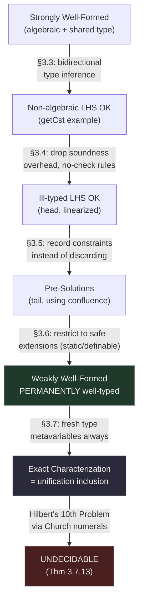

[[book-guidelines|↩ Back to guidelines]]

## Why "algebraic and well-typed" is too strong a criterion

Chapter 2 left us with a working but blunt tool: **strongly well-formed** rewrite rules — algebraic left-hand side, both sides sharing a common type — are guaranteed permanently well-typed (see [[The-lambda-Pi-Calculus-Modulo|The λΠ-Calculus Modulo]]). This chapter's entire arc is a sequence of five increasingly permissive re-definitions of "sufficient criterion for well-typedness," each one strictly generalizing the last, ending in an *exact* characterization and a proof that even the exact version is undecidable. If you're building an elaborator that needs to accept dependent pattern matching, this chapter is the single most load-bearing piece of theory in the thesis — it's the difference between a checker that can only accept `plus`/`mult`-style algebraic definitions and one that can accept real dependently-typed code with matches under binders.

Two concrete motivating failures open the chapter, and both recur throughout:

**Failure 1 — non-algebraic left-hand sides are sometimes fine.** The rule `getCst (λx:nat.n) → n` (extracting a constant function's return value) has an abstraction on its left — not algebraic — yet it's obviously type-safe: `n`'s type can be inferred from context regardless.

**Failure 2 — algebraic-and-well-typed left-hand sides are sometimes *too rigid*, and that rigidity actively destroys confluence.** Consider vectors indexed by length:

```
Vector : nat → Type.
vcons : Πn:nat. term → Vector n → Vector (S n).
head : Πn:nat. Vector (S n) → term.
head n (vcons n e l) ,→ e.        -- strongly well-formed, but n repeats!
```

`head`'s rule is strongly well-formed by the old criterion — but it repeats the variable `n`, making it **non-left-linear**. And [[Abstract-Rewriting-and-Confluence-Theory|Chapter 1 already proved]] that non-left-linear rules combined with β-reduction tend to break confluence outright — the exact same mechanism as the `minus n n` counterexample built from Turing's $\Omega$. Since confluence is the thesis's main route to product compatibility (via Theorem 2.6.11), a strongly well-formed but non-left-linear rule is a live threat to the whole calculus's soundness, not a cosmetic inconvenience.

**The fix — linearize, but justify it.** Replace `n` by two fresh variables: `head n1 (vcons n2 e l) → e`. This is left-linear, hence confluence-friendly by Theorem 1.4.7, but is it still *the same function*? Saillard's key observation: **any well-typed instance of the redex forces `n1` and `n2` to already be convertible** — `Vector (S n1)` (from `head`'s domain) and `Vector (S n2)` (from `vcons`'s codomain) both have to type-check together, so a well-typed substitution can never actually distinguish `n1` from `n2`. The linearized rule has *identical behavior on well-typed terms*, while being confluence-safe on top. This single example — introduced here, resolved concretely in §3.4 — is the chapter's organizing thread, and it's worth keeping in your head through everything that follows.

```rust
// The tension in one picture: two versions of the same rule, different confluence behavior.
enum HeadRule {
    NonLinear,   // head n (vcons n e l) → e   — well-typed, but breaks confluence with β
    Linearized,  // head n1 (vcons n2 e l) → e — confluent, needs a NEW justification
}
```

## The proof template: a "main lemma," reused five times

Every theorem in this chapter (and several in Chapter 4) follows the exact same two-part shape, worth internalizing once so the rest of the chapter reads as variations on a theme rather than five independent proofs:

1. **Main Lemma**: if a substituted left-hand side $\sigma(u)$ is well-typed at $T$, then $\sigma$ is itself a *well-typed substitution* from the left-hand side's own inferred typing context, and $T \equiv_{\beta\Gamma} \sigma(T_0)$ for $T_0$ the left-hand side's inferred type.
2. **Corollary**: given the main lemma, apply the property of well-typed substitutions (Lemma 2.6.9) to transport the right-hand side's typing derivation for $v$ (checked once, statically, in an abstract context) across $\sigma$ — concluding $\Gamma;\Delta \vdash \sigma(v) : T$.

Each generalization in this chapter is really a generalization of *what kind of context the left-hand side gets type-checked in* — algebraic terms admit type inference for free; non-algebraic terms need a bidirectional system; ill-typed-but-inferrable left sides need the bidirectional system to also *record* the constraints it would otherwise discard.

## Step 1 (§3.3): non-algebraic left-hand sides via bidirectional inference

**What problem this solves.** Algebraicity was only ever a means to an end: knowing the type of a left-hand side (and the types of its free variables) *without ambiguity*. But that's exactly what **type inference** does for any term whose type is determined by its head symbol — you don't need the syntactic restriction to "no abstractions," you need the weaker guarantee "this term's type, and its free variables' types, can be synthesized."

Saillard formalizes this with a **bidirectional type system** — synthesis $\Rightarrow_i$ and checking $\Rightarrow_c$, mutually defined, exactly the inference/checking split familiar from any bidirectional elaborator:

$$
\text{(S-Application)}\quad \frac{\Delta_1;\Sigma \Rightarrow_i u \Rightarrow T,\Delta_2 \quad T \to^*_{\beta\Gamma} \Pi x{:}A.B \quad \Delta_2;\Sigma \Rightarrow_c v \Leftarrow A \mid \Delta_3}{\Delta_1;\Sigma \Rightarrow_i u\,v \Rightarrow B[x/u], \Delta_3}
$$

Here $\Sigma$ tracks *bound* variables (from abstractions inside the left-hand side, matched exactly), while $\Delta_1/\Delta_2$ thread *free* variables discovered along the way (these are the ones the rule will actually bind and match against). The (Free Variable) rule is where a genuinely new free variable gets its type recorded into $\Delta$ for the first time, and (Inversion) is the bridge from synthesis mode into checking mode (verify the synthesized type converts to the expected one).

> **Theorem 3.3.3.** If $\Gamma;\varnothing;\varnothing \Rightarrow_i u \Rightarrow T,\Delta$ and $\Gamma;\Delta \vdash v : T$, then $(u \hookrightarrow v)$ is permanently well-typed.

This directly discharges `getCst (λx:nat.n) → n`: bidirectional synthesis walks through the abstraction (using the (S-Abstraction) rule, checking the domain `nat` and synthesizing `n`'s type against the bound context), successfully inferring `n : nat` even though the left-hand side is not algebraic. Note Theorem 3.4.1 proves this bidirectional system is *sound* with respect to ordinary typing — but strikingly, **soundness is never actually invoked in the well-typedness proof itself**; only the redex being well-typed matters, not that the bidirectional system's derivation matches an ordinary one. This observation licenses the next generalization for free.

## Step 2 (§3.4): dropping soundness overhead — the left-hand side need not even be well-typed

Since soundness was never load-bearing, Saillard strips out every premise the bidirectional rules only needed *for* soundness — e.g. the (Inversion) rule's conversion check $A_1 \equiv_{\beta\Gamma} A_2$ is simply dropped, giving a leaner relation $\Rightarrow^2_i/\Rightarrow^2_c$ with extra shortcut rules ((No-Check), (App-No-Check)) that skip inspecting subterms whose type is already pinned down by context. The payoff is immediate: it now handles the `head` linearization directly.

> **Theorem 3.4.3.** Same statement as 3.3.3, but using $\Rightarrow^2_i$.

**Corollary 3.4.6** discharges `head n1 (vcons n2 e l) ,→ e`: synthesizing `head n1`'s type gives `Vector (S n1) → term`; synthesizing `vcons n2 e l`'s type gives `Vector (S n2)`; the (Inv-No-Check) rule *lets these differ syntactically* — it simply drops the requirement that they be convertible, accepting whatever type the context ultimately assigns to the application. In other words: **the system is now willing to type-check a left-hand side that would be outright ill-typed under ordinary rules** (`Vector (S n1)` really isn't the same as `Vector (S n2)` as far as ordinary typing is concerned) — a strictly bigger, strictly more permissive net than even bidirectional inference alone would license.

## Step 3 (§3.5): don't discard the discrepancy — record it as a constraint

Dropping the conversion check in Step 2 threw away real information. Consider `tail`:

```
tail : Πn:nat. Vector (S n) → Vector n.
tail n1 (vcons n2 e l) ,→ l.
```

Synthesizing gives `tail n1 (vcons n2 e l) : Vector n1`, but the right-hand side `l` has type `Vector n2` — and `Vector n1 \not\equiv_{\beta\Gamma} Vector n2` *syntactically*. Theorem 3.4.3 fails outright here. But intuitively the rule is still fine: **any well-typed redex will already force $n_1 \equiv_{\beta\Gamma} n_2$** (because `vcons n2 e l : Vector (S n2)` must match `head`'s expected `Vector (S n1)`) — the information wasn't unrecoverable, it was just discarded too early.

**The fix: don't discard, record.** A refined bidirectional system $\Rightarrow_i/\Rightarrow_c$ (Figures 3.3–3.4) threads a *constraint set* $C$ alongside the usual context — every place the old system silently dropped a conversion check, this one adds a pair $(A,B)$ to $C$ instead. A **constraint** is just a pair of terms; a set of constraints is a **unification problem modulo $\equiv_{\beta\Gamma}$**.

### Most general solutions don't exist — so weaken to pre-solutions

**What breaks, and why the standard unification-theory notion fails here.** Ordinary unification theory wants a **most general unifier (MGU)**: a solution $\tau$ that every other solution factors through. But unification *modulo an equivalence relation* routinely has no MGU — Saillard's own counterexample: $\lambda x{:}A.y\,x \equiv_{\beta\Gamma} \lambda x{:}A.c\,x$ has two incomparable solutions, $\{y \mapsto c\}$ and $\{y \mapsto \lambda x{:}A.c\,x\}$ (the second one via η-expansion), and neither one is more general than the other.

The fix is a genuinely weaker notion: a **pre-solution** $\tau$ only needs *every actual solution $\sigma$ to factor through it* ($\sigma \equiv_{\beta\Gamma} \sigma\tau$) — but $\tau$ itself need not be a solution:

$$\tau \in \mathrm{PreSol}_\Gamma(V,C) \iff \forall \sigma \in \mathrm{Sol}_\Gamma(V,C).\ \sigma \equiv_{\beta\Gamma} \sigma\tau \text{ on } V$$

The identity substitution is *always* a pre-solution — so the set of pre-solutions is never empty, unlike the set of MGUs. For the `tail` example, $C = \{(\mathrm{Vector}(S\,n_1), \mathrm{Vector}(S\,n_2))\}$ has $\{n_1 \mapsto n_2\}$ as a pre-solution — using **confluence** to conclude that any actual solution's substitutions for $n_1$ and $n_2$ must themselves be $\equiv_{\beta\Gamma}$-convertible.

> **Theorem 3.5.8.** If $u$ synthesizes $(\Delta,T,C)$, $\tau$ is a pre-solution for $C$, and $\Gamma;\tau(\Delta) \vdash v : \tau(T)$, then $(u \hookrightarrow v)$ is well-typed.

Applying $\tau = \{n_1 \mapsto n_2\}$ to `tail`'s constraint set lets $l : \mathrm{Vector}(n_2)$ match the expected $\tau(\mathrm{Vector}(n_1)) = \mathrm{Vector}(n_2)$ — the rule checks out. **Note the word "well-typed," not "permanently well-typed"** in the theorem statement — a deliberate downgrade whose reason is the subject of the next section.

```rust
// Pre-solution vs. MGU: the identity always works as a fallback pre-solution.
fn identity_is_presolution<C: Constraints>(constraints: &C) -> bool {
    true // trivially — every actual solution "factors through" the identity
}
```

## Step 4 (§3.6): why "well-typed" isn't enough — extensions can invalidate a pre-solution

**A subtle trap.** Being a pre-solution for $C$ in $\Gamma$ says nothing about whether it *stays* a pre-solution in a later extension $\Gamma_2 \supset \Gamma$. Saillard demonstrates this concretely: extend the context with `NonEmptyVector : Type` and a new rule `Vector (S n) ,→ NonEmptyVector` — now *every* `Vector (S n1)`-shaped type collapses to the same `NonEmptyVector` regardless of `n1`'s actual value, so `tail`'s type-checking no longer forces $n_1 \equiv_{\beta\Gamma_2} n_2$ at all. The rule silently becomes ill-typed under this extension: subject reduction breaks. This is exactly the phenomenon [[The-lambda-Pi-Calculus-Modulo|the previous chapter]] flagged with **permanently well-typed** rules (Definition 2.6.16) — a rule well-typed *now* isn't automatically safe *forever*, and DEDUKTI, which adds declarations incrementally as it processes a file top to bottom, absolutely needs the permanent guarantee, not just a point-in-time one.

**A naive fix over-corrects.** The obvious strengthening — "$\tau$ is a pre-solution in *every* well-typed extension" — turns out useless: it collapses to requiring $\tau$ be the identity, because among "every possible extension" is one that trivializes the very constraint you're relying on (e.g., adding a direct rewrite rule between the two sides of the constraint). This is a subtle trap worth remembering: an overly strong universal quantifier can make a definition vacuous rather than strong.

**The working fix: restrict which extensions count, via "safe" contexts.** Partition constants into **static symbols** (never the head of a rewrite rule — `Vector`, `S`, `0`) and **definable symbols** (may be redefined — `head`, `tail`, `plus`). A global context is **safe** if it's well-typed, confluent, and every rewrite rule's head is a definable symbol. A **permanent pre-solution** then only needs to survive extension by *safe* contexts:

> **Definition 3.6.4.** $\tau \in \mathrm{PreSol}^{per}_\Gamma(V,C)$ iff for every *safe* extension $\Gamma_2 \supset \Gamma$ and every $\sigma \in \mathrm{Sol}_{\Gamma_2}(V,C)$, $\sigma \equiv_{\beta\Gamma_2} \sigma\tau$.

Since `NonEmptyVector`'s rule fires on `Vector`, and `Vector` is declared static, that extension is simply *excluded* from consideration — it isn't safe, so it can't invalidate the pre-solution. A **weakly well-formed rewrite rule** (Definition 3.6.5) is exactly Theorem 3.5.8's criterion but with $\tau$ required to be a *permanent* pre-solution, and Theorem 3.6.6 confirms these stay well-typed across any safe extension — the "permanently" guarantee, recovered. Figure 3.5's inference rules build **weakly well-formed global contexts** the same iterative way Figure 2.6 built strongly well-formed ones, and Theorem 3.6.9 confirms these are safe (hence well-typed) — the load-bearing corollary that closes the loop back to Chapter 2's axiomatic well-typedness definition.

This machinery pays off in real examples: `vmap`, `vappend` on length-indexed vectors, and a simply-typed λ-calculus encoding (`lapp`/`labs` with a β-simulation rewrite rule) are all weakly well-formed once `Vector`/`lterm`/`arrow` are declared static. §3.6.4's `vappend` example is a genuine cautionary tale worth internalizing on its own: **two "equivalent-looking" linearizations of the same non-linear rule are not interchangeable** — one preserves confluence against a later extension, the other doesn't, depending on exactly which variable survives the linearization. This connects directly to §3.6.5's punchline: this exact linearization technique **is** the type-safety justification behind Agda's dependent-pattern-matching compiler optimization of dropping redundant constructors from compiled `case` trees — not an analogy, the same underlying argument, independently discovered and cited by name (Norell's implementation).

## Step 5 (§3.7): the exact characterization — and its undecidability

Even weakly well-formed rules don't capture *every* well-typed rule. Three deceptively small examples resist the whole apparatus so far, because in each case **the type of the rule's own free variable `y` genuinely isn't unique**:

```
y ,→ y.                    -- (Identity)
(λx:nat. y x) ,→ y.         -- (η-reduction on nat)
(λx:nat. y) 0 ,→ y.          -- (Trivial β-redex)
```

`y : nat → nat` and `y : nat → prop` are both perfectly legal instances of the η-rule — there is no single inferrable type for `y`, so no bidirectional system (which always tries to synthesize *one* type) can handle these rules at all — no matter how much constraint-recording machinery you bolt on.

**The final move: stop trying to always synthesize a type — introduce fresh type-level metavariables when inference genuinely can't determine one.** A further-generalized relation $\Rightarrow^e$ (Figure 3.6) *always* succeeds at producing some type, by minting a fresh type variable $X_x$ for each newly-encountered free variable, and recording every needed equation as a constraint. A **solution** is now a *triple* $(\Delta,\sigma,\tau)$: $\sigma$ substitutes the rule's object-level free variables, $\tau$ substitutes the type-level metavariables — exactly the two-level substitution structure ("term metavariables" and "type metavariables") a Miller-pattern-style elaborator's unifier maintains internally.

> **Theorem 3.7.8 (Exact Characterization).** $(u \hookrightarrow v)$ is well-typed in $\Gamma$ **iff** for every solution $(\Delta,\sigma,\tau_1)$ of $u$'s constraints $(V_u, C_u)$, there exists $\tau_2$ extending it to a solution of $(V_u \cup V_v,\, C_u \cup C_v \cup \{T_u = T_v\})$.

This is a genuinely different *kind* of statement than everything preceding it: not "here is a sufficient syntactic criterion," but **"well-typedness of a rewrite rule is precisely equivalent to an inclusion between two unification-constraint solution sets"** — every solution to the left side's own constraints must extend to a solution witnessing the two sides share a type. This closes the loop the guidelines flag: the entire chapter's generalization sequence bottoms out in unification theory, because that's what well-typedness of a rewrite rule *actually is*.

**Corollary 3.7.11** discharges all three pathological examples directly by exhibiting the required inclusion — for instance, the Trivial β-redex's constraint set already entails $X_0 = X_y$ once product compatibility resolves the arrow types, so the inclusion holds trivially.

### Undecidability, via Hilbert's Tenth Problem through higher-order unification

Having an *exact* characterization is a double-edged sword: it means well-typedness's difficulty is now precisely inherited from **unification modulo $\equiv_{\beta\Gamma}$**, a problem already known to encode arbitrary Diophantine equation solvability via Church numerals (Lemma 3.7.12, citing Dowek's reduction of Hilbert's Tenth Problem to higher-order unification). Saillard's reduction is a compact, elegant gadget: declare

```
E : CN → Type.
f : Π~x:CN. E(p ~x) → ι.
g : Π~y:CN. E(q ~y).
```

for two arbitrary Church-numeral-encoded polynomials $p, q$, then ask whether `f ~x (g ~y) ,→ λz:ι.z` is well-typed. By Theorem 3.7.8, this reduces to whether the constraint set $\{E(p\,\vec x) = E(q\,\vec y)\}$ is even satisfiable — and it's satisfiable *only if* $p\,\vec x \equiv_{\beta\Gamma} q\,\vec y$ for some instantiation, i.e., only if the two polynomials share a common value. **Well-typedness of this one rewrite rule literally decides whether two arbitrary polynomials agree somewhere** — exactly Hilbert's Tenth Problem, known undecidable.

> **Theorem 3.7.13.** Well-typedness of a rewrite rule is undecidable.

This is the same proof shape as Chapter 2's product-compatibility undecidability ([[Subject-Reduction-Product-Compatibility-and-Uniqueness-of-Types|Subject Reduction, Product Compatibility and Uniqueness of Types]]) — encode an already-undecidable problem as a satisfiability question inside the calculus — but the encoded problem this time is *unification itself*, made possible only because §3.7 finally gave well-typedness an exact unification-theoretic characterization to reduce *from*.



## Where this leads

Chapter 3's conclusion is explicit about the trade-off it has built: weakly well-formed contexts are the thesis's practical, checkable notion (implemented as `rewrite_wf` in Chapter 6's algorithms), sitting strictly below the *exact* but undecidable characterization of §3.7 — a familiar shape for anyone who has built a decidable subset of an undecidable type system. Chapter 4 picks up a problem this chapter's linearization technique doesn't touch: rewrite rules that need to match **under a binder** (an abstraction *inside* the left-hand side pattern, not just as a whole subterm), which requires an entirely different confluence toolkit (Higher-Order Rewrite Systems) rather than an extension of the constraint-recording machinery here.

For the standing compiler project (`type-theory`, `automated-reasoning`): the pre-solution/permanent-pre-solution distinction is the exact concept your Miller-pattern unifier needs when discharging metavariable constraints that arise from dependent pattern matching — a constraint solvable *now* under the current signature may not remain solvable after a later declaration, and "safe extension" (static vs. definable symbols) is a directly reusable discipline for keeping your own elaborator's unification results valid as the user's program grows incrementally. The final unification-inclusion characterization (§3.7) is also a clean, self-contained worked example of *reducing a type-theoretic decision problem to higher-order unification* — the same reduction direction your CSP/theorem-prover kernel will need when discharging refinement-type obligations that bottom out in constraint solving.
