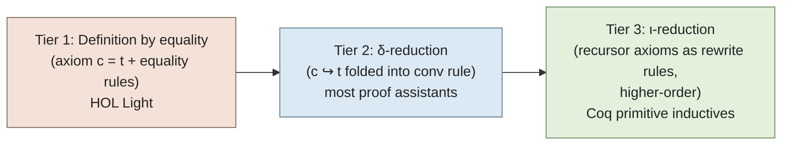
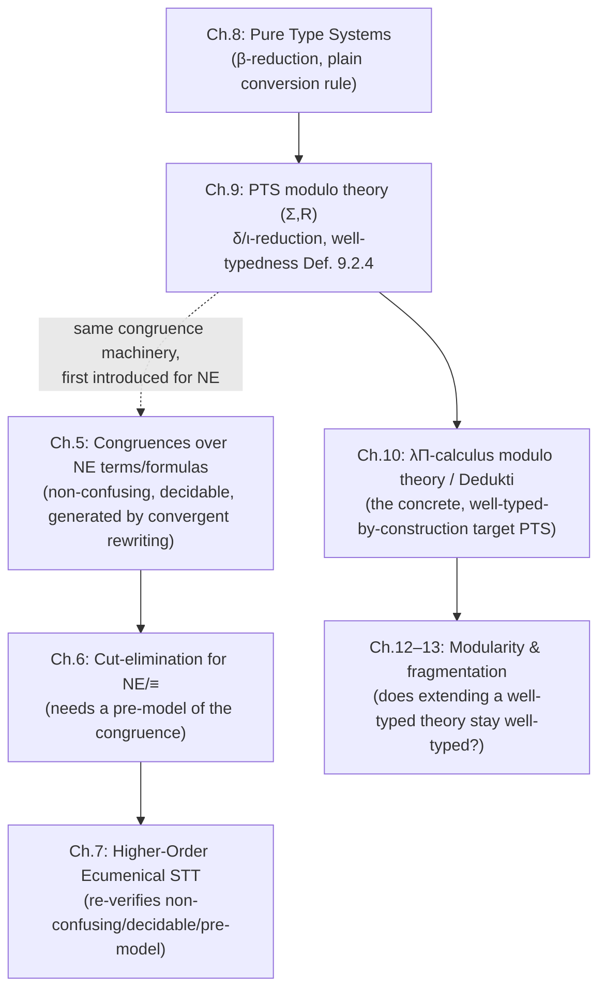

[[book-guidelines|↩ Back to guidelines]]

# Deduction Modulo Theory

## What breaks without it

Suppose you're building a type checker and you want to state that `0 + 0 = 0` is true. In a bare Pure Type System (PTS) — the kind you get from Chapter 8's machinery, with nothing added — every fact about a program's behavior has to be proved by axiom. There is no such thing as "the compiler just knows that `add` unfolds." If addition is declared as an opaque constant `add : Nat -> Nat -> Nat`, the *only* way to prove `add zero zero = zero` is to bolt on an equality axiom and an inference system for reasoning about it explicitly — reflexivity, symmetry, transitivity, congruence — and thread every unfolding step through that machinery by hand.

This is not a hypothetical: it's literally how HOL Light works, and the thesis walks through the cost concretely (Chapter 9, Fig. 9.1). Proving `0 + 0 = 0` there means: (1) invoke the definition-axiom `+ = Add` (a term abbreviation), (2) invoke the axiom for β-reduction to compute `Add 0 0 = (R 0 f) 0`, (3) invoke the base-case axiom of the recursor `R`, and (4) chain all three together with the transitivity of `=`. Four proof steps for one arithmetic identity nobody would ever doubt. Multiply that by `1200 + 0 = 1200` and you'd need the recursor's inductive-step axiom applied 1200 times, each one an explicit proof step. That's the failure mode deduction modulo theory exists to eliminate: **equality that should be computed is instead being proved**, and every proof term balloons with bookkeeping that carries zero mathematical content.

The fix, introduced in Chapter 5 and generalized in Chapter 9, is to stop treating definitional facts as propositions to be proved and start treating them as *identifications* — two syntactically different terms (or formulas) that are simply declared to be the same thing, checked automatically by the type checker rather than proved by the user. This is "deduction modulo a congruence," and it's the single idea that makes proof assistants usable rather than merely correct.

## Congruences over terms and formulas

### The core move: relaxing "equal" to "congruent"

Ordinary natural deduction (and the PTS typing rules of Chapter 8) are stated up to *syntactic* equality — a rule applies only when its premises and conclusion match a schematic pattern exactly. Deduction modulo theory replaces this rigid matching with matching *up to a fixed congruence* $\equiv$: a binary relation that says which terms/formulas are to be treated as interchangeable.

**Definition (Grienenberger, Def. 5.2.2, adapted for both terms and formulas).** A binary relation $R$ over a set of terms and formulas is a **congruence** if it is:
- an **equivalence relation** — reflexive, symmetric, transitive, and
- **stable by context**: for any context $C[\cdot]$ (an expression with a hole, formally Def. 5.2.1) and any $u_1, u_2$ with $R(u_1,u_2)$, also $R(C[u_1], C[u_2])$ — you can substitute equivalent things inside any larger expression, and
- **stable by substitution**: for any substitution $\theta$, $R(u_1,u_2)$ implies $R(u_1\theta, u_2\theta)$.

The "stable by context" clause is exactly what you'd want a compiler's notion of "these two ASTs denote the same value in any surrounding expression" to satisfy — it's a congruence in the algebraic sense, the same property that makes `==` on a `PartialEq` type behave sanely inside larger structures.

Any relation, however badly behaved, has a smallest congruence containing it (its *closure*, built by saturating with exactly the pairs needed to acquire each missing property — e.g. the reflexive closure of $R$ is $R \cup \{(x,x) : x \in X\}$). So "define a congruence" really means "pick a starting relation and let the framework complete it."

**Worked example (Claim 5.1.1, the thesis's own).** Fix a first-order language with sort $\mathbb{N}$, function symbols $0, S, +$, and predicate symbol $\mathrm{Positive}$. There is a congruence $\equiv$ such that:
$$0 + t \equiv t \qquad S(u) + t \equiv S(t+u)$$
$$\mathrm{Positive}(0) \equiv \bot \qquad \mathrm{Positive}(S(t)) \equiv \top$$
Once this congruence exists, proving $\vdash \circ_i\,[\mathrm{Positive}(S(0) + S(S(x)))]$ (in NE, the thesis's ecumenical natural-deduction system — see the companion article on [[Ecumenical-Logics|Ecumenical Logics]]) takes a *single* application of the truth-introduction rule, because the whole expression is congruent to $\top$ by chaining the addition and positivity identities. Compare that to the HOL-Light-style four-step derivation above: this is the entire payoff of the framework in one line.

### How the inference rules change

Deduction-modulo versions of the introduction/elimination rules don't require the conclusion to look exactly like the rule's schema — they require it to be *congruent* to that schema. The thesis's own rendering (Fig. 5.2/5.3, NE's version) makes this explicit with a side condition. Truth-introduction becomes:
$$\frac{}{\Gamma \vdash \gamma} \ (\top\text{-i}) \quad \text{if } \gamma \equiv \circ_\sigma \top$$
instead of requiring $\gamma$ to be syntactically $\circ_\sigma\top$. Every other rule in the system gets the same treatment — conjunction-introduction requires only that the goal be *congruent* to $\circ_\tau(A \wedge_\sigma B)$, not equal to it, and so on for every connective and quantifier. This is a completely general recipe: it applies to plain PTSs too (Chapter 9's `conv` rule, below), it's just introduced first for NE because that's the system under construction in Chapters 3–4.

**Rust framing.** Think of ordinary syntactic-equality typing as `derive(PartialEq)` on an AST enum — two `Expr` values are equal only if they're the identical constructor tree. Deduction modulo swaps this for a custom `PartialEq` impl (or better, a normalization function `fn normal_form(&self) -> Expr` with `a.normal_form() == b.normal_form()`) that treats semantically-identical-but-structurally-different terms as equal. The type checker's `is_def_eq` function is exactly this custom equality — and in Lean's kernel, `isDefEq` is *precisely* this mechanism: two terms are definitionally equal not because they're the same tree, but because they reduce (via β, δ, ι, and more) to a common normal form. Everything in this article is the theory behind what `isDefEq` computes.

## Non-confusing and decidable congruences

A congruence can't just be *any* relation you feel like declaring — an arbitrary identification can silently break the logic built on top of it. The thesis (§5.3, and generalized in Chapter 9's Def. 9.2.4) imposes two conditions.

**Non-confusion.** Two formulas $A$ and $B$ may be declared congruent only if one is atomic, or they share the same main connective (*and the same index*, in NE's ecumenical setting) with congruent subformulas. Concretely: if $A = A_1 \wedge_\sigma A_2$ and $A \equiv B$, then either $B$ is atomic, or $B = B_1 \wedge_\sigma B_2$ with $A_1 \equiv B_1$, $A_2 \equiv B_2$ — same connective, same $\sigma$, congruent parts.

*What breaks without it:* if a congruence could equate, say, an intuitionistic conjunction $A \wedge_i B$ with a classical disjunction $A \vee_c B$, the notion of "which inference rule applies" collapses. You could eliminate a $\vee$ where you meant to eliminate a $\wedge$; the thesis phrases this sharply — "how to define a cut when one connective can be eliminated and another introduced?" Cut-elimination, the load-bearing proof-normalization argument of the entire second part of the book, is stated per-connective; a confusing congruence destroys the case analysis it depends on. This is the formula-level analogue of a type-confusion bug: if your compiler's equality relation ever said `enum Shape::Circle` was interchangeable with `enum Shape::Square`, every downstream `match` on `Shape` becomes unsound.

**Decidability.** There must be an algorithm deciding, for any two terms/formulas, whether they're congruent. Without this, "does rule X apply here?" — the single most basic operation a type checker performs, called on every subterm during every check — is not effectively computable. A logic with an undecidable definitional-equality relation is a logic whose type checker cannot be built, only specified.

## Convergent rewrite systems as congruences

Both conditions above are easy to *state* and hard to *verify* for an arbitrary congruence handed to you in the abstract. The thesis's practical answer: don't define a congruence directly — define it as the equivalence generated by a **rewrite system**, and get non-confusion and decidability for free from one structural property of that system.

**Sufficient condition (stated, not derived from scratch, in the thesis, citing Dowek 2015 and Dowek–Werner 2003):** if a rewrite system is
- **convergent** — both **terminating** (no infinite rewrite sequence) and **confluent** (if a term rewrites two different ways, both paths rejoin at a common term), and
- **maps terms to terms and atomic propositions to propositions** (it never rewrites, say, a whole conjunction into an atomic proposition or vice versa, preserving syntactic shape at the top level),

then the equivalence relation it generates is automatically a non-confusing, decidable congruence.

The intuition for *why* this works: convergence gives every term a unique normal form, computable by an algorithm that's guaranteed to halt (termination) and guaranteed to reach the same answer regardless of rewrite order (confluence). Congruence-checking `a ≡ b` then reduces to `normal_form(a) == normal_form(b)` under ordinary structural equality — which is exactly decidable, and which trivially cannot confuse two different top-level connectives because it falls back to syntactic comparison once both sides are irreducible.

```rust
// The "convergent rewrite system as congruence" recipe, as a checker would implement it.
trait Rewrite {
    // one primitive rewrite step, if any rule's LHS matches
    fn step(&self) -> Option<Self> where Self: Sized;
}

fn normal_form<T: Rewrite + Clone>(t: &T) -> T {
    // Termination guarantees this loop halts.
    let mut cur = t.clone();
    while let Some(next) = cur.step() {
        cur = next;
    }
    cur
}

// Congruence check ≡ : decidable exactly because normal_form always halts
// and confluence guarantees the result doesn't depend on which redex we
// picked first inside `step`.
fn congruent<T: Rewrite + Clone + PartialEq>(a: &T, b: &T) -> bool {
    normal_form(a) == normal_form(b)
}
```

This is, almost verbatim, the architecture of Dedukti's (and Lean's) `whnf`/`isDefEq` loop: reduce both sides toward normal form and compare. Confluence is what lets the implementation pick *any* reduction strategy (e.g. weak-head-first, lazily) without risking a wrong answer.

## From axiomatic definitions to rewrite-based ones: the three-tier spectrum

Chapter 9 opens with the question a PTS-based proof assistant must answer: given a purely declarative system where you can only *declare* `+ : N → N → N`, how do you actually *define* `+`? The thesis lays out three answers, in increasing order of computational integration — and each is a strictly more efficient way of encoding "this constant unfolds to this term."

### Tier 1 — Definition by equality (axiomatic)

Declare `+` and separately assert an equality axiom `+ = λn. R n (λm n. S m)` (using the primitive recursor `R` with `(R e f) 0 = e` and `(R e f) (S n) = f [(R e f) n] n`). Reasoning about `+` requires explicitly invoking this axiom together with the general inference rules for equality (reflexivity, symmetry, transitivity, congruence/stability-by-context). This is HOL Light's approach, and it's the Fig. 9.1 four-step derivation described above. It's not *wrong* — the kernel stays extremely small, since it only needs one generic equality theory rather than a rewriting engine — but every unfolding is now a manual proof obligation, and proof terms balloon in size. (The thesis notes this cost mostly matters for *interoperability*, since HOL Light rarely bothers storing these expanded terms internally.)

### Tier 2 — Definition by δ-reduction (unfolding definitions)

Instead of an axiom, declare a **rewrite rule** directly identifying the constant with its body:
$$+ \hookrightarrow_\delta \lambda n{:}N.\ R\ n\ (\lambda m,n{:}N.\ S\ m)$$
and fold this into the *conversion rule* itself. The PTS's `(conv)` rule, which previously only assimilated types up to β-equivalence, is relaxed to assimilate types up to $\equiv_{\beta\delta}$ — the smallest congruence containing both $\to_\beta$ and $\to_\delta$ (Fig. 9.2):
$$\frac{\Gamma \vdash t : A \qquad \Gamma \vdash B : s \qquad A \equiv_{\beta\delta} B}{\Gamma \vdash t : B}\ (\mathrm{conv}\text{-}\beta\delta)$$
Now `0 + 0 = 0` is *automatically* $\beta\delta$-equivalent to `(R 0 f) 0`, and the recursor's own base-case rewrite rule finishes the job — no explicit equality-axiom bookkeeping at all. This is unfolding "for free," done by the type checker's own definitional-equality check rather than by user-visible proof steps.

**Dedukti's concrete syntax for exactly this (Chapter 10, pp. 97–98)** — worth seeing verbatim, since it's the thesis's own reference implementation:

```
Nat  : Type.
zero : Nat.
succ : Nat -> Nat.

def add : Nat -> Nat -> Nat.
[n]   add n zero      --> zero.
[n,m] add n (succ m)  --> succ (add n m).
```

The keyword `def` (as opposed to `thm`) is precisely the syntactic marker for "this may be unfolded by the conversion rule" — `def new : T := t.` compiles to a declaration `new : T` plus a δ-rule `new ↪ t`, while `thm new : T := t.` only checks `t : T` once and then treats `new` as opaque forever after. This is the concrete-syntax fork of the Tier-1-vs-Tier-2 distinction: `thm` gives you an axiom-flavored, non-unfolding definition (closer to Tier 1's opacity, minus the equality-axiom ceremony); `def` gives you genuine δ-reduction.

### Tier 3 — Recursor by ι-reduction (inductive recursion)

Rewriting the recursor's *own* defining axioms as rewrite rules:
$$(R\ e\ f)\ 0 \hookrightarrow_\iota e \qquad (R\ e\ f)\ (S\ n) \hookrightarrow_\iota f\ [(R\ e\ f)\ n]\ n$$
means that a proof of `1200 + 0 = 1200` no longer needs 1200 explicit invocations of an inductive-step axiom — the type checker just *computes*, applying the ι-rule as many times as needed during normalization, the same way evaluating `fold` on a 1200-element list just runs. This is Coq's approach to primitive inductive types, and it's the mechanism that makes computation-heavy proofs (e.g. `reflexivity`-closing a decidable arithmetic fact) tractable at all.

**The catch — ι-reduction is genuinely higher-order.** In the rule $(R\ e\ f)\ (S\ n) \hookrightarrow_\iota f\ [(R\ e\ f)\ n]\ n$, the metavariable $f$ is *used as a function* on the right-hand side (applied to `[(R e f) n]` and `n`) rather than merely substituted as an inert subterm. This puts ι-reduction outside first-order term rewriting, where confluence/termination/modularity theory is comparatively mature — the thesis is explicit that higher-order rewriting's metatheory is "comparatively undeveloped," and that it will use higher-order rewrite rules without developing their general theory (deferring to Klop 1980, Nipkow 1991, Klop–van Oostrom–van Raamsdonk 1993).



## Higher-order rewrite rules

The ι-rule above is the thesis's motivating example, but the general point generalizes: **a higher-order rewrite rule is one where a metavariable occurring in the pattern is applied to arguments on the right-hand side**, rather than merely appearing as a leaf. First-order rewriting (the theory used for e.g. `n + S(m) → S(n + m)`, where the metavariables `n`, `m` are only ever substituted wholesale, never applied) has a rich, decades-deep confluence/termination toolbox (critical pairs, Knuth–Bendix completion, and so on). Higher-order rewriting inherits none of this automatically — every confluence or termination argument for a higher-order system has to be built (or borrowed) case by case. The thesis flags this explicitly as a boundary of its own scope: it will *use* higher-order rewrite rules (both here for recursors, and later for the combinator-based encoding of λ-terms in Higher-Order Ecumenical Type Theory) without re-deriving the general higher-order metatheory.

*Lean framing:* this is exactly the distinction between Lean's `rfl`-closing definitional unfolding of a first-order `def` versus the far more delicate reduction behavior of its structural/well-founded recursors — the kernel's iota-reduction rule for `Nat.rec` or a custom inductive's recursor is, syntactically, the same higher-order pattern as the thesis's $R$.

## Well-typedness of a computational theory

None of the above is safe to bolt onto a PTS's conversion rule unconditionally. Chapter 9 gives the general framework: a **theory** is a pair $(\Sigma, R)$ — a typed signature $\Sigma = c_1{:}T_1,\ldots,c_n{:}T_n$ of constants, plus a rewrite system $R$ over terms built from those constants (Def. 9.2.1–9.2.2). The PTS $P$ "modulo" $(\Sigma,R)$, written $P/\Sigma,R$, relaxes the `(conv)` rule to use $\equiv_{\beta R}$ (the congruence generated jointly by β and $R$) and adds a `(const)` rule typing each declared constant.

**The pathological counterexample (Example 9.2.2) — showing exactly what can go wrong.** Take $\Sigma = \{\, \mathrm{product}{:}\mathrm{TYPE},\ T_1{:}\mathrm{TYPE},\ T_2{:}\mathrm{KIND},\ \mathrm{impossible}{:}(\mathrm{TYPE}\ \mathrm{TYPE}) \,\}$ and a single rewrite rule $\Pi x{:}y.\,z \hookrightarrow \mathrm{product}$ (collapsing *every* dependent product to one constant, regardless of its domain/codomain). This single badly-chosen rule breaks all three of the properties a well-behaved theory needs, simultaneously:
- **Product injectivity fails**: $\Pi x{:}T_1.T_1 \equiv_{\beta R} \Pi x{:}T_1.T_2$ (both reduce to `product`), yet $T_1 \not\equiv_\beta T_2$ — two products can be identified even though their components aren't.
- **Subject reduction fails**: $\vdash \Pi x{:}T_1.T_2 : \mathrm{KIND}$ typechecks, and $\Pi x{:}T_1.T_2 \hookrightarrow_R \mathrm{product}$, but $\mathrm{product}$ is *not* typable at KIND — reduction silently changes a term's type.
- **Type correctness fails**: `impossible : TYPE TYPE` typechecks per the signature, but the term `TYPE TYPE` (applying the sort TYPE to itself) isn't even a well-formed typable term — you've typed something meaningless.

**Definition 9.2.4 (well-typedness of a theory)** rules this out with three conditions on $(\Sigma,R)$:
1. **$\Sigma$ is well-typed** — every declared constant's type itself has a sort: $\vdash_{P/\Sigma,R} T : s$ for each $(c{:}T)\in\Sigma$.
2. **$R$ is type-preserving** — for every rule $(\ell,r)$ and every instance (redex) $\ell\theta$, if $\ell\theta$ is typable at $T$, then $r\theta$ is *also* typable at $T$. (This is the property that fails for `Πx:y.z ↪ product` above — rewriting silently changed the type.)
3. **The dependent product is injective modulo $\Sigma,R$** — $\Pi x{:}A_1.B_1 \equiv_{\beta R} \Pi x{:}A_2.B_2$ implies $A_1\equiv_{\beta R}A_2$ and $B_1\equiv_{\beta R}B_2$.

Given all three, **Theorem 9.2.5** (crediting Blanqui) recovers *all* of the good PTS metatheorems from Chapter 8 — subject reduction, type correctness, inversion, and uniqueness of types (for functional PTSs) — now stated modulo $\equiv_{\beta R}$ instead of just $\equiv_\beta$. This theorem is the entire payoff of the well-typedness conditions: they are exactly, and only, what's needed to keep every metatheoretic guarantee you had for plain PTSs after you've bolted on arbitrary user-defined computation. Product injectivity in particular is singled out (Remark 9.2.1) as equivalent to β-reduction being type-preserving — it is *the* linchpin condition, not one of three independent add-ons.

The worked positive example — $((\Sigma_+, \Sigma_{eq}), R_+)$ for natural-number arithmetic and equality inside the Calculus of Constructions — checks all three boxes constructively: constants are typed by TYPE/KIND; each rewrite rule (`n + 0 ↪ n`, `n + S(m) ↪ S(n+m)`) preserves the type of any well-typed instance of its left-hand side by direct case inspection; and because no dependent product is ever an $R_+$-redex and $R_+$ is confluent, products stay injective automatically.

```python
# A minimal sketch of what a type checker must verify before "trusting" a
# theory (Sigma, R) enough to fold it into the conversion rule.
def is_well_typed_theory(sigma, R, typecheck, sort_of):
    # 1. Sigma well-typed: every declared constant's type has a sort.
    for (c, T) in sigma.constants():
        if sort_of(T, sigma, R) is None:
            return False, f"constant {c} has ill-sorted type {T}"
    # 2. R type-preserving: reducing never changes a redex's type.
    for (lhs, rhs) in R.rules():
        for theta, T in typeable_instances(lhs, sigma, R):
            if not typecheck(rhs.subst(theta), T, sigma, R):
                return False, f"rule {lhs} --> {rhs} is not type-preserving"
    # 3. Product injectivity modulo (Sigma, R) — usually shown via
    #    confluence + "no dependent product is ever a redex".
    if not products_injective(sigma, R):
        return False, "dependent product is not injective modulo (Sigma, R)"
    return True, None
```

This is, essentially, the checklist a Rust-based kernel would run once, offline, when accepting a new user-defined theory (a set of `def`s and rewrite rules) before trusting its conversion checker to fold that theory's rules into every subsequent `is_def_eq` call.

## Where this leads

**Structural picture** of how this topic sits in the thesis:



Chapter 5 is where the congruence machinery is *introduced*, in the friendlier setting of NE's natural-deduction rules; Chapter 9 is where it's *generalized* to full PTS typing and given its precise well-typedness conditions. Everything downstream depends on this pairing: Chapter 6's cut-elimination theorem needs the congruence to have a "pre-model" (a semantic condition building on non-confusion/decidability); Chapter 10's λΠ-calculus modulo theory *is* a PTS modulo a well-typed theory in exactly Chapter 9's sense, and Dedukti's `def`/rewrite-rule syntax is the direct implementation of it; and Chapters 12–13's entire modularity/fragmentation program (can you safely add rules to a theory without breaking well-typedness elsewhere?) is asking, at scale, the question this chapter answers for a single theory in isolation.

For the standing project: this is the load-bearing chapter for **`isDefEq`** in a Rust-based kernel — every one of the conditions here (non-confusion, decidability via convergence, type-preservation, product injectivity) is a proof obligation your kernel's trusted core must either verify once (per `type-theory`'s downstream payoff) or simply assume of a theory it's handed. It also feeds `automated-reasoning`'s concern with proof-term size and proof reconstruction directly: the entire motivation (Fig. 9.1's four-step HOL-Light derivation versus one δ/ι-reduction) is precisely the "proof-producing architecture" tradeoff between an axiomatic and a computational trusted kernel — the same tradeoff your elaborator will face when deciding which equalities to discharge by computation versus by an explicit proof obligation.
