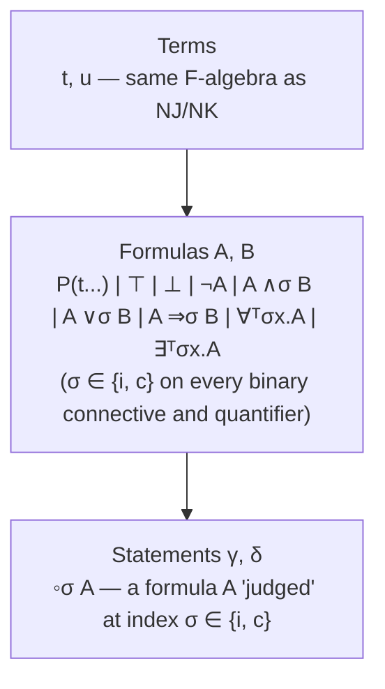
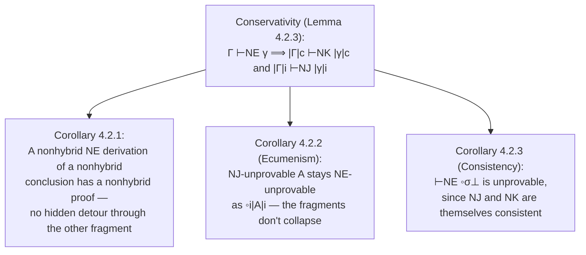

# Ecumenical Logics

[[book-guidelines|↩ Back to guidelines]]

## The problem: two logics, one meaning collision

Constructive and classical logic are not two dialects of the same language — they are two different languages that happen to share an alphabet. NJ (constructive/intuitionistic natural deduction) and NK (classical natural deduction) are built over the same syntax of terms and formulas, differing only in one rule: NK adds unrestricted excluded-middle, `A ∨ ¬A`, as an axiom with no premises. Every NJ proof is trivially an NK proof (drop the extra rule and nothing else changes), but the converse fails — some formulas are NK-derivable and not NJ-derivable.

That single extra axiom has an outsized effect. Once you have excluded-middle, you can derive:

- **Double-negation elimination (RAA):** $\neg\neg A \Rightarrow A$
- **Peirce's formula:** $((P \Rightarrow Q) \Rightarrow P) \Rightarrow P$
- **A classical reading of implication:** $(\neg P \lor Q) \Leftrightarrow (P \Rightarrow Q)$

None of these are NJ-derivable. So `∧`, `∨`, `⇒`, `∀`, `∃` don't mean quite the same thing depending on which system you're standing in — the connective symbol is shared, but its proof-theoretic content diverges. Using the *same glyph* `∨` for two different things that behave differently is what the book calls "unsatisfactory": you cannot look at a formula `A ∨ B` in isolation and know which inference rules apply to it.

**What breaks without addressing this:** if you try to naively pool NJ's and NK's rules into one system — just literally union them — you don't get a peaceful coexistence, you get a collapse. Introduce an intuitionistic disjunction $\lor_i$ and negation $\neg_i$, a classical $\lor_c$/$\neg_c$, and run both rule-sets side by side. The book shows (Fig. 3.2) that you can then derive $A \lor_i \neg_i A$ — the *intuitionistic* excluded-middle — for **any** formula $A$, by routing through a classical sub-derivation of $\neg_c A \vdash \neg_i A$ and then applying $\lor_i$-introduction. The "intuitionistic" fragment silently absorbs classical strength through the back door. If your goal was to keep two logics genuinely separate while letting them interoperate, naive union defeats the purpose entirely.

This is exactly the shape of bug you'd get building a type checker that tries to merge two type systems by literally unioning their typing rules without checking whether a derivation in the union can smuggle in power neither system alone had — the analogue of unsound rule interaction in a combined calculus.

## Why intuitionistic proofs are worth preserving: the witness and disjunction properties

Before designing the fix, the book establishes *why* it's worth the trouble — what do you actually lose if you just always reason classically?

> **Lemma 3.1.1 (Witness and disjunction properties).** Let $A, B$ be formulas.
> - If $\vdash_{NJ} \exists x.\, A$, then there is a term $t$ such that $\vdash_{NJ} A[x := t]$.
> - If $\vdash_{NJ} A \lor B$, then either $\vdash_{NJ} A$ or $\vdash_{NJ} B$.

Neither property holds in NK. Classically, $\vdash_{NK} \exists x.\, P(x) \lor \neg P(x)$ is provable without ever producing a specific witness term, and $\vdash_{NK} A \lor \neg A$ is provable without deciding which disjunct holds. Intuitionistic proofs, by contrast, are *computational certificates*: an existential proof carries an actual witness, and a disjunction proof commits to a side. This is the proof-theoretic content that a program extraction pipeline (Curry–Howard) relies on — a constructive proof of $\forall x.\, \exists y.\, S(x,y)$ **is** (via the isomorphism) an algorithm computing $y$ from $x$.

Concretely, in a Rust-shaped mental model: think of an NJ proof of `A ∨ B` as literally being forced to construct a value of

```rust
enum Or<A, B> {
    Left(A),
    Right(B),
}
```

— you cannot produce an `Or<A, B>` without picking a variant and supplying the payload. An NK proof of `A ∨ B`, by contrast, is more like a proof that "an `Or<A, B>` value must exist, deduced by contradiction from assuming neither variant is constructible" — you never actually get to pattern-match on which one it was, because no such algorithm was ever produced. This is precisely the trade-off that motivates the whole chapter: classical logic gives you strictly more provable *theorems*, but intuitionistic logic gives you a strictly more informative *proof object* whenever a theorem happens to be provable in it.

## The design goal: coexistence without collapse

Given that we want both — classical expressivity for stating specifications, constructive information whenever we're lucky enough to have it — the design goal for an "ecumenical" logic becomes precise:

1. Intuitionistic and classical connectives must be **syntactically distinguishable** (no symbol overloading).
2. The classical fragment, taken alone, should be exactly as strong as NK; the intuitionistic fragment, taken alone, exactly as strong as NJ.
3. Mixing them (a "hybrid" formula using both flavors of `∧` in the same expression) should be *meaningful and safe* — not a backdoor that inflates the intuitionistic fragment's strength, as the naive union did.
4. Two logics coexisting in one proof-database means you can store, cross-check, and query constructive and classical proofs together, rather than maintaining two disjoint repositories and losing the "this proof happens to be constructive" metadata whenever a classical wrapper is applied.

Prior ecumenical systems (Prawitz's $NE_p$, sequent-calculus systems by Dowek, Girard, and others) had already explored this space, generally via one of two strategies: splitting proof contexts into intuitionistic/classical "zones," or defining classical connectives *purely* as double-negation translations of intuitionistic ones (so there's no primitive classical `∧`, only `¬¬(¬¬A ∧ ¬¬B)` spelled out each time). The thesis's system, **NE**, takes a third route.

## NE's key idea: statements as a third syntactic layer

NE adds a level of syntax that NJ and NK don't have. Instead of two layers (terms, formulas), NE has **three**:



- **Terms** are untouched — identical to NJ/NK's first-order terms over a signature $(F, P)$.
- **Formulas** get the indexing: every one of `∧`, `∨`, `⇒`, `∀`, `∃` comes in two indexed copies, written $\land_i / \land_c$, $\lor_i / \lor_c$, etc. Crucially, $\top$, $\bot$, and $\neg$ get **only one copy each** — because they are already intuitionistically stable under double negation ($\vdash_{NJ} \top \Leftrightarrow \neg\neg\top$), there's no divergent classical/intuitionistic reading to distinguish. (This is a nice test of understanding: if you ever find yourself indexing $\neg$ or $\bot$ in a from-scratch redesign, you've misunderstood *why* the other five connectives needed indices in the first place — it's specifically because they interact with double negation non-trivially.)
- **Statements**, the genuinely new layer, are of the form $\circ_\sigma A$: a formula $A$ *embedded* into a judgment, tagged by $\sigma \in \{i, c\}$. The embedding symbols $\circ_i$ and $\circ_c$ represent, respectively, the *absence* and the *presence* of a prenex double negation. Read $\circ_i A$ as "$A$, judged intuitionistically" and $\circ_c A$ as "$A$, judged classically — i.e., roughly $\neg\neg A$."

This is the structural trick that avoids both prior strategies: no zoned contexts (a single, uniform context of statements suffices), and no purely-derived classical connectives (`∧_c` is a first-class primitive connective, not sugar for double-negated `∧_i`) — yet the *semantics* of `∧_c` is still exactly "what you'd get by double-negating `∧_i`'s arguments," so the connection to the double-negation translation is preserved *without* making it the definition.

A **hybrid** formula/statement/proof is one that mixes indices; a **nonhybrid** one is uniformly classical or uniformly intuitionistic throughout (Def. 4.2.1). For instance, with nullary predicates $P, Q$: $(P \land_i Q) \Rightarrow_i Q$ is nonhybrid intuitionistic, while $(P \land_c Q) \Rightarrow_i Q$ is hybrid.

## Taming the combinatorial explosion: one rule per connective

Here's the mechanism question a naive design runs into immediately. Take conjunction-introduction. A premise formula's *statement* can be indexed $i$ or $c$ independently for each of the two conjuncts, and the conclusion's embedding index and the connective's own index can each independently be $i$ or $c$. That's $2 \times 2 \times 2 \times 2 = 16$ combinations for one rule. Multiply that across five indexed connectives (plus their elimination rules) and you get an unmanageable rule explosion — exactly the kind of state-space blowup you'd want to avoid if you were implementing this as a type-checker's rule table.

The book's fix is an **ordering constraint** rather than a rule per case:

> **Definition 4.1.3 (Ordering on indices).** $c < i$ — "constructive proofs contain more information than classical proofs; constructive information can only be lost, never gained, by applying an inference rule."

Concretely for conjunction-introduction: given $\Gamma \vdash \circ_{\sigma_A} A$ and $\Gamma \vdash \circ_{\sigma_B} B$, you may conclude $\Gamma \vdash \circ_\tau (A \land_\sigma B)$ exactly when

$$\min(\sigma, \tau) \le \min(\sigma_A, \sigma_B).$$

Out of the 16 raw combinations, this side condition licenses exactly the 13 shown in the book's Figure 4.1 and rules out 3. The 3 forbidden ones are precisely the cases where you'd be manufacturing intuitionistic-looking information (index $i$ somewhere on the conclusion side, at a "more informative" position than the premises support) out of purely classical premises — e.g., deriving $\circ_i(A \land_i B)$ from $\circ_c A$ and $\circ_c B$ would, once you unfold the underlying double negations, amount to deriving $A \land B$ in NJ from mere $\neg\neg A$ and $\neg\neg B$ — exactly the illegal move NJ forbids. The ordering constraint is doing the job that, in a compiler, a variance/subtyping check does when you're deciding whether it's safe to treat a "less precise" value as if it were "more precise" — here, the direction of safe flow is $c \to i$ is *forbidden* while $i \to c$ (forgetting information) is always fine.

Every NE connective — $\land, \lor, \Rightarrow, \forall, \exists$, plus $\neg$ and $\bot$-elimination — gets exactly **one** introduction and **one** elimination rule this way, each carrying its own index-ordering side condition (see the rule table below, condensed from Fig. 4.2):

| Rule | Conclusion | Side condition |
|---|---|---|
| Axiom | $\Gamma, \circ_\tau A \vdash \circ_\sigma A$ | $\sigma \le \tau$ |
| $\land$-i | $\Gamma \vdash \circ_\tau(A \land_\sigma B)$ | $\min(\sigma,\tau) \le \min(\sigma_A,\sigma_B)$ |
| $\land$-e | $\Gamma \vdash \circ_\upsilon A$ (or $B$) | $\upsilon \le \min(\tau,\sigma)$ |
| $\lor$-i | $\Gamma \vdash \circ_\tau(A \lor_\sigma B)$ | $\min(\sigma,\tau) \le \sigma_A$ (resp. $\sigma_B$) |
| $\lor$-e | $\Gamma \vdash \circ_\upsilon C$ | $\upsilon \le \min(\sigma,\tau,\sigma_C,\tau_C)$ |
| $\Rightarrow$-i | $\Gamma \vdash \circ_\tau(A \Rightarrow_\sigma B)$ | $\sigma_B \ge \min(\sigma,\tau)$ |
| $\Rightarrow$-e | $\Gamma \vdash \circ_\upsilon B$ | $\upsilon \le \min(\sigma,\tau) \le \sigma_A$ |
| $\neg$-i / $\neg$-e | — | analogous, using $\bot$ |
| $\circ_i$-i / $\circ_i$-e | moves between $\circ_c A$ and $\circ_\sigma \neg\neg A$ | — |

One rule of note is $\forall$: unlike the other connectives, its introduction rule does **not** fit the same "inner double negation ≈ outer double negation" pattern, because $\forall x.\, \neg\neg B \not\dashv\vdash_{NJ} \neg\neg\forall x.\, B$ — quantifiers and double negation don't commute intuitionistically the way conjunction's parts do. The book flags this explicitly as an exception to keep in mind, not an oversight.

### Worked example: what you can and can't prove

The book gives a worked hybrid derivation for $\vdash \circ_i[(P \land_i Q) \Rightarrow_c P]$ (Fig. 4.3a): axiom gives $\circ_c(P \land_i Q) \vdash \circ_c(P \land_i Q)$; conjunction-elimination (with $c \le \min(c,i)$, satisfied) gives $\circ_c(P \land_i Q) \vdash \circ_c P$; implication-introduction (with $\min(i,c) \le c$, satisfied) closes it to $\vdash \circ_i[(P \land_i Q) \Rightarrow_c P]$.

Now try the *same shape* of proof for $\vdash \circ_i[(P \land_c Q) \Rightarrow_i P]$. You'd need a premise of the form $\circ_\sigma(P \land_c Q) \vdash \circ_i(P \land_c Q)$ — but the **Axiom rule requires $\sigma \le \tau$** (you can only extract a *less-or-equally* informative statement from a hypothesis, i.e. $i$ from $i$, or $i$ from $c$-via-weakening is fine but not the reverse: getting $\circ_i$ *out of* a $\circ_c$ hypothesis needs $i \le c$, which is false since $c < i$). The rule is simply inapplicable. This is the formal expression of "you cannot extract a constructive result from a proof of a purely classical formula" — and indeed, semantically, $(\neg\neg P \land \neg\neg Q) \Rightarrow P$ is not an NJ tautology, so this unprovability is exactly correct, not an artifact of an incomplete calculus.

**What breaks without the ordering constraint:** if you dropped the side conditions and allowed all 16 index combinations per rule (the literal union of NJ+NK rule sets), you'd reproduce the Fig. 3.2 collapse from Chapter 3 — the intuitionistic fragment would silently gain classical strength. The ordering constraint is *the entire mechanism* that prevents collapse; it is not a minor refinement, it is the load-bearing design decision of the whole chapter.

## Externally classical judgments and ecumenical entailment

A statement $\circ_\sigma A$ is **externally classical** if $\sigma = c$, **externally intuitionistic** if $\sigma = i$ (§4.2.3) — "externally" because the *outermost* judgment index is what matters for these properties, regardless of what's inside $A$. Externally classical judgments inherit the classical repertoire wholesale: double-negation elimination, de Morgan's laws, contrapositive reasoning, and Peirce's formula all hold when wrapped in $\circ_c$, e.g.:

$$\circ_c(\neg\neg A) \vdash_{NE} \circ_c A, \qquad \vdash_{NE} \circ_c\big((A \Rightarrow_\sigma B) \Rightarrow_\tau A\big) \Rightarrow_\upsilon A \quad \text{(Peirce)}.$$

Excluded-middle holds specifically on externally classical instances $\circ_c(A \lor_\sigma \neg A)$. Meanwhile, the ecumenical (partial) analogues of the witness and disjunction properties are reserved for externally *intuitionistic* judgments and are only established later (Chapter 6), after normalization machinery is in place — this article doesn't need those details, but flags the dependency.

There's also a subtlety worth internalizing: **NE's entailment relation is defined to be intuitionistic**, even though the system houses a classical fragment. Concretely, $\circ_{\sigma_1} H_1, \ldots, \circ_{\sigma_n} H_n \vdash_{NE} \circ_\sigma A$ implies $\vdash_{NE} \circ_i\big[\bigwedge_i^{n} H_\ell \Rightarrow_\sigma A\big]$ — the "internalized" implication that packages up a derivation is always wrapped in $\circ_i$, no matter how classical the individual hypotheses or conclusion are. This is analogous to how, in a bidirectional type-checker with a global classical extension (say, exceptions or call/cc), the *meta-level* judgment "this typing derivation exists" can still be a plain intuitionistic fact even when the object language itself is classical — the turnstile itself doesn't inherit whatever exotic control effects live inside the terms it relates.

## Soundness and conservativity: NE is neither more nor less than NJ + NK, glued correctly

The heart of Chapter 4 is showing that the classical and intuitionistic fragments of NE really *are* NK and NJ — not systems that merely resemble them. This is established via two families of mutually-inverse translations.

**Soundness** (Lemma 4.2.2) uses embeddings $|\cdot|_i$ and $|\cdot|_c$ (Fig. 4.5) that push an NJ or NK formula into NE by uniformly indexing every connective with $\sigma$:

$$|Q x.\, A|_\sigma = Q_\sigma\, x.\, |A|_\sigma, \qquad |A \mathbin{\text{\`{}}}\, B|_\sigma = |A|_\sigma \mathbin{\text{\`{}}}_\sigma |B|_\sigma$$

("$\text{\`{}}$" ranging over $\land,\lor,\Rightarrow$). The result: if $\Gamma \vdash A$ has a classical (resp. intuitionistic) proof in NK (resp. NJ), then $\circ_c|\Gamma|_c \vdash_{NE} \circ_c|A|_c$ (resp. the $i$ version) — **and the resulting NE proof is itself nonhybrid**. The proof is a direct induction: when every index in sight is the same $\sigma$, every NE side-condition trivially collapses to an equality, so the NE rule degenerates to exactly the corresponding NJ/NK rule.

**Conservativity** (Lemma 4.2.3) goes the other way and is the harder direction, because it must handle *hybrid* NE derivations, not just nonhybrid ones. Two inverse transformations $|\cdot|^c$ and $|\cdot|^i$ (Fig. 4.6) map arbitrary NE formulas/statements back down:

- $|\cdot|^c$ simply **erases all indices** — every $\land_\sigma$ becomes plain NK's $\land$, every $\circ_\tau$ embedding is dropped.
- $|\cdot|^i$ **inserts double negations wherever a classical index appears** — e.g. $|Q_c\, x.\, A|^i = Q\,x.\,\neg\neg|A|^i$, and on statements, $|\circ_c A|^i = \neg\neg|A|^i$.

The theorem: if $\Gamma \vdash_{NE} \gamma$, then $|\Gamma|^c \vdash_{NK} |\gamma|^c$ **and** $|\Gamma|^i \vdash_{NJ} |\gamma|^i$ — *both* projections are always valid, regardless of how hybrid the original NE proof was. The classical case is a straightforward induction (NK's rules are strictly less constrained than NE's, so every NE step trivially survives erasure). The intuitionistic case is the interesting one: it's "reminiscent of a double-negation-translation preservation proof," but broader, because conjunction-introduction alone spawns 13 index-combination cases to check by hand, each of which must independently come out an NJ tautology.

The payoff that makes this more than bookkeeping: $\bigl|\circ_c|A|_c\bigr|^i$, for an NK formula $A$, is **exactly the classical Kolmogorov double-negation translation** of $A$. NE doesn't just happen to be compatible with the historical double-negation translation — composing its own soundness and conservativity embeddings *reconstructs* Kolmogorov's translation as a special case. The book also notes this reconstruction genuinely needs the $\circ_\sigma$ embedding layer: naively bolting a double negation onto each classical connective wouldn't suffice for atomic formulas, which is exactly the gap the statement layer was introduced to close.

## Consequence chain: ecumenism, non-collapse, and consistency

Three corollaries fall directly out of conservativity, each one a genuine theorem you'd want to check before trusting a combined system in a proof-database setting:



- **Corollary 4.2.1** says a nonhybrid derivation can always be witnessed by a nonhybrid *proof* — you never need to secretly borrow classical machinery to prove a purely intuitionistic statement, and vice versa. This is precisely the property that failed for the naive union of Chapter 3: there, an intuitionistic-looking conclusion ($A \lor_i \neg_i A$) was only derivable by routing through classical reasoning underneath. NE's design specifically forecloses that route.
- **Corollary 4.2.2 (Ecumenism proper)** is the formal statement that the classical and intuitionistic fragments **do not collapse**: for any NJ formula $A$, if $A$ is not NJ-provable, then $\circ_i|A|_i$ is not NE-provable either. Applied to an excluded-middle instance that fails intuitionistically, this confirms NE genuinely preserves the NJ/NK gap rather than quietly closing it — the entire point of the exercise.
- **Corollary 4.2.3 (Consistency)** falls out almost for free: if $\vdash_{NE} \circ_\sigma \bot$ were derivable, conservativity would force $\vdash_{NJ} \bot$ or $\vdash_{NK} \bot$, contradicting the (independently known) consistency of NJ and NK. NE inherits consistency from its parts rather than needing a fresh semantic argument.

A further, sharper application: the book shows $\circ_i[(P \land_c Q) \Rightarrow_i P]$ is **not** NE-provable (for nullary $P, Q$), because its $|\cdot|^i$-image $(\neg\neg P \land \neg\neg Q) \Rightarrow P$ is not an NJ tautology. This is a genuinely nontrivial negative result that many other ecumenical systems (where conjunction is shared rather than indexed) can't even *state*, because they don't distinguish $\land_i$ from $\land_c$ finely enough for the question to arise. NE's finer-grained indexing buys you finer-grained unprovability results — this is the general shape of a good design decision in a verifier: more precise syntax lets you *prove more refined negative facts*, not just more positive ones.

## Where this leads

NE as defined here is a purely axiomatic (Hilbert/natural-deduction) system — provability only, no proof terms, no reduction, no way yet to *ask* whether a witness extracted from an externally-intuitionistic proof actually reduces to a genuine term. That machinery — proof terms, cut-elimination, and the ecumenical witness/disjunction properties for normal proofs — is deferred to Chapter 6 (NE modulo a computational theory, Chapter 5, first), and Chapter 7 lifts the whole apparatus to a higher-order Simple Type Theory. Everything in this article — the index ordering, the soundness/conservativity embeddings, the non-collapse corollaries — is the static, purely logical foundation that all of that later, harder proof-theoretic work is built on top of; if the index-ordering side conditions here were wrong, cut-elimination in Chapter 6 would have no sound base to normalize proofs *of*.

For the standing project (`automated-reasoning`): NE's index-ordering side conditions are a clean, minimal case study in **designing inference rules with a soundness-preserving side condition baked directly into the rule schema**, rather than as an external well-formedness check bolted on afterward — the same pattern a trusted proof-checking kernel needs whenever it combines two calculi (say, a decidable equality fragment and a classical SMT-discharge fragment) and must guarantee that mixing them cannot prove something neither fragment could prove alone. The soundness/conservativity embedding pair ($|\cdot|_\sigma$ / $|\cdot|^\sigma$) is also a template worth recognizing elsewhere: proving two directions of translation are *mutually inverse on the nonhybrid subsets* is exactly the technique you'd reach for to certify that an elaborator's desugaring pass (or a proof-certificate exporter targeting a foreign kernel) is faithful — sound in one direction, conservative (introduces no new theorems) in the other.
