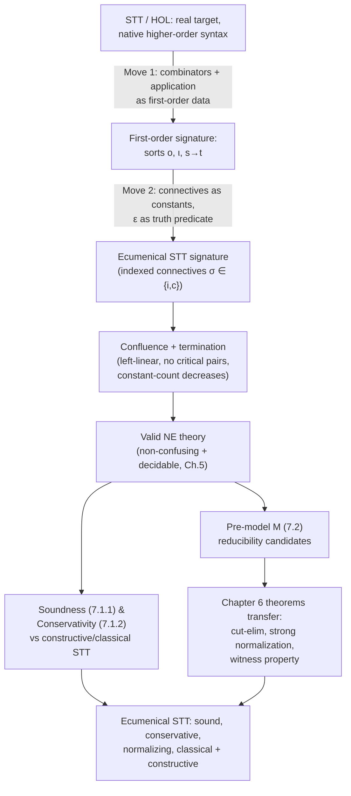

# Higher-Order Ecumenical Type Theory

[[book-guidelines|↩ Back to guidelines]]

## The problem: NE was first-order, but real proof assistants aren't

Everything built in Chapters 4–6 — the ecumenical system NE, its extension modulo a congruence, its cut-elimination theorem — lives over a **first-order** signature: terms, atomic predicates, first-order quantifiers $\forall x, \exists x$ ranging over individuals. That's already a real achievement (a classical/intuitionistic hybrid logic with a normalization theorem), but it doesn't yet cover what most working proof assistants actually use as their logical core. HOL Light, Isabelle/HOL, HOL4 — the whole HOL family — are built on **Simple Type Theory (STT)**, a.k.a. Higher-Order Logic: quantification not just over individuals but over *predicates and functions themselves*, and formulas that are literally terms of a distinguished type rather than a separate syntactic class.

**What breaks without addressing this:** if ecumenism (intuitionistic and classical connectives coexisting soundly, without collapse, with a working cut-elimination theorem) only works at the first-order predicate-logic level, it's a beautiful result about a toy logic — not a foundation you could actually retrofit into HOL Light or Isabelle/HOL. The whole interoperability motivation from Chapter 1 (comparing and combining proofs across real proof assistants) needs ecumenism to reach *higher-order* logic. Chapter 7 is the payoff chapter: it shows the NE-modulo-theory machinery from Chapters 5–6 is expressive enough to carry ecumenism all the way up, provided higher-order terms can first be squeezed into the first-order mold that machinery expects.

## Move 1: encode higher-order terms as first-order terms

The central trick — due to Dowek, Hardin, and Kirchner's earlier work on encoding HOL in a first-order rewriting framework ([DHK01], [Dow15a]) — is to **not** give STT a native higher-order syntax with real variable-binding lambda terms. Instead, higher-order structure is simulated entirely inside a first-order signature, so that the whole NE-modulo-theory apparatus (built for first-order terms and congruences) applies unchanged.

**Sorts.** The set of sorts is defined inductively:

$$T, U, V, \ldots ::= o \mid \iota \mid s \to t$$

- $\iota$ is the sort of *individuals* (the base "data" sort — think `i32` or an uninterpreted domain type).
- $o$ is the sort of **propositional contents** — not propositions themselves yet; more on that distinction below.
- $s \to t$ is a function-type sort, built from any two sorts, including $o$ — so `$\iota \to o$` is a legitimate sort (a predicate over individuals, represented as a *term*, not as a separate syntactic category).

This is exactly the type grammar of simply-typed lambda calculus, generated as *sorts of a first-order many-sorted signature* rather than as a type system sitting on top of an independent term syntax. In Rust terms, imagine you wanted to represent closures and higher-order functions, but your target VM only understands first-order function calls on plain data — you'd need to *defunctionalize*: turn every closure into a first-order data structure (its captured environment) plus a first-order `apply` function that dispatches on it. That's precisely what's happening here: instead of primitive lambda-abstraction and application in the term syntax, you get combinators (data) and one `apply` symbol.

**Combinators and application.** For every pair (or triple) of sorts $T, U, V$:

- $K_{T,U}$ — a constant of sort $T \to U \to T$.
- $S_{T,U,V}$ — a constant of sort $(T \to U \to V) \to (T \to U) \to T \to V$.
- $\alpha_{T,U}$ — a first-order function symbol of arity $\langle T \to U, T, U \rangle$, i.e. `apply : (T → U) → T → U`, written infix/juxtaposed and normally left implicit (the book omits it visually once the reader is used to it, writing $t\,u$ for $\alpha(t, u)$).

These are the classical **SK combinators** from combinatory logic, dressed up with sort annotations so they type-check as a many-sorted first-order signature. Their behavior is fixed by two rewrite rules (Figure 7.1a):

$$\alpha(\alpha(K_{T,U}, x), y) \longrightarrow x \qquad\qquad \alpha(\alpha(\alpha(S_{T,U,V}, a), b), x) \longrightarrow \alpha(\alpha(a, x), \alpha(b, x))$$

These two rules are enough to simulate arbitrary $\lambda$-abstraction and $\beta$-reduction (the standard combinatory-logic translation: $\lambda x. x \equiv SKK$, etc. — the book doesn't re-derive this since it's classical folklore, but it's worth knowing by name if you want to reconstruct it: **bracket abstraction**). The point of doing it this way rather than adding real binders is architectural, not just economical: everything downstream (the NE-modulo-theory framework, its non-confusion/decidability/pre-model conditions from Chapter 5, its cut-elimination theorem from Chapter 6) was built for first-order terms over a first-order congruence. Rather than re-deriving all of that machinery for a genuinely higher-order rewrite system — a much harder and, as Chapter 9 notes elsewhere in the thesis, "comparatively undeveloped" metatheory — Chapter 7 buys higher-order expressivity *for free* by paying the encoding cost once, up front, at the term-representation level.

```rust
// A first-order-flavored mental model of the combinator encoding.
// (Real Dedukti/NE terms are untyped-syntax-plus-sort-annotations, not
// a Rust enum — this is a grounding sketch, not a literal translation.)
enum Term {
    Var(String),
    K(Sort, Sort),                 // K_{T,U} : T -> U -> T
    S(Sort, Sort, Sort),           // S_{T,U,V} : (T->U->V) -> (T->U) -> T -> V
    App(Box<Term>, Box<Term>),     // alpha_{T,U}(f, x), infix-omitted in the book
    Connective(Connective, Sort),  // the constants below
}

fn step(t: &Term) -> Option<Term> {
    match t {
        // alpha(alpha(K, x), y) -> x
        Term::App(f, y) => match &**f {
            Term::App(k, x) if matches!(**k, Term::K(..)) => Some((**x).clone()),
            // alpha(alpha(alpha(S,a),b),x) -> alpha(alpha(a,x), alpha(b,x))
            Term::App(sab, x) => match &**sab {
                Term::App(sa, b) => match &**sa {
                    Term::App(s, a) if matches!(**s, Term::S(..)) => Some(Term::App(
                        Box::new(Term::App(a.clone(), x.clone())),
                        Box::new(Term::App(b.clone(), x.clone())),
                    )),
                    _ => None,
                },
                _ => None,
            },
            _ => None,
        },
        _ => None,
    }
}
```

## Move 2: connectives as first-order constants, and $\varepsilon$ as the truth predicate

Once higher-order *terms* are down-translated to first-order data, the same trick is applied to the **logical connectives**. Instead of $\land, \lor, \Rightarrow, \forall, \exists, \lnot$ being primitive syntactic formers of a separate "formula" category, they become ordinary first-order constants of the appropriate function sort:

$$\dot\top, \dot\bot : o \qquad \dot\land, \dot\lor, \dot\Rightarrow : o \to o \to o \qquad \dot\forall^T, \dot\exists^T : (T \to o) \to o \qquad \dot\lnot : o \to o$$

Notice $\dot\forall^T, \dot\exists^T$ take a *function* from $T$ to $o$ — this is what lets quantification reach over predicates, functions, or even other propositional contents (since $o \to o$ is itself a legal sort, $\dot\forall^o$ quantifies over propositional contents themselves — genuine higher-order/impredicative-flavored quantification, expressed with nothing more exotic than a first-order constant of a fancy sort).

But here's the subtlety that gives this section its name: **a term of sort $o$ is not, by itself, a proposition.** It's a *propositional content* — an inert piece of first-order data that merely *represents* a would-be proposition, the way an AST node representing `a && b` is data, not yet "the fact that `a` and `b` both hold." You need something to say "and now, interpret this content as an actual claim you can prove." That something is the predicate

$$\varepsilon : o \to \text{(proposition)}$$

$\varepsilon$ is the **truth predicate** — it is the single hinge on which the whole encoding turns, converting inert data of sort $o$ into first-order propositions that NE's actual inference rules ($\land$-i, $\lor$-e, etc.) can be applied to. It is defined entirely by rewrite rules (Figure 7.1b, the plain-STT version shown first for orientation):

$$\varepsilon(\dot\top) \to \top \qquad \varepsilon(t\,\dot\land\,u) \to \varepsilon(t) \land \varepsilon(u) \qquad \varepsilon(\dot\forall^T t) \to \forall^T x.\,\varepsilon(t\,x) \qquad \varepsilon(\dot\lnot t) \to \lnot\varepsilon(t)$$

and symmetrically for $\dot\lor, \dot\Rightarrow, \dot\exists$. Reading this operationally: $\varepsilon$ walks down a propositional-content term and, connective by connective, *unfolds* it into the corresponding real first-order-logic connective applied to the $\varepsilon$-images of the subterms — bottoming out at the two base propositions $\top, \bot$.

**Why bother separating these two roles at all**, rather than just letting $\land, \lor$ etc. directly build propositions the way ordinary predicate logic does? Two reasons converge:
1. **Uniformity with the term-encoding trick.** Since higher-order terms are already first-order data (Move 1), connectives applied to them need to *also* be first-order data if you want to quantify over propositional contents themselves (e.g. $\dot\forall^o$) — you can't quantify over "propositions" as a bare syntactic category in a first-order framework, but you *can* quantify over terms of sort $o$.
2. **It's the load-bearing seam for ecumenism.** Once propositional content is separated from the act of asserting it, the ecumenical *indexing* (Chapters 3–5's $\sigma \in \{i, c\}$ tagging every connective as intuitionistic or classical) can be bolted onto the connective constants themselves, and $\varepsilon$ becomes the single choke point where that indexing gets resolved into an actual NE statement. This is visible immediately in the ecumenical version (Figure 7.1c):

$$\varepsilon(t\,\dot\land_\sigma\,u) \to \varepsilon(t)\,\land_\sigma\,\varepsilon(u)$$

Every ecumenical STT connective ($\dot\land_\sigma, \dot\lor_\sigma, \dot\Rightarrow_\sigma, \dot\forall^T_\sigma, \dot\exists^T_\sigma$, for $\sigma \in I = \{i,c\}$) carries the very same index that NE's own connectives carry from Chapter 4 — $\varepsilon$'s rewrite rules simply pass that index through into the corresponding indexed NE formula. Ecumenical STT is, structurally, "plain STT plus the $\sigma$-tagging machinery of NE, glued on exactly at the $\varepsilon$ seam."

**A Rust/typestate analogy for the $\varepsilon$ separation:** think of $o$-sorted terms as an untyped AST (`enum PropContent { Top, Bot, And(Box<Self>, Box<Self>), Forall(Sort, Box<Term>), ... }`) and $\varepsilon$ as an *interpreter/elaborator function* `fn assert(pc: &PropContent) -> Proposition` that walks the AST and produces something the type-checker (NE's inference rules) can actually consume — with the crucial point being that *nothing* about `PropContent` construction requires going through `assert` first. You can pass propositional contents around, substitute into them, quantify over them, all as inert data — and only decide to "make a claim" out of one when you apply $\varepsilon$. This mirrors exactly the trusted-kernel-boundary pattern from unification/elaboration: a metavariable-laden term is manipulable data throughout elaboration, and only at the very end does the kernel's `isDefEq`/type-check treat it as a genuine typed term.

```lean
-- Lean's own Prop/decide-style separation is the closest native analogue:
-- a `Bool` (or here, an inert first-order term of sort `o`) is data,
-- while `Prop` embeds it into something with proof obligations attached.
-- `decide` is, informally, playing the role ε plays here: it converts
-- inert boolean/data-level content into an actual proposition you can
-- discharge with a proof term.
example (b : Bool) : Prop := b = true   -- inert `b` lifted into a real Prop
```

## Confluence and termination of the ecumenical rewrite system

For this whole encoding to be usable inside the NE-modulo-theory framework of Chapter 5, the rewrite system generated by the combinator rules plus the $\varepsilon$ rules has to satisfy exactly the conditions Chapter 5 laid out as sufficient for a **well-behaved theory**: non-confusing, decidable — and the sufficient condition the book actually verifies is that the underlying rewrite system be **convergent**, i.e. terminating and confluent.

**Termination.** The argument given is refreshingly concrete rather than requiring a heavy termination-ordering apparatus: *the number of occurrences of constant symbols strictly decreases with every reduction step.* Check both rule families:
- $\alpha(\alpha(K,x),y) \to x$: the right-hand side $x$ is a strict subterm of the left-hand side, discarding $K$, $y$, and both applications — constant-symbol count strictly drops.
- $\alpha(\alpha(\alpha(S,a),b),x) \to \alpha(\alpha(a,x),\alpha(b,x))$: this one looks like it *duplicates* $x$ (a classic termination red flag — duplicating rewriting rules are usually the hard case), but the constant $S$ itself disappears and is not replaced by anything of equal-or-greater constant weight, so the *count of constant symbols specifically* (not term size in general) still strictly decreases. This is a nice illustration of why termination measures need to be tailored to what a rewrite system is actually shrinking — total term size is not always the right potential function.
- Every $\varepsilon$-rule strictly decreases the count of $\varepsilon$/connective-constant occurrences by unfolding one connective layer per step.

**Confluence.** The book invokes the standard sufficient criterion from term-rewriting theory (Baader–Nipkow [BN98]): a **left-linear** rewrite system (no repeated variables in any left-hand side — check the four rules above, none repeat a variable pattern in matchable position) with **no critical pairs** (no two rules' left-hand sides can overlap on a shared redex) is automatically confluent, with no need for a Newman's-lemma-style local-confluence argument or explicit critical-pair completion (à la Knuth–Bendix). The overlap analysis is done by a simple case-split on syntactic shape:
- Rules with $\varepsilon$ prenex on the left-hand side only overlap with each other if applied to the *same* connective — and each connective gets exactly one $\varepsilon$-rule, so no two $\varepsilon$-rules can ever fire on the same redex.
- The combinator rules have prenex application symbols, and the very next symbol after the application is always a *distinct* combinator ($K$ vs. $S$) — so no combinator rule can overlap with another combinator rule, or with any $\varepsilon$-rule (whose left-hand sides start with $\varepsilon$, a different head symbol entirely).

This is exactly the kind of syntactic, decidable confluence check you'd want as an engineer implementing this in a real type-checker: no semantic reasoning about reduction sequences, just a case-by-case inspection of head symbols in the finite rule set — the sort of check a `match` over rule left-hand-side shapes could verify mechanically, and indeed does in Dedukti's own confluence checker.

Because the ecumenical STT rewrite system is convergent (terminating + confluent), left-linear with no critical pairs, and maps terms to terms / atomic propositions to propositions, it satisfies the **non-confusing and decidable** conditions Chapter 5 requires of a congruence-defining theory: ecumenical STT is a legitimate NE theory.

## Soundness: ecumenical STT doesn't lose what constructive/classical STT could already prove

Soundness and conservativity for NE (Chapter 4) were stated relative to NJ and NK — but those results were proved for a *shared first-order signature*; STT's higher-order signature is a different syntax entirely, so the results don't transfer automatically. Chapter 7 re-derives them for STT specifically, reusing the *shape* of the Chapter 4 argument (the mutually inverse embeddings $|\cdot|_\sigma$) rather than its literal statement.

The embedding is redefined over STT terms: $|\dot{o}\!\!\!\dot{n}|_\sigma = \dot{o}\!\!\!\dot{n}_\sigma$ for every connective $\dot{o}\!\!\!\dot{n} \in \{\dot\land,\dot\lor,\dot\Rightarrow,\dot\exists^T,\dot\forall^T\}$ — i.e. take a plain (unindexed) STT connective and tag it with index $\sigma$ — with every other symbol (combinators, $\varepsilon$, individual-sort function symbols) mapped to itself unchanged.

**Lemma 7.1.1 (Preservation of congruence).** If $t \equiv u$ in constructive or classical STT, then $|t|_i \equiv |u|_i$, resp. $|t|_c \equiv |u|_c$, in ecumenical STT. The proof is essentially bookkeeping: since $|\cdot|_\sigma$ commutes with every rewrite rule of constructive/classical STT by construction (each rule's image under $|\cdot|_\sigma$ is a valid ecumenical-STT rewrite instance), congruence — which is exactly the closure of the rewrite relation — is preserved along the way.

**Lemma 7.1.2 (Soundness).** If $\Gamma \vdash A$ is derivable in constructive (resp. classical) STT, then $\circ_i\,|\Gamma|_i \vdash \circ_i\,|A|_i$ (resp. $\circ_c\,|\Gamma|_c \vdash \circ_c\,|A|_c$) is derivable in ecumenical STT. The proof explicitly reuses "all features used in the proof of Lemma 4.2.2" (Chapter 4's own soundness lemma for first-order NE) — the higher-order encoding doesn't require a fundamentally new soundness argument, only re-verification that the congruence-modulo side-conditions on each NE rule application still hold, which follows immediately from Lemma 7.1.1.

**What this buys you:** every proof you already had in vanilla constructive or classical STT survives, unmodified in content, as an ecumenical STT proof under the appropriate index. Ecumenical STT is a strict extension, not a different, incompatible logic.

## Conservativity: ecumenical STT doesn't prove anything *extra* about the pure fragments

Soundness alone is cheap (a trivial ecumenical theory could soundly embed everything by being inconsistent). The real content is the converse direction: **conservativity** — ecumenical STT proves nothing about the purely-constructive or purely-classical fragment that wasn't already provable there.

This direction is structurally harder because it must *invert* the ecumenical indexing, and the natural way to erase classical content is via a double-negation translation — which forces the transformation to reach *inside* connectives rather than just relabeling them:

$$|\dot{o}\!\!\!\dot{n}_c|_i = \lambda x.\,\lambda y.\,(\lnot\dot{}\lnot\dot{} x)\,\dot{o}\!\!\!\dot{n}\,(\lnot\dot{}\lnot\dot{} y) \quad \text{for } \dot{o}\!\!\!\dot{n} \in \{\dot\land,\dot\lor,\dot\Rightarrow\}, \qquad |\dot{Q}_c^T| = \lambda f.\,\dot{Q}^T_i(\lambda x.\,\lnot\dot{}\lnot\dot{}(f\,x))$$

while intuitionistic-indexed connectives just drop their index unchanged ($|\dot{o}\!\!\!\dot{n}_\sigma|_\tau = \dot{o}\!\!\!\dot{n}$). This is the higher-order analogue of the Kolmogorov double-negation translation Chapter 4 used for first-order NE — but here it has to be expressed as a *higher-order rewriting transformation on combinator terms* (note the $\lambda$-abstractions in the formulas above — these are meta-level lambdas standing for the corresponding combinator encodings, since a real term of sort $o \to o \to o$ built this way must itself be expressed via $S$/$K$).

**Lemma 7.1.3 (Preservation of congruence, converse direction).** If $t \equiv u$ in ecumenical STT, then $|t|_i \equiv |u|_i$ in constructive STT and $|t|_c \equiv |u|_c$ in classical STT. The proof is explicitly flagged as "more complex than the previous section" precisely because of the double negations: e.g. showing $|\varepsilon(t \,\dot\land_c\, u)|_i \equiv^* |\varepsilon(t)\land_c\varepsilon(u)|_i$ requires tracking that both sides reduce (via $\to^*$, not a single step) to $\lnot\lnot\varepsilon(|t|_i) \land \lnot\lnot\varepsilon(|u|_i)$ — a multi-step reduction argument rather than an immediate rule-image check.

**Lemma 7.1.4 (Conservativity).** If $\Gamma \vdash_{NE} A$ in ecumenical STT, then $|\Gamma|_i \vdash |A|_i$ in constructive STT and $|\Gamma|_c \vdash |A|_c$ in classical STT. Proved by reusing Lemma 4.2.3 (first-order NE's own conservativity proof, "all NJ rules are simulable in NE using $|\cdot|_i$") plus the congruence-preservation just established.

**Together, soundness + conservativity say:** ecumenical STT is a *conservative extension* of both constructive and classical STT simultaneously — you can freely mix indexed connectives, but restricting attention to either pure fragment recovers exactly what that pure logic could prove on its own, no more, no less. This is the higher-order counterpart of the ecumenism-without-collapse guarantee established in Chapter 4, and it is exactly the property that would let a real interoperability tool trust a "constructive-flagged" sub-proof extracted from a mixed ecumenical-STT proof database.

## Normalization: re-verifying, not inheriting, the Chapter 6 preconditions

Chapter 6's cut-elimination theorem for NE-modulo-$\equiv$ was stated *generically*, conditional on the congruence $\equiv$ being non-confusing, decidable, and — crucially — admitting a **pre-model** (an interpretation of the signature validating every rewrite rule, used to build the reducibility-candidate argument for strong normalization). None of this transfers automatically just because ecumenical STT happens to satisfy the syntactic non-confusing/decidable conditions verified above — a pre-model has to be built *by hand* for this specific signature.

Section 7.2 repeats the confluence/termination argument (identical to the one given for soundness's prerequisites, restated here as the entry ticket to Chapter 6's theorem) and then constructs an explicit pre-model $\mathcal{M}$ (Figure 7.2):

- **Sort interpretations:** $M_\iota = \{0\}$ (individuals interpreted trivially, since termination doesn't depend on their internal structure), $M_o = \mathcal{C}$ (propositional contents interpreted as the set of **reducibility candidates** — exactly the technical device Chapter 6 used to prove strong normalization for first-order NE, reused verbatim), $M_{T\to U} = M_T \to M_U$ (function sorts interpreted as genuine set-theoretic function spaces between the interpretations).
- **Combinator interpretations:** $\hat K_{T,U} = x \mapsto (y \mapsto x)$, $\hat S_{T,U,V} = f \mapsto (g \mapsto (x \mapsto (f\,x)(g\,x)))$ — i.e. the combinators are interpreted as their *actual* set-theoretic meta-level functions, so that the reduction rules become semantic identities, not just syntactic rewrites, in this model.
- **Connective interpretations** follow Definition 6.2.4's reducibility-candidate clauses from Chapter 6 exactly (e.g. $\dot{\Rightarrow}_\sigma$ interpreted as the set of strongly-normalizing terms that, whenever ultra-reduced to a $\lambda_\sigma$-abstraction, map every argument in the domain candidate into the codomain candidate) — the point being that *nothing new* is invented at the semantic-clause level; only the base sort interpretations and combinator semantics needed fresh work.

**Lemma 7.2.1** confirms $\mathcal{M}$ is indeed a pre-model of $\equiv$: for every rewrite-rule instance and variable assignment, both sides interpret to the same value — combinators because $\lambda$-terms genuinely simulate them at the semantic level, and connectives because their interpretations were lifted straight from Chapter 6's formula-interpretation definition.

With a genuine pre-model in hand, **Chapter 6's results transfer wholesale**: cut-elimination, strong normalization, and — the headline payoff — **the witness property (Theorem 6.4.2)** hold for ecumenical STT proofs of externally intuitionistic type. The book closes the chapter on this note: ecumenical STT is "a truly ecumenical formalization of mathematics," combining full classical expressivity (nothing constructive is sacrificed to get classical reasoning) with the constructive proof-theoretic guarantees (witness/disjunction properties, normalization) whenever a proof happens to land in the intuitionistic fragment.

## Structure of the chapter



## Where this leads

This chapter is the thesis's proof that ecumenism generalizes past toy first-order logic into the actual logical core of real HOL-family proof assistants — which is exactly what later work (Chapter 14, "Application to [[Ecumenical-Logics|ecumenical logics]]") builds on: encoding Ecumenical STT *shallowly* inside Dedukti's own theory U, where the super-consistency machinery finally nails down **strong** normalization (left here as Conjecture 14.2.1, since only weak normalization and decidable type-checking are established via this pre-model route) and proves consistency and soundness/conservativity against HOL-$\lambda$/HOL-$\lambda$I.

For the compiler-and-elaborator project this vault is ultimately in service of: the $\varepsilon$/propositional-content separation is a direct model for keeping an elaborator's *inert term representation* (propositional contents, unification-friendly, metavariable-substitutable) distinct from the *trusted kernel's* judgment that something is a genuine, checkable proposition (`type-theory`, `automated-reasoning`) — exactly the boundary a bidirectional elaborator needs between "term the unifier is still rewriting" and "term the kernel's `isDefEq` has committed to." And the confluence/termination argument here — a purely syntactic, decidable, rule-shape case-split rather than a semantic termination measure — is a template worth reusing directly for any hand-rolled rewrite-rule confluence checker in the compiler's own definitional-equality engine (`type-theory`).
