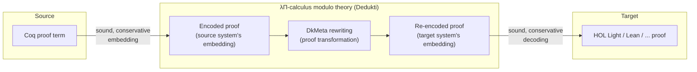

[[book-guidelines|↩ Back to guidelines]]

## Why this problem exists at all

Suppose you formalize a theorem in Coq. It is now *true, mechanically* — but only inside Coq's universe of discourse. If someone working in Lean wants to use your result, they cannot import your proof term; Lean's kernel doesn't know what a Coq `Prop` is, doesn't share Coq's inductive-type machinery, and doesn't accept Coq's proof scripts as input. They have two options: re-prove the theorem from scratch in Lean, or trust your Coq proof as a black box and re-*assert* the theorem as an axiom. Neither is satisfying. Re-proving is enormous duplicated labor across a field where formalization is already expensive. Trusting-as-axiom throws away exactly the property that made formalization worth doing in the first place — that a machine, not a social process, checked the argument.

This is the **interoperability problem**, and Grienenberger's thesis opens with it rather than with any of its own technical machinery (§1–2, pp. 11–22). The chapter's rhetorical move is worth noticing: instead of asserting abstractly that "proof assistants should talk to each other," it walks through one concrete theorem — denumerability of $\mathbb{Q}$ — formalized independently in three systems, and shows *exactly* where the friction is. That case study is the right place to start, because it turns "interoperability is hard" from a slogan into a diagnosis with symptoms you can name.

## The case study: three proofs of the same theorem that share almost nothing

**Theorem (denumerability of $\mathbb{Q}$).** There exists a surjection $f : \mathbb{N} \to \mathbb{Q}$.

Trivial as a piece of mathematics. Formalized independently in at least ten proof assistants (the thesis cites it as item 3 on Wiedijk's "100 theorems" list — more on that list below). Here is what "the same theorem" looks like across three of them:

**PVS** builds numbers top-down by *subtyping refinement*: a type of reals exists, rationals are a subtype, integers a subtype of those, naturals a subtype of those (`nonneg_int: NONEMPTY_TYPE = {i:int | i >= 0}`). Crucially, PVS's interactive proof development produces **proof obligations** discharged by an internal automatic prover *without emitting a certificate* — so a PVS "proof" is a script, not a term. There is nothing to re-check outside PVS without first reconstructing a proof term that never existed.

**HOL Light** builds naturals from the **axiom of infinity** (an injective, non-surjective function exists) plus the **axiom of choice** (pick the successor function and an element outside its image — that element becomes $0$). This construction is explicitly non-constructive. HOL Light does have real proof terms, but its kernel is deliberately minimal (a handful of primitive inference rules), so recovering a full derivation for external use requires an extra "recording" feature, and doing this at scale is a genuine engineering problem.

**Coq** builds naturals (and rationals) *inductively*, as binary-encoded terms:
```
Inductive positive : Set := xI : positive -> positive | xO : positive -> positive | xH : positive.
Inductive Z : Set := Z0 : Z | Zpos : positive -> Z | Zneg : positive -> Z.
Record Q : Set := Qmake { Qnum : Z; Qden : positive }.
```
This is constructive by construction and does produce explicit proof terms — but the terms are *shaped completely differently* from PVS's or HOL Light's, because the data representation of "rational number" itself is different.

Three systems, one theorem, and pairwise translation between any two of them would require: (a) somehow reconstructing missing proof terms (PVS), (b) reconciling classical vs. constructive foundations (HOL Light vs. Coq), and (c) translating between genuinely different representations of the same mathematical objects (binary Coq integers vs. PVS's subtype tower). None of this is symbol-pushing — it's a foundational mismatch, three times over. **This is the concrete shape of "why direct pairwise translation is hard,"** and it's why the thesis's answer isn't "write nine more translators" (for $\binom{10}{2}\cdot 2$ directions across ten systems) but "find one common target everyone can translate *into*."

**What breaks without addressing this:** without a shared framework, the number of translators you need grows quadratically in the number of systems, and each one is a bespoke research project (each pair has its own foundational mismatch, as above). This is precisely the argument for a *hub-and-spoke* architecture over a *mesh* — familiar from compiler design, where you write $n$ front-ends and $n$ back-ends targeting one IR instead of $n^2$ direct translators. Keep that analogy; it resurfaces below almost literally.

## Two distinct goals hiding inside "interoperability"

The thesis is careful to separate what could easily be conflated into one vague goal. There are (at least) two different reasons you'd want cross-system portability, with different technical requirements:

**1. Trust and cross-checking.** Some important theorems are formalized in *only one* system — the thesis cites Green's theorem and the central limit theorem (Isabelle only), the four-color theorem (Coq only), a cube-dissection result (Lean only), the isoperimetric theorem and Pick's theorem (HOL Light only), plus enormous unique developments like Flyspeck and CompCert. Wiedijk's "100 theorems" tracking page (maintained since the mid-2000s) documents exactly this landscape; as of this thesis, only Fermat's Last Theorem remains unformalized anywhere. For a single-system result, the question is sharp: **are we confident enough in this one proof assistant's soundness, and in this one formalization's correctness, to treat the theorem as established?** Cross-checking in a second, independently-implemented system is the strongest available answer short of re-deriving the mathematics by hand. The thesis states the core technical requirement precisely: *the theoretical bar for a cross-checking translation is that it be **sound** — i.e., it must preserve provability of statements* (a proof of $A$ must translate to a proof of [the image of] $A$, never smuggling in something unprovable). Existing direct, sound translations between specific pairs of systems already exist; the technical obstacles are usually scalability or the absence of explicit proof terms to translate (as in PVS above).

**2. Comparison, alignment, and de-duplication.** When the *same* theorem is proved in many systems (or twice within one system, as happens in Coq for $\mathbb{Q}$'s denumerability), a different set of questions arises: are these proofs fundamentally different or redundant? How do you even compare axioms and intermediate lemmas across systems with different native vocabularies? Can you detect that a result you're about to formalize already exists somewhere and avoid re-deriving it? This shades into a concern beyond proof assistants specifically — code and lemma duplication is a general problem in large software/library ecosystems — but it sharpens acutely for formal proof, where "this lemma already exists" can save weeks of specialized labor.

These two goals both want the same technical enabler (a common target for translation), but they stress different properties of it: goal 1 wants **soundness of translation**; goal 2 additionally wants translated proofs to be **comparable** — you need to be able to look at an imported proof and ask "which axioms does this actually depend on?", not just "does this type-check."

## The proposed answer: a common logical framework, not $n^2$ translators

A **logical framework** is defined precisely in the introduction: a language for formalizing theories, statements, and proofs, in which a given theory's own definitions/axioms are kept syntactically distinct from the framework's own logical axioms and deduction rules. The paradigm example predating this thesis is the **Edinburgh Logical Framework (LF)**, ancestor of de Bruijn's Automath and, through it, of essentially all contemporary proof assistants.

The thesis's proposed common target is **Dedukti**, an implementation of the **$\lambda\Pi$-calculus modulo theory** — LF extended so that a *user-defined computational theory* (a signature of typed constants plus a set of rewrite rules) can be layered on top of the bare framework. This is the crucial extra freedom LF alone doesn't give you: instead of encoding a proof system's inference rules only as *typed constructors* (pure Curry–Howard, "formulae as types," which forces every rule application to appear explicitly in a term), you can also fold definitional content into a **rewrite/conversion relation**, so that a chain of unfolding steps a source system performed silently gets performed silently in Dedukti too. This expressive flexibility is *why* Dedukti (as opposed to bare LF) is claimed to admit sound and conservative encodings of a wide range of concrete proof assistants' logics — this claim is not proved in these introductory chapters but is the technical payload of Chapters 9–10, which this article's sibling on "[[Pure-Type-Systems|Pure Type Systems]]" and "The λΠ-Calculus Modulo Theory" covers.

Once a proof is encoded into Dedukti, three things become possible that weren't possible source-system-to-source-system:

1. **Rechecking** — an independent, minimal kernel re-verifies the proof, which is exactly the cross-checking goal above, done once against a common framework rather than against every other system pairwise.
2. **Transformation** — a proof term can be *rewritten* while remaining well-typed, using a dedicated metaprogramming tool the thesis names explicitly: **DkMeta**. This is the mechanism, not just the metaphor, behind translation: a proof isn't magically re-expressed in a new system, it's mechanically rewritten within (or out of) the common framework.
3. **Export** — the (possibly transformed) proof can be emitted back out as a proof in a different target system.

This gives a genuine **pipeline**, not a single conversion function:



Notice the compiler analogy from earlier is now literal: Dedukti plays the role of a shared **intermediate representation**, front-ends encode source-system proofs into it, DkMeta is the optimization/transformation pass, and back-ends decode into target systems. You write one encoder and one decoder per proof assistant, not one translator per *pair* — turning an $O(n^2)$ problem into an $O(n)$ one, exactly as LLVM IR did for compiler backends.

## Theory U: pushing the common ground one level higher

A further observation sharpens this pipeline. If proof systems with *similar logical foundations* — say, the whole HOL family (HOL Light, HOL4, Isabelle/HOL, ProofPower, OpenTheory) — are each embedded into Dedukti more or less independently, those embeddings will likely look similar to each other, since they're encoding similar logics. If instead you build **one Dedukti theory that already contains, as identifiable sub-theories, the common logical cores that multiple proof assistants share**, then translation between two systems whose embeddings both extend that common core reduces to handling only the *specific, non-shared* features of each embedding — the shared part needs no further transformation at all, because it's already the same term.

This is **theory U** (introduced by Blanqui, Dowek, Grienenberger et al. — not invented from scratch in this thesis but studied and extended by it): a single Dedukti theory expressive enough to state proofs of minimal, constructive, classical, and *ecumenical* (classical-and-intuitionistic-coexisting — the subject of this book's companion topic on "[[Ecumenical-Logics|Ecumenical Logics]]") predicate logic and Simple Type Theory, with or without prenex polymorphism or predicate subtyping, together with the calculus of constructions. In other words: many of the actual logical foundations proof assistants use in practice, sitting inside *one* well-typed theory as identifiable fragments.

The payoff, stated directly in Chapter 11's motivation (pp. 109–110), is that theory U — or a similarly-designed comprehensive theory — lets you go one further step beyond the generic Dedukti pipeline: proofs from diverse systems can be **rechecked and compared inside a single theory** (which constants, which axioms did this proof actually use?), and **proof transformations implemented once inside theory U** — the thesis names *constructivization* (turning a classical proof into a constructive one where possible) as a concrete example — become reusable across *every* source system whose logic embeds into theory U, rather than needing to be re-implemented as a bespoke transformation for each pair of systems.

But this ambition immediately raises a hard technical question, and the thesis is explicit that this is *the* open problem the rest of the manuscript exists to answer: if theory U is one large combined theory built by extending and *fragmenting* smaller ones, **how do you know a proof imported into it, using rewriting freely, only actually depends on the axioms of the sub-theory you claim it belongs to?** A proof term carries no syntactic trace of which rewrite rules fired during its type-checking — so "this proof is really a proof of the intuitionistic fragment" is not something you can read off the term by inspection. Chapter 11 gives four worked counterexamples (non-modular theory union, non-modular extension, and two non-modular fragmentations) showing that naive answers fail: e.g., two individually well-typed theories $\Sigma_b, R_b$ and $\Sigma_c, R_c$ can have a well-typed union that is *not* well-typed, because product injectivity — a property needed for the type system's core metatheorems — can fail once both rewrite rules for `a` coexist. This is exactly the kind of failure that "just concatenate the Dedukti files" would not warn you about; the thesis's answer (the **fragment theorem**, developed in Chapters 12–13) is what eventually makes "which sub-theory does this proof belong to" a question with a computable, sound answer — but that's the subject of the "[[Theory-Fragmentation|Theory Fragmentation]]" topic, downstream of this one.

## Grounding: what this looks like as an engineer, not a logician

**Rust — the pipeline as a compiler you'd actually build.** The natural Rust shape for "logical framework as common IR" is an AST enum with a *trusted, generic* type-checker, plus a **rewrite-rule table** that's data, not code:

```rust
enum DkTerm {
    Var(usize),
    App(Box<DkTerm>, Box<DkTerm>),
    Lam(Box<DkTerm>, Box<DkTerm>),   // λ x : A. body
    Pi(Box<DkTerm>, Box<DkTerm>),    // Π x : A. B  (dependent product)
    Const(Symbol),
    Sort(Sort),                      // TYPE, KIND
}

struct RewriteRule { lhs: DkTerm, rhs: DkTerm } // [x1..xn] l --> r

struct Theory {
    signature: HashMap<Symbol, DkTerm>, // constant -> its type
    rules: Vec<RewriteRule>,            // the "computational content"
}
```
A proof-assistant "encoder" is then just a function `SourceProof -> DkTerm` written against a fixed `Theory` (the embedding of that source system's logic); an "exporter" is `DkTerm -> TargetProof` against the same or a different `Theory`. DkMeta's role — proof transformation *within* the framework — is a function `DkTerm -> DkTerm` that must be shown to preserve typability (this is exactly the "well-typedness is preserved under X" concern that recurs as the technical backbone of the rest of the thesis: theory extension, fragmentation, rewriting all need to preserve this same invariant). The generic type-checker over `DkTerm` — the piece you'd want to keep as small and auditable as possible — *is* the trusted computing base of this whole architecture: everything downstream (soundness of every encoding, correctness of every transformation) is only as trustworthy as this one small kernel, which is precisely the LCF/de Bruijn-style "small trusted kernel" design proof assistants already use internally, just applied one layer up, to the interoperability hub itself.

**Lean — the `def`/`thm` distinction as a live example of what's at stake.** Dedukti's concrete syntax (detailed in Chapter 10, previewed here) distinguishes `def f := t` (adds a $\delta$-rewrite rule — `f` unfolds silently during type-checking) from `thm f := t` (keeps only the type declaration — `f` is opaque, never unfolds). This is *exactly* Lean's distinction between a reducible `def` and an irreducible `theorem`/`opaque` — and it's not a stylistic choice, it's a decision about **what a proof of interoperability-relevant equality is allowed to see through**. A translator encoding a Lean proof into Dedukti has to get this right per-declaration: get it wrong (make something opaque that the source system treats as unfolding, or vice versa) and the encoded theory can fail to be sound or conservative with respect to the source — the exact property Chapter 10's theorems (previewed here, proved there) are built to guarantee.

**Where this is *not* forced.** Direct grounding in Python doesn't add anything here beyond a restatement of the Rust sketch — the interesting content of this topic is architectural (why a hub, what soundness a translator needs) rather than algorithmic in a way a short script would illuminate, so no Python example is given.

## Where this leads

This topic is the thesis's motivation, not its technical content — everything downstream cashes out the promise made here:

- **Ecumenical logics (NE, Chs. 3–7)** answer *part* of "what should the common framework look like internally" by showing classical and intuitionistic reasoning can coexist as primitives in one system without collapsing — directly serving theory U's ambition to hold multiple logics as identifiable fragments.
- **Pure Type Systems and the $\lambda\Pi$-calculus modulo theory (Chs. 8–10)** give Dedukti its actual formal definition and prove the soundness/conservativity/decidability theorems this article's pipeline diagram assumed.
- **Modularity and fragmentation (Chs. 11–13)**, previewed above via the non-modularity counterexamples, build the **fragment theorem** — the technical device that finally answers "which sub-theory does an imported proof really belong to," making theory U's comparison/classification promise actually deliverable rather than aspirational.
- **Chapter 14** closes the loop by showing theory U's ecumenical fragments really are normalizing, decidable, sound, and conservative — i.e., that the architecture sketched in this introduction actually works for a concrete, nontrivial case.

**For the standing project (`type-theory`, `automated-reasoning`):** the trusted-kernel argument above — a small, generic, independently-auditable type-checker as the *only* thing every encoding/transformation must be checked against — is the same design principle a Rust-based verifier's kernel needs: keep the checker minimal and push all the "did I define addition correctly" complexity into a `(signature, rewrite-rules)` pair that the kernel treats generically, exactly as Dedukti does. The `def`/`thm` (unfold-vs-opaque) distinction is a direct, load-bearing analogue of the elaborator/kernel question "does `isDefEq` see through this constant," which will matter the moment the project's own elaborator has to decide what counts as definitionally, versus only propositionally, equal.
