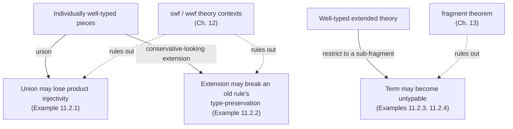
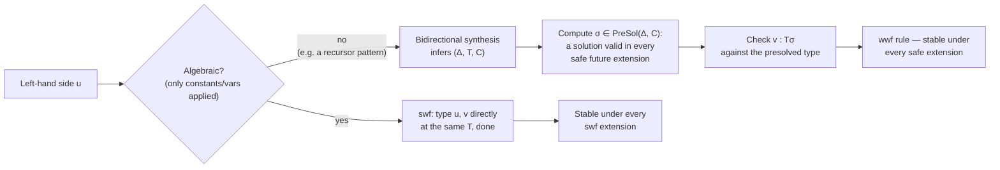

[[book-guidelines|↩ Back to guidelines]]

## The problem: type-checking is not naturally incremental

Here is the situation a Dedukti user runs into as soon as a project grows past one file. Chapter 8's definition of a well-typed PTS theory is a *global* property: a pair $(\Sigma, R)$ — a signature of typed constants and a set of rewrite rules — is well-typed, full stop, or it isn't. There is no notion of "half of a theory is well-typed." So the moment you write a second file that adds new declarations to an existing, already-checked theory, the only answer the definitions so far give you is: *concatenate the two files and type-check the result from scratch.*

That answer is correct but useless as an engineering discipline. If checking "original + new" always requires re-deriving well-typedness for the *combined* theory, you get no module system — no notion of "this file is done, trust it, only check the new file against it." For a language meant to store and transform *large* proof databases (recall from [[Interoperability-of-Proof-Assistants|Interoperability of Proof Assistants]] that Dedukti's whole raison d'être is being a common target that whole proof assistants get encoded into), re-checking everything on every extension is not a curiosity, it's a scalability wall.

**What breaks without a fix here:** every one of the two use cases motivating this thesis directly needs incremental checking. Type-checking user-defined theories (a Dedukti user builds up a library file by file) needs it for basic usability. Interoperability pipelines need it even more sharply: if theory U is one giant combined theory containing many proof systems' logics as sub-theories, you want to add a new embedding as an *extension* of the existing theory U file, not re-verify the entire, ever-growing theory from the ground up every time someone adds one more logic to the union.

R. Saillard's thesis [Sai15] is the origin of the fix Dedukti's actual type-checker uses today: two graded notions of "well-formed enough that extension is safe," called **strongly well-formed (swf)** and **weakly well-formed (wwf)** theories. This chapter (Ch. 12) reconstructs that framework — fixing one circularity in Saillard's original definitions and generalizing from $\lambda\Pi$-calculus modulo theory specifically to any functional, injective, semi-full PTS — while Chapter 11 first earns the whole exercise by showing, with four worked counterexamples, exactly how modularity fails if you don't do this work.

## Chapter 11: four ways modularity fails

Before building the fix, it's worth sitting with why the naive approach breaks, concretely. All four examples work inside the $\lambda\Pi$-calculus modulo theory (Dedukti's own system), and each one isolates a *different* metatheoretic property that a careless extension can destroy.

**Non-modular theory union.** Declare three types $a, b, c$. Extension $\Sigma_b, R_b$ adds the rule `[] a --> (x : b) -> b.`; extension $\Sigma_c, R_c$ adds `[] a --> (x : c) -> c.` Each extension alone is perfectly well-typed. Their *union* is not: with both rules present, $a$ reduces to two dependent products whose domains ($b$ and $c$) are not themselves convertible, so **product injectivity** — the Key Lemma from Chapter 8 that says $\Pi x{:}A_1.B_1 \equiv_\beta \Pi x{:}A_2.B_2$ implies $A_1\equiv_\beta A_2$ — fails modulo the combined rewrite system. Product injectivity is not a nicety; subject reduction for PTSs is proved *using* it. Lose it and the whole metatheoretic edifice of Chapter 8 stops applying.

**Non-modular theory extension.** This is the sharpest one, because it shows well-typedness can be destroyed by an extension that is, in isolation, completely innocent. Start with `real`, `bool`, `True : bool`, `pi : real`, and two functions `to_real`/`false_to_nat : bool -> Type` defined by rewriting only on `True` (`to_real True --> real`, `false_to_nat True --> real`), plus `real_to_nat : (b:bool) -> to_real b -> false_to_nat b` with the rule `[b] real_to_nat b pi --> pi.` This theory is well-typed: the only way to instantiate `b` such that `real_to_nat b pi` type-checks at all is `b ≡ True` (forced by `pi : real ≡ to_real b`), and in that one case both sides of the rule have type `real`. Now extend conservatively — add a *new* constructor `False : bool`, a *new* type `nat`, and rules `to_real False --> real`, `false_to_nat False --> nat`. Every individual new piece is well-typed on its own. But now `b` can *also* be instantiated to `False`, and under that instantiation the rule's left-hand side `real_to_nat False pi` has type `nat` while the right-hand side `pi` still has type `real` — the rule is no longer type-preserving. **The old rule didn't change. The context around it did, and that alone broke it.** This is the single example that most directly motivates everything that follows: a rewrite rule's well-typedness is not a local property of the rule, it depends on which instantiations of its free variables the *ambient theory* makes available, and a theory extension can always add new ones.

**Non-modular fragmentation (two variants).** These run the same idea in reverse: a term typable in a bigger theory need not be typable in a smaller sub-theory it was carved out of. In the first variant, `Σ₁` declares `o, x : o, fun, f : fun`; extension `Σ₂` adds `i` and the rule `o -> i --> fun.`. The term `f x` (built entirely from `Σ₁` symbols) is not typable in `Σ₁, R₁` — but it *is* typable, at type `i`, once the extension's rule is present, because the extension changes what `fun` reduces to relate to. The second variant reaches the same conclusion (`f x` typable in the extension but not the original) through a different failure: the extension's rules for an auxiliary symbol `Fun` (`Fun --> fun.` and `Fun --> o -> o.`) are individually fine but jointly break **confluence** — `Fun` can reduce to two different, non-joinable normal forms — and it is exactly that lost confluence that lets `f x` acquire a type it didn't have before.

The pattern across all four: **well-typedness of a piece is not compositional in the naive sense.** You cannot check a rule or a fragment once, in isolation, and expect that verdict to survive every future extension, union, or restriction — unless you impose extra structural discipline on what counts as an acceptable extension. That discipline is exactly what swf and wwf theory contexts provide.



## Chapter 12: formalizing "incremental" — theory contexts

The first move is purely organizational, but it's the move that makes everything else possible: stop treating a theory as an unordered pair $(\Sigma, R)$ and instead treat it as an **ordered list of declarations**, the way a Dedukti file actually looks on disk.

**Definition 12.1.1 (Theory context).** Fixing a PTS $P = \langle S, A, R\rangle$, theory contexts are built inductively:
$$
\text{(Rewrite rule)}\quad \xi ::= u \hookrightarrow v \qquad
\text{(Rules declaration)}\quad \Xi ::= \xi \mid \Xi, \xi \qquad
\text{(Theory context)}\quad \Gamma ::= [\,] \mid \Gamma, c{:}T \mid \Gamma, \Xi
$$
A theory context is literally a Dedukti file, read top to bottom: a nested list of "declare this constant" and "declare this batch of rewrite rules" steps.

**Definition 12.1.2 (Contextual theory).** From a theory context $\Gamma$ you extract the theory $T(\Gamma) = (\Sigma(\Gamma), R(\Gamma))$ by collecting every constant declaration into $\Sigma(\Gamma)$ and every rule appearing in some $\Xi \in \Gamma$ into $R(\Gamma)$. $\Gamma$ is *well-typed* iff $T(\Gamma)$ is — same notion of well-typedness as Chapter 8/9, just indexed by the incremental structure. The thesis introduces convenient shorthand notation reused throughout: $\Gamma; \Delta \vdash_P t : T$ for $\Delta \vdash_{P/T(\Gamma)} t : T$, and $\to_\Gamma$ for $\to_{R(\Gamma)}$.

This definition alone buys nothing new semantically — $T(\Gamma)$ is exactly the same flat theory as before. What it buys is a *shape to induct on*. Every proof in the rest of the chapter proceeds by induction on how $\Gamma$ was built, one declaration at a time — which is precisely the structure a file-by-file (or even declaration-by-declaration) type-checking *algorithm* has to follow. The theory context is the formal object that makes "does declaration-by-declaration checking suffice?" a question with a definite technical answer, rather than a vague hope.

**A caveat the thesis is careful to state up front:** even with this incremental scaffolding, proofs about theory contexts stay technically heavy, because higher-order rewriting itself lacks good modularity properties in general [AvOS10] — confluence and termination of a combined rewrite system are *not* automatic consequences of confluence/termination of the pieces (this is exactly what Examples 11.2.1 and 11.2.4 exploit). Theory contexts organize the problem; they do not make the underlying rewriting theory easier.

## Strongly well-formed (swf) theory contexts

The first, simpler sufficient condition targets rules whose left-hand side is built *only* from constants and variables applied to each other — no pattern-matching-like structure, nothing clever.

**Algebraic terms.** $t, u ::= c \mid t\,u \mid t\,x$ where $c$ ranges over constants in $\Sigma(\Gamma)$ and $x$ over variables. Note the asymmetry: applying to another *algebraic term* or to a bare *variable* is allowed at any position, but nothing more exotic (no lambda-abstractions, no nested reduction-dependent structure).

**Definition 12.2.1 (swf rewrite rule).** Fix $\Gamma$ such that $\to_{\beta\Gamma}$ is confluent. A rule $\xi = u \hookrightarrow v$ is *strongly well formed* in $\Gamma$, written $\Gamma \vdash \xi \;\mathsf{swf}$, if $u$ is algebraic and there is a typing context $\Delta$ and a type $T$ such that $\mathrm{dom}(\Delta) = FV(u)$, $\Gamma \vdash \Delta\;\mathsf{wf}$, and both $\Gamma; \Delta \vdash u : T$ and $\Gamma; \Delta \vdash v : T$ — the left- and right-hand sides are typable, *at the same type*, in a context that assigns a type to every free variable of $u$.

**Definition 12.2.2 (swf theory context).** Built inductively: the empty context is swf; a constant declaration $c{:}T$ extends an swf context if $T$ is a sort-typed and $c$ is fresh; a rewrite-rules declaration $\Xi$ extends an swf context if $\to_{\beta(\Gamma,\Xi)}$ is confluent and every rule in $\Xi$ is swf in $\Gamma$.

Why does this suffice for modular extension? Because of a stability lemma about the very restricted shape of algebraic terms:

**Lemma 12.2.3 (Unicity of algebraic terms' type).** If $t$ is algebraic, $\Gamma_0$ is swf, $\Gamma$ is an swf extension of $\Gamma_0$, and $\Gamma_0;\Delta_0 \vdash t : T_0$ while $\Gamma; \Delta \vdash t\theta : T$ (for a substitution $\theta$), then $T \equiv_{\beta\Gamma} T_0\theta$, and every free variable's instantiated type under $\theta$ is convertible to what $\Delta_0$ originally said it should be. In words: an algebraic term's type is *stable* — extending the theory and instantiating its variables can only produce a *convertible* type, never a genuinely different one. This is proved by a straightforward induction on $t$'s three shapes (constant, application to a term, application to a variable), leaning on confluence at each step to push convertibility through.

Because algebraic terms carry this rigidity, an swf rule literally cannot suffer the fate of Example 11.2.2's `real_to_nat` rule — that example's left-hand side `real_to_nat b pi` only became newly instantiable (at `b := False`) because `to_real`/`false_to_nat`, the symbols determining what types `b` could range over, were themselves *definable by rewriting*, i.e. non-algebraic in spirit (their behavior depends on which constructor of `bool` you plug in). An algebraic left-hand side has no such escape hatch: its type is pinned down structurally, extension or no extension.

This delivers the two headline theorems:

- **Theorem 12.2.6 (Extension of swf context).** An swf rewrite rule in $\Gamma_0$ stays well-typed in *every* swf extension of $\Gamma_0$. (Proved by combining Lemma 12.2.3 with a substitution lemma for well-typed substitutions, Lemma 12.2.5.)
- **Theorem 12.2.7.** An swf theory context is well-typed, full stop — because each of its rules is swf in some swf sub-context, hence well-typed by Theorem 12.2.6, and declarations/product-compatibility follow from confluence directly.

**The payoff, stated plainly:** if you build your Dedukti file so that every rewrite rule's left-hand side is algebraic and every prefix of the file stays confluent, you can type-check it *declaration by declaration*, and — this is the actual module-system guarantee — any *future* swf extension is automatically guaranteed not to retroactively break an already-checked rule. That is precisely the property Example 11.2.2 showed the naive theory of Chapter 8 does not give you for free.

## Weakly well-formed (wwf) theory contexts: when the left-hand side isn't typable on its own

swf is clean but too restrictive. Plenty of ordinary, everyday rewrite rules have a left-hand side that is *not itself well-typed as written* — yet every well-typed *instance* of that left-hand side behaves correctly [Bla01]. A recursor is the canonical example: `(R e f) 0 --> e` and `(R e f) (S n) --> f [(R e f) n] n` (from Chapter 9's discussion of $\iota$-reduction) are exactly this shape — `R e f` applied to `0` or `S n` isn't algebraic (`0` and `S n` aren't variables or constants-applied-to-things in the required sense; they're specific *constructor instances* the rule pattern-matches on), yet the rule is perfectly sound once you restrict attention to instances where the pattern actually matches.

To recover these rules, the thesis needs two new ingredients: a distinction between symbols that can and can't be redefined by later rewrite rules, and a genuine **type-inference algorithm with constraint generation**, since a non-algebraic left-hand side can no longer just be "typed" outright — its type has to be *inferred*, possibly leaving behind unresolved equational obligations.

### Static vs. definable symbols

Every signature is now partitioned into **static** symbols $\Sigma_S$ and **definable** symbols $\Sigma_D$. Only a definable symbol may head the left-hand side of a rewrite rule. This is the formal version of a distinction every Dedukti user already makes informally: some constants are "just data" (like a `bool` constructor) and some are "defined by computation rules" (like a recursor or an `if`-`then`-`else`). Restricting rule heads to definable symbols is what stops a rule from ever trying to redefine, say, a constructor — the source of a lot of confluence trouble in practice.

### Constraint generation: bidirectional inference with deferred equations

The thesis defines a **synthesis** judgment $\Gamma;\Delta;\Phi;C \Rightarrow_i t \Rightarrow (\Delta', T, C')$ ("infer a type $T$ for $t$, threading through and possibly extending a set of open constraints $C$") and a **checking** judgment $\Gamma;\Delta;\Phi;C \Rightarrow_c t : T \Rightarrow (\Delta', C')$ ("check $t$ against expected type $T$"), given as Figures 12.1–12.2. This is precisely the **bidirectional typing** discipline: synthesis (infer-mode) rules for constants, variables, sorts, application, abstraction, and products; checking (check-mode) rules that either invoke synthesis and demand convertibility (`Inversion`), push through a known Π-type without re-checking a domain that's already fixed by context (`App No Check`), or — crucially for the recursor case — record a **constraint** between the type you *expected* and the type you can *infer for a still-abstract pattern* whenever a value known only up to $\Phi$-bound variables prevents outright comparison (`C-Abstraction`, which literally emits $C_3 \cup (\lambda\Phi.A_1, \lambda\Phi.A_2)$ into the constraint set rather than trying — and failing — to prove $A_1 \equiv A_2$ on the spot).

A **constraint** is just a pair of terms over the current variables; a **solution** $\theta \in \mathrm{Sol}_\Gamma(V, C)$ is a substitution making every pair convertible under $\Gamma$. So type-checking a wwf-candidate rule doesn't ask "is this term typable" outright — it asks "under what substitution *would* this term be typable," and defers the answer as a set of equational obligations to be discharged later. This is structurally the same move a Hindley–Milner-style inferencer or an elaborator's metavariable-and-constraint-queue makes: infer eagerly, generate equations where you can't decide immediately, solve (or at least characterize solutions to) the equations afterward.

### Safe extensions and permanent presolutions

The hard question is: solved *when*, and against *which* future theory? A constraint set collected while checking a rule in $\Gamma$ might have different solutions once $\Gamma$ is later extended — new constants and new instances become available, exactly the mechanism that broke Example 11.2.2. The thesis's answer is to demand a solution robust against every extension that could plausibly still preserve the surrounding theory's good behavior:

**Definition 12.2.9 (Safe extension).** An extension $\Gamma$ of a base context $\Gamma_0$ is **safe** if: it is injective (product injectivity holds), $\to_{\beta\Gamma}$ is confluent, every declaration in $\Gamma$ is well-typed, every rewrite rule $u \hookrightarrow v \in \Gamma$ has $u = f\,\vec w$ for a *definable* symbol $f$, and — the clause that actually closes the loop — every rewrite rule already present in $\Gamma_0$ stays well-typed in $\Gamma$. A safe extension is, by definition, exactly the kind of theory growth that cannot reproduce Example 11.2.2's failure.

**Permanent presolution.** A substitution $\sigma$ is a *permanent presolution* for constraints $C$ in $\Gamma$, written $\sigma \in \mathrm{PreSol}_\Gamma(V, C)$, if for **every** safe extension $\Gamma_1$ of $\Gamma$ and **every** actual solution $\theta \in \mathrm{Sol}_{\Gamma_1}(V, C)$, we have $\theta \equiv_{\beta\Gamma_1} \theta\sigma$. In words: $\sigma$ is a single, canonical solution that every future solution — no matter which safe extension eventually supplies it — must agree with, up to conversion. This is the technical device that lets a rule be checked *once*, against a presolution computed now, and trusted to remain correct against solutions that only become available later.

**Definition 12.2.10 (wwf rewrite rule).** $\xi = u \hookrightarrow v$ is weakly well-formed in $\Gamma$ if synthesis infers $u \Rightarrow (\Delta, T, C)$, some $\sigma \in \mathrm{PreSol}_\Gamma(\mathrm{dom}(\Delta), C)$ exists, $\Delta\sigma$ is well-formed, and $\Gamma;\Delta\sigma \vdash v : T\sigma$ — the right-hand side is checked against the *presolved* left-hand-side type, not the raw inferred one.

The technical engine that makes this whole apparatus work is **Lemma 12.2.11**, a substantial inductive proof (spanning the bidirectional rules of Figures 12.1–12.2 case by case) showing that typing information computed by synthesis/checking in $\Gamma$ is *preserved, up to convertibility, when instantiated into any safe extension* $\Gamma_0$ — exactly the generalization of Lemma 12.2.3's stability result from algebraic terms to arbitrary bidirectionally-typed terms. From it:

- **Theorem 12.2.12.** A wwf rule in a well-typed $\Gamma$ stays well-typed in every safe extension of $\Gamma$.
- **Definition 12.2.13 / Theorem 12.2.14.** wwf theory contexts (defined the same inductive way as swf ones, but requiring every declared rule's head to be definable and every rule to be wwf, not just algebraic-and-typable) are well-typed — proved by strengthening the induction hypothesis to "$\Gamma$ is well-typed *and* every rule in $\Gamma$ stays well-typed in every wwf extension of $\Gamma$," since the wwf-context construction itself guarantees that every wwf extension is, in particular, a safe extension.



## Why the older definition had to be replaced

The chapter opens by flagging that it deliberately drops Saillard's original notion of "permanently well-typed rewrite rule" (his Definition 2.6.16), because that definition is **circular**: it defines when a rule stays well-typed in future extensions by quantifying over future extensions that are themselves required to keep declared rules "permanently well-typed" — a self-referential condition that complicates the induction needed to prove the framework's own soundness. The fix here threads the same intuition through **safe extension** (Definition 12.2.9) instead, which is defined structurally (injectivity, confluence, well-typedness of declarations, definable-headed rules, preservation of *already-declared* rules) rather than by quantifying over the very notion being defined. This is a genuinely technical but important point: it's the difference between "an extension is safe if it doesn't break things" (checkable, structural) and "an extension is safe if every extension of it is also safe" (circular, unusable as an induction hypothesis). The second contribution the chapter claims — generalizing from $\lambda\Pi$-calculus modulo theory specifically to *any* functional, injective, semi-full PTS — is what makes this machinery reusable for type-checking user-defined theories in systems other than Dedukti itself.

## Grounding: what this looks like as an engineer

**Rust — swf/wwf as a two-tier admission check for a rewrite-rule table.** Recall from [[Interoperability-of-Proof-Assistants|Interoperability of Proof Assistants]] the sketch of a `Theory { signature, rules }` with a generic, trusted checker. Modularity says: don't just add a `RewriteRule` to `rules` and re-run the whole checker over everything. Instead, classify each rule at declaration time:

```rust
enum LhsShape { Algebraic, PatternHeaded { head: Symbol } }

struct RuleCheck {
    shape: LhsShape,
    // swf path: direct typing of lhs and rhs at one shared type
    // wwf path: bidirectional synthesis leaves behind constraints,
    //           which must be discharged by a *presolution* valid
    //           against every future "safe" extension of the signature
    obligations: Vec<Constraint>,
}

fn admit_rule(theory: &Theory, rule: &RewriteRule) -> Result<RuleCheck, TypeError> {
    match classify_lhs(&rule.lhs, &theory.signature) {
        LhsShape::Algebraic => check_algebraic_rule(theory, rule),
        LhsShape::PatternHeaded { head } => {
            require_definable(&theory.signature, head)?;
            let (ctx, ty, constraints) = synthesize(theory, &rule.lhs)?;
            let presolution = solve_permanently(theory, &constraints)?; // Def. 12.2.9/12.2.10
            check(theory, &rule.rhs, ty.substitute(&presolution))?;
            Ok(RuleCheck { shape: LhsShape::PatternHeaded { head }, obligations: constraints })
        }
    }
}
```
The load-bearing engineering idea is `require_definable` plus `solve_permanently`: a real module system for a rewrite-based checker needs exactly this two-tier admission test — "is this rule's shape simple enough to type outright" versus "does this rule's shape need a constraint-and-presolution argument that's guaranteed robust against whatever gets added to the signature later." Skipping this and just re-type-checking the concatenation of all files (as Chapter 11's opening paragraph describes as the "unsatisfactory" naive approach) is exactly the $O(n^2)$-recheck trap the interoperability pipeline can't afford at proof-database scale.

**Lean — bidirectional constraint generation as literally what the elaborator does.** The synthesis/checking pair of Figures 12.1–12.2 is the same architecture as Lean's own elaborator: infer a type where you can (synthesis, `i`), check against an expected type where one is given (checking, `c`), and where neither is immediately decidable, **defer an equation into a constraint set** rather than failing outright. Lean's elaborator does exactly this with **metavariables** and its unifier's deferred-constraint queue — a metavariable's type gets pinned down eagerly when possible, and postponed as a constraint (later discharged by `isDefEq`) when it can't be. The `PreSol_Γ(V, C)` notion — *a solution that remains valid no matter which admissible future extension of the ambient elaboration state supplies the real answer* — is the thesis's rewrite-rule-typing analogue of what Miller's pattern-unification fragment gives an elaborator: a canonical, extension-robust most-general solution to a set of deferred unification constraints, computed once and trusted to still be correct once more of the surrounding term/context is filled in. This is precisely why this topic is tagged `automated-reasoning` as well as `type-theory`: "does a set of constraints have a solution valid against everything that could come later" is the same shape of question a constraint-generation-and-solving pass asks anywhere in the toolchain, whether the "later" is a Dedukti file extension or an elaborator resolving the rest of a term.

## Where this leads

**Immediate consequence — Chapter 13's fragment theorem.** This chapter proved that swf/wwf theories are *stable going forward* (extension preserves well-typedness). The converse direction — going *backward*, from a large combined theory like theory U down to "which sub-fragment does this specific proof actually need?" — is Chapter 13's subject, and it leans directly on this chapter's results: fragments of swf theories are themselves swf (so [[Theory-Fragmentation#The fragment theorem|the fragment theorem]] holds for them unconditionally), and fragments of wwf theories inherit wwf-ness via an algorithmic argument about the `find_presolution` procedure this chapter's constraint machinery makes possible in the first place.

**Chapter 14's payoff.** Theory U's ecumenical fragments are shown well-typed as a direct, "for free" consequence of Chapter 13's fragment theorem building on this chapter's framework — meaning the heavy metatheoretic lifting for *those* results (normalization, decidability, soundness, conservativity) doesn't have to re-derive well-typedness from scratch; it inherits it structurally from being expressed as swf/wwf fragments of a larger, already-checked theory.

**For the standing project (`type-theory`, `automated-reasoning`):** this chapter is a direct blueprint for any compiler that wants a real module system over a rewrite-rule-extensible core language — exactly the situation a Rust-based verifier faces once user-defined `def`-style unfoldings or a CSP-solver's own domain-specific rewrite rules are allowed to accumulate across files. The swf/wwf distinction is the load-bearing design decision: decide, per rule, whether its left-hand side is simple enough to type outright (swf, cheap) or needs bidirectional constraint generation plus an extension-robust presolution (wwf, the mechanism this article shares structurally with metavariable-constraint solving in an elaborator). Getting the "safe extension" notion right — non-circular, structurally checkable — is precisely the kind of invariant a trusted kernel must get exactly right once, since every later module-loading decision depends on it.
