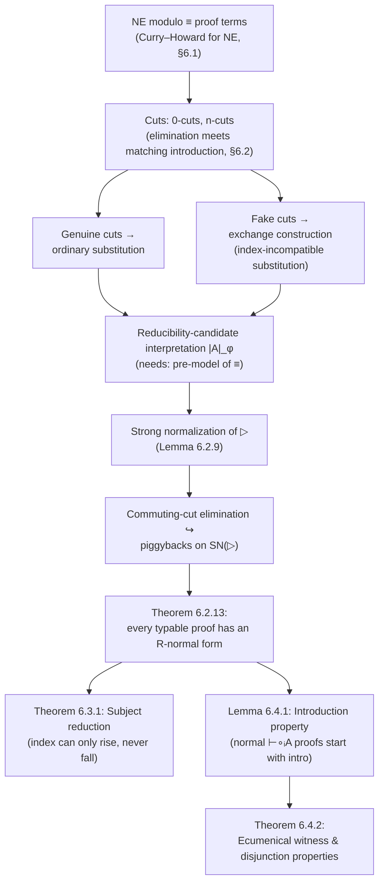

# Proof Normalization in Ecumenical Logic

[[book-guidelines|↩ Back to guidelines]] · builds on [[Ecumenical-Logics]]

## Why NE needs its own normalization theorem

Chapter 4 of the thesis gave you sound, conservative translations $|\cdot|_\sigma$ and $|\cdot|^\sigma$ back and forth between NE (the ecumenical natural-deduction system with indexed connectives $\wedge_\sigma, \vee_\sigma, \Rightarrow_\sigma$, etc.) and the classical/intuitionistic reference systems NK/NJ. Since NJ and NJ-modulo-theory proofs are already known to normalize, the lazy move would be: translate an NE proof down into NJ, normalize *there* using fifty years of established cut-elimination technology, and forget about NE-specific machinery.

That move throws away exactly the thing NE was built to preserve. A hybrid NE proof — one that genuinely mixes classical and intuitionistic connectives, e.g. an externally intuitionistic conclusion reached via an internal classical detour — has no faithful image as a *single* NJ or NK proof; translating it collapses the fine-grained index structure that told you which parts of the derivation were classical and which were constructive. If your entire reason for building NE was to keep classical and constructive information visibly separate (so you can, say, extract a program from the constructive part even though the overall statement used classical reasoning), then normalizing via a lossy translation defeats the purpose before you've even started. **What breaks without a native normalization procedure:** you'd get a normal form, but you'd have already lost the ecumenical bookkeeping that made the normal form worth having.

So Chapter 6 redoes cut-elimination *inside* NE modulo a congruence ($\mathrm{NE}/\!\equiv$, from Chapter 5's deduction-modulo framework), tracking indices at every reduction step. The payoff, delivered at the very end of the chapter, is worth previewing: once you have normal forms, you can prove ecumenical (partial) versions of the witness and disjunction properties — the same properties that [[Ecumenical-Logics|distinguish NJ from NK]] — but now for *externally intuitionistic* judgments inside the hybrid system NE. That result was flagged as a dependency back in the Ecumenical Logics article and deferred here; this is where it actually gets proved.

## Proof terms: giving NE a Curry–Howard reading

Before you can talk about reduction, you need *terms* to reduce, not just derivations. Section 6.1 assigns proof terms $\pi, \rho, \ldots$ to $\mathrm{NE}/\!\equiv$ derivations — a direct Curry–Howard correspondence (Lemma 6.1.1: a sequent $A_1,\ldots,A_n \vdash B$ is derivable iff there's a proof term $\pi$ with $\alpha_1:A_1,\ldots,\alpha_n:A_n \vdash \pi:B$ typable).

Most of the constructors are exactly what you'd expect from a typed lambda calculus with pairs and sums: $\lambda^\sigma\alpha.\pi$ and $\mathrm{app}_\sigma(\pi,\pi')$ for implication, $\langle\pi,\pi'\rangle$/$\mathrm{fst}$/$\mathrm{snd}$ for conjunction, $i_\sigma(\pi)$/$j_\sigma(\pi)$ for disjunction injections with a case-split eliminator $\delta^{\vee}_{\sigma,\tau}\pi\,\alpha\pi_1\,\beta\pi_2$, and $\langle t,\pi\rangle_\sigma$/$\delta^\exists_\sigma$ for the existential. Two constructions are new and specific to NE: $\mathrm{furl}(\pi)$/$\mathrm{unfurl}(\pi)$, corresponding to the introduction/elimination of the embedding connective $\circ_i$ (recall $\circ_i A$ says "$A$ holds without needing a double negation"), and $\theta$ for the introduction of $\top$.

**Rust framing.** Think of this the way you'd think of a typed IR for a compiler pass: every AST node in the "proof language" corresponds to exactly one inference rule, so type-checking a proof term is structurally identical to type-checking any other tagged-union AST —

```rust
enum ProofTerm {
    Var(ProofVar),
    LambdaI(Index, ProofVar, Box<ProofTerm>),      // λ^σ α. π  (⇒-i / ¬-i)
    App(Index, Box<ProofTerm>, Box<ProofTerm>),     // app_σ(π, π')  (⇒-e / ¬-e)
    Pair(Box<ProofTerm>, Box<ProofTerm>),           // ⟨π, π'⟩  (∧-i)
    Fst(Box<ProofTerm>), Snd(Box<ProofTerm>),       // (∧-e)
    InjL(Index, Box<ProofTerm>), InjR(Index, Box<ProofTerm>),   // i_σ, j_σ  (∨-i)
    CaseOr(Index, Index, Box<ProofTerm>, ProofVar, Box<ProofTerm>, ProofVar, Box<ProofTerm>), // δ∨  (∨-e)
    Exists(Term, Box<ProofTerm>, Index),            // ⟨t, π⟩_σ  (∃-i)
    CaseExists(Index, Box<ProofTerm>, Var, ProofVar, Box<ProofTerm>), // δ∃  (∃-e)
    Furl(Box<ProofTerm>), Unfurl(Box<ProofTerm>),   // ◦_i-i / ◦_i-e
    Truth,                                          // θ  (⊤-i)
    ExcludedMiddle,                                 // ν  (EM)
    Falso(Box<ProofTerm>),                          // δ⊥  (⊥-e)
}
```

The one thing that has *no* ordinary programming-language analogue is that **every binder and every constructor carries an index** $\sigma \in \{i, c\}$, and the typing rules (Figs. 6.1–6.3) are guarded by side conditions on those indices — e.g. $(\wedge\text{-i})$ requires $\min(\sigma,\tau) \le \min(\sigma_A,\sigma_B)$, mirroring exactly the ordering constraint from NE's static typing rules in Chapter 4. This is the load-bearing detail for everything that follows: reduction steps will need to *recompute* whether these constraints still hold, and sometimes they only hold after routing through an auxiliary construction (the "exchange" trick, below) rather than by direct substitution.

One structural fact worth internalizing early, because it recurs in every proof by induction in this chapter: proof terms split into **introductions** (headed by an introduction-rule constructor: $\theta$, $i_\sigma$, $j_\sigma$, $\lambda x.\pi$, $\lambda^\sigma\alpha.\pi$, pairs, $\mathrm{furl}$, existential witnesses) and **eliminations** (headed by $\mathrm{fst}$, $\mathrm{snd}$, $\delta^\perp$, $\delta^\exists_\sigma$, $\mathrm{app}_\sigma$, $\mathrm{unfurl}$, $\delta^\vee_{\sigma,\tau}$). A term is **neutral** if it is not an introduction. This introduction/elimination split is exactly the same dichotomy Lean's kernel uses when deciding whether a term is in weak-head normal form (an introduction is "already a value"; an elimination is a candidate redex if its main premise reduces to a matching introduction).

## Cuts: the shapes a redex can take

A **cut** is what a redex looks like in NE: an elimination whose *major premise* (the premise containing the connective being eliminated) is itself an introduction of that same connective. The simplest case, a **0-cut**, is a redex you can eliminate immediately — e.g. $\mathrm{fst}(\langle\pi_1,\pi_2\rangle) \to \pi_1$ is exactly conjunction's beta rule, and $\mathrm{app}_\tau(\lambda^\sigma\alpha.\pi_B, \pi_A) \to \pi_B[\alpha:=\pi_A]$ is ordinary beta reduction (the book notes explicitly: "beta-reduction is a subsystem of the reduction of 0-cuts").

Where it gets interesting is **n-cuts**. Because NE has disjunction-elimination ($\vee$-e) and existential-elimination ($\exists$-e) — both of which case-split into subproofs — a formula can be *introduced*, then pass through one or more $\vee$-e/$\exists$-e applications as a "passenger," and only get *eliminated* several layers of case-analysis later. Formally: a path $A_0, \ldots, A_n$ is a cut of length $n$ if $A_0$ is the major premise of an elimination, each intermediate $A_i$ is the conclusion of a $\vee$-e or $\exists$-e whose minor premise is $A_{i+1}$, and $A_n$ is the conclusion of an introduction. A 1-cut looks like $\mathrm{fst}(\delta^\exists_\sigma \pi_F\, x\alpha\langle\pi_1,\pi_2\rangle)$ — the elimination ($\mathrm{fst}$) is stuck outside a $\exists$-e whose branch produces the matching introduction (the pair). You can't reduce this directly; you first have to **migrate the intervening case-split outward** past the elimination, turning the 1-cut into a 0-cut: $\mathrm{fst}(\delta^\exists_\sigma\pi_F\,x\alpha\,\pi) \rightsquigarrow \delta^\exists_\sigma \pi_F\,x\alpha\,\mathrm{fst}(\pi)$.

**What breaks without treating n-cuts separately:** if you only ever look for 0-cuts, a proof can be stuck in a form that is "morally" reducible (there's an introduction and a matching elimination somewhere) but syntactically unreachable because a case-split sits between them. This is a genuinely structural difference from plain lambda calculus, where every redex is already "adjacent" — it's the price of having $\vee$-e/$\exists$-e as binding, branching eliminators rather than simple destructors.

## The exchange construction: reducing "fake cuts"

Here is the chapter's most distinctive piece of machinery, and the one that has no analogue at all in ordinary NJ/NK cut-elimination. Some 0-cuts in NE are *fake*: syntactically they look like an introduction meeting a matching elimination, but the index constraints on the introduction and the elimination are incompatible in a way that blocks ordinary substitution.

Concretely: for implication, $\mathrm{app}_{\tau_A}(\lambda^{\sigma_A}\alpha.\pi_1, \pi_2)$ is a genuine cut you reduce by substitution *when* $\tau_A \ge \sigma_A$. But when $\tau_A < \sigma_A$ — which the index-ordering constraints force to mean $\tau_A = c$ (classical) and $\sigma_A = i$ (intuitionistic) — direct substitution would try to plug a classical-typed proof $\pi_2 : \circ_c A$ into a slot expecting $\alpha : \circ_i A$, and that's simply ill-typed; constructive information can only be *lost* going down the index order $c < i$, never gained. Once you translate this proof into NJ via the Chapter 4 embeddings, it turns out this configuration *isn't a cut at all* — it's an artifact of NE's syntax, hence "fake."

The fix is a dedicated combinator:

$$\mathrm{exchange}^\alpha(\pi_1,\pi_2) = \mathrm{unfurl}(\lambda^i\beta.\, \mathrm{app}_i(\mathrm{furl}(\pi_1), \lambda^i\alpha.\, \mathrm{app}_i(\mathrm{furl}(\pi_2), \beta)))$$

Read this as a piece of classical proof-engineering built entirely from double-negation plumbing. $\mathrm{furl}$ embeds a classical proof into a double negation ($\circ_c A \to \circ_i \neg\neg A$ style typing, roughly); the two nested $\mathrm{app}_i$ applications are exactly the standard proof of $\neg\neg B \Rightarrow ((A \Rightarrow \neg\neg B \text{ via } \neg B \Rightarrow \neg A) \ldots)$ pattern — a "classical modus ponens" that routes the substitution through a continuation-passing detour rather than direct plugging. Lemma 6.3.4 (Exchange) makes this precise: if $\Gamma \vdash \pi_A : \circ_c A$ and $\Gamma,\alpha:\circ_i A \vdash \pi_B : \circ_c B$, then $\Gamma \vdash \mathrm{exchange}^\alpha(\pi_A,\pi_B) : \circ_c B$ — you get a well-typed classical conclusion even though the "substitution" you wanted to perform was index-incompatible.

**Compiler-engineer framing.** This is structurally identical to what a continuation-passing-style (CPS) transform does when you need to "call" a function whose calling convention doesn't match at the type level — you don't call it directly, you wrap the call in an explicit control-flow shim built from the ambient effect (here, double-negation / classical reasoning is playing the role of the ambient "exception" or "control" effect). The exchange construction is exactly this: a shim that lets a proof "commit" to using classical reasoning explicitly, at exactly the one point where the index discipline would otherwise reject the direct route.

Fake cuts get their own reduction rules distinct from ordinary cuts (Fig. 6.4c–6.4e) — e.g. $\mathrm{app}_\upsilon(\lambda^{\sigma}\tau.\alpha\pi_1,\pi_2) \to \mathrm{exchange}^\alpha(\pi_2,\pi_1)$ when the ordinary substitution route is blocked, with the symmetric rule for disjunction-elimination and existential-elimination redexes that fall into the same index-mismatched case.

## Strong normalization via reducibility candidates

The chapter defines two reduction relations: ordinary **simple reduction** $\to$ (0-cuts, reduced directly), and a stronger **ultra-reduction** $\rhd$ that additionally allows collapsing a $\vee$-e/$\exists$-e directly to one of its branches even when the discriminee hasn't fully reduced to an injection yet (Fig. 6.4d: $\delta^{\sigma,\tau}_\vee \pi_1\alpha\pi_2\beta\pi_3 \rhd \pi_2$ and $\rhd \pi_3$; $\delta^\exists_\sigma\pi_1\alpha x\pi_2 \rhd \pi_2$). Since $\to \subseteq \rhd$, strong normalization of $\rhd$ (written $SN(\rhd)$) is the stronger, harder-to-prove, more useful result — and it's what the chapter targets.

The proof method is **Tait/Girard reducibility candidates** (credited to [JYG72] — Girard's original technique for proving strong normalization of System F), adapted from prior work on NJ-modulo-theory ([DW03]) to the ecumenical setting.

### Definition: reducibility candidate

A set of proof terms $R$ is a reducibility candidate if:
- it's closed under $\rhd$-reduction,
- it contains every proof variable,
- every $\pi \in R$ is strongly normalizing (in $SN(\rhd)$),
- and — the key closure condition — if $\pi$ is neutral and every one-step $\rhd$-reduct of $\pi$ is in $R$, then $\pi \in R$ itself.

That last clause is doing all the real work: it's what lets you build up membership in $R$ by induction on reduction-sequence length even for terms that aren't already normal.

### Interpreting formulas as reducibility candidates

Definition 6.2.4 assigns, to every formula $A$ and variable assignment $\varphi$, a reducibility-candidate set $|A|_\varphi$, by structural recursion on $A$ — exactly Girard's original recipe, extended connective-by-connective:

- $|\bot|_\varphi = |\top|_\varphi = SN(\rhd)$ — the trivial/degenerate cases.
- $\pi \in |A \Rightarrow_\sigma B|_\varphi$ iff $\pi \in SN(\rhd)$ and, whenever $\pi \rhd^* \lambda^\tau\alpha.\pi_1$, every $\pi_0 \in |A|_\varphi$ satisfies $\pi_1[\alpha:=\pi_0] \in |B|_\varphi$ — the usual "functions map good inputs to good outputs" clause.
- $\pi \in |A \wedge_\sigma B|_\varphi$ iff $\pi \in SN(\rhd)$ and $\pi \rhd^* \langle\pi_1,\pi_2\rangle \Rightarrow \pi_1 \in |A|_\varphi \wedge \pi_2 \in |B|_\varphi$.
- $\pi \in |\forall_\sigma^T x.A|_\varphi$ iff $\pi \in SN(\rhd)$ and $\pi \rhd^* \lambda x.\pi_1 \Rightarrow$ for every term $t$ of sort $T$ and every model element $E$, $\pi_1[x:=t] \in |A|_{\varphi,x\mapsto E}$.
- ...and symmetrically for $\vee$, $\exists$, $\neg$.

The striking detail — and the one worth sitting with, because it's the ecumenical-specific twist — is: **these clauses are index-agnostic.** The interpretation of $A \wedge_i B$ and $A \wedge_c B$ is the *same* set of proof terms, because "proof terms cannot discriminate" between indices at the level of what they compute — the index is a typing-level annotation about classical-vs-constructive provenance, not a runtime tag the reduction machinery inspects. This is precisely the discipline that lets a *single* reducibility argument cover both fragments of NE at once, rather than needing two separate strong-normalization proofs (one classical, one intuitionistic) glued together.

### The role of a pre-model

This is the chapter's single most important caveat, worth flagging explicitly since it gates everything downstream: **the whole normalization argument is conditional**, not unconditional.

A **pre-model** of a first-order signature $(F,P)$ (Def. 6.2.2) is just what you'd expect from first-order model theory: a carrier set $M_T$ per sort, a function $\hat f$ per function symbol, and — crucially, this is where it departs from ordinary model theory — a map $\hat P$ sending each predicate application to a *reducibility candidate* $\hat P(\ldots) \in \mathcal{C}$, rather than to a Boolean truth value. A pre-model is a pre-model **of a congruence** $\equiv$ (Def. 6.2.7) if $A \equiv B$ implies $|A|_\varphi = |B|_\varphi$ for every assignment $\varphi$ — i.e. the model's interpretation respects the theory's rewrite-based congruence from Chapter 5.

Lemma 6.2.8 (the technical heart of the chapter, a long structural induction covering every proof-term constructor) shows: *given* such a pre-model, every typable proof term lies in the interpretation of its own type: $\Gamma \vdash \pi : \circ_\sigma A \implies \pi\theta\sigma \in |A|_\varphi$ for suitable substitutions. Since every $|A|_\varphi \subseteq SN(\rhd)$, strong normalization (Lemma 6.2.9) drops straight out as a corollary.

**Why the hypothesis is necessary rather than free**, per the chapter's own framing: the interpretation $|A|_\varphi$ has to be *well-defined* and *congruence-respecting* before the induction can even get off the ground — and for an arbitrary congruence $\equiv$ generated by an arbitrary rewrite system (recall from Chapter 5 that $\equiv$ only needs to be non-confusing and decidable to define a legal NE theory), there is no guarantee such a model exists. This is the same shape of caveat you'll see resurface in Chapter 14 for Ecumenical STT — where the thesis has to construct an explicit pre-model (via "full ordered complete $\Pi$-algebras") to *discharge* this hypothesis for that specific theory, rather than getting normalization automatically from Chapter 6's generic machinery. **Pre-model existence is the standing assumption that everything else in this chapter — and this whole line of the thesis — is contingent on.**

**Lean framing.** This should feel structurally close to how a dependently-typed kernel with user-defined reduction rules (think Lean's `@[reducible]` unfoldings, or Dedukti's arbitrary rewrite rules) has to separately verify termination/confluence of *that specific* rule set before trusting `isDefEq` to terminate — the kernel's generic infrastructure (substitution, alpha-equivalence, unification) doesn't buy you termination for free once you let users add their own computation rules; you need an extra semantic argument (a model, or a reduction-order proof) per theory.

## From $\to$-normal to $R$-normal: eliminating commuting cuts

Strong normalization of $\rhd$ gives you *a* normal form, but $\rhd$'s extra collapsing rules are a proof tool, not the notion of "fully reduced" you actually want; what you want is normal forms under the *full* rewrite system $R = {\to} \cup {\hookrightarrow}$, where $\hookrightarrow$ is a separate system of **commuting-cut** rules (Fig. 6.5) that let an elimination "float inward" through the branches of a $\vee$-e or $\exists$-e — e.g. $C[\delta^{\sigma,\tau}_\vee \pi_1\alpha\pi_2\beta\pi_3] \hookrightarrow \delta^{\sigma,\tau}_\vee\pi_1\alpha\,C[\pi_2]\,\beta\,C[\pi_3]$, where $C[\cdot]$ ranges over **commuting contexts** (a one-hole context built from exactly the elimination constructors: $\mathrm{fst}(\cdot)$, $\mathrm{app}_\sigma(\cdot,\pi)$, etc.).

The subtlety flagged explicitly in the text: **every $\hookrightarrow$-step can create a fresh $\to$-redex**, so strong normalization of $\to$ alone doesn't compose trivially with strong normalization of $\hookrightarrow$ to give strong normalization of the combined system $R$. The fix is to piggyback on $\rhd$: since $\to \subseteq \rhd$ and $\hookrightarrow$-steps correspond to $\rhd$-reduction sequences that generate the same eventual $\to$-redexes, $SN(\rhd)$ (already established) is strong enough to underwrite a well-founded induction — Theorem 6.2.13 runs this induction on the lexicographic order of (length of longest $\rhd$-reduction, size of term), classifying every $\to$-normal typable term via Lemma 6.2.12 into exactly one of three shapes: an introduction, a **simple proof term** (built from variables/applications/projections without any stray case-split sitting in the wrong place), or a term with an "exposed" $\vee$-e/$\exists$-e/$\perp$-e still waiting to commute outward. Each case has a normal form by the induction hypothesis, giving the chapter's main theorem: **every typable $\mathrm{NE}/\!\equiv$ proof term has an $R$-normal form**, conditional (as always in this chapter) on $\equiv$ being non-confusing with a pre-model.

## Subject reduction: normalizing without leaving the type system

A normalization theorem is only useful if reduction doesn't silently change what's proved. Theorem 6.3.1 (Subject Reduction) states: if $\Gamma \vdash \pi : \gamma$ and $\pi \mathrel{R} \pi'$, then $\Gamma \vdash \pi' : \gamma$ — the *exact same type*, not merely "a related type."

The proof leans on two ordinary-looking substitution lemmas (Lemma 6.3.2 for proof-variable substitution, Lemma 6.3.3 for term substitution — routine structural inductions, the same shape you'd write for any typed lambda calculus) plus the Exchange lemma (6.3.4) from earlier for the cases where a redex is fake rather than genuine. The interesting content is in verifying, case by case, that the **index-ordering side conditions on each typing rule are still satisfiable after reduction**. The chapter's summary observation is elegant and worth stating precisely: *reducing a cut can only raise the embedding index, never lower it* — i.e. the classicality of the conclusion can only increase (move from $i$ toward $c$) as you normalize, never decrease. This is exactly the intuition from Chapter 4 that "constructive information can only be lost" cashed out at the level of *reduction steps* rather than just static typing — a cut-elimination step is a controlled place where you're allowed to spend constructive information, and the type system's index bookkeeping makes sure you can't spend more than you have.

Concretely, for the implication cut $\mathrm{app}_{\tau_A}(\lambda^{\sigma_A}\alpha.\pi_1,\pi_2) \to \pi_1[\alpha:=\pi_2]$: when $\tau_A \ge \sigma_A$, ordinary substitution (Lemma 6.3.2) suffices and the resulting proof keeps its original type. When $\tau_A < \sigma_A$ (forcing $\tau_A=c, \sigma_A=i$, the fake-cut case), the theorem instead routes through $\mathrm{exchange}^\alpha(\pi_2,\pi_1)$ and Lemma 6.3.4 supplies a well-typed classical-indexed result — the type is preserved, but only because the exchange construction was available to do the substitution's job under an incompatible index regime. The commuting-cut cases (disjunction, existential, falsity — Figs. 6.12–6.17) follow the same pattern: you verify that after weakening the branch proofs and commuting the outer elimination inward, the accumulated index constraints ($\max(v_E, \sigma_A,\sigma_B) \le \min(\tau,\sigma)$, etc.) are still satisfied — mechanical but essential bookkeeping that guarantees commuting a cut can't accidentally "launder" a classical fact into an intuitionistic-looking slot.

## The payoff: normal proofs recover ecumenical witness/disjunction properties

Everything above was infrastructure. Section 6.4 spends it. Recall from [[Ecumenical-Logics]] that the classical *witness property* ($\vdash \exists x.A \Rightarrow \vdash A[x:=t]$ for some $t$) and *disjunction property* ($\vdash A \vee B \Rightarrow \vdash A$ or $\vdash B$) hold for NJ but fail for NK — they're exactly the proof-theoretic content that marks a proof as "genuinely constructive," and any naive ecumenical system that let classical reasoning leak into intuitionistic-looking conclusions would lose them (that's precisely the collapse failure mode from Chapter 3).

**Lemma 6.4.1 (Introduction property).** If $\equiv$ has a pre-model, every $R$-normal $\mathrm{NE}/\!\equiv$ proof of $\vdash \circ_i A$ begins with an introduction rule. The proof is a short elimination-by-cases argument: it can't be $(EM)$ or $(\circ_i\text{-e})$ (wrong shape), can't be $(\neg\text{-e})$/$(\perp\text{-e})$ (would need $\vdash \circ_i \bot$, but NE is consistent — Chapter 4's non-collapse result doing double duty here), and if it began with any other elimination, by normality its major premise would *also* have to begin with an elimination, and iterating would require an infinite proof — contradiction, since proofs are finite trees.

**Theorem 6.4.2 (Witness and disjunction properties).** Given the pre-model hypothesis, if there's an $\mathrm{NE}/\!\equiv$ proof of $\vdash \circ_i(\exists_\sigma x.A)$, there's a term $t$ with $\circ_\sigma A[x:=t]$ provable; if there's a proof of $\vdash \circ_i(A \vee_\sigma B)$, then $\circ_\sigma A$ or $\circ_\sigma B$ is provable. This is the direct payoff of the introduction property applied to a normal form of the given proof: a normal proof of an externally-intuitionistic existential/disjunction *must* start with the corresponding introduction rule, and that introduction rule's premise is literally the witness/disjunct you need.

Notice precisely how this generalizes Lemma 3.1.1: the classical NJ result was stated for a *uniformly* intuitionistic system. Theorem 6.4.2 gets the same conclusion for a *hybrid* system, as long as the outward-facing judgment is externally intuitionistic ($\circ_i$) — internal subproofs are free to use classical reasoning ($\circ_c$-typed lemmas, excluded middle instances, double-negation elimination) without contaminating the property, provided the overall conclusion's index still reads as intuitionistic. That's the entire ecumenical promise made operational: you can freely mix classical convenience into your proof development and still extract a constructive witness at the end, as long as you land back on an intuitionistic-indexed statement.

## Structural summary



## Where this leads

Within the thesis, this chapter is the technical hinge between the purely axiomatic NE of Chapter 4 and the higher-order Ecumenical STT of Chapter 7: normalization here is stated abstractly (for *any* non-confusing congruence with a pre-model), and Chapter 7 discharges that hypothesis concretely for the STT signature by building an explicit pre-model out of reducibility candidates over sorts — reusing Definition 6.2.4's semantic clauses verbatim. Later, Chapter 14 revisits the same pre-model obligation for theory U's ecumenical fragments, this time via "super-consistency" and $\Pi$-algebra models, because higher-order rewriting doesn't let normalization transfer modularly the way [[Theory-Fragmentation#The fragment theorem|the fragment theorem]] lets typing transfer.

For your own compiler/elaborator project (`type-theory` and `automated-reasoning` focus areas): the reducibility-candidates technique here is the textbook Tait/Girard method you'd reach for to prove strong normalization of any typed calculus with user-defined rewrite rules layered on top of it — directly relevant if your dependent-type kernel's `isDefEq` needs a termination argument for a fixed set of delta/iota rules rather than relying on syntactic termination checks alone. The exchange construction is a sharper, narrower lesson: it's a worked example of what to do when your type system's index/level discipline (here: intuitionistic vs. classical; in a refinement-type kernel, perhaps universe levels or effect annotations) blocks a substitution that's *semantically* fine but *syntactically* mismatched — build a explicit coercion term rather than weakening the discipline. And the pre-model-as-hypothesis structure throughout is the same shape as any conditional soundness result you'll need to state for a metaprogramming elaborator with user-extensible unification rules: normalization is not free once users can add computation rules, and you must either prove a model exists for your specific rule set or refuse to accept it.
