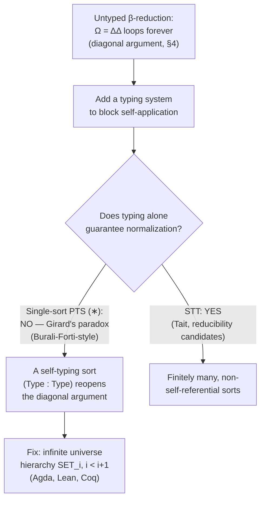

# Pure Type Systems

[[book-guidelines|↩ Back to guidelines]]

## Why you need a *family* of type systems, not just one

Every typed calculus you've met — simply-typed lambda calculus, System F, a
dependently-typed language like Lean's core — shares the same three moving
parts: variables, function abstraction, function application. What differs
between them is a much smaller, more surgical thing: *which* things are
allowed to depend on *which other* things when you form a function type.

- In simply-typed lambda calculus, a function type `A → B` is built from two
  *types*, and the result is a *type*.
- In System F, you additionally form `∀A. B` where `A` ranges over *types*
  and the body `B` is again a *type* — a type depending on a type.
- In a dependently-typed language, you form `Πx:A. B` where `B` can mention
  a *term* `x` — a type depending on a term.

Rather than write down four or five separate calculi and re-prove the same
metatheorems (confluence, subject reduction, decidability) four or five
times, Grienenberger — following Barendregt and Jutting–Henk–Geuvers'
generalized presentation [JHG93] — factors out exactly the part that
differs into three parameters: **sorts**, **axioms**, and **rules**. A
*pure type system* (PTS) is the calculus you get once you fix those three
parameters. This chapter (Ch. 8, pp. 77–88) is the vocabulary chapter: it
defines PTS syntax, the computation rule (β-reduction), the typing
judgment, and the metatheoretic properties that make the whole apparatus
useful — and it is exactly the framework underlying Dedukti and, by
extension, the rest of this thesis.

If you're building a type checker, this chapter is close to literally the
spec: sorts/axioms/rules is a parametrized *kernel design*, not just
notation.

## 1. A pure type system as a triple ⟨S, A, R⟩

**Definition 8.1.1.** A PTS is a triple $\langle S, A, R \rangle$:

- $S$ — a set of **sorts** (the "types of types": `TYPE`, `KIND`, `PROP`, …).
- $A \subset S \times S$ — a set of **axioms**: $(s_1, s_2) \in A$ means
  $s_1$ itself can be typed by $s_2$ (i.e. `⊢ s₁ : s₂`).
- $R \subset S \times S \times S$ — a set of **rules** governing when a
  dependent product is well-typed: $(s_1, s_2, s_3) \in R$ means that if
  $A : s_1$ and $B : s_2$, then the product type $\Pi x{:}A.\,B$ itself has
  type $s_3$.

That's the entire "configuration surface" of a PTS. Everything else — the
term syntax, β-reduction, the typing rules — is *fixed* and shared by every
PTS; only $\langle S, A, R\rangle$ varies.

**Rust framing.** Think of $\langle S, A, R \rangle$ as a static
configuration table your kernel consults, not code it re-derives:

```rust
struct PtsConfig<Sort: Eq + Copy> {
    sorts: Vec<Sort>,
    axioms: Vec<(Sort, Sort)>,        // (s1, s2): s1 : s2
    rules: Vec<(Sort, Sort, Sort)>,   // (s1, s2, s3): Πx:A.B : s3 when A:s1, B:s2
}

impl<Sort: Eq + Copy> PtsConfig<Sort> {
    fn axiom_of(&self, s: Sort) -> Option<Sort> {
        self.axioms.iter().find(|(s1, _)| *s1 == s).map(|(_, s2)| *s2)
    }
    fn rule_for(&self, s1: Sort, s2: Sort) -> Option<Sort> {
        self.rules.iter().find(|(a, b, _)| *a == s1 && *b == s2).map(|(_, _, s3)| *s3)
    }
}
```

A type checker whose `axiom_of`/`rule_for` implementations are *swappable*
is, structurally, a PTS-parametrized kernel — this is exactly what lets
Dedukti (and your eventual verifier) support "STT mode," "CC mode," or a
custom universe hierarchy by changing only the config, never the checker.

### Barendregt's λ-cube (Example 8.1.1)

The classical λ-cube is recovered with $S = \{\texttt{TYPE}, \texttt{KIND}\}$,
$A = \{(\texttt{TYPE},\texttt{KIND})\}$, and a chosen subset of four possible
rules:

| Rule | Reading | Example |
|---|---|---|
| (TYPE, TYPE, TYPE) | simple types | ordinary functions `A → B` |
| (KIND, KIND, KIND) | type constructors | `list : ΠA:TYPE. TYPE` has type `KIND` |
| (KIND, TYPE, TYPE) | polymorphism | `id : ΠA:TYPE. A → A` has type `TYPE` |
| (TYPE, KIND, KIND) | dependent types | `vect : Πn:N. TYPE` has type `KIND` |

Each of the cube's eight corners is just a choice of *which subset* of
these four rules is included: simply-typed λ-calculus is none of them;
System F adds polymorphism; $\lambda P$ (LF) adds dependent types; the
Calculus of Constructions ($\lambda C$, Coq's core) has all four. **The
entire λ-cube is one PTS definition with a rule-subset dial** — this is
the cube's real payoff: it isn't eight calculi, it's one calculus with an
8-position switch.

STT itself (as used by HOL-family provers) is usually presented with a
fourth sort `PROP` for propositions, axiom `(PROP, TYPE)`, and rules
`(PROP, PROP, PROP)` and `(TYPE, PROP, PROP)` for implication and universal
quantification — showing the same $\langle S,A,R\rangle$ machinery scales
smoothly to "propositions as a separate sort from types," not just to
Curry–Howard-style formulas-as-types.

## 2. Syntax: terms, free/bound variables, substitution

**Definition 8.2.1.** Terms of $\mathcal{T}(V, S)$ over variables $V$ and
sorts $S$:

$$t, u, M, N, A, B ::= x \mid s \mid M\,N \mid \lambda x{:}A.\,M \mid \Pi x{:}A.\,B$$

Five constructors: variable, sort, application, abstraction, dependent
product. This is deliberately the *minimal* superset that can express
every corner of the λ-cube — no separate "type" vs. "term" syntactic
category, because in a PTS types *are* terms (they're classified by sorts
via the typing judgment, not by a separate grammar).

**Free/bound variables (Def. 8.2.2)** are defined structurally in the
usual way, with the binder cases being the only interesting ones:
$FV(\lambda x{:}A.\,M) = FV(\Pi x{:}A.\,M) = FV(A) \cup (FV(M) \setminus \{x\})$
— note $A$ (the domain type) is *not* under the binder, so its free
variables survive, while $M$'s occurrences of $x$ are captured.

**Substitution (Def. 8.2.3)** is the operation that makes β-reduction
possible, and its abstraction case is where all the subtlety lives:

$$
(\lambda y{:}A.\,M)[x := t] =
\begin{cases}
\lambda y{:}A[x:=t].\,M[x:=t] & \text{if } y \notin FV(t) \\
(\lambda z{:}A.\,M[y:=z])[x:=t] & \text{otherwise, for fresh } z
\end{cases}
$$

**What breaks without the fresh-variable case:** naive substitution into
$\lambda y{:}A.\,M$ when $y$ happens to occur free in the term $t$ you're
substituting would let $t$'s free `y` get silently *captured* by the
binder — the classic variable-capture bug. E.g. substituting `t = y` for
`x` into `λy:A. x` naively gives `λy:A. y`, which now means "the identity
function" instead of "the constant function returning the substituted
value" — the meaning of the term changed because of a name collision that
has nothing to do with the term's actual structure. The fix is to rename
the bound variable to something fresh *before* substituting, which is
exactly α-renaming. This is the single most common correctness bug in a
hand-rolled substitution function, and it's precisely the "substitution
and context management" thread this project keeps needing to get right —
it recurs identically underneath Hoare-triple soundness proofs and under
an elaborator's metavariable instantiation.

**Rust grounding.** A de Bruijn-indexed representation sidesteps the
capture problem entirely by making bound variables anonymous:

```rust
enum Term {
    Var(usize),                       // de Bruijn index, no names to capture
    Sort(SortId),
    App(Box<Term>, Box<Term>),
    Lam(Box<Term> /* domain */, Box<Term> /* body */),
    Pi(Box<Term> /* domain */, Box<Term> /* codomain */),
}
```

Substitution then becomes an index-shifting traversal instead of a
name-comparison one — this is the standard reason production kernels
(Lean's included) use de Bruijn or locally-nameless representations rather
than the named syntax the book uses for readability.

**Contexts with a hole (Def. 8.2.4)** — $C ::= \Box \mid C\,t \mid t\,C \mid
\lambda x{:}C.t \mid \dots$ — give a formal handle on "a term with a
sub-term-shaped gap," used to state **stability by context**: if a
relation $R$ holds of $M_1, M_2$, it should hold of $C[M_1], C[M_2]$ for
any surrounding context $C$ — i.e. the relation is a *congruence* with
respect to term structure. This (plus stability by substitution) is what
turns an ad hoc relation into something usable as an equational theory:
you need "if $A \equiv A'$ then $f\,A \equiv f\,A'$" to hold for equality
reasoning to compose at all.

## 3. α-equivalence

**Definition 8.2.6.** α-equivalence $\equiv_\alpha$ is the context-stable,
reflexive, symmetric, transitive closure of $\lambda x{:}A.\,M \rightsquigarrow_\alpha
\lambda z{:}A.\,(M[x:=z])$ (and the analogous rule for $\Pi$).

The point of formalizing this at all: $\lambda x{:}A.\,x$ and $\lambda
y{:}A.\,y$ are *the same function* — the bound-variable name is pure
bookkeeping, never observable. Rather than special-case this everywhere,
the chapter takes the quotient once: $\Lambda(V,S) = \mathcal{T}(V,S) /
{\equiv_\alpha}$, and from then on "term" always means "α-equivalence
class of term." This is exactly what a de Bruijn representation buys you
*for free* — two de Bruijn terms are syntactically equal iff their named
counterparts are α-equivalent, which is precisely why kernels use it: it
turns a quotient you'd otherwise have to reason about explicitly into
plain structural equality on your data type.

## 4. β-reduction as computation

**Definition 8.3.1.** The β-step is the context-stable closure of
$(\lambda x{:}A.\,M)\,t \rightsquigarrow_\beta M[x := t]$.

This is the PTS's *only* computation rule — applying a function performs
the substitution. Everything you'd recognize as "running a program"
(arithmetic reduction, pattern matching via recursors, unfolding
definitions) is either this rule directly or — as the *next* chapter
shows — an extension of the ambient rewrite relation ($\delta$ for
constant unfolding, $\iota$ for recursors) layered on top of it.

### Rewrite-relation vocabulary (Def. 8.3.2–8.3.3)

The book introduces generic vocabulary for *any* rewrite relation
$\to_R$, then specializes it to β:

- **Normalizing**: every term has *some* normal form (need not be unique
  or reached by every strategy).
- **Strongly normalizing**: *no* infinite reduction sequence exists from
  any term (every strategy terminates).
- **Confluent**: if $x \to_R^* y$ and $x \to_R^* z$, both $y$ and $z$
  reduce to a common $n$ — "it doesn't matter which redex you reduce
  first, you can always reconverge."
- **Convergent** = strongly normalizing + confluent — this combination is
  what guarantees a *unique* normal form reachable by *any* strategy,
  which is the property an implementer actually wants (it means "pick
  whatever reduction order is fast, you'll get the right answer").

**Theorem 8.3.4 [JHG93]:** β-reduction is confluent in every PTS —
this holds unconditionally, independent of typing. **Confluence is not
enough on its own**, though: it guarantees *if* you reach a normal form,
it's unique — it says nothing about whether you'll ever reach one.

### Untyped β-reduction does not normalize — the diagonal argument

The chapter's central negative example: let $\Delta = \lambda x{:}y.\,x\,x$
and $\Omega = \Delta\,\Delta$. Then:

$$\Omega = (\lambda x{:}y.\,x\,x)(\lambda x{:}y.\,x\,x) \to_\beta x\,x[x := \Delta] = \Delta\,\Delta = \Omega$$

$\Omega$ reduces to itself, forever, with **no other reduct available** —
so this isn't merely "not strongly normalizing," it's not normalizing *at
all* (there is no escape route to a normal form). The book is explicit
that the mechanism here is a **diagonal argument** — the same family of
device as Cantor's diagonalization, Russell's paradox, and the halting
problem: $\Delta$ is built from *self-application* ($x\,x$), and $\Omega$
is $\Delta$ applied to *itself*. Untyped computation is Turing-complete
precisely because nothing stops you from writing this term — which is
exactly the reason a *type system* is introduced next: to syntactically
rule out `x x` from ever being well-typed, since typing `x x` would
require `x` to have both type `A` and type `A → B` for some `A`, forcing
`A = A → B`, which is impossible for any term formed by the grammar above.

This is the crux fact for anyone building a checker: **typing exists
specifically to block self-application-style non-termination**, and
whether it fully succeeds at that (see §6 below) is far from automatic.

## 5. The typing system and the conversion rule

**Definition 8.4.1.** Judgments: $\vdash_P \Gamma\ \mathrm{wf}$
(well-formed context) and $\Gamma \vdash_P t : T$ (typing). The seven rules
(Fig. 8.1):

$$
\text{(empty)}\ \frac{}{\vdash_P []\ \mathrm{wf}}
\qquad
\text{(decl)}\ \frac{\Gamma \vdash_P A : s}{\vdash_P \Gamma, x{:}A\ \mathrm{wf}}
\qquad
\text{(sort)}\ \frac{\vdash_P \Gamma\ \mathrm{wf}}{\Gamma \vdash_P s_1 : s_2}\ (s_1,s_2)\in A
$$
$$
\text{(var)}\ \frac{\vdash_P \Gamma\ \mathrm{wf}\quad x{:}A \in \Gamma}{\Gamma \vdash_P x : A}
\qquad
\text{(app)}\ \frac{\Gamma \vdash_P t : \Pi x{:}A.\,B \quad \Gamma \vdash_P u : A}{\Gamma \vdash_P t\,u : B[x:=u]}
$$
$$
\text{(prod)}\ \frac{\Gamma \vdash_P A : s_1 \quad \Gamma, x{:}A \vdash_P B : s_2}{\Gamma \vdash_P \Pi x{:}A.\,B : s_3}\ (s_1,s_2,s_3)\in R
\qquad
\text{(abs)}\ \frac{\Gamma \vdash_P \Pi x{:}A.\,B : s \quad \Gamma, x{:}A \vdash_P t : B}{\Gamma \vdash_P \lambda x{:}A.\,t : \Pi x{:}A.\,B}
$$
$$
\text{(conv)}\ \frac{\Gamma \vdash_P t : A \quad \Gamma \vdash_P B : s \quad A \equiv_\beta B}{\Gamma \vdash_P t : B}
$$

Every rule here has a job: **(sort)** and **(prod)** are literally the
axioms $A$ and rules $R$ from §1 made operational; **(var)**/**(app)**/**(abs)**
are the unsurprising structural rules a typed λ-calculus needs. **(conv)**
is the one that does something non-obvious: it lets you replace a term's
recorded type $A$ with any *β-equivalent* type $B$, *without* that
substitution being visible in the term itself.

**Why (conv) has to exist:** consider a term computed to have type
$(\lambda x{:}N.\,N)\,100$. Syntactically that's a stuck-looking
application, not `N` — but semantically, $(\lambda x{:}N.\,N)\,100
\equiv_\beta N$, so a term of that type genuinely *is* a natural number.
Without (conv), *every* dependent type former that involves computed
indices (e.g. `vect (2 + 3)` vs. `vect 5`) would be a different,
unrelated type from its reduced form, and virtually nothing would type
check. **(conv) is what lets computation happen at the type level** — it's
the rule that makes dependent types usable in practice, and it is also
exactly the rule whose soundness depends on β-reduction being confluent
(§4): if $A \equiv_\beta B$ could mean two genuinely different things
depending on reduction order, (conv) would be unsound.

**Lean correspondence.** (conv) is precisely what Lean's kernel calls
*definitional equality* — `isDefEq`, decided by reducing (whnf-ing) both
sides and comparing. Every time you write `rfl` for a goal that isn't
syntactically reflexive but *computes* to being so, you are invoking this
exact rule. Anyone building a bidirectional elaborator will implement
(conv) as the fallback case when a term's inferred type doesn't
syntactically match its expected type — checking mode calls into
`isDefEq`/(conv) at exactly that seam.

## 6. Metatheoretic properties: injectivity, subject reduction, uniqueness

**Definition 8.5.1** classifies PTSs by structural properties of $R$/$A$:
**functionality** (the sort-typing and rule relations are actual
*functions*, not just relations — given $s_1$, there's at most one
type-of-type; given $s_1, s_2$, at most one product sort), **fullness**
(every pair of sorts admits *some* product rule), and **injectivity** (at
most one axiom/rule per premise sort).

**Theorem 8.5.2** [JHG93] — the load-bearing metatheorems:

- **Product injectivity ("the Key Lemma")**: if $\Pi x{:}A_1.\,B_1
  \equiv_\beta \Pi x{:}A_2.\,B_2$, then $A_1 \equiv_\beta A_2$ *and* $B_1
  \equiv_\beta B_2$. Read backwards, this is the statement that
  β-equivalence can't accidentally *merge* two genuinely different
  product types — it's an injectivity property of the product
  constructor with respect to $\equiv_\beta$.
- **Subject reduction**: if $\Gamma \vdash_P t_1 : T$ and $t_1
  \rightsquigarrow_\beta t_2$, then $\Gamma \vdash_P t_2 : T$ — *running a
  well-typed program never breaks its type.* This is the single property
  a real checker's soundness argument hinges on: without it, "well-typed"
  would say nothing about a program's runtime behavior, since the program
  could type-check now and become ill-typed one reduction step later.
- **Type correctness / inversion**: every typing derivation can be
  "read backwards" uniquely by syntactic case on the term — this is
  exactly what a bidirectional type-*checker's* case-dispatch on term
  shape relies on being sound.
- **Uniqueness of types** (for functional PTSs): if $\Gamma \vdash_P t :
  t_1$ and $\Gamma \vdash_P t : t_2$, then $t_1 \equiv_\beta t_2$ — a term
  has one type up to conversion, not several unrelated ones.

**Why product injectivity is load-bearing, concretely:** the chapter
proves Claim 8.5.1 ($\Delta = \lambda x{:}A.\,x\,x$ is untypable in STT)
using exactly this lemma — the proof needs to derive a contradiction from
$B \equiv_\beta \Pi x{:}B.\,C$ for the hypothesized domain type $B$ of
$x$, and does so by confluence plus the fact that no rule of shape
$(s_1, \texttt{KIND}, s_2)$ exists in STT. Subject reduction itself is
*proved using* product injectivity (hence "Key Lemma") — if you drop
injectivity from a PTS's design, subject reduction can fail, meaning a
checker built on that PTS could accept a program that later reduces to
something ill-typed. **This is the single fact in the chapter most worth
internalizing for a checker implementer**: type-checking is not just
"run the typing rules once" — the metatheorems that make one-shot type
checking *meaningful at all* (rather than just "true at this instant")
are separate theorems that must be established for your specific
sort/axiom/rule configuration, not inherited for free.

## 7. Nontermination under typing — Girard's paradox

Does typing *fully* solve the nontermination problem from §4? **No, and
this is the chapter's sharpest result.**

**Theorem 8.5.3 [Tai67]:** β-reduction *is* normalizing over well-typed
terms of STT (proved via Tait's reducibility-candidates method — a
logical-relations argument assigning each type a set of "good" terms and
showing every well-typed term lands in its type's set). Corollary: STT's
β-reduction is even *convergent* on well-typed terms.

**But this does not generalize.** The minimal single-sort PTS $(*)$ —
$S=\{*\}$, $A=\{(*,*)\}$, $R=\{(*,*,*)\}$ — is *not* normalizing. The
proof [MR86] adapts **Girard's paradox** [JYG72], itself an adaptation of
**Burali-Forti's paradox** (the set-theoretic paradox of "the set of all
ordinals"). It's demonstrated concretely via Girard's systems $\lambda U$
and $\lambda U^-$ — PTSs over sorts (`PROP`, `TYPE`, `KIND`) whose rule
sets are rich enough to let a sort quantify over *itself* (a "type of all
types" situation, exactly analogous to `Type : Type` in early dependently
typed systems, and to the set-of-all-sets Russell/Burali-Forti pattern).
The actual term witnessing non-normalization is large (a minimized version
still runs to length 2039 [Hur95]) — it isn't reproduced in the chapter,
but its *existence* is the point: **a single self-referential sort axiom
is enough to reopen the diagonal-argument door that typing was supposed
to have closed.**

**The fix — universe hierarchies.** Agda's PTS avoids this by replacing a
single self-typing sort with an *infinite, strictly increasing* hierarchy
$\texttt{SET}_i$ for $i \in \mathbb{N}_\omega$ (Example 8.5.2):
axioms $(\texttt{SET}_i, \texttt{SET}_{i+1})$ — each universe is typed by
a *strictly higher* one, never itself — and rules $(\texttt{SET}_i,
\texttt{SET}_j, \texttt{SET}_{\max(i,j)})$. No sort types itself, so the
Girard-paradox construction has no sort to exploit. This is the same
design Lean, Coq, and Agda all actually ship (`Type 0 : Type 1 : Type 2 :
...`), and it is a direct, load-bearing consequence of this chapter's
result: **`Type : Type` is not a convenience simplification a real kernel
skips for elegance — it is a soundness-breaking design choice**, precisely
because it reproduces the single-sort PTS $(*)$'s failure mode.



## 8. Decision problems: undecidability

**Definition 8.6.1** states three decision problems that are, *for PTSs
in general*, **undecidable**:

- **Type-checking**: given $t, T, \Gamma$, is $\Gamma \vdash_P t : T$
  derivable?
- **Typeability**: given $t$, do *some* $\Gamma, T$ exist with $\Gamma
  \vdash_P t : T$?
- **Type reconstruction**: given $t, \Gamma$, does *some* $T$ exist with
  $\Gamma \vdash_P t : T$?

The chapter states this flatly as a fact about arbitrary PTSs, without
belaboring the proof (it flows from the same non-normalization failure
mode as §7 — the (conv) rule quantifies over *all* $B$ with $A
\equiv_\beta B$, and deciding $\equiv_\beta$ in general requires deciding
whether reduction terminates). The takeaway for an implementer: **you do
not get to build "a type checker for PTSs in general" and expect it to
terminate** — normalization (or some sufficient syntactic restriction that
implies it, e.g. a universe hierarchy, or restricting to a strongly
normalizing fragment like the Calculus of Constructions) is a
*precondition* for a real checker's termination, not an afterthought
optimization. This is the direct throughline to why real proof assistants'
kernels are built on specific, individually-proved-normalizing PTS
instances (CC, CIC, Lean's calculus) rather than "PTSs" as an open-ended
family.

## Where this leads

This chapter's vocabulary — sorts/axioms/rules, β-reduction,
$\equiv_\beta$, the seven typing rules, and the metatheorems of §6 — is
the fixed baseline that Chapter 9 (*Pure type systems modulo rewriting*)
extends by adding a user-declared signature $\Sigma$ and rewrite system
$\mathcal{R}$ (δ-reduction for unfolding definitions, ι-reduction for
recursors), generalizing (conv) to $\equiv_{\beta\mathcal{R}}$. That
extension is what makes Dedukti's λΠ-calculus modulo theory — and
eventually theory U — expressive enough to *encode* other logics and
type theories rather than just define new ones from scratch, which is the
thesis's central technical device (Chapters 9–14).

**For the standing project (`type-theory` focus area):** this chapter is
close to a direct blueprint for a kernel's term representation and typing
core — the sorts/axioms/rules triple *is* the configuration surface your
Rust type checker should expose as data, not hardcode; product injectivity
and subject reduction are the exact theorems you'll need to establish (or
carefully inherit from a known-normalizing PTS instance) before trusting
your checker's accept/reject verdict means anything at runtime; and the
conversion rule (conv) is definitionally the same mechanism as Lean's
`isDefEq`, which your bidirectional elaborator will call at every
inferred-vs-expected type mismatch. The Girard's-paradox result is the
concrete argument for *why* your universe design cannot be "just one
`Type` sort" if you want normalization (and hence decidable type
checking) at all.
