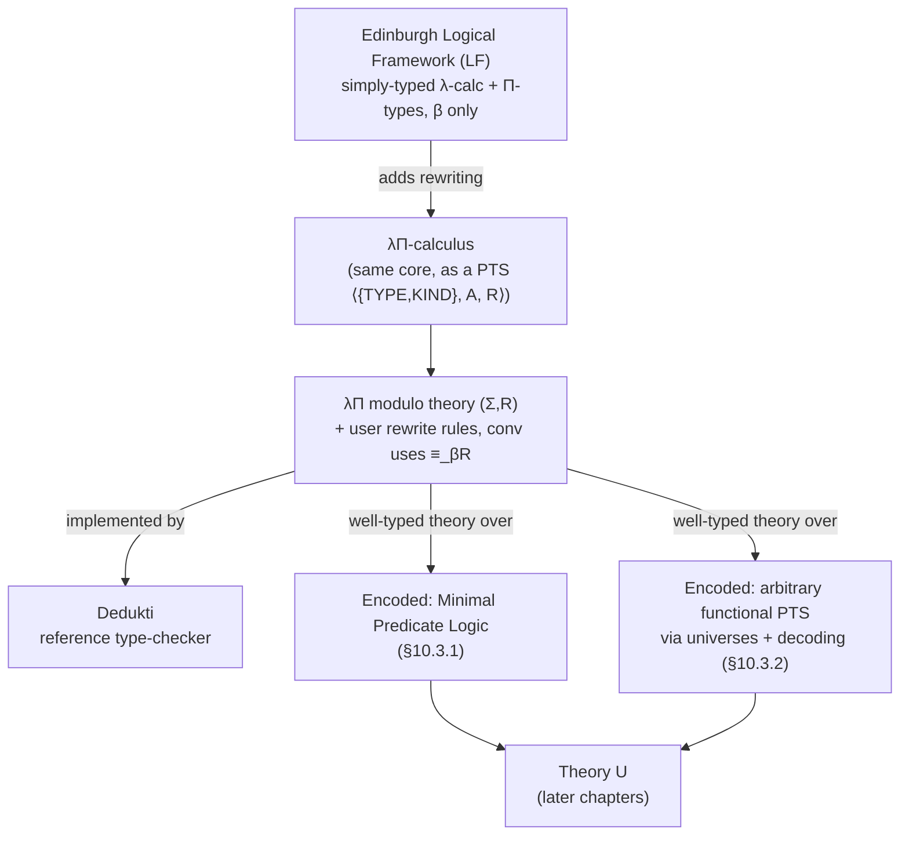

# The λΠ-Calculus Modulo Theory

[[book-guidelines|↩ Back to guidelines]]

## Why this chapter exists

Chapters 8–9 gave you the abstract machinery: a Pure Type System is a triple $\langle S,A,R\rangle$, and you can bolt a signature-plus-rewrite-system $(\Sigma,R)$ onto one to get user-definable computation, provided $(\Sigma,R)$ is *well-typed* (Theorem 9.2.5 then hands you subject reduction, decidable type-checking, etc. "for free"). That's a schema, not a tool. This chapter picks *one specific, minimal PTS* — $\lambda\Pi$ — fixes it as the base, and shows it is expressive enough that almost anything you'd want to formalize (a logic, a programming language, another type theory) can be *encoded* as a well-typed theory over it. That's the whole point of the thesis's "theory U" strategy: instead of building bespoke trusted kernels for every logic, build one very small, very well-understood kernel, and get everything else by encoding.

This is exactly the situation a compiler/elaborator author faces: you don't want your trusted computing base to be "the whole compiler." You want a small kernel that checks a low-level, boring calculus, and you get your surface language's richness by *elaborating into* that calculus rather than by growing the kernel. $\lambda\Pi$-calculus modulo theory is a fully worked historical example of exactly this design — and Dedukti is what happens when you actually build it.

## The Edinburgh Logical Framework, ancestor of $\lambda\Pi$

A **logical framework** is a language for formalizing *other* theories — their syntax, their judgments, their inference rules — while keeping the framework's own logic (its type theory) sharply separated from whatever object-theory you're encoding inside it. The **Edinburgh Logical Framework (LF)** [Harper–Honsell–Plotkin, 1987] is the prototype: simply-typed $\lambda$-calculus extended with **dependent types** ($\Pi$-types), used purely as a *representation* language — you represent a logic's judgments as LF types and its derivations as LF terms, and "well-typed LF term" becomes synonymous with "valid derivation." This is the same idea de Bruijn's Automath pioneered, and it's the direct ancestor of the type-theoretic cores of Coq, Agda, and Lean.

$\lambda\Pi$-calculus modulo theory takes LF's core ($\lambda\Pi$, a dependently-typed but otherwise minimal calculus) and adds exactly one extra capability on top: **user-defined rewrite rules**. Where LF gives you dependent types and nothing else to compute with beyond $\beta$-reduction, $\lambda\Pi$ modulo theory lets you extend the *conversion relation itself* — the notion of "these two types/terms count as equal for typechecking purposes" — with your own equations. That one addition is what turns a representation language into a genuinely programmable one.

**[[Deduction-Modulo-Theory#What breaks without it|What breaks without it]]:** if all you have is LF plus $\beta$-reduction, defining something like `add : Nat -> Nat -> Nat` computationally (so that `add zero zero` and `zero` are recognized as the *same term* by the typechecker) requires either axiomatizing equality explicitly (HOL Light's route — see below) or building recursion in as a primitive. Neither scales to encoding arbitrary logics uniformly. Rewrite rules give you a single uniform mechanism.

## $\lambda\Pi$ itself: the base PTS

Concretely, $\lambda\Pi$ is the PTS $\langle \{\mathrm{TYPE},\mathrm{KIND}\}, \{(\mathrm{TYPE},\mathrm{KIND})\}, \{(\mathrm{TYPE},\mathrm{TYPE},\mathrm{TYPE}),\,(\mathrm{TYPE},\mathrm{KIND},\mathrm{KIND})\}\rangle$ — two sorts, one axiom, two product-formation rules. That's it. No universe hierarchy, no polymorphism, no inductive types built in. The book writes $\vdash$ for $\vdash_{\lambda\Pi}$ and $\vdash_{\Sigma,R}$ for $\vdash_{\lambda\Pi/\Sigma,R}$ (typing modulo a theory $(\Sigma,R)$); the full rule set modulo a theory is exactly the PTS rules from Chapter 8 with the **(conv)** rule relaxed to use $\equiv_{\beta R}$ instead of plain $\equiv_\beta$:

$$
\dfrac{\Gamma\vdash_{\Sigma,R} t:A \qquad \Gamma\vdash_{\Sigma,R} B:s \qquad A\equiv_{\beta R} B}{\Gamma\vdash_{\Sigma,R} t:B}
$$

Why does such a minimal system matter? Because Chapter 8 already proved that $\lambda\Pi$ is **injective, semi-full, functional, and normalizing** — the good-behavior checklist from Theorem 8.5.2 — which buys it subject reduction, product injectivity/compatibility, and *decidable* type-checking and typability. And Theorem 9.2.5 (Chapter 9's payoff) says: whatever properties the base PTS has, a *well-typed* theory $(\Sigma,R)$ over it inherits automatically. So the entire strategy of this chapter is: keep the kernel this small and this well-behaved, then get everything else's soundness/decidability by proving each encoding is a well-typed theory over it — never by re-deriving metatheory from scratch for each new logic.



**Rust framing.** Think of $\lambda\Pi$'s kernel as the minimal "IR verifier" of a compiler: a `TermIR` enum with only variables, application, abstraction, and dependent-product formers, plus a `typecheck` function that never grows new cases no matter how many source languages you support. Every new "feature" is implemented as a *library* of declarations and rewrite rules checked *against* that fixed kernel — not as a new match arm in the checker. This is precisely the shape you want your Rust verifier's trusted core to have: a small `Kernel::check(term, ty, ctx) -> bool` that never needs new logic bolted in when the surface refinement-type language grows.

**Lean framing (primary here, since this is squarely type-theoretic machinery).** Lean's own kernel is a small PTS-like calculus (the Calculus of Inductive Constructions, restricted at the trusted-kernel level) that everything else — tactics, elaboration, notation — compiles down into. `def`s in Lean that are `@[reducible]` or plain `def` are unfolded during `isDefEq` exactly the way $\delta$-rewrites are folded into $\equiv_{\beta R}$ here; `theorem`s in Lean are opaque outside of their statement (their body is not unfolded during typechecking) in exactly the same way `thm` in Dedukti below discards its rewrite rule. This is not an analogy — it's the same design decision, arrived at independently.

## Dedukti: the reference $\lambda\Pi$ type-checker, and its syntax

**Dedukti** is the executable realization: a type-checker for $\lambda\Pi$ modulo theory. `Type` is the concrete syntax for the sort $\mathrm{TYPE}$; `KIND` has no surface syntax at all — it's invisible to the user, existing only to make `Type : KIND` well-formed internally.

**Declarations** extend the signature $\Sigma$ directly:

```
Nat : Type.
zero : Nat.
succ : Nat -> Nat.
eq : Nat -> Nat -> Type.
```

Non-dependent arrows `A -> B` are the special case of a dependent product $\Pi x{:}A.\,B$ where $x$ doesn't occur in $B$; the dependent case is written with an explicit binder, `x : A -> B`, meaning $\Pi x{:}A.\,B$:

```
refl : n : Nat -> eq n n.        (* Πn:Nat. eq n n *)
```

**Definitions** come in two flavors, and the distinction is load-bearing for everything in Chapters 11–13 on modularity:

```
def one : Nat := succ zero.              (* adds one:Nat AND a δ-rule one ⇒δ succ zero *)
thm zero_eq_zero : eq zero zero := refl zero.   (* adds ONLY zero_eq_zero : eq zero zero *)
```

`def` compiles to a declaration *plus* a $\delta$-rewrite rule, so the defined name unfolds during conversion checking — it's transparent. `thm` only checks that the body has the stated type and then throws the body away, keeping just the declaration — the name is opaque, never unfolded. This is the formal difference between "a definition" and "a theorem" that most working mathematicians feel intuitively but rarely state: a definition's *content* matters to later computation; a theorem's *content* doesn't, only its *statement* does.

**What breaks without this distinction:** if every proved fact were transparently unfolded like a `def`, type-checking would need to inline every proof term of every lemma used, defeating the entire purpose of lemma reuse (the checker would still be correct, but proof terms would blow up combinatorially — exactly the size explosion modular development is supposed to avoid). Conversely, if every definition were opaque like a `thm`, you'd lose computation: `add zero zero` would never reduce to `zero`, formulae-as-types (below) would be unusable, and you'd be back to needing explicit equality axioms.

**Rewrite rules** are declared with a long arrow `-->`, prefixed by the rule's free (pattern) variables in brackets:

```
def add : Nat -> Nat -> Nat.
[n] add n zero --> zero.
[n,m] add n (succ m) --> succ (add n m).
```

**Abstraction** uses `=>`:

```
def double : Nat -> Nat := (n : Nat) => add n n.
```

Dedukti's syntax is deliberately *thin* — no implicit arguments, no notation extensions, no tactics. That's a design decision, not an oversight: Dedukti is meant to be a **compilation target** for automatically-generated, already-elaborated proof terms (e.g. proofs exported from Coq, or generated by another prover), not a language a human develops proofs in directly. (**LambdaPi** is mentioned as the friendlier sibling implementation, with infix operators, tactics, and IDE support, aimed at humans.) This mirrors the standard compiler-pipeline separation between a rich surface language and a small, syntactically boring core IR that the backend actually verifies.

## Shallow versus deep encodings

Before getting to the two case studies, the chapter fixes vocabulary that recurs constantly later (Chapter 14 uses it explicitly): when you encode some source system's syntax into $\lambda\Pi$, you can do it two ways.

- **Shallow encoding:** the source system's own binders, applications, and reduction map *directly* onto $\lambda\Pi$'s native $\lambda$, application, and $\beta$-reduction. You get computation "for free" from the host calculus — $\beta$-redexes in the source are literally $\beta$-redexes in $\lambda\Pi$.
- **Deep encoding:** the source syntax is *reified* — represented as an inductive datatype of ASTs — and its reduction relation is axiomatized separately as new rewrite rules over that datatype, rather than reusing $\lambda\Pi$'s own reduction.

Deep encodings buy you the ability to *inspect and structurally manipulate* source terms as data (useful for e.g. writing a normalizer, a static analyzer, or a proof transformation *as a Dedukti program* over the encoded ASTs). But they pay for this with heavier syntax, heavier typing derivations, and — critically — **a loss of computational faithfulness**: two encoded terms that reduce to each other in the source system are no longer *automatically* identified by $\lambda\Pi$'s own conversion; you need your reified reduction relation to re-derive that fact, term by term. The thesis chooses shallow encodings throughout for scalability and fidelity, reserving deep encodings for situations that specifically need structural analysis (§10.3.2, echoed later at the constructive-vs-classical embedding split in Chapter 14, where first-order logic gets a deep embedding but higher-order logic gets a shallow one).

**Rust framing:** this is exactly the shallow-embedding-vs-reified-AST tradeoff you already know from macro design — a `proc_macro` that emits Rust code directly (shallow: you get the host language's own type-checker, borrow-checker, and optimizer "for free") versus building your own interpreter over a custom `Expr` enum (deep: you can inspect and rewrite terms, at the cost of reimplementing everything the host already gave you).

## Encoding minimal predicate logic: formulae-as-types

Two ways to represent a proposition in $\lambda\Pi$:

1. **Naively**, declare each nullary predicate directly as a type, `P : Type` — an inhabitant of `P` *is* a proof of `P`. Simple, but propositions and ordinary data types are indistinguishable, and there's no single handle representing "the type of propositions."
2. **With an explicit embedding**: declare a distinguished type of propositions, `Prop : Type` (the book's `PROP`), and a function `Prf : Prop -> Type` mapping a proposition to its type of proofs. A predicate `P` is now a *term* of type `Prop`, and `Prf P` is the type whose inhabitants are proofs of `P`.

Route 2 is strictly more useful: propositions become first-class *objects* you can pass to functions, pattern-match on, or feed to rewrite rules — which is exactly what's needed to scale from propositional logic up to higher-order logic (Chapter 7's ecumenical STT, and Chapter 14's theory-U encodings, both depend on treating propositions as data of type `PROP`, not as types themselves).

**Definition 10.3.1 (Minimal Predicate Logic, MPL).** The fragment of NJ restricted to $\top,\bot,\Rightarrow,\forall$.

The Dedukti encoding, built up piece by piece:

```
Prop : Type.
def Prf : Prop -> Type.
Term : Type.

(* language: constant a, unary predicate P *)
a : Term.
P : Term -> Prop.

(* connectives, as functions building propositions *)
top : Prop.
bot : Prop.
implies : Prop -> Prop -> Prop.
forall : (Term -> Prop) -> Prop.
```

Now, **two genuinely different strategies** for giving the connectives their proof-theoretic meaning — this is the chapter's central "trade-off" and it recurs as one of the workbench's standing threads (definitional equality quietly doing unification's/inference's job):

**(a) Axiomatic — Curry–Howard via typed constructors.** Each MPL inference rule becomes a typed function that *builds* or *destructs* proofs:

```
topi : Prf top.
bote : Prf bot -> ((A : Prop) -> Prf A).
impi : (A B : Prop) -> (Prf A -> Prf B) -> Prf (implies A B).
impe : (A B : Prop) -> Prf (implies A B) -> Prf A -> Prf B.
fai  : (A : Term -> Prop) -> (x : Term) -> Prf (A x) -> Prf (forall A).
fae  : (A : Term -> Prop) -> Prf (forall A) -> (x : Term) -> Prf (A x).
```

A proof term built this way *records*, syntactically, which inference rule justified each step — `impe` literally names implication-elimination.

**(b) Computational — rewrite `Prf` directly onto the expected functional type:**

```
[] Prf bot --> ((A : Prop) -> Prf A).
[A,B] Prf (implies A B) --> Prf A -> Prf B.
[A] Prf (forall A) --> (x : Term) -> Prf (A x).
```

Here there is no `impi`/`impe` at all — a proof of `Prf (implies A B)` simply *is* a $\lambda\Pi$ function of type `Prf A -> Prf B`, by definitional equality, no wrapper needed. Figure 10.2's side-by-side comparison makes the payoff concrete: proving $P(a), P(a)\Rightarrow\bot \vdash \bot$ takes

```
thm absurdity_ax  := p : Prf (P a) => q : Prf (implies (P a) bot) => impe (P a) bot q p.
thm absurdity_rew := p : Prf (P a) => q : Prf (implies (P a) bot) => q p.
```

— strategy (b) drops the `impe (P a) bot` scaffolding entirely, because the typechecker's conversion rule already knows `Prf (implies (P a) bot) ≡ Prf (P a) -> Prf bot`. **What you gain:** shorter, faster-to-check proof terms, since the "elimination step" is absorbed into ordinary function application rather than requiring a named combinator. **What you lose:** the proof term no longer records *which inference rule* justified the step — from the term `q p` alone you can't recover "this was an implication-elimination" without re-deriving it from the type. This is a real instance of a pattern you'll meet again with elaboration: moving inference into the conversion/unification layer makes checking faster and terms smaller, at the cost of throwing away a syntactic trace that proof-certificate/proof-reconstruction tooling might have wanted.

**Theorem 10.3.2** packages the payoff for the rewrite-based theory $(\Sigma_{\mathrm{MPL}}, R_{\mathrm{MPL}})$, via a structural translation $\|\cdot\|$ from MPL syntax into $\lambda\Pi$ terms (e.g. $\|A\Rightarrow B\| = \texttt{implies}\ \|A\|\ \|B\|$, $\|\forall x.A\| = \texttt{forall}\ (\lambda x{:}\texttt{Term}.\ \|A\|)$):

- **Well-typedness** of $(\Sigma_{\mathrm{MPL}}, R_{\mathrm{MPL}})$;
- **Soundness and conservativity**: $\Gamma \vdash_{\mathrm{MPL}} A$ iff there exists a $\lambda\Pi$-term $t$ with $\|\Gamma\|_{FV(\Gamma,A)} \vdash_{\Sigma_{\mathrm{MPL}},R_{\mathrm{MPL}}} t : \mathrm{Prf}\,\|A\|$ — MPL provability and $\lambda\Pi$-inhabitation of the translated type coincide exactly, in both directions;
- **Decidability**: type-checking in $\lambda\Pi$ modulo $(\Sigma_{\mathrm{MPL}}, R_{\mathrm{MPL}})$ is decidable.

This is the template every later encoding in the thesis follows: define a translation, prove it's well-typed (so Theorem 9.2.5 hands you the metatheory), prove soundness+conservativity (the encoding is faithful in both directions, not just "provable things translate to provable things"), and get decidable type-checking as a corollary rather than a fresh proof.

## Encoding arbitrary pure type systems: universes and decoding functions

Section 10.3.1 handled one specific logic (MPL). Section 10.3.2 generalizes the trick to encode *any functional PTS* $P = \langle S, A, R \rangle$ (with $S$ finite) into $\lambda\Pi$ modulo theory — following Cousineau–Dowek. The key design problem: $\lambda\Pi$ has exactly two sorts, `TYPE`/`KIND`, but $P$ might have arbitrarily many sorts with an arbitrarily rich axiom/rule structure (think System F's `*` and `□`, or a full universe tower). You can't just reuse $\lambda\Pi$'s own sorts — you have to *simulate* $P$'s sort structure as ordinary $\lambda\Pi$ data.

The trick is the same universe-plus-decoding pattern you'd reach for if you had to embed one type theory's sort hierarchy inside a host language with a much simpler one: for every sort $s \in S$, introduce a **universe type** representing "codes for types classified by $s$," and a **decoding function** mapping a code back to the actual $\lambda\Pi$ type it names:

```
Univ_s : Type.
elts_s : Univ_s -> Type.
```

`Univ_s` is a *type of names/codes*; `elts_s` turns a code into the real type it denotes. This separation — code vs. denotation — is structurally the same move as `Prop`/`Prf` above: there, propositions were separated from their proof-types; here, sorts are separated from their element-types. Same idea, one level up.

For every **axiom** $(s_1,s_2)\in A$ (meaning $s_1$ is itself classified by $s_2$ in $P$), declare $s_1$ as an element of $\texttt{Univ\_}s_2$ and give the decoding rule connecting it back:

```
s1 : Univ_s2.
[] elts_s2 (s1) --> Univ_s1
```

(By functionality of $P$, $s_1$ can't appear as the source of more than one axiom, so this is well-defined.)

For every **rule** $(s_1,s_2,s_3)\in R$ (governing when $\Pi x{:}A.B$ is well-sorted, with $A$ of sort $s_1$ and $B$ of sort $s_2$, giving a product of sort $s_3$), declare a **product-forming constant** and its decoding:

```
Prod_s1_s2_s3 : (X : Univ_s1) -> ((elts_s1 X) -> Univ_s2) -> Univ_s3.
[X,Y] elts_s3 (Prod_s1_s2_s3 X Y) --> (x : elts_s1 X) -> elts_s2 (Y x).
```

`Prod_s1_s2_s3` builds a *code* for a dependent product out of a code for the domain and a family of codes for the codomain; decoding it (`elts_s3`) gives back precisely the actual $\lambda\Pi$ dependent product type. This is doing, for an arbitrary PTS's product-formation rule, exactly what `Prf (implies A B) --> Prf A -> Prf B` did for MPL's implication — reducing an object-level type-former to the host calculus's *native* type-former, by rewriting.

The translation of terms then splits into "terms as terms" (a structural homomorphism $|\cdot|$: $|x|=x$, $|t\,u| = |t|\,|u|$, $|\lambda x{:}A.\,t| = \lambda x{:}\|A\|.\,|t|$, and crucially $|\Pi x{:}A.B| = \texttt{Prod\_}s_1\texttt{\_}s_2\texttt{\_}s_3\ |A|\ (\lambda x{:}\|A\|.\,|B|)$ — products become applications of the product-constant, not $\lambda\Pi$ products directly) and "terms as types" ($\|A\| = \texttt{elts\_}s\ |A|$ when $A$ has sort $s$, or $\|s\| = \texttt{Univ\_}s$ for an untyped sort $s$). Note the asymmetry: a $P$-level $\Pi$-*type* is represented as a $\lambda\Pi$ *term* (`Prod_...`), and only becomes an actual $\lambda\Pi$ type once you decode it with `elts_s`. This is what lets a single fixed pair `TYPE`/`KIND` host an unboundedly rich sort hierarchy: the hierarchy lives in ordinary data, not in the kernel's type-formers.

**Theorem 10.3.3** (Cousineau–Dowek) gives the same three-part payoff as before, now for the general theory $(\Sigma_P, R_P)$: well-typedness; soundness and conservativity ($\Gamma \vdash_P t : T$ iff $\|\Gamma\| \vdash_{\Sigma_P,R_P} |t| : \|T\|$); and decidable type-checking. The thesis notes this is only the *base case* — real deployments extend it with type cumulativity, universe polymorphism, inductive types, predicate subtyping, and proof irrelevance (citing later work by Férey, Genestier, Thiré, and others), but all of these are add-ons to the same universes-and-decoding skeleton.

**Lean framing:** this section is close to a from-first-principles derivation of what Lean's own `Sort u` universe hierarchy and universe-polymorphic definitions are doing under the hood — a `Sort u` reference plus `u`-parametrized elaboration *is* a code-plus-decoding scheme, except Lean's kernel bakes the universe tower in natively rather than encoding it as a theory over a smaller kernel. Seeing it done "by hand" here, as an external encoding into a two-sorted host, makes visible a design choice Lean made invisible: universes could have been library-level data instead of kernel primitives, and here they literally are.

**Rust framing:** `Univ_s`/`elts_s` is a *reified type-tag* pattern — the same shape as implementing a small dynamically-typed interpreter's `Value` enum plus a `fn type_of(&self, tag: TypeTag) -> ConcreteType` decoder, so that "the interpreter's type system" can grow richer than Rust's own `enum`/`trait` vocabulary without touching the host language.

## Where this leads

This chapter is the hinge of the whole thesis. Chapters 8–9 gave abstract PTS-modulo-theory machinery; this chapter fixes the *concrete* base ($\lambda\Pi$) and *concrete* tool (Dedukti) everything downstream actually uses, and proves the two encoding templates (formulae-as-types for a logic; universes-and-decoding for an arbitrary PTS) that Chapter 14 will reuse almost verbatim to build theory U's constructive/ecumenical, first-/higher-order fragments. The `def`/`thm` and rewrite-rule vocabulary introduced here is exactly what Chapters 11–13's modularity and fragmentation results are *about* (a `thm` opaque theorem versus a `def` transparent one behaves very differently under theory extension). And the shallow-vs-deep distinction resurfaces explicitly in Chapter 14, where first-order logic gets a deep embedding but higher-order logic (HOL-$\lambda$) needs a shallow one to make the higher-order double-negation translation work at all.

For the `type-theory` and `automated-reasoning` focus areas specifically: this is a fully worked example of a **trusted kernel** design — a minimal, metatheoretically-clean core PTS, with everything else obtained by *proving an encoding is a well-typed theory over it* rather than by growing the kernel. That is the exact shape a Rust dependent/refinement-type verifier's trusted computing base should take: keep `Kernel::check` fixed and tiny, and get refinement types, contracts, and logic-clause specifications by elaborating into it, with each elaboration carrying its own soundness/conservativity theorem the way Theorems 10.3.2 and 10.3.3 do here. The definitional-equality-does-unification's-job thread also shows up concretely in the "axiomatic vs. rewrite-based" comparison of formulae-as-types (§10.3.1): moving an inference step into the conversion rule is the same move as moving a proof obligation into the unifier — faster, smaller terms, at the cost of a lost syntactic trace that a proof-reconstruction or proof-certificate pipeline might later need back.
