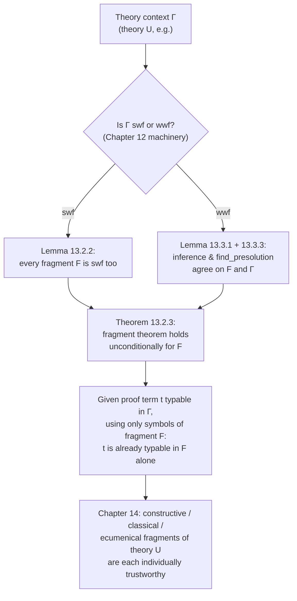

[[book-guidelines|↩ Back to guidelines]]

## The problem: a proof with no paper trail

Suppose you import a proof into theory U — Dedukti's big combined theory that can express minimal, constructive, classical, and ecumenical logic all at once. The proof type-checks. Good. But now someone asks: *is this actually a constructive proof, or did it secretly use excluded middle somewhere?*

You'd think you could just look at the proof term. You can't. Here's the wrinkle that makes this chapter necessary: in $\lambda\Pi$-calculus modulo theory, type-checking uses a **conversion rule** — two types are interchangeable whenever they're related by the theory's rewrite rules, regardless of *which* rewrite rules got used or how many steps it took. A proof term itself is just a sequence of abstractions, applications, and constants. It carries no record of *which* rewrite rules fired during its type-checking. So a proof `t` might use only constructive constants on its face, yet still owe its well-typedness to some classical rewrite rule that fired invisibly, mid-conversion, to make two types match.

Concretely: if all you can inspect is which *symbols* appear in a proof term, is that already enough to know it lives in some sub-theory built from those symbols alone — or could the proof be a fraud, silently borrowing typing power from symbols it never mentions?

This is the **fragment theorem's** whole reason for existing: it says that (under conditions we'll pin down precisely) the answer is no fraud — if a term only *mentions* constructive symbols, it really is typable using *only* the rules that define those symbols. You get to reason about "which axioms this proof depends on" by reading off its symbols, without instrumenting the type-checker to record every rewrite step. That is exactly the guarantee you need before you can trust theory U as neutral storage for proofs from different logics (Chapter 14 cashes this in for real: constructive/classical/ecumenical fragments of theory U).

**[[Deduction-Modulo-Theory#What breaks without it|What breaks without it]]:** without some version of the fragment theorem, "theory U" is just one big undifferentiated theory. You could type-check a proof in it, but you'd have no principled way to say it belongs to the constructive fragment rather than the classical one — the interoperability promise (import proofs, know what they depend on, cross-check them) collapses into "trust the whole monolith or trust nothing."

## Dependency and fragments

The chapter's first move is to define, for a global theory $(\Sigma_2, R_2)$, when a *subset* of its symbols $\Sigma_1$ is self-contained enough to be studied on its own.

**Definition 13.1.1 (Dependency and fragments).** $\Sigma_1 \subseteq \Sigma_2$ *depends on* a symbol $(s : T) \in \Sigma_2$ if either
- some symbol $(s' : T') \in \Sigma_2$ has $s'$'s type $T'$ mentioning $s$, **or**
- some rule $(\ell \hookrightarrow r) \in R_2$ has every symbol of $\ell$ in $\Sigma_1$, and $s$ occurs in $r$.

A **fragment** of $(\Sigma_2, R_2)$ is a sub-theory $(\Sigma_1, R_1)$ with $\Sigma_1 \subseteq \Sigma_2$, $R_1 \subseteq R_2$, such that $\Sigma_1$ is *closed* under this dependency relation — it doesn't depend on anything outside itself.

Read this as a **reachability closure on a dependency graph**: draw an edge from every symbol to every symbol that appears in its type, and from the left-hand-side symbols of a rule to every symbol on the rule's right-hand side. A fragment is any node set closed under following these edges outward. This is precisely the algorithmic shape of computing which modules a piece of code needs to link against — a linker's "reachable symbols" pass, generalized to type dependencies as well as term dependencies.

```rust
// A theory's dependency graph: symbol -> symbols its type/rules mention.
use std::collections::{HashMap, HashSet};

struct Theory {
    // symbol -> the set of *other* symbols occurring in its declared type
    type_deps: HashMap<Symbol, HashSet<Symbol>>,
    // rule -> (lhs symbols, rhs symbols)
    rules: Vec<(HashSet<Symbol>, HashSet<Symbol>)>,
}

impl Theory {
    /// Close a seed set of symbols under Definition 13.1.1's dependency relation.
    fn fragment_closure(&self, seed: HashSet<Symbol>) -> HashSet<Symbol> {
        let mut sigma1 = seed;
        loop {
            let mut grew = false;
            for (s, deps) in &self.type_deps {
                if sigma1.contains(s) {
                    for d in deps {
                        if sigma1.insert(d.clone()) { grew = true; }
                    }
                }
            }
            for (lhs, rhs) in &self.rules {
                if lhs.is_subset(&sigma1) {
                    for d in rhs {
                        if sigma1.insert(d.clone()) { grew = true; }
                    }
                }
            }
            if !grew { return sigma1; } // fixpoint: this is now a fragment
        }
    }
}
```

Note the direction of the closure carefully — it's *outward from a rule's LHS to its RHS*, not the reverse, and it's *from a symbol to the symbols in its type*, not the symbols in its "body." A fragment must be able to fully explain the types of everything in it and fully replay any rewrite step it's licensed to start.

**Definition 13.1.2 (Fragment of a theory context)** lifts this from the semantic level (a pair $(\Sigma_1, R_1)$) to the syntactic level: given a theory context $\Gamma$ (the incrementally-built list of declarations from Chapter 12) and a fragment $(\Sigma', R')$ of $T(\Gamma)$, you get a sub-*context* $F$ by literally filtering $\Gamma$'s declaration list down to the ones naming symbols in $\Sigma'$. This is what lets you talk about "the constructive-logic fragment of theory U" as an actual thing you can type-check against, not just an abstract set of symbols.

## The fragment theorem

**Conjecture 13.1.1 (Fragment theorem).** Let $F$ be a fragment of theory context $\Gamma$. If $t \in \Lambda(F)$, $A \in \Lambda(F)$, and every type in local context $\Delta$ is in $\Lambda(F)$, and $\Gamma; \Delta \vdash t : A$ is derivable, then $F; \Delta \vdash t : A$ is *already* derivable.

In words: if a term, its claimed type, and the types of its free variables only mention symbols from the fragment, then any $\Gamma$-typing derivation of it can be re-done entirely inside the smaller fragment $F$ — no detour through symbols outside $F$ was ever load-bearing. This is stated as a *conjecture* deliberately: the book proves several versions of it, each trading extra hypotheses for a cleaner or more general statement, and the interesting content is in that trade-off.

### The weak fragment theorem

**Lemma 13.1.6 (Weak fragment theorem)** proves a version of the conjecture under three extra hypotheses:
1. both $F$ and $\Gamma$ are well-typed,
2. $\beta_F$ and $\beta_\Gamma$ (reduction restricted to $F$'s rules, vs. all of $\Gamma$'s rules) are confluent,
3. the local context $\Delta$ is well-formed *both* in $\Gamma$ and in $F$.

Under these, if $t \in \Lambda(F)$ and $\Gamma; \Delta \vdash t : A$, there's a type $B \in \Lambda(F)$ with $A \equiv_{\beta\Gamma} B$ (convertible in the big theory) and $F; \Delta \vdash t : B$ (derivable in the small one). Note the type in the fragment isn't syntactically $A$ — it's some $F$-expressible type convertible to $A$ in $\Gamma$. The proof is by structural induction on $t$, and it leans on two supporting facts about fragments worth internalizing on their own:

- **Fragments are closed under reduction (Lemma 13.1.3).** If $t \in \Lambda(F)$ reduces (in the big theory) to $t'$, then $t' \in \Lambda(F)$ too, and the reduction is already witnessed by $F$'s own rules alone. This is exactly the closure property Definition 13.1.1 was built to guarantee: a rewrite rule can only fire on $t$ if its LHS symbols are already in $\Sigma_1$, and dependency-closure then guarantees its RHS symbols are in $\Sigma_1$ as well — so reducing inside a fragment can never "escape" it.
- **Convertibility with a product (Lemma 13.1.5).** If $A \in \Lambda(F)$ and $A \equiv_{\beta\Gamma} \Pi x{:}T.U$ in the big theory, then $F$ already has its *own* witnessing product $\Pi x{:}T'.U'$, with $T \to^*_{\beta\Gamma} T'$ and $U \to^*_{\beta\Gamma} U'$. This is what lets the induction case for application ($t = f\,u$) work: once you know $f$'s type is convertible to *some* $\Pi$-type in $\Gamma$, you can find an $F$-representable one to use instead.

**What breaks without confluence and well-typedness of $F$:** if $\beta_F$ isn't confluent, two different $F$-reductions of the same term could disagree on a normal form, and the "unique-enough" typing arguments (product injectivity, subject reduction) that the induction leans on stop holding *inside $F$ itself* — you could prove the theorem's premises but have no coherent notion of "the type" to hand back. If $F$ isn't well-typed, there's no guarantee the small proof you reconstruct is even legal.

### Weakening the hypotheses

Section 13.1.3 chips away at Lemma 13.1.6's hypothesis list. It shows the "$\Delta$ well-formed in $F$" hypothesis is actually *redundant* — you can derive it from the others.

**Lemma 13.1.7 (Well-formedness of fragments).** If $\Gamma$ is well-typed, $F$ is a well-typed fragment of $\Gamma$, and every declared type in $\Delta$ lies in $\Lambda(F)$, then $\Gamma \vdash \Delta\ \mathrm{wf}$ implies $F \vdash \Delta\ \mathrm{wf}$.

The proof is a simple induction on $\Delta$ that repeatedly calls back into Lemma 13.1.6 itself — a nice bit of bootstrapping: the weak fragment theorem is strong enough to prove one of its own hypotheses is unnecessary. After this, the *only* hypotheses left to eliminate are confluence of $\beta_F$ and well-typedness of $F$ — and eliminating those (rather than assuming them) is exactly what Sections 13.2 and 13.3 do, by looking at *how* $\Gamma$ was built.

## Fragments of strongly well-formed theories: the theorem "for free"

Recall from Chapter 12 that a theory context is **strongly well-formed (swf)** when every rewrite rule's left-hand side is an *algebraic term* (built purely from constants applied to constants/variables — no bound-variable applications) that is well-typed on the nose, with both sides typable at the same type, and the whole thing stays confluent as it's built up declaration by declaration.

Section 13.2's punchline: **you never need to check swf-ness of a fragment separately — it comes for free.**

**Lemma 13.2.1 (Unicity of types for algebraic terms)** shows that in a swf theory, an algebraic term $u$ of a fragment $F$, well-typed in the ambient $\Gamma$, has a typing context that can be rewritten (up to conversion) to use only $F$'s own symbols — algebraic terms don't let free variables "borrow" types from outside their own fragment, because every variable's type is pinned down by which constant it's plugged into.

**Lemma 13.2.2 (Fragments of swf theories are swf)** then proves, by induction on how $\Gamma$ was incrementally constructed, that filtering a swf context down to a fragment $F$ yields another swf context: each rewrite rule kept in $F$ is still algebraic, still well-typed at a common type (now witnessed entirely within $F$, via 13.2.1), and confluence transfers down via closure-under-reduction (13.1.3).

That gives the clean statement:

**Theorem 13.2.3 (Fragment theorem for swf theory contexts).** If $\Gamma$ is swf and $F$ is a fragment of $\Gamma$, with $t, A$, and $\Delta$'s types all in $\Lambda(F)$, then $\Gamma; \Delta \vdash t : A$ derivable implies there's $B \in \Lambda(F)$, $B \equiv_{\beta\Gamma} A$, with $F; \Delta \vdash t : B$ derivable — **with no confluence or well-typedness side-conditions to check on $F$ at all.** They're automatic consequences of $\Gamma$ being swf.

This is the payoff of doing the Chapter 12 modularity work first: swf-ness was designed to make *incremental extension* easy to verify; it turns out the exact same inductive structure makes *fragmentation* (extension's mirror image) easy too.

## Fragments of weakly well-formed theories

**Weakly well-formed (wwf)** theories are the harder, more expressive case from Chapter 12: they allow rewrite rules whose left-hand side *isn't itself* typable (e.g. it uses a bound variable in a way that only makes sense for specific well-typed instantiations), handled instead via a **bidirectional constraint-generation** type-inference system and a notion of **presolution** — a substitution $\sigma$ that "covers" every actual solution a constraint set could have across *any* safe future extension of the theory, up to convertibility. A rule is wwf if its LHS's inferred constraints admit such a presolution making both sides typable at a common type.

Fragments of wwf theories don't get the swf treatment's free lunch outright — but Section 13.3 shows the two pieces of machinery that establish wwf-ness *algorithmically* both transfer cleanly to fragments.

### Type inference commutes with fragmentation

**Lemma 13.3.1** is a long mutual induction over every rule of the bidirectional type-inference/checking system (Sort, Constant, Φ-Variable, Δ-Variable, S-/C-Application, S-/C-Abstraction, Product, Free Variable, Inversion, App-No-Check, No-Check — the full Figure 12.1/12.2 rule set from Chapter 12). Its content, stripped of the case analysis: **if you run type inference on a term $t$ that only mentions fragment symbols, inference in the big theory $\Gamma$ and inference in the fragment $F$ produce the same output** — the same inferred type, the same generated constraints, the same output context. Nothing about inference "reaches outside" the fragment when its input didn't.

$$
\Gamma; \Delta_1; \Phi; C_1 \Rightarrow_i t \leadsto (\Delta_2, T_2, C_2)
\quad\text{iff}\quad
F; \Delta_1; \Phi; C_1 \Rightarrow_i t \leadsto (\Delta_2, T_2, C_2)
$$

**Corollary 13.3.1** specializes this to inference from an empty context: if $t \in \Lambda(F)$, inferring $t$'s type in $\Gamma$ gives exactly the answer inferring it in $F$ would give.

### Finding a presolution in a fragment

The other piece of wwf's algorithmic core is `find_presolution` (Saillard's constraint-solving procedure): given a variable set $V$ and constraint set $C$, it either returns a presolution or fails (correctly reporting $C$ unsolvable). **Lemma 13.3.2** confirms completeness whenever $\to_{\beta\Gamma}$ is normalizing: the procedure's only failure mode is running into a genuinely unsolvable normalized constraint shape (mismatched sorts, abstraction vs. non-abstraction, etc.) — it never spuriously gives up.

**Lemma 13.3.3** is the fragment-specific punchline: if all the constraints in $C$ only mention symbols of a fragment $F$ (and hence so does every rewrite step used to normalize them, by closure-under-reduction again), then `find_presolution Γ V C` and `find_presolution F V C` **run identically** — same success/failure, same returned substitution. The procedure literally cannot tell whether it's operating inside the fragment or the whole theory, because it never needs a symbol outside $F$ to do its job.

Put together: **if you've already established, algorithmically, that $\Gamma$ is wwf** (by running `find_presolution` on all its rules and confirming confluence), **you get wwf-ness of every fragment of $\Gamma$ for free** — you don't re-run the constraint solver on the fragment; its behavior there is guaranteed identical.

### The upshot

Since Dedukti's actual type-checking algorithm is built on exactly this swf/wwf framework, both side-conditions of the original weak fragment theorem — confluence and well-typedness of $F$ — turn out to be automatic for *any* theory Dedukti accepts, theory U included. Concretely: a well-typed proof term of theory U that only uses symbols from, say, the constructive-first-order-logic fragment really is well-typed in that fragment alone. You can determine which axioms a proof depends on by reading its symbols — exactly the property motivating the whole chapter, now delivered unconditionally for any Dedukti-checked theory.

## Structural summary



## Where this leads

The fragment theorem is the piece of machinery that turns "theory U type-checks your proof" into "theory U type-checks your proof *and* tells you, for free, which sub-theory it actually depends on." Chapter 14 is where this gets spent: it defines Constructive/Ecumenical Predicate Logic and STT as explicit fragments of theory U, invokes Theorem 13.2.3 (or its wwf analogue) to get well-typedness and subject reduction "for free," and then does the genuinely new work — normalization via super-consistency, decidability, soundness/conservativity — that fragmentation alone doesn't hand you. Chapter 12's swf/wwf apparatus was the prerequisite for both directions of modularity: *extension* (can I add to a theory safely?) and *fragmentation* (can I carve a trustworthy sub-theory back out?) turn out to be proved by the same inductive machinery, just run in opposite directions over the same theory-context structure.

For the standing goal of a Rust-based dependent-type/refinement checker with a metaprogramming elaborator: this chapter is a direct model for a **trusted-kernel design pattern** relevant to both `type-theory` and `automated-reasoning`. If your elaborator's kernel is going to accept proof terms or verification conditions assembled from a large, shared library of lemmas and definitions (analogous to theory U), you will want the same guarantee — that a term type-checked against the full library is *actually* only depending on the symbols it mentions, so you can attribute trust (which axioms, which unsafe extensions, which admitted lemmas a given proof relies on) without instrumenting every conversion step. The dependency-closure algorithm (Definition 13.1.1) is literally the reachability pass you'd write for that attribution; the swf/wwf distinction maps onto a design choice you'll face directly — algebraic, syntactically-checkable rewrite rules (cheap, swf-style, no constraint solving) versus rules needing bidirectional constraint generation and presolutions (wwf-style, closer to what Miller-pattern metavariable unification demands when an elaborator's rule's left-hand side isn't fully first-order-typable on its own). The "presolution robust to any safe future extension" idea (Definition 12.2.9) is also worth holding next to pattern unification's own robustness requirement — a substitution solving a metavariable constraint needs to stay correct as the context grows with further elaboration, which is exactly the "any safe extension" quantifier doing work here.
