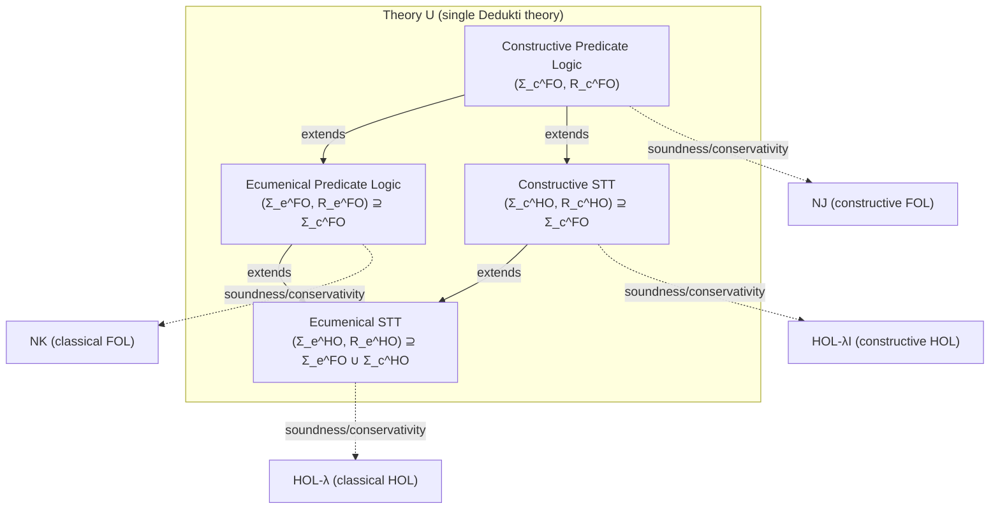
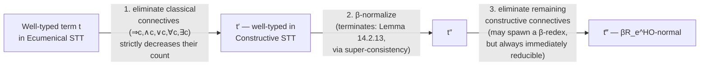
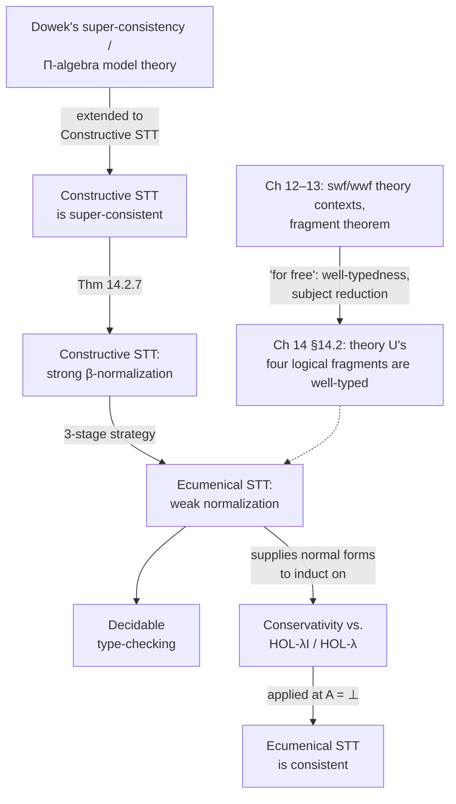

# Theory U and Ecumenical Fragments

[[book-guidelines|↩ Back to guidelines]]

## The problem this chapter closes out

By Chapter 13 the thesis has two mostly-separate achievements sitting side by side. Part II built NE, a genuinely ecumenical natural-deduction system where classical and intuitionistic connectives coexist without collapsing, plus (Chapters 5–7) a computational, higher-order version of it. Parts III–IV built an entirely different piece of machinery: the theory of *well-typed* [[Pure-Type-Systems|Pure Type Systems]] modulo rewriting, culminating in [[Theory-Fragmentation#The fragment theorem|the fragment theorem]] — if a well-typed theory context is strongly or weakly well-formed, then every sub-theory (fragment) closed under symbol dependency is automatically well-typed too, "for free."

Chapter 14 is where these two threads are forced to meet inside one concrete artifact: **theory U**, a single Dedukti theory expressive enough to contain constructive and classical predicate logic, constructive and classical Simple Type Theory (STT), and the ecumenical combinations of each — all as fragments of the same ambient theory, encoded via rewriting rather than as separate systems bolted together.

**What breaks without this chapter.** The fragment theorem gives you subject reduction and "which axioms did this proof actually use" for free — but only *given* that the theory is well-typed and its rewriting is confluent and terminating. Well-typedness of theory U's logical fragments was already established elsewhere ([BDG+21]); what is *not* free is everything a working type-checker actually needs day to day: does type-checking terminate (normalization), is it decidable, does the encoding actually mean what it claims to mean (soundness/conservativity against a trusted reference logic), and is the whole thing even consistent (i.e., does it fail to prove `⊥`)? None of these follow automatically from well-typedness — higher-order normalization in particular is famously *non-modular*: knowing that `→β` (beta-reduction) terminates and that the user-defined rewrite rules `→R` terminate separately tells you nothing about whether their union `→βR` terminates. Chapter 14 has to earn each of these properties by hand for theory U's ecumenical fragments.

This matters for the thesis's whole interoperability pitch (Chapter 1): if you're going to trust theory U as a shared vault for proofs translated in from HOL Light, Coq, Isabelle, etc., you need to know that checking a proof in theory U actually terminates, that it doesn't let you prove something false, and that a proof theory U accepts is provable in the reference system you claim it came from (and vice versa) — not just that theory U's *type-checking algorithm* is internally coherent.

## A different encoding strategy: shallow, not deep

Chapter 7 already built an ecumenical STT — but as a **deep** encoding: higher-order terms were defunctionalized into first-order combinator terms ($K$, $S$, an explicit application symbol $\alpha$) precisely because the NE-modulo-theory machinery from Chapters 5–6 only knows how to reason about first-order congruences. Theory U's version, built directly inside Dedukti/$\lambda\Pi$-calculus modulo theory, doesn't need that detour: **Dedukti's own term language is already higher-order** (it has native $\lambda$-abstraction and application via $\Pi$-types), so ecumenical STT can be expressed with a **shallow** embedding — source abstractions and applications map directly onto Dedukti's own abstractions and applications, and $\beta$-reduction in the source logic literally *is* $\beta$-reduction in Dedukti, rather than being simulated by combinator-rewriting.

This is the same shallow/deep distinction introduced in Chapter 10 (§10.3.2) for encoding functional PTSs, now put to double duty: theory U's *first-order* fragments (predicate logic) still use a deep encoding of the source language's terms (arbitrary function/predicate symbols get their own Dedukti constants, à la Chapter 10's `formulae-as-types`), while its *higher-order* fragments reuse Dedukti's own binders directly. This split is exactly why the chapter's closing question (Key Question 4 in the guidelines) matters: a shallow embedding of a rich system like HOL-λ complicates the double-negation translation needed for the classical fragment, because you can no longer treat "translate the formula" and "the formula's own reduction behavior" as independent — translating a *normal* HOL-λ term can produce a term that is *not* normal in the target (see the "Soundness and conservativity w.r.t. higher-order logic" section below).

## 1. Shallow encoding of ecumenical STT in Dedukti

The encoding is layered, and each layer is a genuine Dedukti theory (a signature $\Sigma$ plus rewrite rules $R$), not a meta-level translation.

**Base layer.** Two pairs of "type of codes / decoding function" declarations:

$$\texttt{SET} : \texttt{TYPE} \qquad \texttt{El} : \texttt{SET} \to \texttt{TYPE}$$
$$\texttt{PROP} : \texttt{TYPE} \qquad \texttt{Prf} : \texttt{PROP} \to \texttt{TYPE}$$

`SET` is a type of *codes* for object-level sorts (the sorts of predicate logic, or the simple types of STT); `El` decodes a code $T : \texttt{SET}$ into the actual Dedukti type of its elements, so an object $t$ of sort $T$ is typed as $t : \texttt{El}\ T$. `PROP`/`Prf` do the same job one level up, for propositions and their proofs. This two-level "codes-and-decoding" idiom is the same universe-and-`elts` trick Chapter 10 used to encode arbitrary PTSs into $\lambda\Pi$ — here specialized to encode a *fixed target logic* rather than an arbitrary source PTS.

**Constructive connectives (Fig. 14.2).** Each connective is declared as an inert constant of type `PROP` (or a function into `PROP`), then given computational content purely through a rewrite rule on `Prf` applied to it — never through typed constructor functions. Implication uses the Curry–Howard reading directly:

$$(\Rightarrow\text{-decl})\quad {\Rightarrow} : \texttt{PROP}, \texttt{PROP} \to \texttt{PROP} \qquad (\Rightarrow\text{-red})\quad \texttt{Prf}(x \Rightarrow y) \hookrightarrow \texttt{Prf}(x) \to \texttt{Prf}(y)$$

Every other connective is defined **à la Russell** — the rewrite rule directly mimics natural deduction's elimination rule rather than routing through a constructor, e.g. conjunction unfolds to a "give me a $z$-consumer that works for any $z$" continuation-passing shape:

$$\texttt{Prf}(x \land y) \hookrightarrow \Pi z{:}\texttt{PROP}.\ (\texttt{Prf}(x), \texttt{Prf}(y) \to \texttt{Prf}(z)) \to \texttt{Prf}(z)$$

This is exactly the impredicative (Leibniz/Church) encoding of `And` you'd get by defining `and A B := ∀ z, (A → B → z) → z` in a System-F-like setting — no primitive pair type needed, just quantification. **Constructive Predicate Logic** is the theory $(\Sigma_c^{FO}, R_c^{FO})$ formed from the declarations/rewrite-rules of `{SET, El, ind, PROP, ⊤, ⊥, ¬, ∧, ∨, ∀, ∃}` (`ind` is the fixed sort of first-order individuals). **Ecumenical Predicate Logic** extends it with classical duplicates `{Prfc, ∧c, ∨c, ∀c, ∃c}` defined by inserting double negations into the constructive versions, e.g.:

$$\texttt{Prf}_c \hookrightarrow \lambda x{:}\texttt{PROP}.\ \texttt{Prf}(\lnot\lnot x) \qquad {\land}_c \hookrightarrow \lambda x\,y.\ (\lnot\lnot x) \land (\lnot\lnot y)$$

`Prfc` is the load-bearing trick here: rather than translating an entire classical formula with a double-negation translation up front (which would bury the formula's syntactic shape under negations), you get a *second proof-of predicate* `Prfc` that inserts double negations exactly where needed, connective by connective, letting classical and constructive connectives sit **in the same formula** simultaneously. The book gives the concrete payoff: with $P, Q : \texttt{PROP}$, $\texttt{Prf}((P \land Q) \Rightarrow_c P)$ is inhabited (classical implication is weaker, so it tolerates a constructive premise) while $\texttt{Prf}((P \land_c Q) \Rightarrow P)$ is not — a genuinely **hybrid** proposition, mixing indices within one formula, exactly like NE's indexed connectives from Chapter 4, but produced here purely by rewriting rather than by a bespoke indexed proof calculus.

**Lifting to STT.** Rather than re-doing the whole Prop/Prf apparatus one level up (which would require *nesting* embeddings — propositions containing propositions containing propositions — and quickly gets unwieldy), STT is built as a lightweight *extension* of predicate logic: add one new sort code `o : SET` for "propositions as objects" and one arrow-sort-constructor `⤳ : SET, SET → SET`, plus the rewrite rule $\texttt{El}\ o \hookrightarrow \texttt{PROP}$ identifying the object-level embedding of propositions with `PROP` itself, and $\texttt{El}(x \between y) \hookrightarrow \texttt{El}\ x \to \texttt{El}\ y$ turning arrow-codes into real function types. **Constructive STT** $= \Sigma_c^{FO} \cup \{o, \between\}$; **Ecumenical STT** $= \Sigma_e^{FO} \cup \Sigma_c^{HO}$ — the union of everything built so far. This is precisely why the chapter's dependency diagram above is a lattice, not a chain: Ecumenical STT sits at the join of "add classical connectives" and "add higher-order quantification," and both of those extensions have to be independently checked to preserve well-typedness (Lemma 14.2.1, inherited "for free" from Chapters 12–13's swf/wwf machinery).

**Rust/Lean grounding.** The `Prf`-by-rewriting idiom is worth comparing directly to how a real kernel treats definitional unfolding. In Lean, if you `def And' (A B : Prop) := ∀ z, (A → B → z) → z`, then `And' A B` and its unfolding are *definitionally equal* — `rfl`-provable, checked by unfolding during `isDefEq`, not by an explicit elimination rule. The `(∧-red)` rewrite rule above is doing exactly that job: it is theory U's `isDefEq`-relevant delta/iota step for conjunction. In Rust terms, if you were implementing a small trusted kernel, `Prf` would be a function from your `Prop` AST to a `Type` AST, and each `-red` rule would be an entry in your normalizer's unfolding table — checked not by a special-cased typing rule per connective, but uniformly by whatever routine decides definitional equality (the `(conv)` rule from Chapter 8's PTS typing system). This is the through-line the whole thesis has been building toward: *ecumenism turns out to be just more definitions, expressed inside the conversion relation, rather than a new primitive judgment form.*

## 2. Super-consistency and $\Pi$-algebra models

Normalization is stated as the load-bearing property early in §14.2: if `→βR` is normalizing and confluent, then convertibility (and hence the applicability of the `(conv)` rule, and hence type-checking) is *decidable* — normalize both sides and compare up to $\alpha$-renaming. But **higher-order normalization does not compose**: knowing $\beta$ terminates and knowing the ecumenical-specific rewrite rules terminate separately says nothing about their union. Worse, one of theory U's own rules — the arrow-code rule $(\between\text{-red})$ — is *not arity-preserving* (its right-hand side is a $\Pi$-type, a "bigger" shape than its left-hand side) and is independently flagged by an automated termination tool (SizeChangeTool) as self-looping when analyzed naively. So normalization for theory U as a whole is still open; Chapter 14's actual achievement is normalization for its **ecumenical STT fragment specifically**, via a semantic (model-theoretic) route rather than a syntactic (rewriting-analysis) one.

**The model-theoretic route: reducibility candidates, abstracted.** The classical technique for proving strong normalization of typed lambda calculi is Tait's method of *reducibility candidates* — interpret each type as a set of "reducible" terms closed under certain operations, then show every well-typed term lands in the interpretation of its type, and that reducible terms are strongly normalizing by construction. Dowek's prior work ([Dow17]) abstracts this method into a general *model theory* for $\lambda\Pi$-calculus-modulo-theory theories, valued in structures called **$\Pi$-algebras** — order-theoretic structures similar to pre-Heyting algebras, playing the role that reducibility-candidate lattices play in a hand-rolled strong-normalization proof.

**Definition 14.2.2 (full ordered complete $\Pi$-algebra).** A structure $B$ equipped with:
- a preorder $(B, \le)$ with a maximal element $\tilde{\top}$,
- a meet operation $\tilde\land : B \times B \to B$ (greatest lower bound for $\le$),
- a "generalized product" $\tilde\Pi : B \times (\mathcal{P}(B)\setminus\emptyset) \to B$ satisfying $a \le \tilde\Pi(b, S)$ iff $a \,\tilde\land\, b \le c$ for every $c \in S$ — this is the semantic counterpart of $\Pi$-types: $\tilde\Pi(b, S)$ behaves like "the type of functions from (something related to) $b$ into every member of $S$,"
- and a second, *unrelated* order $\sqsubseteq$ making $\tilde\Pi$ anti-monotonic on the left / monotonic on the right, with every subset having a least upper bound for $\sqsubseteq$.

The two orders doing different jobs is the crux: $\le$ carries the "logical strength" structure ($\tilde\top$ as maximal truth), while $\sqsubseteq$ carries the *reducibility-candidate* structure needed for the strong-normalization argument itself — they are deliberately decoupled so the same algebra can support both roles without one contaminating the other.

**Definition 14.2.3–14.2.5 (models).** A *model* is three interpretation functions $(\llbracket\cdot\rrbracket^i)_{1\le i\le 3}$ (a simplified, 3-level case of Dowek's arbitrary-depth definition — three levels turn out to suffice here): level 1 interprets `TYPE`/`KIND` themselves as (a fixed universe) $B$; level 2 interprets terms of type `TYPE`/`KIND` given a level-1 assignment; level 3 interprets *proofs*, i.e. terms whose type is itself a level-2-interpreted term, given both previous assignments. $\Pi$-types get their expected recursive interpretation, $\llbracket\Pi x{:}t.\,u\rrbracket^3 = \tilde\Pi(\llbracket t \rrbracket^3, \{\llbracket u \rrbracket^3_{x=c} : c \in \llbracket t\rrbracket^1 \times \llbracket t \rrbracket^2 \})$ — quantifying over *all* elements at both lower interpretation levels simultaneously. A model *of a theory* $(\Sigma, R)$ additionally has to validate variable lookup, respect weakening and substitution, be invariant under the theory's own congruence $\equiv_{\beta R}$ (Validity of the congruence — this is where each `-red` rewrite rule from §1 above has to be individually checked semantically sound), and interpret every axiom's type as $\ge \tilde\top$ (Validity of the axioms — every declared constant's type must be "at least as strong as truth" in the model).

**Definition 14.2.6 (super-consistency).** A theory is **super-consistent** if it has a model valued in *every* full, ordered, complete $\Pi$-algebra — universally quantified over the whole class of such algebras, exactly the same "works no matter which model you pick" flavor as Henkin-completeness arguments, but pointed at normalization rather than at completeness.

**Theorem 14.2.7 ([Dow17]):** $\to_\beta$ is strongly normalizing on well-typed terms of any super-consistent theory. **Theorem 14.2.8 ([Dow17]):** Minimal STT (the fragment with only $\top, \bot, \Rightarrow, \forall$ — Definition 10.3.1's minimal predicate logic, lifted to STT) is already known to be super-consistent.

Chapter 14's own new work in §14.2.1 is extending this base model to cover **all** of Constructive STT's connectives ($\top, \bot, \neg, \exists, \land, \lor$), by explicit, per-connective interpretation clauses (Figures 14.4–14.7) and three verification obligations for each: (1) extend the interpretation, (2) prove the connective's own declared *type* is validated by the interpretation (Lemma 14.2.10 — e.g. $\land$'s interpretation must land in the interpretation of `PROP, PROP → PROP`), (3) prove the connective's *axiom* is valid, i.e. $\ge \tilde\top$ (Lemma 14.2.11), and (4) prove that each `-red` rewrite rule leaves the interpretation invariant (Lemma 14.2.12 — this is the step that actually connects the semantic model back to the syntactic rewrite system from §1, and the one flagged as "most problematic" because connectives like $\land$ aren't defined by a rule of the shape `∧ ↪ t` but by a rule on `Prf(x ∧ y)`, forcing `Prf` and application to be interpreted jointly).

**Why this matters beyond this one proof.** Super-consistency is the thesis's model-theoretic analogue of what a type-theorist would call a *set-theoretic (or realizability) semantics for a kernel*: instead of arguing "this reduction relation terminates" by hand-tracing every rewrite rule (which is exactly what fails here, per the non-arity-preserving $\between$-rule above), you exhibit *one universal semantic argument* that automatically absorbs any well-typed extension satisfying the model conditions. This is analogous to how a Lean-style kernel's trust in `isDefEq` ultimately rests on a semantic normalization argument (reducibility candidates / logical relations), not on a syntactic confluence-and-termination check of the literal rewrite system — precisely because dependent, higher-order rewriting resists purely syntactic termination analysis at scale.

## 3. Normalization and decidability of type-checking for Ecumenical STT

Lemma 14.2.13 gets strong $\beta$-normalization for Constructive STT for free from Theorem 14.2.7, once its super-consistency has been established (§14.2.1's real work). But Ecumenical STT is *not* claimed to be strongly normalizing outright — only **weakly** normalizing (Corollary 14.2.3): every well-typed term has *some* reduction path to a normal form, not necessarily that *every* path terminates. The proof is a genuinely constructive three-stage normalizing strategy, not an existence argument:

The subtlety is stage 3: eliminating a constructive quantifier rule like $(\forall\text{-red})$ or $(\exists\text{-red})$ can *create a new $\beta$-redex* (because the eliminated form applies a $\lambda$-abstracted continuation to an argument). The proof has to observe that any such freshly created redex has the immediately-reducible shape $(\lambda x{:}t.\,u)\,y$ — so reducing it doesn't reintroduce more connectives and the strict-decrease measure from stage 3 stays valid. This is a small but characteristic piece of normalization-proof craft: the measure you pick (number of connectives) has to survive being perturbed by a *side effect* of the very reduction you're using it to justify.

**Corollary 14.2.4:** type-checking in Ecumenical STT is decidable — immediate once you have a normalizing strategy plus confluence (confluence of the rewrite system is assumed established elsewhere for these fragments), by the same "normalize both sides, compare, decide `(conv)`" argument sketched in §2. The book is candid that this specific 3-stage strategy isn't what any real implementation actually runs (Dedukti's own normalization is untargeted, not staged by connective-kind) — it's an *existence* proof for decidability, with the practical evidence being that a large real corpus (the ported HOL Light standard library) type-checks against this theory with no observed counterexample to normalization behaving well in practice. **Conjecture 14.2.1** — that Ecumenical STT is in fact *strongly*, not just weakly, normalizing — is explicitly left open.

**Where this connects to the target project.** This is a direct hit on the "algorithmic mechanisms" and "decidability" threads: a normalization *strategy*, staged to make each stage's termination argument independently tractable, is exactly the shape of engineering compromise a real elaborator/kernel makes when full syntactic termination analysis of the whole reduction relation is infeasible — stage the reduction, prove each stage separately, and only claim the overall property (decidable type-checking) that composes cleanly, while leaving the stronger property (strong normalization) as future work rather than blocking on it.

## 4. Soundness and conservativity with respect to first-order logic

**Setup.** A first-order language $L$ is encoded via a context $\Delta_L$: each $n$-ary function symbol $f \in L$ becomes a Dedukti function $\dot f : \texttt{El}\ \texttt{ind} \to \cdots \to \texttt{El}\ \texttt{ind}$, each $n$-ary predicate $P$ becomes $\dot P : \texttt{El}\ \texttt{ind} \to \cdots \to \texttt{PROP}$. NJ formulas embed via a straightforward homomorphic translation $|\cdot|_c$ (Fig. 14.8: connectives map to connectives, quantifiers to $\forall\,\texttt{ind}\,(\lambda x.\, |A|_c)$, etc.) — this is a **deep** embedding in the Chapter 10 sense: the source language's own function/predicate symbols get freshly declared Dedukti constants rather than reusing Dedukti's binders for the source syntax itself, unlike the STT case in §1.

**The bug this chapter fixes.** Soundness (if $\Gamma \vdash_{NJ} A$ then the translated judgment is derivable in Constructive Predicate Logic) was proved twice before ([Dor11], [Sai15]) — and both proofs are shown here to be **wrong**, in the same way: they mishandle free variables that occur *only inside a subproof*, not in the final conclusion. The book's counterexample (Fig. 14.9) is concrete and worth internalizing as a general lesson about translating natural-deduction derivations, not just about this one system: from $\forall x.[Q(x) \land P] \vdash \forall x.[Q(x)\land P]$, apply $\forall$-elimination to introduce a *fresh* variable $y$ (instantiating the bound $x$), then $\land$-elimination to conclude $\vdash P$. The **final judgment** $\forall x.[Q(x)\land P] \vdash P$ has no free occurrence of $y$ — but the **proof term** built along the way does, because $\forall$-elimination's proof-term constructor literally substitutes $y$ into the witness. If you build the typing context only from the free variables of the *final judgment* (as both prior proofs did), $y$ is undeclared, and the constructed proof term is simply ill-typed.

**The fix** is almost embarrassingly simple once diagnosed: add one **witness constant** $w : \texttt{El}\ \texttt{ind}$ to $\Delta_L$ once and for all, and substitute $w$ for any such "proof-internal but not judgment-external" free variable. Lemma 14.3.1 restates soundness correctly with this fix, and the inductive proof step for $\land$-elimination shows exactly where the substitution has to happen: after building the naive proof term over the *proof's* free variables, apply the substitution $[y_1 := w, \ldots, y_k := w]$ for every variable free in a subproof but not in the final judgment/context, using the substitution lemma to justify that this doesn't change well-typedness. Conservativity (the converse direction — Lemma 14.3.2) is stated as a special case of the higher-order conservativity proof developed later in §14.4.2, since Constructive STT is a proper extension of Constructive Predicate Logic.

**Extending to the classical/ecumenical case.** Ecumenical Predicate Logic's soundness/conservativity with respect to NK is obtained almost entirely by *composition*, not fresh proof work: define an embedding $|\cdot|_e$ mapping NK connectives to their classical (subscript-$c$) counterparts (Fig. 14.10a), then show (Lemma 14.3.3) that $\texttt{Prf}_c\,|A|_e \equiv_{\beta R} |\lnot\lnot A^\perp|_c$ for every NK formula $A$ — i.e., "translate then apply the classical proof-of predicate" is *definitionally equal* to "apply the Kolmogorov double-negation translation $A \mapsto \lnot\lnot(A^\perp)$ then translate constructively." Since Kolmogorov's translation (Fig. 14.10b, Lemma 14.3.4, [Kol25]) is already known to make NK provability reduce to NJ provability of the doubly-negated formula, soundness (14.3.5) and conservativity (14.3.6) for the ecumenical case follow by chaining: NK ⟷ (Kolmogorov) ⟷ NJ ⟷ (§4.3.1's fixed result) ⟷ Constructive Predicate Logic ⟷ (Lemma 14.3.3, definitional) ⟷ Ecumenical Predicate Logic. This chaining pattern — reduce a new soundness/conservativity result to an *already proved* one via a definitional-equality bridge lemma — recurs almost verbatim in the higher-order case below, and is itself worth noticing as a proof-engineering technique: rather than re-running an induction over the whole proof system twice (once for NJ, once for NK), you factor the classical case through the constructive case plus one purely syntactic translation lemma.

## 5. Soundness and conservativity with respect to higher-order logic

**Reference system.** HOL-λ (Definition in §14.4.1) is the *intensional* variant of HOL (no $\eta$-expansion rule): simple types $T, U ::= \iota \mid o \mid T \to U$, terms built from typed variables/constants, $\lambda$-abstraction, application, and typed logical constants ($\dot\Rightarrow, \dot\land, \dot\lor : o\to o\to o$; $\dot\top,\dot\bot : o$; $\dot\neg : o \to o$; $\dot\forall_T, \dot\exists_T : (T\to o)\to o$). Its proof system (Fig. 14.11) is a Hilbert/natural-deduction hybrid where every proposition appearing in a proof is required to be **$\beta$-normal** (rules for $\dot\forall$-intro/elim and $\dot\exists$-intro/elim explicitly β-normalize the instantiated formula, written $(A\,t)\!\downarrow$) — this normal-form discipline is what later forces the conservativity proof to reason about normal forms so heavily. **HOL-λI** is its constructive fragment, obtained by deleting the excluded-middle rule (EM).

**Soundness of Constructive STT w.r.t. HOL-λI.** Here the embedding $|\cdot|_c$ (Fig. 14.12) really is **shallow**: HOL-λ variables map to Dedukti variables, applications to applications, $\lambda$-abstraction to $\lambda$-abstraction — Dedukti's own binders are reused directly, unlike the deep first-order encoding of §4. This directly preserves $\beta$-reduction (Lemma 14.4.1) and hence $\beta$-conversion (Corollary 14.4.1) and *normality itself* (Lemma 14.4.2: a HOL-λI term is normal iff its translation is normal in Constructive STT) — properties a deep encoding could never give you so cheaply, since a deep encoding's "reduction" is a separate rewrite system layered on top of an inert representation. Soundness (Lemma 14.4.4) is then a standard induction on the HOL-λI derivation, with the $\forall$-introduction/elimination cases doing real work: because HOL-λ's own rules build in $\beta$-normalization at each quantifier step, the translated proof term has to be pushed through the *same* witness-substitution device from §4 (free variables appearing mid-proof but not in the final judgment) generalized now to simple types rather than just `ind`.

**Conservativity requires the normalization result from §3.** This is the payoff that makes §3's weak-normalization proof more than an isolated decidability result: conservativity of Constructive STT is proved (Lemmas 14.4.5–14.4.10) by a chain of structural facts about **normal forms** on the Constructive-STT side — normal proof-types have a canonical product shape (14.4.5), simple types have a canonical normal shape (14.4.6), typed variables/constants trace back to a hypothesis in $\Gamma$ (14.4.7, "conserving hypotheses" — the key inversion lemma), normal terms of a `SET`-coded type correspond to an actual simple type (14.4.8), and normal terms of an `El`-decoded type correspond to an actual HOL-λI term (14.4.9, "conserving objects"). Lemma 14.4.10 (weak conservativity) then runs an induction *on a normal Dedukti term* — case-splitting on whether it's a headed application or an abstraction — using product compatibility (from Chapter 8's PTS metatheory!) to peel off argument types one at a time and reconstruct, connective by connective, the HOL-λI derivation the term must have come from. **None of this induction is possible without knowing normal forms exist to induct on** — which is exactly what §3's weak-normalization proof supplies. Corollary 14.4.2 upgrades this to full conservativity by first normalizing an arbitrary (not-necessarily-normal) witnessing term.

**The classical case: why shallow embedding complicates the double-negation translation.** For Ecumenical STT vs. full HOL-λ, the natural move — mirror §4's approach and factor through a Kolmogorov-style translation composed with the already-proved constructive result — runs into exactly the shallow-embedding wrinkle flagged at the top of this article. Because $|\cdot|_e$ (Fig. 14.13a) reuses Dedukti's own binders, translating a **normal** HOL-λ term does *not* in general produce a **normal** Constructive-STT term: the book's example, $(z \dot\land z)^\perp$, translates to $[\lambda x_1.\lambda x_2. (\dot\neg\dot\neg x_1)\dot\land(\dot\neg\dot\neg x_2)]\,z\,z$ — a visible $\beta$-redex, sitting right there because the double-negation translation $\cdot^\perp$ (Fig. 14.13b) has to substitute *terms* into a connective's own $\lambda$-abstracted double-negation template, and a shallow embedding can't defer that substitution the way a deep encoding's separate rewrite system could. This is precisely the extra complication the Key Questions flagged: a deep embedding's translation and its reduction behavior are decoupled (translation is just data construction; reduction happens later, governed by rules you designed), while a shallow embedding's translation *is* term construction in the target calculus, so it inherits the target's reduction behavior whether you want it to or not.

The fix (Lemma 14.4.11–14.4.12) is to show $\cdot^\perp$ commutes with HOL-λ conversion (so post-hoc $\beta$-normalizing the translated formula is licensed) and that the Glivenko/Kolmogorov-style correspondence holds up to explicit normalization: $\Gamma \vdash A$ in HOL-λ iff $\dot\neg\dot\neg\Gamma^{\perp}\!\!\downarrow \,\vdash\, \dot\neg\dot\neg A^{\perp}\!\!\downarrow$ in HOL-λI — note the explicit $\downarrow$ (normalize) baked into the statement, which is precisely what a deep-embedding version of this lemma would *not* need. Soundness (14.4.13) and conservativity (14.4.14) for the full classical system then chain through this normalized correspondence and the already-proved constructive result (14.4.4/14.4.2), exactly mirroring §4's chaining pattern but with an extra normalization step wedged in at every hop to compensate for the shallow embedding's lack of a translation/reduction firewall.

## 6. Consistency of Ecumenical STT

**Corollary 14.4.3** delivers the capstone result cheaply, once everything above is in place: there is no derivation of $\vdash_e^{HO} \texttt{Prf}\ \bot$ in Ecumenical STT. The proof is not a fresh argument — it is the **conservativity** result (14.4.14) applied at $A = \dot\bot$: if Ecumenical STT could prove $\texttt{Prf}\ \bot$, conservativity would transport that into a HOL-λ derivation of $\dot\bot$ itself, and HOL-λ is independently known to be consistent. This is the standard "consistency for free from conservativity over a known-consistent system" move — and it is exactly *why* conservativity (not just soundness) had to be established, and why soundness alone would not have sufficed: soundness only tells you that provable-in-theory-U implies provable-in-HOL-λ's *image*, which says nothing about whether theory U could prove things HOL-λ can't. Conservativity is the direction that actually rules out theory U introducing new, unfounded proving power — including a proof of falsehood.

## Synthesis: what this chapter earns, and what's still open

Zooming out to the Conclusion (pp. 161–163): the thesis frames itself as two parallel attacks on the same underlying problem — *combining* computational theories without either collapsing distinct logical fragments together or losing track of which axioms a given proof actually depends on. Part II's answer is NE/≡: an axiomatic-and-computational ecumenical framework with its own normalization theorem. Parts III–IV's answer is the modularity/fragmentation machinery, culminating in the fragment theorem. Chapter 14 is the chapter where these two answers are shown to *cohere on a real example*: theory U's ecumenical fragments mirror NE's own design (indexed/duplicated connectives, double-negation-based classical variants) but built entirely inside the fragment-theorem framework, earning subject reduction and the fragment theorem "for free," and earning normalization, decidability, soundness, conservativity, and consistency through the fresh work surveyed in §§2–6.

What remains explicitly open, per the Conclusion: normalization and consistency for the *entirety* of theory U (not just its logical fragments — the problematic $\between$-rule from §2 stands as a concrete obstacle, since it defeats naive termination tooling), strong (not just weak) normalization of Ecumenical STT itself (Conjecture 14.2.1), and the behavior of genuinely *hybrid* propositions and proofs mixing classical and constructive connectives across different ecumenical designs — though the book notes that weak normalization already gives a partial answer here, since every hybrid object's normal form provably lands in the Constructive STT fragment.

**Connecting to the standing project (`type-theory`, `automated-reasoning`).** This chapter is close to a worked case study in exactly the load-bearing mechanism the roadmap keeps flagging: *definitional equality doing the work of a proof rule*. Every connective here is "proved sound" by being reduced to a rewrite rule inside the conversion relation, and the entire soundness/conservativity apparatus is a discipline for keeping a trusted kernel's `isDefEq`-equivalent honest against an external reference semantics — precisely the shape of the soundness argument a Rust-based verifier's kernel would need against its own specification language. The witness-constant fix in §4 is a small but genuine instance of the "substitution, context management, and free-variable bookkeeping" thread: a bug in two independently published proofs, caused by conflating "free in the final judgment" with "free in the proof term," is the kind of context-validity subtlety that recurs verbatim in Hoare-triple soundness arguments and in elaboration (a metavariable's scope is exactly this same question — "which context does this variable's solution actually need to mention?"). And the super-consistency route to normalization (§2) is a concrete illustration of *why* a trusted kernel's normalization argument is usually semantic (a model/logical-relations argument) rather than purely syntactic (confluence + termination of the literal rewrite system) once the rewriting gets higher-order and dependently-typed enough that termination tools stop working — the exact regime a refinement-type compiler's own definitional-equality checker will eventually have to operate in.
