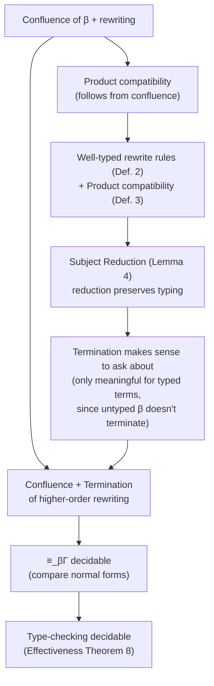
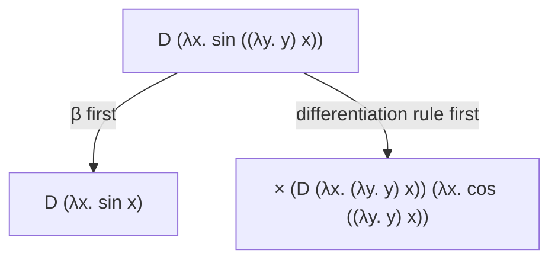

# Decidability via Effective Subsystems

[[book-guidelines|↩ Back to guidelines]]

## The problem: conversion without a receipt

Go back to the conversion rule from Section 2.2.2 of the paper:

$$
\frac{\Gamma \vdash A : s \quad \Gamma \vdash B : s \quad \Gamma \vdash t : A \quad A \equiv_{\beta\Gamma} B}{\Gamma \vdash t : B}
$$

Read operationally, this rule says: "if you can show $A$ and $B$ are the same type up to the rewriting congruence $\equiv_{\beta\Gamma}$, you may swap one for the other." But look at what's *not* in the rule. The premise is $A \equiv_{\beta\Gamma} B$ — a bare existence claim that some chain of rewrite/reduction steps connects $A$ and $B$ — not a specific chain. The typing derivation doesn't carry a receipt for *how* $A$ and $B$ were shown equal. It just asserts that they are.

This is exactly the situation a type checker cannot tolerate. If checking $A \equiv_{\beta\Gamma} B$ requires searching an unbounded rewriting relation for *some* sequence of steps that joins the two terms, and that relation is generated by user-declared rewrite rules of arbitrary shape, then in general there's no algorithm that decides the question. Dedukti lets a user throw in almost any left-hand side and right-hand side as a rewrite rule; nothing in Section 2.2 stops you from writing a non-terminating or non-confluent system. So the calculus in Section 2.2 is a *specification*, not something you could implement as a decision procedure.

**[[Embedding-Predicate-Logic-in-a-Logical-Framework#What breaks|What breaks]] without this restriction:** without confluence, $\equiv_{\beta\Gamma}$ might relate a term to two "different" normal forms depending on the order rewriting is performed, so "are $A$ and $B$ convertible" stops being a well-defined yes/no question you can settle by normalizing both sides and comparing — you'd need to explore the entire (possibly infinite) rewriting graph. Section 2.3 exists to close this gap: it identifies **effective subsystems** — restrictions on which rewrite rules are legal — under which $\equiv_{\beta\Gamma}$, and hence type-checking itself, becomes decidable.

If you're used to thinking of "the type checker" and "the theorem prover" as different pieces of software, this is the place in the paper where the distinction dissolves: deciding $\Gamma \vdash t : B$ *is* deciding a specific, structured word problem, and the rest of this section is exactly the argument that makes that word problem tractable. This is the mechanism a Rust-based verifier's `isDefEq`/definitional-equality checker has to implement, and the same mechanism — under a different name, "unification" — is what an elaborator's metavariable solver runs continuously during type inference.

## Why confluence has to come first

The paper is explicit about proof order here, and it's worth dwelling on because it's the opposite of the "usual" story you get in an operational-semantics course, where you typically prove termination of a reduction system before worrying about anything else.

The dependency chain, spelled out in 2.2.3 and again at the top of 2.3, runs like this:



Follow the arrows and the circularity becomes visible, and so does its resolution. You want termination, because a terminating rewrite system lets you decide $A \equiv_{\beta\Gamma} B$ by normalizing both sides and checking syntactic equality. But termination is a statement about *typed* terms only — plain untyped $\beta$-reduction doesn't terminate at all (think of $(\lambda x.\, x\,x)(\lambda x.\, x\,x)$), so "does this rewrite system terminate" is only a sensible question once you already know which terms are well-typed. And knowing which terms are well-typed, in a system with a conversion rule, already presupposes *some* notion of when two types are interchangeable — which is what subject reduction (Lemma 4) is there to protect: it says reduction never silently changes a term's type out from under you. But Lemma 4 itself is proved from product compatibility (Definition 3), and product compatibility is, in general, most naturally obtained as a *consequence of confluence* — if $\Pi x{:}A_1\,B_1 \equiv_{\beta\Gamma} \Pi x{:}A_2\,B_2$ and the rewriting relation is confluent, both sides must reduce to a common term, and since $\Pi$ is not itself the head of any rewrite rule's left-hand side in a well-behaved system, that common term forces $A_1 \equiv_{\beta\Gamma} A_2$ and $B_1 \equiv_{\beta\Gamma} B_2$ directly.

So the escape from the circle is: **prove confluence first, on untyped terms, independent of any termination or typing assumption.** Confluence gives you product compatibility, which gives you subject reduction, which is what makes "termination for well-typed terms" a coherent statement to even try to prove next. This is why Sections 2.3.1 and 2.3.2 do all their work purely in terms of syntactic shape restrictions — patterns, static/definable symbol distinctions, most general typing substitutions — without ever assuming the rewrite system terminates. Termination, when it's wanted, is bolted on afterward in the Effectiveness Theorem (Theorem 8) as a separate, final hypothesis.

## 2.3.1 — Higher-order rewriting and Miller's patterns

### What breaks: confluence dies at the first λ

The paper's own example is the cleanest way to see the failure mode. Fix a context $\Delta = f : \mathit{Real} \to \mathit{Real}$ and declare a rewrite rule for symbolic differentiation of $\sin(f(x))$ under the chain rule:

$$
(D\ (\lambda x{:}\mathit{Real}.\ \sin(f\,x))) \longrightarrow_\Delta (\times\ (D\ (\lambda x{:}\mathit{Real}.\ f\,x))\ (\lambda x{:}\mathit{Real}.\ \cos(f\,x)))
$$

This rule has a $\lambda$-abstraction *inside* its left-hand side — the differentiation operator $D$ is being pattern-matched against a lambda term, not just applied to a first-order argument. That's an entirely natural thing to want (see also Section 8.3 of the paper, on inductive-type eliminators, which need the same power). But it interacts badly with plain first-order rewriting-plus-$\beta$: the term $D\,(\lambda x.\,\sin((\lambda y.\,y)\,x))$ can be reduced two different ways —



— and these two terms, $D\,(\lambda x.\,\sin x)$ and $\times\,(D\,(\lambda x.\,(\lambda y.\,y)\,x))\,(\lambda x.\,\cos((\lambda y.\,y)\,x))$, are *not* joinable by any further first-order rewriting or $\beta$-steps: the redex $(\lambda y.\,y)\,x$ trapped inside the differentiation rule's instantiated right-hand side has no counterpart to cancel against on the left. This is a genuine **critical peak** (in the classical Knuth–Bendix sense) that the first-order theory of confluence cannot close. So: rewriting-plus-$\beta$, viewed as an ordinary first-order rewrite system, is simply **not confluent** once you allow $\lambda$-abstraction in left-hand sides.

### The fix: rewrite modulo β, matched by patterns

The paper's fix is to change what "matching" means rather than to forbid $\lambda$ in left-hand sides. Instead of first-order syntactic matching, use **higher-order matching**: a term $t$ matches a left-hand side $l$ if there exists a substitution $\sigma$ such that $\sigma l$ is $\beta$-*convertible* to $t$ (not syntactically identical to it). Under this relation — "rewriting modulo $\beta$-equivalence", i.e. higher-order rewriting — the peak above closes immediately, because $D\,(\lambda x.\,\sin((\lambda y.\,y)\,x))$ is directly recognized (after normalizing the trapped redex as part of matching, not as a separate rewrite step competing for confluence) as an instance of the differentiation rule, giving the single joined term $D\,(\lambda x.\,\sin x) \to \times\,(D\,(\lambda x.\,x))\,(\lambda x.\,\cos x)$ directly.

The catch: **higher-order matching is undecidable in general** (this is a classical result — Huet, and independently Goldfarb, on the undecidability of higher-order unification, of which matching is the one-sided special case). If matching itself isn't decidable, you haven't gained anything — you've just moved the undecidability from "is $A \equiv_{\beta\Gamma} B$" down into "does this rule even apply here." The paper's escape is to *restrict which left-hand sides are legal* so that matching against them is always decidable. The restriction is Miller's pattern fragment:

> **Definition 6 (Pattern).** A $\beta$-normal term $f\,u_1 \dots u_n$ is a *pattern* with respect to $\Delta$ if $f$ is a variable not declared in $\Delta$, and the variables declared in $\Delta$ are applied to pairwise distinct bound variables.

Unpack the two clauses separately, because they're doing different jobs:

- **"$f \notin \Delta$"** — the *head* of the left-hand side (the symbol being rewritten, e.g. $D$ or $\mathit{Tail}$) must not itself be one of the rule's local pattern variables. This is what makes the rule about a specific, fixed symbol rather than a schema that could match anything.
- **"$\Delta$-variables applied to pairwise distinct bound variables"** — every occurrence of a rule variable (drawn from $\Delta$, e.g. $f$ in the differentiation example) must appear applied to a list of *distinct, locally bound* variables, never to a compound term or to a repeated variable. In the differentiation rule, $f$ occurs as $f\,x$, where $x$ is a single bound variable — legal. The paper's own counterexamples make the boundary concrete: if $f$ is declared in $\Delta$, then $D\,(\lambda x.\,\sin(f\,x))$ *is* a pattern, but $D\,(\lambda x.\,f\,(\sin x))$ is **not** (here $f$ is applied to the compound term $\sin\,x$, not to a bare bound variable), and $D\,((\lambda x.\,\sin x)\,y)$ is **not** a pattern either (it isn't even $\beta$-normal, since $(\lambda x.\,\sin x)\,y$ is itself a redex).

Within this fragment, higher-order matching (and, more generally, higher-order *unification*) reduces to something structurally close to first-order unification with a variable-renaming side condition, and is therefore decidable and has a most-general solution. This is precisely why the pattern fragment, not full higher-order unification, is the load-bearing tool: the paper needs a fragment expressive enough to write rules like the differentiation rule and dependent eliminators, but restrictive enough that "does this rule fire here" stays a total, terminating check inside the type checker itself.

**This is the same mechanism as Miller's pattern unification in an elaborator.** If you've seen Lean, Agda, or Coq's elaborators handle implicit arguments and metavariables, this restriction should look extremely familiar: a metavariable applied to a spine of distinct local (bound) variables is exactly a *flexible pattern*, and it's exactly the case where the elaborator can assign the metavariable a value by "abstracting the right-hand side over that spine" — no search, no backtracking, a unique most general assignment. Full higher-order unification for arbitrary metavariable applications is undecidable and requires Huet-style search with non-unique, potentially infinite solution sets; production elaborators almost universally fall back to Miller's pattern fragment as the fast, decidable, complete-for-this-fragment path, and only resort to heuristics or user annotation outside it. Dedukti's rewrite-rule left-hand sides and an elaborator's metavariable occurrences are, formally, the same object playing two roles: a symbol applied to a spine, where the tractability of solving for it hinges on that spine being a list of distinct bound variables.

```rust
// A sketch of "is this left-hand side a Miller pattern", the check a
// rewrite-rule (or metavariable-assignment) compiler pass must run before
// accepting a rule/solving a metavariable.
enum Term {
    Var(usize),                 // a locally bound variable (de Bruijn index)
    Symbol(String),             // f, D, Tail, ...
    App(Box<Term>, Box<Term>),
    Lam(Box<Term>),
}

/// `pattern_vars` are the rule's own ∆-declared variables (or, in an
/// elaborator, the metavariable being solved). Returns true iff `t`,
/// read as `f u1 ... un`, is a Miller pattern with respect to them.
fn is_pattern(t: &Term, pattern_vars: &[String]) -> bool {
    fn spine(t: &Term) -> (Option<&Term>, Vec<&Term>) {
        let mut args = vec![];
        let mut cur = t;
        while let Term::App(f, a) = cur {
            args.push(a.as_ref());
            cur = f;
        }
        args.reverse();
        (Some(cur), args)
    }
    let (head, args) = spine(t);
    let head_is_pattern_var = matches!(head, Some(Term::Symbol(s)) if pattern_vars.contains(s));
    if head_is_pattern_var {
        return false; // f ∉ ∆ is required for the *rule's own* head symbol
    }
    // Every occurrence of a ∆-variable, anywhere in the term, must be
    // applied only to a spine of pairwise-distinct bound variables.
    fn check(t: &Term, pattern_vars: &[String]) -> bool {
        match t {
            Term::Var(_) | Term::Symbol(_) => true,
            Term::Lam(body) => check(body, pattern_vars),
            Term::App(_, _) => {
                let (h, args) = spine(t);
                let is_pv = matches!(h, Some(Term::Symbol(s)) if pattern_vars.contains(s));
                if is_pv {
                    let mut seen = std::collections::HashSet::new();
                    args.iter().all(|a| matches!(a, Term::Var(i) if seen.insert(*i)))
                } else {
                    args.iter().all(|a| check(a, pattern_vars))
                }
            }
        }
    }
    check(t, pattern_vars)
}
```

In Lean's kernel/elaborator terms: this check is the gate that decides whether `isDefEq` on a metavariable application can take the cheap, deterministic "pattern" branch (assign directly) versus falling back to postponement or full unification search. Naming it explicitly here matters because the paper is doing the *type-checking-time* version of exactly this gate.

## 2.3.2 — Typing rewrite rules: static/definable symbols and the Tail example

Confluence alone isn't enough — a confluent rewrite system can still be *ill-typed*, silently converting a term of one type into an unrelated garbage type. So Section 2.3.2 asks: under what syntactic condition on a rule $l \longrightarrow_\Delta r$ can we be sure it's well-typed in the sense of Definition 2 (type-preserving for every substitution)?

### The static/definable distinction, made necessary by injectivity

Before getting to the well-typedness rule itself, notice a distinction the paper is quietly relying on throughout this argument (and which becomes an explicit named concept later, in Section 3.2, once Dedukti gets concrete syntax): some symbols, like $\mathit{Vector}$ or $S$ (successor) in the example below, never appear as the *head of a rewrite rule's left-hand side* — they are never "defined by computation," only ever declared and used structurally. Call these **static symbols**. Others, like $\mathit{Tail}$ or $\mathit{plus}$, are exactly the symbols rewrite rules *do* rewrite — **definable symbols**. The reason this distinction matters here, before Dedukti even gives it a name, is that the entire well-typedness argument below leans on being able to say "$\mathit{Vector}(S\,m) \equiv \mathit{Vector}(S\,n)$ implies $m \equiv n$" — i.e. that $\mathit{Vector}$ and $S$ are *injective* with respect to the congruence. A symbol can only be guaranteed injective this way if no rewrite rule ever fires on it and unpredictably identifies two of its distinct arguments' outputs; that guarantee holds automatically for a symbol that's never a rule head (a static symbol) but has to be checked or assumed for one that is. This is why static symbols, even before Section 3 gives them a formal syntax marker, are doing real logical work in 2.3.2: they're the source of "free" injectivity that the typing-substitution argument below depends on.

### The naive rule, and why it's too strong

A first, tempting attempt at a well-typedness rule for $l \longrightarrow_\Delta r$ just asks that $l$ and $r$ both be well-typed at the *same* type, in the rule's own local context:

$$
\frac{l \text{ is a pattern} \quad \Gamma,\Delta \vdash l : T \quad \Gamma,\Delta \vdash r : T \quad \mathrm{dom}(\Delta) \subseteq FV(l)}{\Gamma \vdash l \longrightarrow_\Delta r}
$$

This looks reasonable, but the paper immediately shows it rejects rules you obviously want. Take a context with $A : \mathit{Type}$, $\mathit{Vector} : \mathit{nat} \to \mathit{Type}$, $\mathit{Nil} : (\mathit{Vector}\ 0)$, and

$$
\mathit{Cons} : \Pi n{:}\mathit{nat}.\ (A \to (\mathit{Vector}\ n) \to (\mathit{Vector}\ (S\,n)))
$$

and suppose you want $\mathit{Tail} : \Pi n{:}\mathit{nat}.\ ((\mathit{Vector}\ (S\,n)) \to (\mathit{Vector}\ n))$. The natural computation rule — drop the head element of a non-empty vector — is

$$
(\mathit{Tail}\ n\ (\mathit{Cons}\ n\ a\ l)) \longrightarrow l
$$

But this left-hand side is *non-linear*: the variable $n$ occurs twice. Non-linear left-hand sides make confluence proofs much harder in general — and recall from the previous subsection that confluence has to be established first, before termination or typing assumptions are even in play — so the paper prefers a *linear* variant, renaming the second occurrence:

$$
(\mathit{Tail}\ n\ (\mathit{Cons}\ m\ a\ l)) \longrightarrow l
$$

This rule is well-typed in the sense of Definition 2 (type-preserving for every substitution, which you can check directly). But now the naive rule above rejects it anyway, for a different reason: **the left-hand side itself is not well-typed.** $(\mathit{Cons}\ m\ a\ l)$ has type $(\mathit{Vector}\ (S\,m))$, but $(\mathit{Tail}\ n)$ *expects* an argument of type $(\mathit{Vector}\ (S\,n))$ — and since $m$ and $n$ are unrelated free variables of the rule, $(\mathit{Vector}\ (S\,m))$ and $(\mathit{Vector}\ (S\,n))$ are not convertible types. The naive rule, which demanded $\Gamma,\Delta \vdash l : T$ outright, has no way to accept this rule — even though the rule is obviously the computation behavior you want, and is well-typed as far as Definition 2 is concerned.

### The fix: the most general typing substitution

The insight is that $l$ doesn't need to be well-typed *by itself* — it only needs to become well-typed after applying whatever substitution is *forced* by typing it. Concretely: type-checking $\sigma(\mathit{Tail}\ n\ (\mathit{Cons}\ m\ a\ l))$, for any substitution $\sigma$, generates the constraint

$$
(\mathit{Vector}\ (S\ \sigma n)) \equiv (\mathit{Vector}\ (S\ \sigma m))
$$

Using the injectivity of $\mathit{Vector}$ and $S$ — exactly the static-symbol injectivity flagged above — this collapses to $\sigma n \equiv \sigma m$. So *every* substitution $\sigma$ that makes an instance of the rule well-typed must, at minimum, unify $n$ and $m$; the most general such substitution is $\tau = \{p/m,\ p/n\}$ for a fresh variable $p$ — i.e., every legal $\sigma$ factors as $\sigma = \eta \circ \tau$ for some further substitution $\eta$. Both $\tau(\mathit{Tail}\ n\ (\mathit{Cons}\ m\ a\ l))$ and $\tau l = \tau\,l$ (here just $l$, since $l$ doesn't mention $m$ or $n$) now have the common type $(\mathit{Vector}\ p)$ — and since $\tau$ is the *most general* such unifier, applying any further $\eta$ preserves that shared type, giving well-typedness for the whole family of substitutions at once.

This gives the corrected rule:

$$
\frac{l \text{ is a pattern} \quad \Gamma,\Delta \vdash \tau l : T \quad \Gamma,\Delta \vdash \tau r : T \quad \mathrm{dom}(\Delta) \subseteq FV(l)}{\Gamma \vdash l \longrightarrow_\Delta r}
$$

where $\tau$ is the *most general typing substitution* for $l$ in $\Gamma,\Delta$ — the minimal unifier forced by making $l$'s type-indices consistent. Notice the rule **subsumes** the naive one: if $l$ was already well-typed on its own, its most general typing substitution is just the identity, and the two rules coincide. The generalization only does new work exactly when $l$'s type indices are *under-determined* until you unify them — which is precisely the situation dependent pattern matching creates whenever a constructor's index (here, $S\,m$) has to line up with a caller's expected index ($S\,n$) but the rule's linearization has separated them into different variables.

If you've implemented (or studied) dependent pattern matching compilation — Agda/Idris-style `with`-clauses, or Coq's `Fixpoint`/`match` elaboration into eliminators — this is the exact problem those systems solve via *unification of indices*, sometimes under the name "the inversion principle" or "index unification during clause compilation." The paper's $\tau$ is doing, at the level of rewrite-rule typing, precisely what a dependently-typed pattern-match compiler's index-unification pass does at the level of surface-syntax `match` clauses.

```rust
// Modeling the Tail/Cons example directly: given a pattern's index
// constraints, compute the most general typing substitution and use it
// (not the raw pattern) to typecheck the rule.
#[derive(Clone, Debug, PartialEq)]
enum Idx { Var(String), Succ(Box<Idx>), Zero }

/// Try to unify two index expressions, extending `subst`.
/// This is ordinary first-order unification over index terms; the
/// "injectivity of Vector and S" the paper invokes is exactly the license
/// to decompose `Succ(a) ~ Succ(b)` into `a ~ b` instead of getting stuck.
fn unify_idx(a: &Idx, b: &Idx, subst: &mut std::collections::HashMap<String, Idx>) -> bool {
    match (a, b) {
        (Idx::Zero, Idx::Zero) => true,
        (Idx::Succ(x), Idx::Succ(y)) => unify_idx(x, y, subst),
        (Idx::Var(v), other) | (other, Idx::Var(v)) => {
            subst.insert(v.clone(), other.clone());
            true
        }
        _ => false, // constructors disagree: no unifier, rule is ill-indexed
    }
}

// Tail n (Cons m a l) --> l
// Tail expects (Vector (S n)); Cons n a l produces (Vector (S m)).
// unify_idx(Succ(Var("n")), Succ(Var("m")), &mut tau)
// yields tau = { "n": Var("p"), "m": Var("p") }  (up to the fresh-name choice),
// i.e. exactly τ = {p/m, p/n} from the paper.
```

### The Effectiveness Theorem

Everything so far — confluence via the pattern restriction, well-typedness via most general typing substitutions — comes together in the paper's headline result:

> **Theorem 8 (Effectiveness).** If $\Gamma$ is a strongly well-formed context such that higher-order rewriting is confluent then $\Gamma$ satisfies the subject reduction property. Moreover, if higher-order rewriting is terminating on well-typed terms, then typing is decidable.

Read this as two separate payoffs stacked on top of each other:

1. **Confluence alone buys you soundness** (subject reduction) — a strongly well-formed context (every declared rule individually well-typed, via the $\tau$-rule above) whose higher-order rewriting is confluent never lets a term's type "drift" under reduction. This holds *regardless of termination.* This is exactly why Section 7.1 of the paper can later embed non-terminating program semantics (a Turing-complete language's operational rules) without breaking Dedukti's soundness — termination was never a precondition for soundness, only for decidability.
2. **Termination on top of confluence buys you decidability** — only once you *also* know the higher-order rewrite system terminates on well-typed terms can you actually run a type-checking algorithm: normalize both sides of a conversion goal and compare, guaranteed to halt with a definite yes/no.

This is the precise sense in which "effective subsystems" earns its name: it isn't one restriction but the composition of exactly two independently-justified restrictions — Miller's patterns (buying decidable matching and confluence) and most general typing substitutions (buying well-typedness without over-restricting which rules are legal) — each targeted at a specific place the fully general calculus of Section 2.2 was undecidable or unsound.

## Where this leads

Within the paper itself, Theorem 8 is the license for everything from Section 3 onward: Dedukti's actual type-checking algorithm (Section 3.1) is described as relying "on the confluence and termination of the higher-order rewrite system together with $\beta$-reduction, to decide whether two terms are convertible" — a direct citation of this theorem, not a new claim. The static/definable distinction that appears here only implicitly (through the injectivity argument in the Tail example) becomes Dedukti's explicit `def` keyword in Section 3.2. And the confluence half of the theorem is exactly why Dedukti itself doesn't attempt to check confluence internally — it exports rules to the TPDB format for external, specialized termination/confluence tools (Section 3.1) — because confluence-checking is a hard enough problem in its own right that a general framework for arbitrary user theories can't decide it.

For the standing compiler/elaborator project, this section is close to a direct blueprint for two separate pieces of machinery:

- **The `isDefEq`/definitional-equality checker** (`type-theory`): the argument that confluence must be established independently of, and prior to, termination is a design constraint on the checker itself, not just a proof-theoretic curiosity — a real implementation needs a confluence-checking or confluence-by-construction argument for its reduction rules *before* it can lean on termination to decide convertibility by normalize-and-compare.
- **The metavariable unifier** (`type-theory`, `automated-reasoning`): Miller's pattern restriction (Definition 6) is, almost verbatim, the fragment a bidirectional elaborator's unifier should special-case for O(1), deterministic metavariable assignment, falling back to constraint postponement or restricted search outside it. The Tail/Cons most-general-typing-substitution argument is the same *index unification* problem a dependent pattern-match compiler solves when a constructor's return-type indices must be reconciled with a caller's expected indices — which is precisely the mechanism a refinement-type compiler will need when checking that a definable symbol's (or dependent function's) equations respect the indices its result type promises.
