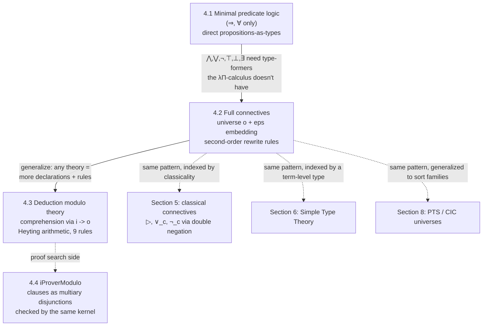

[[book-guidelines|↩ Back to guidelines]]

# Embedding Predicate Logic in a Logical Framework

## Why this section exists

Section 1 of the paper set up five reasons predicate logic, taken by itself, is a poor
substrate for a proof-checking framework: no binders beyond $\forall/\exists$, no
propositions-as-types, no distinction between deduction and computation, no uniform
notion of cut, and a built-in commitment to classical logic. Sections 2–3 built the
tool meant to fix this — the $\lambda\Pi$-calculus modulo theory, i.e. dependent types
plus a global set of user-declared rewrite rules. Section 4 is the first real test:
can you actually *embed* predicate logic — arguably the most conservative, best-understood
logical system there is — into this new machine, and does the embedding buy you anything
beyond a re-implementation?

The answer unfolds in three moves, each solving a problem the previous one couldn't:

1. **4.1** — embed the tiny fragment of predicate logic with only $\Rightarrow$ and
   $\forall$, directly, using propositions-as-types. No rewrite rules needed yet.
2. **4.2** — extend to the full connective set ($\land, \lor, \lnot, \top, \bot, \exists$).
   This is where propositions-as-types genuinely breaks, and the paper introduces a second
   embedding style — a universe of propositions plus an explicit "forgetful" map into
   `Type` — to route around the breakage *without* falling back to a naive, computationally
   inert encoding.
3. **4.3** — generalize from "a fixed logic" to *any* theory over that logic, by observing
   that a theory just *is* its rewrite rules. Worked example: Heyting arithmetic in nine
   rules.

If you're building a type checker or elaborator, the mechanism worth stealing here is not
"how to encode logic" in the abstract — it's the specific move in 4.2, where a definitional
unfolding (a rewrite rule) is used to make a proof-theoretic principle (second-order
comprehension) *computationally transparent* to the kernel, rather than opaque behind an
inductive-type constructor. That's the crux of the whole paper's thesis, and this section is
where you watch it happen for the first time.

---

## 4.1 Minimal predicate logic: propositions as types, no extra machinery

### The setup

"Minimal many-sorted predicate logic" here means: many sorts, arbitrary function and
predicate symbols, but the *only* logical connective is $\Rightarrow$ and the *only*
quantifier is $\forall_s$ (one per sort $s$). This fragment is deliberately anemic — it's
chosen because it maps onto the $\lambda\Pi$-calculus's existing machinery with zero new
declarations. No rewrite rules are needed for this subsection at all; it's pure dependent
typing.

### Language embedding (Definition 9)

Given a language $L$ of predicate logic, build a context $\Sigma$:

- each sort $s$ becomes a variable `s : Type`,
- each function symbol $f$ of arity $\langle s_1,\dots,s_n,s'\rangle$ becomes
  `f : s1 -> ... -> sn -> s'`,
- each predicate symbol $P$ of arity $\langle s_1,\dots,s_n\rangle$ becomes
  `P : s1 -> ... -> sn -> Type`.

That last line is the whole trick, and it's worth pausing on. A predicate of arity $n$
doesn't become a function returning a boolean, or a proposition-valued term — it becomes a
**type family**, indexed by its arguments. `P(c)` isn't "true or false depending on `c`";
it's *a type*, and that type's inhabitants (if any) are exactly the proofs that `P(c)` holds.
This is propositions-as-types (Curry–Howard) applied at the level of predicate logic itself,
before any connective is even in the picture.

### Term and proposition embeddings (Definitions 10, 12)

Terms embed structurally: $|x| = x$, $|f(t_1,\dots,t_n)| = (f\,|t_1|\,\dots\,|t_n|)$ —
this is just "write the term as an applied $\lambda\Pi$-term," nothing logic-specific yet.

Propositions embed as *types*:

$$
\|P(t_1,\dots,t_n)\| = (P\,|t_1|\,\dots\,|t_n|), \qquad
\|A \Rightarrow B\| = \|A\| \to \|B\|, \qquad
\|\forall_s x\,A\| = x{:}s \to \|A\|
$$

Implication becomes the function-type arrow. Universal quantification becomes a dependent
product. There is no separate "proposition" sort at this stage — `∥A∥` is literally a
`Type`, constructed the same way you'd construct the type of a polymorphic function.

### The central result: Theorem 14

Lemma 11 and Lemma 13 are routine (embedding a well-sorted term/proposition produces a
well-typed $\lambda\Pi$ term/type — proved by structural induction). The payoff is
**Theorem 14 (Proof embedding)**: for a sequent $A_1,\dots,A_n \vdash B$ in the source logic,

$$
A_1,\dots,A_n \vdash B \text{ has a Natural Deduction proof}
\iff
\exists\,\pi.\ \Sigma,\Gamma_1,\Gamma_2 \vdash \pi : \|B\|
\iff
\exists\text{ normal } \pi.\ \Sigma,\Gamma_1,\Gamma_2 \vdash \pi : \|B\|
$$

This is the adequacy theorem you'd expect from any propositions-as-types encoding: proof
search in the source logic is *literally* type inhabitation in the target calculus, and you
additionally get that a *normal-form* inhabitant suffices — normalization in the calculus
corresponds to cut-elimination / proof normalization in Natural Deduction. The paper's
worked example: $\forall_T x\,(P(x)\Rightarrow P(x))$ embeds to `x:T -> (P x) -> (P x)`, and
its proof is the term `x:s => a:(P x) => a` — literally the identity function, because the
proof of "P(x) implies P(x)" *is* the identity on proofs of P(x).

```
def Thm : x : s -> (P x) -> (P x) := x : s => a : (P x) => a .
```

**What breaks without this:** if you tried to encode predicates as `Type`-valued booleans
(`P : s1 -> ... -> sn -> Bool`) instead of type families, you'd get a *decision procedure*
representation, not a *proof* representation — you could ask "is `P(c)` true" but a `true`
answer wouldn't carry a certificate. The whole point of propositions-as-types is that
inhabitation *is* the certificate, and the kernel's ordinary type-checker (which you need
anyway) becomes your proof-checker for free.

### A subtlety worth internalizing early: propositions are types, not vice versa

The paper flags this immediately, and it becomes load-bearing in 4.2: `∥B∥` is a type (it
has type `Type`), but not every term of type `Type` is a `∥B∥` for some proposition `B`. A
sort `s` itself has type `Type`, but there's no proposition `B` with `s = ∥B∥`. So
"propositions" is a subset of "types," picked out by which types arise from the translation
— at this stage, an *implicit*, unenforced subset. Section 4.2 will make this subset
**explicit** as a syntactic invariant, which is exactly what's needed once the type system
itself can't express the connectives you want.

---

## 4.2 Constructive predicate logic: why propositions-as-types breaks, and the epsilon fix

### What breaks

The $\lambda\Pi$-calculus, as given, has $\Pi$-types (dependent function types) and nothing
else — no Cartesian product (needed for $\land$), no disjoint union (needed for $\lor$), no
unit type (needed for $\top$), no empty type (needed for $\bot$), and $\exists$ needs a
$\Sigma$-type, which is also absent. Section 4.1's trick — translate the connective directly
onto a built-in type former — has nowhere to go once you're past $\Rightarrow$/$\forall$.

Two ways forward are named:

1. **Deep encoding**: extend the calculus itself with Cartesian products, disjoint unions,
   etc. (add native inductive types to the kernel).
2. **Shallow encoding**: keep the kernel exactly as-is, and use the λΠ-calculus *modulo
   theory*'s rewrite rules to *define* the connectives computationally.

The paper takes route 2, and the "deep vs. shallow" terminology recurs across the whole
survey (it reappears for programming-language embeddings in Section 7) — it's worth fixing
precisely now:

- **Deep encoding** would mean introducing `and : Prop -> Prop -> Prop` as a genuinely new
  primitive type-former, with its own dedicated introduction/elimination rules baked into
  the kernel — the connective is *data* the kernel has special-cased knowledge of.
- **Shallow encoding**, as done here, means `and` is an ordinary declared symbol of type
  `o -> o -> o`, and its *entire logical meaning* is expressed indirectly, via a rewrite rule
  that unfolds `eps (and x y)` into an *already-existing* $\lambda\Pi$-calculus type built
  from `Π` alone. The kernel never needs a special case for "conjunction" — it only ever
  needs to know how to reduce `eps (and x y)`. This is what "preserves binding, typing, and
  reduction" (the property the guidelines flag as central to the whole paper) actually
  means mechanically: the connective's proof theory is compiled down to ordinary $\Pi$-type
  proof theory via computation, not postulated as new kernel primitives.

### The universe `o` and the `eps` embedding (the epsilon embedding)

Concretely: declare a fresh symbol

```
o : Type .
```

and re-target predicate symbols to land in `o` instead of `Type`:

```
s : Type .
P : s -> o .
```

`o` here is a **universe "à la Tarski"** — a *type of codes*, where each code (each term of
type `o`) denotes some other type, but isn't itself that type. To recover the actual type of
proofs from a code, you need a decoding function:

```
def eps : o -> Type .
```

`eps` (epsilon) is that decoding map. `(P c)` is now a term of type `o` — a *name* for a
proposition — and `eps (P c)` is the actual `Type` whose inhabitants are proofs. This is the
**epsilon embedding**, and it's the key structural move distinguishing 4.2 from 4.1:
propositions are no longer directly identified with `Type`-level things; they're a
*designated subtype of `Type`*, reached only through `eps`. Concretely: `imp : o -> o -> o`
is declared, and the rewrite rule

```
[x, y] eps (imp x y) --> (eps x) -> (eps y).
```

says: the proof-space of "$x$ implies $y$" (as a *code*) computes to exactly the ordinary
function-type between the proof-spaces of $x$ and $y$. Nothing new is postulated about
implication — `eps (imp x y)` just *reduces* to the $\Pi$-type you'd have written by hand in
4.1.

**Why not just keep using `Type` directly for connectives, as in 4.1?** Because `Type`
itself has no type-former available for conjunction/disjunction/etc. — you'd be stuck at
exactly the wall described above. Introducing `o` sidesteps that wall: `o` is just an
ordinary uninterpreted type with ordinary function-typed constants (`and : o -> o -> o` is a
completely mundane declaration — no different in kind from declaring `plus : nat -> nat ->
nat`). All the logical content is pushed into what `eps` computes those codes *to*, and
`eps`'s codomain (`Type`) already has everything you need ($\Pi$-types) to express any
connective's proof theory, given enough cleverness in the rewrite rule.

### The conjunction rule: second-order encoding, made shallow

This is the example the guidelines' Key Questions flag explicitly, so it's worth deriving
rather than just quoting.

```
and : o -> o -> o .
[x, y] eps (and x y) --> z:o -> (eps x -> eps y -> eps z) -> eps z .
```

Read the right-hand side as a type: "for every proposition-code $z$, if (assuming a proof of
$x$ *and* a proof of $y$) you can produce a proof of $z$, then you can produce a proof of
$z$." This is precisely the **second-order impredicative encoding of conjunction** familiar
from System F: $A \land B \triangleq \forall Z.\,(A \to B \to Z) \to Z$. If you've written
`type And<A,B> = <Z>(f: (a:A,b:B)=>Z) => Z` in a System-F-flavored language, this is
literally that, restated as a rewrite target.

Why does this work as a *definition* of conjunction, proof-theoretically? Because it exactly
captures conjunction's elimination behavior: "if you have a proof of $A\land B$, you can get
out anything derivable from having *both* $A$ and $B$ as hypotheses" — which is precisely
what the universally-quantified continuation-passing type states. Constructing a term of
this type amounts to providing the pairing function; consuming one amounts to using its
generality at whatever $z$ you currently need.

**Why this is shallow, not deep**: `and` is an ordinary function symbol; the rewrite rule
is an ordinary $\beta$-like reduction the kernel already knows how to fire. Nothing about
the *kernel* changed to accommodate conjunction — the kernel's conversion check
($\equiv_{\beta\Gamma}$ from Section 2) just now also unfolds `eps (and x y)` when it needs
to. A term claiming to prove `eps (and A B)` and a term claiming to prove
`z:o -> (eps A -> eps B -> eps z) -> eps z` are *the same term up to conversion* — the kernel
doesn't distinguish "logic-level equality" from "ordinary definitional equality." That
identification (rather than, say, an isomorphism the user has to invoke by hand) is exactly
what "shallow" buys you: proof terms transport across the encoding for free, under the
kernel's ordinary equality check, with no extra lemma to invoke.

The paper gives the same treatment to the rest of the connectives, and all of them are worth
having side by side because the pattern (each is *some* instance of the "give the
elimination principle, quantified over the goal" schema) is more visible in aggregate:

```
def top : o .
[] eps top --> z:o -> (eps z) -> (eps z).          -- ⊤: trivially provable, no hypotheses to use

def bot : o .
[] eps bot --> z:o -> (eps z).                      -- ⊥: proves *anything* (ex falso), no way to build one

def not : o -> o := x:o => imp x bot .              -- ¬A is *defined*, not primitive: A ⇒ ⊥

def or : o -> o -> o .
[x, y] eps (or x y)
    --> z:o -> (eps x -> eps z) -> (eps y -> eps z) -> eps z .   -- ∨: case-split elimination

def fa_s : (s -> o) -> o .
[y] eps (fa_s y) --> x:s -> eps (y x).              -- ∀: literally a Π-type, sort by sort

def ex_s : (s -> o) -> o .
[y] eps (ex_s y) --> z:o -> (x:s -> eps (y x) -> eps z) -> eps z .  -- ∃: second-order, like ∧/∨
```

Two things worth noticing in this table:

- `not` needed *no* rewrite rule at all — it's an ordinary `Type`-level *definition*
  (`not := x:o => imp x bot`), because negation reduces to implication plus falsity, both of
  which already exist. This is a nice small illustration of "theory = declarations +
  rewrite rules" being flexible enough to also just mean "ordinary function definition"
  when that suffices.
- `fa_s` (universal quantification, now over a general sort `s` rather than hardwired as in
  4.1) unfolds to *exactly* the same $\Pi$-type as in Definition 12 — the epsilon machinery
  doesn't change how $\forall$ behaves, it only had to be introduced because $\land,\lor,
  \exists$ forced `o`/`eps` to exist for the language to be uniform. Once `o` exists, it's
  cheapest to route $\forall$/$\Rightarrow$ through it too (Definitions 15–16), even though
  4.1 shows they didn't strictly need it.

### Language and proposition embedding, generalized (Definitions 15, 16)

The full context $\Sigma$ now carries: sort variables, `o : Type`, function/predicate
symbols (predicates targeting `o`), `top, bot : o`, `not : o -> o`, `imp, and, or : o -> o
-> o`, and for each sort `s`, `fa_s, ex_s : (s -> o) -> o`, plus `eps : o -> Type`.
Proposition embedding is now explicitly two-staged: $|A|$ produces a *code* (a term of type
`o`), and only applying `eps` produces the actual `Type` of proofs — $\|A\| := \text{eps}\,
|A|$. Definition 16 spells out $|A|$ compositionally over all connectives (mirroring the
table above), and Lemma 17 re-establishes well-typedness by structural induction, exactly as
Lemma 13 did for the smaller fragment.

### Theorem 18 and the precise sense in which "propositions ⊂ types"

Theorem 18 restates the adequacy result from 4.1 for the full connective set: a sequent has
a Natural Deduction proof iff there's an inhabiting $\lambda\Pi$-term of `∥B∥`. But now the
paper can say something sharper about the propositions/types distinction than it could in
4.1: **not every type of type `Type` is a `∥B∥`** — `o` itself is a counterexample (it has
type `Type` but there's no `B` with `o = ∥B∥`) — **but every normal term of type `o` equals
`|B|` for some `B`.** In other words: `o` (often called `Prop` or `bool` in other systems) is
*exactly* the type of propositions, and — crucially — this containment is now **explicit and
syntactic**, not merely an informal observation about which encodings you happen to have
used. The type `o` is a genuine *subtype of `Type`* (in the loose, non-technical sense: every
proof-relevant type you reach via `eps` sits inside a designated sub-universe), connected to
`Type` by the one explicit map `eps : o -> Type`. This resolves the tension flagged at the
end of 4.1 (propositions are types, but the "proposition" subset was invisible to the
system) by making the subset a first-class citizen, at the modest cost of one extra
indirection (`eps`) on every use.

**Propositions-as-types vs. the epsilon embedding, side by side:**

| | 4.1 (direct propositions-as-types) | 4.2 (epsilon embedding) |
|---|---|---|
| Connectives available | only $\Rightarrow, \forall$ | full set: $\top,\bot,\lnot,\land,\lor,\forall,\exists$ |
| Proposition's representation | a `Type` directly | a term of type `o` (a *code*) |
| How you get proofs | the type itself | `eps` applied to the code |
| Where logical content lives | the kernel's existing $\Pi$-former | rewrite rules unfolding `eps` |
| "Proposition" as a concept | implicit, unenforced | explicit subtype, via `eps`'s image |
| New symbols needed | none | `o`, `eps`, one symbol per connective/quantifier |

This table is also the answer to the guidelines' first Key Question: you need the separate
universe *precisely because* the $\lambda\Pi$-calculus has no native Cartesian-product,
disjoint-union, unit, or empty type-formers to hang $\land,\lor,\top,\bot,\exists$ on
directly the way 4.1 hung $\Rightarrow,\forall$ on $\Pi$. `o`/`eps` isn't there to make
`⇒`/`∀` nicer — it exists solely to give the *other* connectives somewhere to unfold to.

---

## 4.3 Deduction modulo theory: a theory is just its rewrite rules

Section 4.2 fixed one particular logic. Section 4.3's move is to generalize: once you have
`o`, `eps`, and the connective/quantifier rewrite rules, adding a *mathematical theory* on
top — arithmetic, set theory, whatever — costs nothing structurally new. **A theory just is
a further set of declarations and rewrite rules on top of this base.** This is Deduction
Modulo Theory as advertised in Section 1: deduction (Natural Deduction over $\top,\bot,
\land,\lor,\Rightarrow,\forall,\exists$) and computation (rewriting) sit in the same
system, at the same level, rather than computation being encoded as extra deduction steps.

### Comprehension and its skolemized form

Many theories with a "sort of elements" $\iota$ also want a "sort of classes/sets" $\kappa$
over those elements, governed by a comprehension scheme:

$$
\forall x_1 \dots \forall x_n\, \exists c\, \forall y\, (y \in c \Leftrightarrow A)
$$

— "for any formula $A$ (with parameters $x_1,\dots,x_n$, and $y$ free), there's a class
$c$ whose members are exactly the $y$'s satisfying $A$." Naively this needs a genuinely new
sort $\kappa$ and existential quantification over it. The paper's point: **you don't need
$\kappa$ as a separate primitive sort at all** — represent a "class" directly as its
characteristic predicate, i.e. as a term of type $\iota \to o$ (a function from elements to
proposition-codes), and membership $y \in c$ just *is* application, $c\,y$, unfolded through
`eps`. The existential in the comprehension scheme is discharged by **Skolemization**:
replace $\exists c$ with an explicit function symbol $f_{x_1,\dots,x_n,A}$ producing the
witnessing class directly from the parameters:

$$
\forall x_1 \dots \forall x_n\, \forall y\, (y \in f_{x_1,\dots,x_n,A}(x_1,\dots,x_n) \Leftrightarrow A)
$$

which is now a plain universally-quantified biconditional — expressible with the machinery
already built, no new sort, no new quantifier form. This is a clean illustration of the
paper's broader thesis: because deduction and computation share one substrate, a
proof-theoretic device (Skolemization, normally thought of as a *meta*-level
transformation applied before proof search) becomes just another *definition* sitting in the
theory's rewrite set.

### Worked example: Heyting arithmetic in nine rules

```
nat : Type .

0 : nat .
S : nat -> nat .
def plus : nat -> nat -> nat .
def times : nat -> nat -> nat .
def equal : nat -> nat -> o .
N : nat -> o .
[y] plus 0 y --> y
[x, y] plus (S x) y --> S (plus x y).
[y] times 0 y --> 0
[x, y] times (S x) y --> plus (times x y) y .
[] equal 0 0 --> top
[x] equal (S x) 0 --> bot
[y] equal 0 (S y) --> bot
[x, y] equal (S x) (S y) --> equal x y .
[n] eps (N n) -->
    k:(nat -> o) -> eps (k 0) ->
    eps (fa_nat (y:nat => imp (N y) (imp (k y) (k (S y))))) ->
    eps (k n).
```

The first eight rules are ordinary structural recursion — addition, multiplication, and
(decidable) equality on unary naturals, nothing logic-specific. The ninth, defining `N`
("numberness" — "is a genuine natural number"), is the interesting one, and it's exactly
what the guidelines' third Key Question asks about.

Read `eps (N n)` as: "$n$ is a number" *means* — "for every predicate $k$, **if** $k$ holds
of $0$, **and** $k$ is preserved from $y$ to $S(y)$ whenever $y$ is itself a number, **then**
$k$ holds of $n$." This is mathematical induction, stated as a *second-order, impredicative*
proposition — quantifying over *all* predicates `k : nat -> o`, exactly the same
"quantify-over-the-goal" shape that made `and`/`or`/`ex_s` work in 4.2. There is no
primitive induction principle anywhere in the kernel or in this signature; induction is
*derived* the same way conjunction was derived — as the unfolding of a single rewrite rule.
Compare this to a Rust/typed-functional encoding: it's the Church-encoding of a natural
number's induction principle, `∀P. P(0) → (∀n. N(n) → P(n) → P(S(n))) → P(n)`, except here
it's attached to a *predicate* `N` characterizing "being a number" rather than to the type
`nat` itself — `nat` stays an ordinary two-constructor type, and `N` is a logical layer on
top asserting the induction principle holds of a given `n`.

The paper closes the example by proving $\forall x\,N(x) \Rightarrow (x+0)=x$ directly as a
Dedukti term — worth reading once to see induction actually *used*, not just stated:

```
def tt : eps top := z:o => p:eps z => p .

def k := x:nat => equal (plus x 0) x .

def z_r_neutral : eps (fa_nat (x => imp (N x) (k x)))
                := x:nat => p:eps (N x) =>
                   p k tt (y:nat => q:eps (N y) => r:eps (k y) => r).
```

`p`, the hypothesis `eps (N x)`, is applied — by the unfolded meaning of `N` — as a function
taking the motive `k`, a base-case proof `tt : eps (k 0)`, and a step-case proof, returning
`eps (k x)` — this is literally invoking the induction principle that `N x`'s type *is*, by
supplying `k := λx. plus x 0 = x` as the motive. No `induction` tactic exists in this system;
`p k tt (...)` **is** the induction, made possible only because `N`'s definition was shallow
enough that "having a proof of `N x`" and "having access to `x`'s induction principle" are
definitionally — not just logically — the same fact.

### A brief note on 4.4

Section 4.4 (not the focus here) shows the payoff on the automated-reasoning side:
iProverModulo, an ordered-resolution prover for classical predicate logic extended to
Deduction Modulo Theory, exports its resolution/factoring proofs as Dedukti terms of type
`JCK` (a multiary-disjunction encoding of a clause $C$, generalizing the binary `or` from
4.2), giving an independently-checkable proof for each of 3383 TPTP benchmark problems.
Mechanically it's the same idea as sections 4.1–4.3 one level up: a clause becomes a
proposition via `⌈C⌉`, and a proposition becomes a checkable type via `eps`/`∥·∥` — this
detail matters more for Topic 10 (interoperability), where the point is that a prover's
internal proof format can be made externally auditable by a small trusted kernel; here it's
enough to note the pattern doesn't change as you move from "logic" to "a specific
automated-reasoning engine's proof output."

---

## Synthesis: how this section fits the rest of the paper, and your compiler project

**Structurally**, Section 4 is the template every later embedding in the paper reuses:
Section 5 (classical logic) adds a `▷` connective and negative-translated versions of
exactly these same connectives; Section 6 (Simple Type Theory) reindexes `eps`/`fa_s` by a
term-level `type`; Section 8 (CIC/PTS) generalizes `o`/`eps` to a whole hierarchy of
per-sort universes `U_s`/`e_s`. If Section 4's `o`/`eps`/rewrite-rule pattern doesn't click,
none of the later sections will either — this is genuinely the load-bearing chapter of the
survey.



**For your Focus Areas** (this topic is tagged `type-theory` and `automated-reasoning` in
this book's learning-goals file):

- **Trusted kernel, minimized.** The entire logical content of $\land,\lor,\exists$, and
  even mathematical induction (`N`), is pushed into *user-level* rewrite rules that the
  kernel treats exactly like any other definitional unfolding. Your elaborator's kernel
  never needs a bespoke "is this a valid induction principle" check — it needs one
  conversion checker, applied uniformly. This is the strongest argument in the whole paper
  for keeping your own kernel's trusted computing base to "typing + one confluent/terminating
  conversion relation," and pushing everything else (connectives, induction schemes, even a
  refinement-type's proof obligations) into *rewrite rules the kernel doesn't need to
  understand semantically*.
- **The `eps` embedding as a template for a `Prop`/proof-irrelevant sort.** If your
  refinement-type compiler ever needs a genuine `Prop`-like universe distinct from `Type`
  (e.g. to keep proof terms erasable, or to support proof irrelevance the way Lean does),
  Definitions 15–16 are close to a worked blueprint: a designated code type (`o`), an
  explicit decoding map (`eps`), and connective-by-connective computational unfoldings
  rather than primitive constructors. Lean's own `Prop` sort and its `Decidable`
  typeclass machinery are the closest living analogue — when you write `theorem foo : P ↔
  Q := ...` and Lean unfolds `Iff` definitionally, you're watching the same "shallow
  encoding via unfolding, not primitive connective" move play out in a system you can poke
  at directly.
- **Second-order/impredicative encodings as reusable machinery.** The
  continuation-passing shape `∀z. (hyps → z) → z` that defines `and`, `or`, `ex_s`, *and*
  numberness `N` is exactly the shape you'll meet again doing Miller-pattern unification
  and constraint generation for implicit-argument resolution — recognizing "this rewrite
  rule's right-hand side is a Church-style encoding of an elimination principle" is a
  transferable skill, not paper-specific trivia.
- **Skolemization as ordinary definition, not meta-theory.** The comprehension-to-Skolem-form
  move in 4.3 is a nice concrete instance of "unification/unfolding machinery doing a job
  usually described as a separate proof-theoretic transformation" — a thread the workbench
  goals ask to keep surfacing. Filing Skolem functions as *just more rewrite-rule-defined
  symbols* (rather than as a preprocessing pass external to the logic) is the same instinct
  your CSP/abstract-interpretation kernel will want when it turns existentially-quantified
  invariants into concrete witness-producing functions.

**[[Classical-Logic-via-Double-Negation-Connectives#Where this leads|Where this leads]]:** Section 5 immediately reuses the `o`/`eps` machinery to add classical
connectives *alongside* the constructive ones (rather than replacing them), and every later
embedding in the paper (Simple Type Theory, Pure Type Systems, inductive types with
universes) is a variation on exactly the same "declare a universe, declare an unfolding map,
define connectives by rewrite rule" recipe introduced here.
