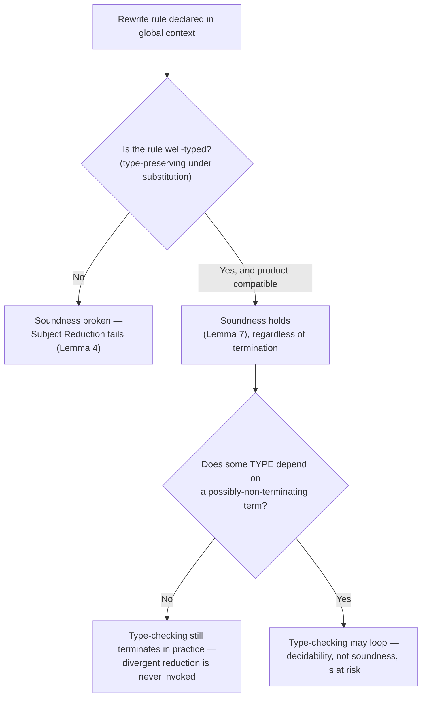

[[book-guidelines|↩ Back to guidelines]]

## Why a proof-checker needs to understand programs at all

Everything up through Section 6 of the paper is about embedding *logics* — predicate logic, classical logic, Simple type theory — into the $\lambda\Pi$-calculus modulo theory. Section 7 makes a jump that looks unrelated at first: it embeds *programming languages*. The motivation is almost embarrassingly simple once stated: rewrite rules, which Section 2 introduced purely as a way to define logical connectives like `and` and `imp`, are Turing-complete. If your framework can already run an unbounded computation, it can already run a program's operational semantics. So instead of treating "logic" and "programs" as different kinds of things Dedukti has to support, the paper treats a programming language's small-step reduction rules as *just another rewrite theory*, declared in the global context exactly like the `and`/`or` rules from Section 4.

Why would you want this? Because of **certified programs** — programs shipped together with machine-checked proofs of their correctness. FoCaLiZe (Section 7.4) is the paper's running example of a system that produces such certificates, and if you want a single trusted kernel (Dedukti) to check proofs coming from Coq, HOL Light, Zenon, *and* FoCaLiZe, then FoCaLiZe's own notion of "this program is correct" has to be expressible as a term Dedukti can type-check. That requires the program itself — not just the logic reasoning about it — to live inside the calculus.

There's an important limitation baked into this from the start, and the paper is explicit about it: because these are **shallow embeddings** (Definition-flavored language reused from Sections 4–6: preserving binding, typing, and operational semantics, but nothing about the *cost* of computing), you can prove *functional* properties of a program (what it outputs) but not *resource* properties (how many steps it takes, how much memory it uses). The embedded `fix` operator computes the right answer; it says nothing about how many rewrite steps it took to get there. If your eventual goal is a verifier that also reasons about complexity, this shallow-embedding boundary is the wall you'd need a different technique to get past — the paper doesn't attempt it here.

## 7.1 The untyped λ-calculus, and why non-termination doesn't sink soundness

### The base encoding

The untyped $\lambda$-calculus embeds almost trivially, because $\lambda\Pi$ already *has* abstraction and application — you're really just wrapping them in fresh constructors so the object-language's terms don't get confused with the meta-language's:

$$|x| = x, \qquad |t\,u| = \mathsf{app}\,|t|\,|u|, \qquad |\lambda x.\,t| = \mathsf{lam}\,(x{:}\mathsf{Term} \Rightarrow |t|)$$

with the signature

```
Term : Type.
lam : (Term -> Term) -> Term.
def app : Term -> Term -> Term.

[f, t] app (lam f) t --> f t.
```

Notice the shape of `lam`: it takes a *meta-level function* `Term -> Term`, not an object-level variable-and-body pair. This is **higher-order abstract syntax** — binding in the embedded language is implemented by reusing the host language's own binding mechanism, so you get alpha-equivalence, capture-avoiding substitution, and beta-reduction of the object language for free from the host's. The single rewrite rule `app (lam f) t --> f t` is then exactly the object language's $\beta$-rule, restated as a Dedukti rewrite rule triggered by matching the constructor pattern `lam f` against the left argument of `app`.

**[[Embedding-Predicate-Logic-in-a-Logical-Framework#What breaks|What breaks]] without this.** If you tried a first-order encoding instead — representing `lam` as binding a de Bruijn index or a named variable directly, the way you'd write an AST type in Rust — you'd have to also implement substitution and alpha-equivalence yourself as separate rewrite rules or algorithms, and then prove *that* implementation correct before you could trust anything built on top of it. Higher-order abstract syntax sidesteps that whole proof obligation by asking the host calculus's own well-established substitution/conversion machinery to do the work. This is precisely the same reason Lean's kernel represents lambda bodies as functions closed over de Bruijn contexts rather than as raw substitution-needing trees — you want *one* substitution engine, at the bottom of the trusted stack, not two.

### Soundness versus termination: the key theoretical point

Here's where the paper makes an observation that's easy to gloss over but is actually the crux of the whole section: **encoding a program's real reduction behavior faithfully will typically produce a non-terminating rewrite system** (because the source language itself may not terminate, or even if it does, encoding it "faithfully" may not preserve termination automatically). Section 2.3 established that Dedukti's decidable type-checking depends on the rewrite system being *effective* — confluent and terminating. So has Section 7 just broken the whole edifice?

No — and the reason is a clean separation the paper draws out explicitly:

> Dedukti's **soundness** (it accepts only well-typed terms) depends only on **product compatibility** (Lemma 7 from Section 2.2.3) — *not* on termination.

Termination only becomes necessary for **decidability of type-checking**, and even then only in one specific spot: the conversion rule, when it needs to check whether two *types* are convertible. If your rewrite system lets a *term* diverge but that term is never itself compared for convertibility as a type (i.e., no other type *depends on* that potentially-non-terminating value), Dedukti's type-checking algorithm never even attempts the diverging reduction — it simply never needs to normalize that subterm to decide well-typedness of anything else.

This is a genuinely important design realization for anyone building a verifier: **soundness and decidability of type-checking are separable properties**, and the thing that actually threatens soundness (ill-typed rewrite rules breaking product compatibility) is a much narrower, more checkable condition than "does this rewrite system terminate." Practically, the paper notes Dedukti's actual conversion-checking strategy — comparing *weak head normal forms* rather than fully normalizing — often succeeds even when full normalization would loop forever, as long as the specific redex needed to expose head-constructor agreement doesn't require diving into the divergent part of the term.



### Worked example: `fix` and `mod2`

The paper gives an explicit fixpoint combinator in the simply-typed setting:

```
type : Type.
arrow : type -> type -> type.
def term : type -> Type.
[A, B] term (arrow A B) --> term A -> term B.

def fix : A : type -> B : type ->
             ((term A -> term B) -> term A -> term B) ->
             term A -> term B.
[A, B, F, a] fix A B F a --> F (fix A B F) a.
```

`fix A B F a` unfolds to `F (fix A B F) a` — literally an infinite unfolding available on demand, one step at a time, exactly the way a lazy fixpoint combinator works in a language like Haskell (or the way you'd implement `Y` using `RefCell`-based knot-tying in Rust if you had to). The rewrite rule for `fix` never terminates as a *rewriting system on its own*, but that's fine: `fix` is never used as a *type*, only as a *value*, so decidable type-checking of anything downstream is unaffected.

The paper then encodes natural numbers (`nat`, `O`, `S`) and a case-dispatcher `match_nat`, and defines `mod2` — parity via structural recursion through `fix` — before checking a concrete instance with the `#CONV` directive:

```
# CONV mod2 (S (S (S (S O)))), O.
```

This asks Dedukti to check that `mod2 4` and `0` are convertible — i.e., to actually *run* the encoded program to a normal form and compare. This is the shallowest possible sense in which Dedukti "executes" the embedded language: convertibility-checking *is* evaluation, since both sides get reduced (here, to weak head normal form and beyond) until they syntactically agree.

**Rust framing.** If you were to build the corresponding piece of a Rust-hosted verifier, this is exactly the moment where your kernel's `is_def_eq`/normalizer has to decide: two terms are "the same" not by structural AST equality but by reducing both (perhaps lazily, to WHNF first) and comparing. A `fix`-like combinator embedded as an opaque recursive function pointer (Rust doesn't have native fixpoint syntax, but you'd model it with a `Rc<dyn Fn(...)>` closure capturing itself, or an explicit `enum Term::Fix(...)` node your evaluator unfolds on demand) is the direct analogue — and the soundness/termination separation above tells you exactly which invariant your normalizer's "don't loop forever" guard actually needs to protect (product/type compatibility), versus which one is "just" an engineering convenience (bounding unfolding depth so `is_def_eq` itself terminates in practice).

## 7.2 The ς-calculus and the preobject technique

### The problem: object records don't decompose

Abadi–Cardelli's $\varsigma$-calculus (specifically its simplest member, $\mathrm{Obj}_1$) models object-oriented programming with **records of methods**. A type is a record type $A ::= [l_i : A_i]_{i \in 1..n}$ (a set of labeled fields, order-irrelevant, so the paper canonicalizes by sorting labels before encoding as an association list). A value is a record of *methods* — each method is bound by a special $\varsigma$ binder that gives the method access to the object it belongs to:

$$a, b, \ldots ::= x \mid [l_i = \varsigma(x_i{:}A)\,a_i]_{i\in 1..n} \mid a.l \mid a.l \Leftarrow \varsigma(x{:}A)\,b$$

(variable; object; method selection `a.l`; method update `a.l ⇐ ς(x:A)b`, which produces a *new* object with method `l` replaced). The self-binder $\varsigma(x{:}A)$ inside method $i$'s body binds a variable of type $A$ — the type of the **whole enclosing object**, not just of the field being defined.

This self-reference is exactly what breaks a naive encoding. If you try to represent an object as a plain dependently-typed list of methods (the obvious first move — a `Cons`-like structure indexed by the record's type), you hit a wall: **a sublist of a well-typed object is not itself well-typed**, because each method's $\varsigma$-annotation refers to the type of the *full* object, not the partial list constructed so far. A Rust analogy: imagine a `struct` where every field's closure captures `&Self` — you cannot type-check field 3 in isolation while fields 4 and 5 haven't been declared yet, because field 3's closure signature mentions the complete struct type. Peeling off a `tail` of the method list the way you would for an ordinary linked list produces something that no longer type-checks as "a partial object," because there's no type for "a partial object" in the first place — only for complete ones.

### The fix: preobjects, tracked by two type parameters

The paper's solution is the **preobject** technique: introduce a type `Preobj A B` where

- `A` is the type of the *full* object being constructed (fixed throughout the construction — every method's $\varsigma$-binder will eventually see this type),
- `B` is the type of the *portion already built* — literally, a type-level accumulator that grows one field at a time as you cons on more methods.

```
Preobj : type -> type -> Type.

prenil  : A : type -> Preobj A typenil.
precons : A : type -> B : type -> l : label -> C : type ->
          (Obj A -> Obj C) -> Preobj A B -> Preobj A (typecons l C B).

def Obj (A : type) := Preobj A A.
```

An object is exactly the special case where the "built so far" parameter `B` has caught up to the "final" parameter `A` — hence `Obj A := Preobj A A`. This is the elegant part: instead of inventing a separate notion of "partial object," the paper defines objects *as* a degenerate preobject, and every intermediate list-construction state along the way is a well-typed value of type `Preobj A B` for the appropriate partial `B`, closing exactly the gap that broke the plain-list approach. Every method inside a `precons` still has type `Obj A -> Obj C` — its self-reference argument really is the *complete* object type `A`, even while `B` (the type tracking "how much has been built") is still under construction. The two-parameter design is precisely what lets `A` be "final and fixed" and `B` be "incremental," at the same time, in the same structure.

**What breaks without the two-parameter split.** If `Preobj` only tracked one type (say, just `B`, the partial type), you'd have no way to state the type of a method's self-reference — it would have to be `Obj B -> Obj C` for the partial `B`, which is wrong: a method planted early in the object still expects to receive the eventual, fully-built object as `self` at call time, not a truncated one. Tracking `A` and `B` separately is what lets the *shape under construction* and the *shape a self-reference expects* diverge during construction and coincide only at the end.

### Selection and update via structural recursion on membership evidence

Selection (`a.l`) and update (`a.l ⇐ ς(x:A)b`) both need to walk down the preobject's list structure to find the labeled method, and both are defined by recursion on a *proof* that the label is present:

```
mem : label -> type -> type -> Type.
athead : l:label -> A:type -> B:type -> mem l A (typecons l A B).
intail : l:label -> A:type -> l':label -> A':type -> B:type ->
         mem l A B -> mem l A (typecons l' A' B).
```

`mem l A B` is an inductive relation ("$(l,A)$ occurs somewhere in the record type $B$"), with two constructors that are exactly the two cases of "found it at the head" versus "recurse into the tail." `preselect`/`preupdate` then pattern-match on a `mem` proof to do their structural recursion — this is doing double duty as *both* a compile-time well-formedness certificate ("this label genuinely exists in this record type") *and* the recursion's decreasing measure, which is a technique worth internalizing on its own: an inductive proof term can simultaneously certify a property and drive the algorithm that needs that property to be well-founded. This is exactly the shape of evidence-carrying recursion you'd reach for in Lean when writing a function over an index into a `Vector` or a `Fin n` — the membership/bound proof *is* the structural decrease Lean's termination checker wants to see, not an extra side condition bolted on afterward.

**Lemma 25 (the payoff).** The paper states — citing Cauderlier's own theorems — that this whole encoding is a genuine *shallow* embedding: it preserves binding, typing, *and* the operational semantics of the simply-typed $\varsigma$-calculus. That's the standard you should hold any such encoding to: not just "well-typed object programs translate to well-typed Dedukti terms," but "the reduction behavior you'd observe in the source language is the reduction behavior you observe after translation," which is what licenses reasoning about the *embedded* program as a faithful stand-in for the *original* one.

## 7.3 ML: destructors for pattern matching, and freezing for recursion

### Destructors as a match-compiler you don't have to write

ML brings three ingredients not yet handled: algebraic datatypes, call-by-value evaluation order, and general recursion. The paper's move for pattern matching is to avoid writing a match-compiler at all (the kind of thing a real ML/Rust compiler does — desegmenting overlapping and nested patterns into a decision tree) by introducing, for each constructor, a dedicated **destructor** symbol that generalizes the if-then-else idiom.

**Definition 26.** For a constructor $C : \tau \to \tau'$, its destructor $\mathsf{destr}_C$ has type

$$R{:}\mathsf{type} \to (\mathsf{eps}\,\tau' \to (\mathsf{eps}\,\tau \to \mathsf{eps}\,R) \to \mathsf{eps}\,R \to \mathsf{eps}\,R)$$

with rewrite rules

```
destrC R (C t)  f d  -->  f t
destrC R (C' t') f d -->  d      (for every other constructor C' of type τ')
```

Read `destrC R scrutinee onMatch onElse` as: "if `scrutinee` is headed by `C`, apply `onMatch` to the payload; otherwise fall through to `onElse`." This is literally `if-then-else` generalized from the two-constructor type `bool = {true, false}` to an arbitrary constructor: `destr_true` *is* the usual conditional, and every other datatype's destructors are the same idea replicated per constructor. Because destructors are **specific to one constructor**, nested patterns (matching two levels deep, as in the FoCaLiZe `mod2` example below) compile to nested destructor applications with no separate compilation pass required — you get exhaustiveness and disjointness "for free" from having one destructor per constructor rather than trying to encode a whole pattern-matrix at once.

**Lemma 27** states this is semantics-preserving: ML pattern matching, translated via destructors, behaves like the source language's pattern matching. This is a genuinely nice engineering insight for anyone writing a Rust or Lean-hosted elaborator that needs to desugar `match` — it says you don't need the full Maranget-style pattern-matching-compilation machinery if your target calculus can express "one destructor per constructor" directly; the complexity of match-compilation is really only needed when your target language *lacks* per-constructor case analysis as a primitive and you have to synthesize it from binary tests.

### The freezing operator `@`: recursion without spurious non-termination on open terms

Recursive ML functions, translated naively as unrestricted rewrite rules, risk looping even on **open terms** — terms containing unresolved variables rather than concrete constructor-headed values — because a rewrite rule's left-hand side might match syntactically before the "real" computation is ready to make progress. The paper's fix is a global "freezing" combinator:

```
@ : A : type -> B : type -> ((eps A -> eps B) -> eps A -> eps B)
```

with, for each constructor $C : \tau \to \tau'$, the rule

$$@\,\tau'\,R\,f\,(C\,t) \longrightarrow f\,(C\,t)$$

`@ τ' R f x` only unfolds once `x` is headed by a constructor — until then, it just sits there, inert, blocking any attempt to trigger the recursive call underneath it. Recursive function definitions insert `@` around every recursive call site in their right-hand side, so a call like `mod2(m)` inside the body of `mod2` becomes (schematically) `@ nat nat mod2 m` — the recursive occurrence stays frozen until its argument `m` is forced to constructor form by the surrounding evaluation, at which point it "thaws" and behaves exactly like an ordinary recursive call.

**What breaks without `@`.** A rewrite theory is checked for confluence and (where required) termination as a *rewrite system on open terms* — matching doesn't wait for a term to be a closed value the way an ML interpreter would. Left uncontrolled, an eager unfolding of every recursive occurrence, applied to a variable rather than a value, produces an infinite rewrite chain that has nothing to do with the source program's actual (terminating, on values) behavior. `@` is exactly a *guard on when unfolding is allowed to fire*, restoring call-by-value-style laziness-until-forced inside a rewriting engine that otherwise has no native concept of "argument not yet evaluated." If you've built or studied a call-by-value evaluator with explicit thunks in Rust (`enum Term { Thunk(Rc<RefCell<...>>), ... }`), `@` is playing the same role as the thunk boundary: it's the mechanism that stops evaluation from crossing into a subterm before the subterm is "ready."

**Lemma 28** closes the loop: if an ML term $t$ evaluates to a value $v$, its translation $|t|$ reduces to $|v|$ — again, the shallow-embedding standard (operational semantics preserved), now specifically for call-by-value evaluation-to-a-value rather than for arbitrary reduction.

## 7.4 FoCaLiZe: where the proof and the program finally meet

FoCaLiZe packages everything above into a real certified-programming workflow: ML as the implementation language, classical predicate logic (Section 5) as the specification language, and lightweight static OO features for modularity — and, crucially, it **delegates most of its proof obligations to Zenon Modulo** (the tableaux prover from Section 5.3), so its proofs arrive in Dedukti "for free" once Zenon Modulo has done the work.

### The worked example, end to end

```
type nat = | Zero | Succ (nat);;

let rec mod2 (n) =
  match n with
  | Zero -> Zero
  | Succ(m) ->
     match m with
       | Zero -> Succ(Zero)
       | Succ(k) -> mod2(k)
;;
```

The nested `match` here is precisely the shape Section 7.3's per-constructor destructors were built to translate directly — `mod2`'s definition becomes a `destr_Succ` inside a `destr_Zero`/`destr_Succ` dispatch, with the recursive call `mod2(k)` frozen by `@`.

The specification introduces `twice` and states the theorem `all n:nat, mod2(twice(n)) = Zero`, proved by induction with two inductive steps, each individually dischargeable as a first-order lemma by Zenon Modulo:

```
theorem mod2_twice_Zero : mod2(twice(Zero)) = Zero
proof = by type nat definition of mod2, twice;;

theorem mod2_twice_Succ :
  all n : nat,
    mod2(twice(n)) = Zero -> mod2(twice(Succ(n))) = Zero
proof = by type nat property mod2_SuccSucc, twice_Succ;;
```

Each of these `by type nat definition/property of ...` hints is exactly a first-order proof-search problem Zenon Modulo can solve on its own — the FoCaLiZe proof *script* is nothing but a set of hints steering which lemmas and unfoldings are in scope, with the actual proof-term construction and Dedukti output produced automatically.

### The gap: non-first-order induction has to be hand-written into Dedukti

The induction principle itself,

```
theorem nat_induction :
  all p : (nat -> bool),
    p(Zero) -> (all n:nat, p(n) -> p(Succ(n))) -> all n:nat, p(n)
proof = assumed;;
```

quantifies over an arbitrary predicate `p : nat -> bool` — a **second-order** statement (a quantifier ranging over predicates, not just individuals). Zenon Modulo is fundamentally a *first-order* tableaux prover (Section 5.3); it has no mechanism to *instantiate* a second-order quantifier like this one, because doing so would require synthesizing the specific predicate `p` to plug in — exactly the kind of higher-order unification problem first-order resolution provers are not built to search. So `nat_induction` is marked `assumed` at the FoCaLiZe specification level, and when it's actually *used* (to conclude `mod2_twice` from its two inductive-step lemmas), FoCaLiZe sidesteps Zenon Modulo entirely and lets the user write the Dedukti proof term by hand, instantiating the induction principle directly:

```
theorem mod2_twice :
  all n : nat, mod2(twice(n)) = Zero
proof =
  dedukti proof
  {* nat_induction mod2_twice_n_is_Zero mod2_twice_Zero mod2_twice_Succ. *};;
```

`nat_induction mod2_twice_n_is_Zero mod2_twice_Zero mod2_twice_Succ` is literally the induction principle applied to the specific motive `mod2_twice_n_is_Zero` (the property "$\mathsf{mod2}(\mathsf{twice}(n)) = 0$" reified as a first-class predicate term) and the two proved base/step lemmas — a completely ordinary dependent-function application, but one a first-order prover cannot discover on its own and a human (or elaborator) has to supply.

This is a very concrete illustration of a **first-order/higher-order boundary** that recurs constantly in automated reasoning: proof *search* for first-order goals can be fully automated, but as soon as a proof obligation quantifies over predicates or types, either you need a higher-order/inductive prover purpose-built for that pattern (Coq's `induction` tactic, Lean's `induction`/`rec` elaboration), or — as FoCaLiZe does here — you drop to the trusted kernel's native term language and construct the instantiation by hand. Scale note from the paper: this combination gets you more than 98% of the FoCaLiZe standard library checked in Dedukti, at 1.89 MB gzipped — the induction-instantiation workaround is evidently rare enough in practice not to be a real bottleneck.

## Where this leads, and how it bears on the compiler project

Structurally, Section 7 is a lateral move rather than a vertical one: it doesn't build on Section 6's Pure-type-system material so much as demonstrate a different capability of the same rewriting infrastructure from Section 2. What it *does* set up is Section 8's treatment of inductive types via primitive eliminators (Gödel's System T style) — `mem`'s two constructors and the `elim_list` eliminator of Section 8.2 are variations on the same idea (an inductive relation or type driving structural recursion via rewrite rules keyed to constructors), and FoCaLiZe's need to hand-instantiate `nat_induction` is a specific instance of the more general question Section 8 answers systematically: how do you give a *primitive*, checkable recursion/elimination principle for an inductive type inside this framework?

For the compiler/elaborator project this vault is tracking (**type-theory** focus area), three things here are directly load-bearing, not just illustrative:

- **The soundness/termination separation** (Lemma 7, product compatibility) is exactly the invariant a Rust-hosted kernel's `is_def_eq`/type-checker needs to protect, and it tells you precisely *where* your normalizer is allowed to be "best-effort" (bounding unfolding, weak-head-only comparison) without endangering soundness — versus where a broken rewrite rule (failing product compatibility) is a hard soundness bug, not a performance one.
- **The preobject technique's evidence-carrying recursion** (`mem` proofs driving `preselect`/`preupdate`) is a template for how a dependently-typed elaborator represents partially-elaborated structures — the same "two type parameters, one fixed target and one growing accumulator" shape reappears anywhere you need to reason about a data structure mid-construction (e.g., a context being built up incrementally during elaboration, or a partially-applied telescope of implicit arguments during unification).
- **The first-order/higher-order proof-obligation boundary** exposed by `nat_induction` is precisely the boundary your planned CSP/automated-reasoning kernel will hit: clause-level, first-order goals are exactly what a resolution/tableaux engine (this project's automated-theorem-prover component) can discharge automatically, while induction-shaped or motive-quantifying obligations will need either a dedicated inductive-proof tactic (as Lean's kernel/elaborator provides) or, in the worst case, the same manual term-construction escape hatch FoCaLiZe uses here.
