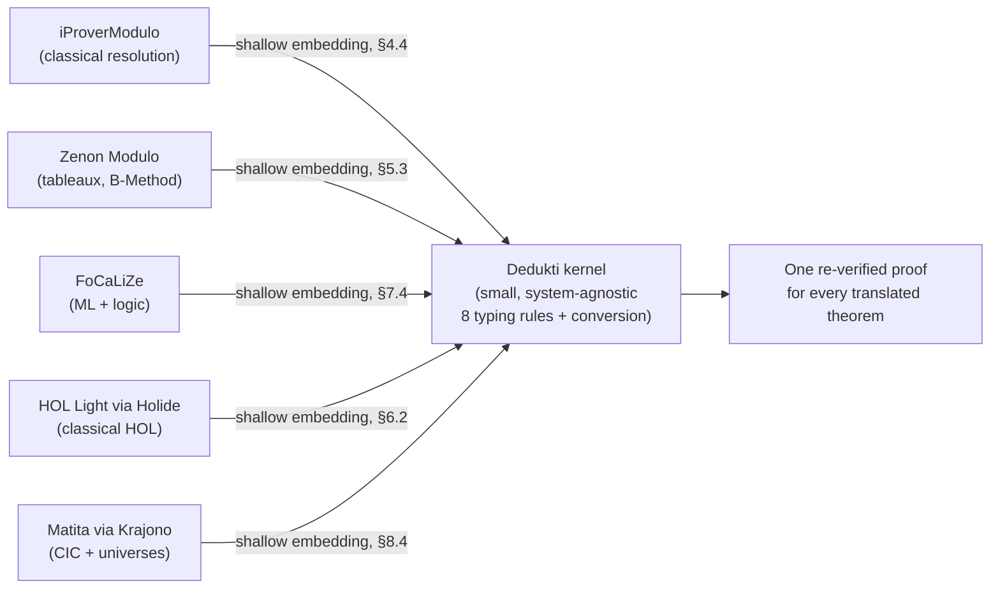

# Interoperability and Reverse Engineering of Proofs

[[book-guidelines|↩ Back to guidelines]]

## Why the paper ends here

Every earlier section of this paper did the same kind of work: take a logical system that was built independently — constructive predicate logic, classical logic, Simple type theory, a Pure type system, a programming language's operational semantics, the Calculus of Inductive Constructions — and show it can be encoded as a $\lambda\Pi$-calculus modulo theory *theory*, i.e. a finite (or schematically-finite) set of symbol declarations and rewrite rules living in Dedukti's global context. Section 10, the paper's conclusion, is where the authors step back and ask: so what did we actually buy by doing all of that?

The answer they give is not "a nice unifying theorem." It's an empirical claim, backed by a table of five numbers, plus a research direction that reframes the entire field's motivating question. That's the content of this topic: interoperability as something you *demonstrate by translating real libraries and having a small kernel check them*, and reverse engineering as the natural next question once you've done that — not "can this proof be expressed here?" but "what is the least this proof actually needs?"

## The problem interoperability solves

Section 1 opened the paper by listing predicate logic's failure as a universal framework: no arbitrary binders, no propositions-as-types, no deduction/computation split, no uniform cut, classical-only. Those five gaps are exactly why the field ended up with *independent, mutually incompatible* systems — HOL Light, Coq, Matita, PVS, B-Method provers, ML-family languages — each solving a subset of the gaps in its own way, with its own kernel, its own notion of proof term, and its own trust boundary.

**[[Embedding-Predicate-Logic-in-a-Logical-Framework#What breaks|What breaks]] without a shared framework:** if you prove a lemma in HOL Light and want to reuse it inside a Coq development, you either re-prove it from scratch in Coq, or you trust a bespoke, one-off translator that nobody else's proofs go through and that itself becomes part of your trusted computing base. There is no shared representation to translate *through* — every pair of systems needs its own bridge, and every bridge is a new thing to trust. This is the $n^2$ integration problem that a common logical framework is meant to collapse into $n$ one-way translations into a single hub.

Dedukti is the paper's candidate hub. The λΠ-calculus modulo theory's job, recall from Section 2, is that a *theory* is nothing more than a finite set of declarations and rewrite rules added to the global context (Section 2.2.4). That means "does system X's logic fit in the framework?" is answerable concretely: write down the rewrite rules, prove the embedding theorem, and check. Sections 4–8 did exactly that, one system at a time. Section 10 is where those individual case studies get read together as evidence for a bigger claim.

## Scale as the actual argument

The paper is explicit that adequacy theorems (Theorems 14, 18, 23, 33 in earlier sections — "provability in system X iff existence of an inhabiting Dedukti term") are necessary but not sufficient. A theorem tells you the encoding is *correct*; it says nothing about whether the encoding is *usable* at the size of real mathematical libraries, where proof terms can be enormous, rewrite systems can have thousands of rules, and a slow or space-hungry embedding is a dead end in practice regardless of what it proves. So the paper's actual validation strategy is: translate the largest available libraries born from these different embeddings, run them through the *same* Dedukti type-checker, and report what happened.

Section 10 collects the results as a table (reproducing the paper's own five rows):

| Library | Source system | Section | Size (gzipped) |
|---|---|---|---|
| iProverModulo TPTP library | classical resolution prover, ~3383 TPTP problems | §4.4 | 38.1 MB |
| Zenon Modulo Set Theory library | B-Method benchmark, 9,994 problems (5.5 GiB source) | §5.3 | 595 MB |
| Focalide library | FoCaLiZe standard library, >98% coverage | §7.4 | 1.89 MB |
| Holide library | HOL Light via OpenTheory (10 MB source) | §6.2 | 21.5 MB |
| Matita arithmetic library | Calculus of Constructions + universes, via Krajono | §8.4 | 1.11 MB |

Two things are worth noticing about this table rather than just its cell values.

First, the five rows are drawn from genuinely disjoint logical starting points: a classical first-order resolution engine, a tableaux prover with set-theoretic axioms, an ML-plus-classical-logic certified-programming environment, a higher-order classical logic with an LCF-style small kernel of its own, and a constructive dependent type theory with cumulative universes. If a single trusted checker can validate all five without per-library hacks to the *checker itself* (the encodings live entirely in the rewrite rules, not in Dedukti's core typing rules), that is a much stronger interoperability claim than any one embedding's adequacy theorem could make alone — it's evidence the framework's expressivity is not an artifact of the toy examples used to state the theorems.

Second, the sizes are the point, not a footnote. A gzipped 595 MB proof library is not something you can spot-check by hand; the only way it gets validated at all is by running it through an automatic checker, which means the checker's soundness is now doing real epistemic work — every one of those millions of proof steps was actually re-verified, not merely translated and assumed correct. That's what "the tool scales up well to very large libraries" (the paper's own phrase) is standing in for: an existence proof that logical-framework-based proof checking is not a research toy.

## The trusted kernel as the mechanism, not just a slogan

Here's the part of the argument that is easy to skim past: *why does routing five unrelated libraries through one checker matter*, beyond being a nice demo? The answer is about the trusted computing base (TCB).

Each source system — iProver, Zenon Modulo, FoCaLiZe's compiler, HOL Light's LCF kernel, Matita's type-checker — has its own soundness argument, proved (if at all) separately, against that system's own metatheory. If you want to *audit* a claim that spans two of these systems (e.g. "this HOL Light theorem and this Matita theorem, combined, imply this consequence"), you either have to trust both kernels and the informal argument connecting their outputs, or you need some third thing that can check both proofs itself.

Dedukti's design is built around minimizing exactly that third thing. Its own core ([[Lambda-Pi-Calculus-and-Its-Typing-Judgments#The eight typing rules|the eight typing rules]] of Section 2.1, plus the conversion rule extended by declared rewrite rules) is small and system-agnostic — it doesn't know about connectives, quantifiers, or type universes at all; those live entirely in *user-declared theories*. That means auditing a translated iProverModulo proof and auditing a translated Matita proof exercise the *same* few hundred lines of kernel code, not two different bespoke checkers. The trust burden shifts from "trust N independently-implemented, independently-audited kernels" to "trust one small, shared kernel, plus N separately-checkable theory declarations (which are just rewrite rules — themselves subject to confluence and termination checks, per Section 2.3)." This is the load-bearing argument beneath the whole "single logical framework" thesis, and it is precisely why Section 10 frames the five-library table as evidence of *auditability at scale*, not just *translatability*.

If your compiler project eventually has a "trusted kernel" versus "elaborator" split — and per the standing project goals it should, since the elaborator does the heavy metavariable-unification work while the kernel just re-checks the result — this is the same architectural instinct scaled up to *inter-system* interoperability: keep the part that must be trusted tiny, and push everything system-specific (connective encodings here, elaboration heuristics there) outside of it, where it's just more re-checkable data.

## Reverse engineering: from "does it fit?" to "what does it need?"

The paper's forward-looking claim is the more interesting one, and it's stated in a single dense paragraph on p. 33 that's worth unpacking carefully:

> "Although HOL Light is a classical system, many proofs of the HOL Light library happen to be constructive. Many proofs in the Matita library do not require the full power of the Calculus of inductive constructions with universes and can be expressed in weaker theories."

This is a genuinely different question from everything Sections 4–8 answered. Those sections asked: *can theory $T$ (classical HOL, CIC-with-universes, …) be embedded in the λΠ-calculus modulo theory?* Reverse engineering asks: *given a specific proof $\pi$ that happens to live inside theory $T$, what is the weakest sub-theory $T' \subseteq T$ that $\pi$ actually uses?*

Why is this a mechanizable question once everything is inside one framework, rather than an informal essay-writing exercise? Because of exactly the definition from Section 2.2.4 that this article's synthesis keeps returning to: **a theory just is a finite set of declarations and rewrite rules in a shared global context.** Once a HOL Light proof has been translated into a Dedukti proof term, "does this proof need classical logic" stops being a question about HOL Light's semantics and becomes a purely syntactic one: *does the proof term, anywhere, use a symbol whose rewrite rules encode a classical (double-negated, Section 5) connective rather than a constructive one?* If it doesn't, the proof term type-checks equally well against the constructive sub-theory with those classical declarations simply removed. Minimality becomes a search problem over which declarations a term's dependency closure actually touches — not unlike computing which axioms a term transitively depends on.

This should land as a familiar move if you've used Lean: `#print axioms foo` walks a checked term's dependency graph and reports exactly the non-constructive axioms it rests on (`Classical.choice`, `propext`, `Quot.sound`), because Lean's kernel already tracks per-declaration dependencies precisely enough to answer that. The paper's "reverse engineering" is the same operation, generalized from "which of a fixed handful of named axioms did you use" to "which subset of an arbitrary, rewrite-rule-defined theory did you use" — and made necessary (rather than a curiosity) because the entire framework is built so that *every* logical feature, not just axioms, is expressed the same way: as declarations and rewrite rules sitting in a context. There's no privileged distinction between "core language feature" and "axiom" to reverse-engineer around — it's declarations all the way down, which is exactly what makes the minimality question uniform and tractable rather than needing bespoke machinery per logic.

**What breaks without this:** without reverse engineering, every translated proof carries its *entire* source theory as a dependency, whether it needed all of it or not — a proof translated out of Matita drags along full cumulative universes and impredicativity even if it's a three-line arithmetic fact that any weaker constructive theory would prove. That inflates the apparent trust requirements of a portable proof and defeats one of the two selling points of predicate logic that Section 1 opened with: proving a lemma in the *weakest sufficient* theory is what lets it be reused across the widest range of contexts later (a proof needing only intuitionistic arithmetic is reusable anywhere a proof needing full CIC-with-universes is not). Interoperability without minimality gets you "everything can be checked in one place"; interoperability *with* minimality gets you "everything can be reused in the smallest place that actually needs it" — which is the more valuable property for a shared library of mathematics.

## Combining lemmas across systems

The paper names reverse engineering as "a first step towards the possibility to use Dedukti to develop complex proofs by combining lemmas developed in several systems," citing a preliminary investigation (Assaf and Cauderlier, "Mixing HOL and Coq in Dedukti," PxTP 2015 — reference [11]) that the paper explicitly flags as **not yet generalized or automated**. This is worth taking at face value rather than reading past it: as of this paper, interoperability at the level of "freely combine a HOL Light lemma and a Coq lemma inside one new proof" is a demonstrated feasibility, not a finished tool. What's missing is exactly what reverse engineering would supply automatically — a systematic way to find the smallest common theory two lemmas from different systems both fit inside, rather than hand-crafting the bridge each time.

This is also a place where the paper is candid about limits elsewhere in the pipeline: proof irrelevance (used throughout Matita, Section 8.4) and universe polymorphism plus modules (used throughout Coq) are named as features "not yet expressed in Dedukti" — which is precisely why the Coq standard library still can't be checked directly at all, and why Krajono's translation of Matita only covers files that avoid explicit proof irrelevance. Interoperability, in other words, is bounded by how much of the λΠ-calculus modulo theory's expressivity work (Sections 4–8) has actually been done, not just by how good the reverse-engineering tooling eventually becomes.

## The historical lineage (Section 9) as a case study in incremental interoperability

Section 9 is a short, deliberately dry attribution section, but it's worth reading against Section 10's thesis rather than skipping as mere acknowledgments. It traces a single dependency chain:

- **Cousineau & Dowek, 2007** — the original λΠ-calculus modulo theory paper, with a partial correctness proof for embedding Pure type systems. Everything downstream depends on this one foundational result.
- **Three successive Dedukti implementations** (Boespflug 2008–2011, Carbonneaux 2012, Saillard 2012–2015) — the engineering of an actual checker capable of running the theorems above at scale, not just stating them.
- **Individually-authored embeddings**, each traceable to a specific thesis: Assaf (2012–2015) for Simple type theory, CIC, and the HOL Light/Matita translations; Burel (2013) for iProverModulo; Halmagrand (from 2013) for Zenon Modulo; Halmagrand, Gilbert, and Cauderlier together for axiom-free classical connectives; Cauderlier (from 2013) for the FoCaLiZe/programs direction.

The point this makes for the interoperability thesis: the "single framework" claim was not designed top-down and then populated — it was built incrementally, one independently-motivated embedding at a time, by different people solving different immediate problems, and it only *became* a general interoperability platform in retrospect, once enough embeddings existed to translate against the same kernel simultaneously. That's a useful data point if you're evaluating how realistic "build one framework, translate everything into it" is as an engineering strategy for your own compiler/verifier project: the paper's own history suggests the framework's generality is closer to an emergent property of accumulating compatible embeddings than something you get by design up front.

## The closing reframing

The paper's very last sentence is the thesis distilled to two competing questions:

> "we hope, with this project, to contribute to the shift of the general question 'What is a good system to express mathematics?' to the more specific questions 'Which definitions, axioms and rewrite rules are needed to prove which theorem?'"

The first question is the one that produced the field's fragmentation in the first place — every system (HOL, Coq, Matita, PVS, ...) is, at bottom, someone's answer to "what is a good system." Answers to that question don't compose: if HOL Light and Coq are both "good systems" by different designers' criteria, there's no way to ask whether a specific theorem needs HOL-Light-ness or Coq-ness, because the question is about whole systems, not about specific theorems.

The second question only becomes askable once Section 2.2.4's move has been made — treating a theory as *nothing but* a finite set of declarations and rewrite rules in a context, all inside one ambient calculus. Under that reduction, "which definitions, axioms, and rewrite rules are needed to prove which theorem" is a well-posed, in-principle-decidable-by-search question about one specific proof term and one specific set of declarations, phrased in a single common syntax. It is the same shift, at the scale of an entire research field, that this article's reverse-engineering section described at the scale of a single library: stop asking "which whole system does this belong to" and start asking "which minimal fragment does this specific proof actually touch."

## Where this leads

This section is the paper's terminus, not a stepping stone to a later section — but its ideas are the ones that matter most for the standing project. A trusted, small kernel checking proof terms produced by translation from many front-ends is exactly the checker/elaborator split a Rust-based verified-compiler toolchain needs (Focus Area: `type-theory`, `automated-reasoning` — trusted kernels, proof certificates, proof reconstruction). Reverse engineering as "find the minimal sub-theory a proof needs" is the same operation, generalized, as computing a minimal set of premises for a Craig interpolant, or minimizing the set of axioms/lemmas a Hoare-triple discharge actually depended on — the searching-over-dependency-closures mechanism transfers directly to minimizing verification-condition proof obligations in an abstract-interpretation or CHC-solving pipeline (Focus Areas: `automated-reasoning`, `sat-smt-csp`). And the paper's own admission that lemma-combination across systems is "not yet generalized or automated" is a candid reminder that the interesting engineering work in this space — turning a feasibility demo into a systematic tool — is still open, which is precisely the kind of gap a purpose-built theorem-prover-plus-elaborator toolchain could be aimed at closing.
