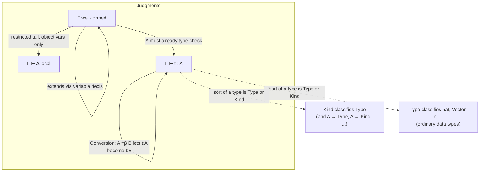

[[book-guidelines|↩ Back to guidelines]]

## Why bother with a "logical framework" at all

Start from the problem the paper actually opens with, not from the calculus. Suppose you want to formalize arithmetic, or set theory, or some programming language's type system. The traditional move is predicate logic: pick function and predicate symbols, write down axioms, done. This buys you three things for free, once and for all, instead of per-theory: the connectives ($\land,\lor,\forall,\dots$) and their deduction rules are already defined; soundness and completeness are already proved; and because every theory lives inside the *same* ambient logic, you get a partial order between theories for free — Zermelo–Fraenkel set theory with choice (ZFC) is just ZF plus one more axiom, so every ZF theorem is automatically a ZFC theorem, and you can meaningfully ask "is this ZFC theorem already provable in ZF?" You also get free interoperability: if $T$ is a theory in language $L$, $T'$ a theory in language $L'$, and $A\Rightarrow B$ is provable in $T$ while $A$ is provable in $T'$, then $B$ is provable in the union $T\cup T'$ — lemmas cross theory boundaries as long as they share a common logical substrate.

None of that is available if every logical system is its own island. And in practice, several major systems — Simple type theory / Higher-order logic, Martin-Löf's Intuitionistic type theory, the Calculus of Constructions, the Calculus of Inductive Constructions — were *not* built as theories inside predicate logic. They were built as independent formalisms with their own bespoke notions of term, proof, and proof-checker. The practical cost of that independence is exactly the cost you'd expect if you've ever tried to port a Coq proof into Lean, or an SMT certificate into a Rust verifier by hand: a proof developed in one system cannot be reused in another without redeveloping it, and lemmas proved in different systems cannot be combined at all. The paper calls this "a tower of Babel."

**[[Embedding-Predicate-Logic-in-a-Logical-Framework#What breaks|What breaks]] without a shared framework.** This isn't an abstract inconvenience — it's the entire reason the "interoperability" and "reverse engineering of proofs" agenda in the later sections of this paper (and much of the automated-reasoning literature on proof certificates and trusted kernels) exists at all. If your target is a single small trusted kernel that can check proofs coming from Coq, Lean, an SMT solver, *and* your own refinement-type compiler, you need one calculus expressive enough to *host* all of their proof objects — otherwise "checking a proof" degenerates into "re-implementing every source system's own checker."

### Why predicate logic itself can't be that framework

The paper is precise about *why* the historical formalisms didn't just stay inside predicate logic — it lists five specific expressiveness gaps:

1. **No binders beyond $\forall,\exists$.** You cannot define a function symbol that binds a variable in its own argument (there's no way to write something like a $\lambda$ inside predicate logic's syntax).
2. **No propositions-as-types.** There's no notion of "a proof $\pi$ of proposition $A$ is a term of type $A$" — proofs and terms live in disjoint universes.
3. **No deduction/computation distinction.** Peano arithmetic's $2\times 2 = 4$ has to be *proved* via a chain of deduction steps, because predicate logic has no built-in notion of *computing* $2\times2$ down to $4$ and then just checking syntactic identity.
4. **No uniform notion of cut.** Unlike "proof" or "model," which are defined once for all of predicate logic, "cut" (the logical analogue of function composition / lemma application) has to be redefined per theory.
5. **Classical only.** Constructive theories need a different ambient logic entirely.

The **Logical framework** (also called the $\lambda\Pi$-calculus, or the $\lambda$-calculus with dependent types) is an extension of predicate logic that solves gaps 1 and 2 — that's the whole subject of this article. **Deduction modulo theory** is a separate extension solving gaps 3 and 4 (rewrite rules as the "computation" half of proof search — that's the next topic in this series). Combine the two and you get the **$\lambda\Pi$-calculus modulo theory**, a variant of Martin-Löf's logical framework, solving four of the five gaps at once. Gap 5 (classical vs. constructive) is handled separately, by a device layered *on top* of this calculus rather than baked into it (covered under "Classical Logic via Double-Negation Connectives" later in the paper).

So the $\lambda\Pi$-calculus's entire reason for existing, in this paper's framing, is: *give predicate logic general-purpose binders, and give it the propositions-as-types principle.* Everything in the formal system below is in service of exactly those two things.

## The core idea: types can depend on terms

Here is the intuitive content before any symbol-pushing. In the simply typed $\lambda$-calculus, a function type $A\to B$ is fixed once $A$ and $B$ are fixed — every input of type $A$ produces an output of the *same* type $B$, no matter which particular value of type $A$ you plugged in. That's already not expressive enough for the propositions-as-types idea to pay off: if a proof of $\forall x\,P(x)$ is going to be a function taking an arbitrary element $x$ to a proof of $P(x)$, the *codomain type* — "proof of $P(x)$" — genuinely depends on the *specific value* of $x$ you fed in. You cannot express that with a fixed $A \to B$ arrow.

The $\lambda\Pi$-calculus's answer is to let the return type of a function vary with the argument's value. Concretely (using an example that recurs throughout this paper and the Dedukti literature): imagine `Vector n`, "the type of length-`n` vectors." As soon as `n` is a term (`0`, `3`, a variable, whatever) rather than a fixed compile-time constant, `Vector` is a function from terms to types — `Vector 3` and `Vector 4` are *different* types, both produced by applying the same symbol `Vector` to different arguments. This is precisely the generalized binder that gap 1 was missing: `Vector` binds its argument the way $\forall$ and $\exists$ do, except now the "quantifier" is a plain function symbol, and it produces a *type*, not a proposition.

Once you allow this, the ordinary arrow $A\to B$ generalizes to a **dependent product** $\Pi x:A\;B$, read "the type of functions that, given `x : A`, return a value of type `B`, where `B` may itself mention `x`." When `B` doesn't actually mention `x`, $\Pi x:A\;B$ degenerates back to the ordinary arrow $A\to B$ — dependent products are a strict generalization, not a replacement.

```rust
// The non-dependent Rust intuition — fixed codomain regardless of the argument value:
fn head<T>(v: Vec<T>) -> T { /* ... */ }

// The dependent intuition Rust *can't* type-check directly: the return type is a
// function of the *value* n, not just of a type parameter. This is exactly what
// Idris/Agda/Lean's `Vect n a` gives you and Rust's const generics only approximate
// (and only for `n : usize`, never for an arbitrary dependently-typed index):
// tail : Πn:nat. Vector (S n) -> Vector n
```

```lean
-- Lean 4: this is the literal, executable version of "Vector n" from the paper's
-- own running example. `Vector.tail` genuinely has a type that depends on the
-- *value* n, which is exactly what a non-dependent arrow cannot express.
def Vect (α : Type) : Nat → Type
  | 0     => Unit
  | n + 1 => α × Vect α n

def Vect.tail {α : Type} {n : Nat} : Vect α (n + 1) → Vect α n
  | (_, xs) => xs
```

## Two sorts: `Type` and `Kind`

Once types are themselves terms that can be passed around and depended upon, you need a type *for* `Type` — otherwise you can't even state "`Vector` is a function from `nat` to `Type`," because that sentence needs `Type` to be classifiable as *something*. The paper introduces exactly one extra sort for this, called $\mathit{Kind}$, whose entire job is to type $\mathit{Type}$ itself, and things built from it like $A \to \mathit{Type}$.

**What breaks without a separate `Kind`.** The naive move — declare $\mathit{Type} : \mathit{Type}$ — is the single most infamous shortcut in type theory: it is inconsistent (it lets you reconstruct Girard's paradox, the type-theoretic analogue of Russell's paradox, letting you build a term of any type including `False`). Introducing a distinct sort $\mathit{Kind}$ to classify $\mathit{Type}$, while leaving $\mathit{Kind}$ itself unclassified (there is no rule giving $\mathit{Kind}$ a type), is the paper's way of avoiding that trap while still keeping the object language uniform: `nat : Type`, `Type : Kind`, and `nat -> Type` (the type of `Vector`) is also classified by `Kind`, not by `Type` — it's one level "too high" to be an ordinary data type.

This is the two-sort skeleton of a Pure Type System with sorts $\{\mathit{Type},\mathit{Kind}\}$; later sections of the paper (Sections 8.1 and 8.3, on Pure type systems and cumulative universe hierarchies) generalize this to an infinite tower $U_0 \subseteq U_1 \subseteq \cdots$ for systems like the Calculus of Constructions — but the two-sort version here is the minimal case, and everything about the *shape* of the typing rules below survives that later generalization unchanged.

## Judgments: what the rules are rules *about*

Before reading the typing rules themselves, it's worth being explicit about what a *judgment* is, since this is exactly the "shared ancestor of a type checker and a proof checker" idea worth internalizing early. A judgment is a claim the system can derive evidence for — a *typed fact*, distinct from a term or a type. The $\lambda\Pi$-calculus has two judgment forms:

- $\Gamma \text{ well-formed}$ — "the context $\Gamma$ is a legitimate sequence of variable declarations." This is not decoration: since later declarations can depend on the types of earlier ones (that's the whole point of dependent types), a context can itself be ill-formed, e.g. if a declared type isn't itself well-typed.
- $\Gamma \vdash t : A$ — "under context $\Gamma$, term $t$ has type $A$." This is the ordinary typing judgment, generalized so that $A$ can be *either* $\mathit{Type}$, $\mathit{Kind}$, an ordinary type like `nat`, or a dependent type like `Vector n`.

If you've built (or read the source of) a type checker before, this pairing should look familiar even if you've never seen it phrased as "judgments": a well-formedness check on the environment (are these declarations even legal in sequence?) plus a typing relation on terms *inside* that environment is exactly the shape of `check_env` + `infer`/`check` in any real implementation. The paper is explicit that this is a deliberate departure from "the usual typing judgments" alone — well-formedness of the *context* is elevated to its own first-class judgment precisely because dependency makes contexts fallible in a way they aren't in simply-typed systems.

```rust
// The judgment-as-data-structure translation. `Ctx` corresponds to Γ; a `Ctx` being
// well-formed corresponds to every entry in it type-checking against its prefix.
// `infer` corresponds to the synthesizing direction of Γ ⊢ t : A (see the
// bidirectional discussion below); a well-formed context is a *precondition*,
// not something checked again on every call.
struct Ctx(Vec<(String, Term)>); // Γ = x1:A1, x2:A2, ...

fn infer(ctx: &Ctx, t: &Term) -> Result<Term, TypeError> { /* Γ ⊢ t : A, synthesizing A */ }
fn check(ctx: &Ctx, t: &Term, expected: &Term) -> Result<(), TypeError> { /* Γ ⊢ t : A, checking against a given A */ }
```

## Local vs. global contexts

The paper's Section 2.2.1 draws a distinction inside "context" that matters as soon as rewrite rules enter the picture (the next topic in this series), but which is worth planting here since it's a property of *contexts*, not of rewriting: a **global context** $\Gamma$ can contain both variable declarations *and* rewrite rules, while a **local context** $\Delta$ contains *only object-variable declarations* — declarations whose type itself has type $\mathit{Type}$ (not $\mathit{Kind}$). A third judgment, $\Gamma \vdash \Delta\text{ local}$, expresses "$\Delta$ is a legal local context relative to the ambient global context $\Gamma$":

$$
\dfrac{\Gamma \text{ well-formed}}{\Gamma \vdash [\,] \text{ local}}
\qquad\qquad
\dfrac{\Gamma \vdash \Delta \text{ local}\quad \Gamma,\Delta \vdash A : \mathit{Type}}{\Gamma \vdash \Delta, x:A \text{ local}}
$$

The point of the distinction: a rewrite rule's own local variables (the ones that will get instantiated by matching, like `n`, `m`, `a`, `l` in a rule about `Vector`) are always *object* variables — never type-family variables of kind $\mathit{Kind}$ — so restricting $\Delta$ to object declarations is exactly the restriction rewrite-rule contexts need. Lemma 1 records the sanity check that this restriction doesn't lose anything semantically: if $\Delta$ is local in $\Gamma$, then $\Gamma,\Delta$ is itself a perfectly good (well-formed) global context — a local context is just a way of saying "this tail segment of the context happens to only contain object variables," not a different kind of thing. The well-formedness judgment for global contexts is extended, in parallel, with one more rule to allow declaring a rewrite rule alongside a local context:

$$
\dfrac{\Gamma \text{ well-formed}\quad \Gamma \vdash \Delta \text{ local}}{\Gamma,\, l \longrightarrow_\Delta r \text{ well-formed}}
$$

Note what this rule *doesn't* require: at this stage $l$ and $r$ don't need to have any particular type, or even be well-typed at all — that's a deliberate simplification the paper makes here, before tightening it up once rewriting's interaction with typing is analyzed (that tightening — well-typed rules, product compatibility, subject reduction — is the subject of the next topic, "The λΠ-Calculus Modulo Theory"). For the pure $\lambda\Pi$-calculus (no rewrite rules at all), every context is trivially just a sequence of variable declarations, and the local/global distinction is invisible — it only becomes load-bearing once rules are added.

## The eight typing rules

Here is the complete rule set for the plain $\lambda\Pi$-calculus (Section 2.1), before any rewrite rules exist. Each rule is presented with its book-native form first, then unpacked.

**Well-formedness of the empty context.**
$$
\dfrac{}{[\,]\text{ well-formed}}
$$
The base case: the empty context is trivially legal. In a real implementation this is just "an empty environment type-checks," not worth a runtime check at all.

**Declaration of a type or type-family variable**, and **declaration of an object variable** — these are the two ways a context can grow:
$$
\dfrac{\Gamma \vdash A : \mathit{Kind}}{\Gamma, x:A \text{ well-formed}}
\qquad\qquad
\dfrac{\Gamma \vdash A : \mathit{Type}}{\Gamma, x:A \text{ well-formed}}
$$
These are the rules that make context well-formedness genuinely non-trivial under dependent types: you can only *add* `x : A` to the context if `A` itself already type-checks (against `Type`, for an ordinary object variable like `n : nat`, or against `Kind`, for a type-family variable like `Vector : nat -> Type`). This is exactly the "what breaks without it" case for context well-formedness as its own judgment: without this check, nothing would stop you from writing a context that declares `x : garbage` for some `garbage` that isn't even a legal type — the whole calculus would be typing "facts" relative to nonsense.

**The `Type` rule.**
$$
\dfrac{\Gamma \text{ well-formed}}{\Gamma \vdash \mathit{Type} : \mathit{Kind}}
$$
This is the rule that actually classifies `Type` — it's how you know `nat -> Type` (needed to type `Vector`) lands in `Kind` rather than being unclassifiable.

**Variable.**
$$
\dfrac{\Gamma \text{ well-formed}\qquad x:A\in\Gamma}{\Gamma \vdash x : A}
$$
Lookup — a term is well-typed at exactly the type its declaration says, no more, no less (until the conversion rule below lets you *reclassify* that type up to definitional equality).

**Product, for kinds and for types** — two rules with parallel shape, differing only in whether the *codomain* $B$ lives in $\mathit{Kind}$ or $\mathit{Type}$:
$$
\dfrac{\Gamma \vdash A : \mathit{Type}\qquad \Gamma, x:A \vdash B : \mathit{Kind}}{\Gamma \vdash \Pi x:A\; B : \mathit{Kind}}
\qquad\qquad
\dfrac{\Gamma \vdash A : \mathit{Type}\qquad \Gamma, x:A \vdash B : \mathit{Type}}{\Gamma \vdash \Pi x:A\; B : \mathit{Type}}
$$
Note the asymmetry: $A$, the *domain*, is always required to have type $\mathit{Type}$ in both rules (you can't quantify over a whole type-family/kind as the domain of a dependent product in this system — only over object-level types). The *codomain* $B$ can be either a $\mathit{Kind}$ (giving you, e.g., `nat -> Type`, the type of `Vector` itself) or a $\mathit{Type}$ (giving you, e.g., `Vector n -> Vector n`, an ordinary function type between two concrete vector types). This is precisely what lets a single symbol like `Vector` exist one level up from the vectors it classifies.

**Abstraction, for type families and for objects** — again a parallel pair, distinguished by whether the codomain sort is $\mathit{Kind}$ or $\mathit{Type}$:
$$
\dfrac{\Gamma \vdash A:\mathit{Type}\quad \Gamma,x:A\vdash B:\mathit{Kind}\quad \Gamma,x:A\vdash t:B}{\Gamma\vdash \lambda x{:}A\;t : \Pi x{:}A\;B}
\qquad\qquad
\dfrac{\Gamma \vdash A:\mathit{Type}\quad \Gamma,x:A\vdash B:\mathit{Type}\quad \Gamma,x:A\vdash t:B}{\Gamma\vdash \lambda x{:}A\;t : \Pi x{:}A\;B}
$$
This is ordinary $\lambda$-introduction, generalized so the body's type $B$ (and hence the whole $\lambda$'s type, the dependent product) can mention the bound variable $x$.

**Application.**
$$
\dfrac{\Gamma\vdash t : \Pi x{:}A\;B\qquad \Gamma\vdash t' : A}{\Gamma\vdash (t\;t') : (t'/x)B}
$$
This is where dependency actually *bites*: the result type isn't $B$ as written, it's $B$ with the bound variable $x$ **substituted** by the concrete argument $t'$. Applying `tail` (of type $\Pi n{:}\mathit{nat}\;(\mathit{Vector}(S\,n) \to \mathit{Vector}\,n)$) to the literal `3` doesn't just give you "a function into `Vector`-something" — it gives you a function of the fully concrete type `Vector 4 -> Vector 3`. Substitution is the mechanism that makes "the type depends on the value" cash out operationally, and it's exactly the piece of plumbing that recurs, under different names, in every later stage of a dependent type checker (instantiating a $\Pi$-type at a metavariable during elaboration is the same substitution, just deferred).

**Conversion** — two variants, one for each sort the type itself can inhabit:
$$
\dfrac{\Gamma\vdash t:A\qquad \Gamma\vdash A:\mathit{Type}\qquad \Gamma\vdash B:\mathit{Type}\qquad A\equiv_\beta B}{\Gamma\vdash t:B}
\qquad\qquad
\dfrac{\Gamma\vdash t:A\qquad \Gamma\vdash A:\mathit{Kind}\qquad \Gamma\vdash B:\mathit{Kind}\qquad A\equiv_\beta B}{\Gamma\vdash t:B}
$$
Covered in its own section below — this is the rule that makes the whole system usable in practice.

### A worked derivation: why `Vector` needs `Kind`, concretely

Take the running example from the paper itself (used again once rewrite rules are introduced): a context with `nat : Type`, and we want to justify declaring `Vector : nat -> Type`. Here is the actual derivation, rule by rule, of $\Gamma \vdash \mathit{nat} \to \mathit{Type} : \mathit{Kind}$ (writing $\mathit{nat}\to\mathit{Type}$ for $\Pi\_{:}\mathit{nat}\;\mathit{Type}$, since `Type` doesn't depend on the bound variable):

$$
\dfrac{
  \dfrac{\Gamma\text{ well-formed}}{\Gamma\vdash \mathit{nat}:\mathit{Type}}\;(\text{Variable})
  \qquad
  \dfrac{\Gamma,\_{:}\mathit{nat}\text{ well-formed}}{\Gamma,\_{:}\mathit{nat}\vdash \mathit{Type}:\mathit{Kind}}\;(\mathit{Type})
}{
  \Gamma \vdash \Pi\_{:}\mathit{nat}\;\mathit{Type} : \mathit{Kind}
}\;(\text{Product, for kinds})
$$

This derivation is only *legal* because the Product-for-kinds rule exists and specifically targets $\mathit{Kind}$ as the sort of the result. Had there been only a single sort $\mathit{Type}$ (the $\mathit{Type}:\mathit{Type}$ shortcut mentioned above), this same derivation would conclude $\Gamma\vdash \mathit{nat}\to\mathit{Type} : \mathit{Type}$ instead — which sounds harmless until you notice it now puts `Vector`'s own type at the *same level* as the vectors it classifies, opening the door to self-referential constructions (a type containing itself as a possible value) that are exactly the seed of Girard's paradox.

## Reading the rules bidirectionally

Every one of the eight rules above can be read through a **bidirectional typing** lens, even though the paper doesn't use that vocabulary itself — and it's worth doing explicitly, because it's the shape a real type-checker implementation actually takes (and it's the same split a proof-search procedure needs: "what can this term's type be inferred to be?" vs. "does this term have that specific type?").

- **Synthesizing (inferring) rules** — the conclusion's type is *read off* from the premises without being given in advance: `Variable` (look up the declared type), `Type` (always produces `Kind`), `Product` (always produces `Type` or `Kind`, chosen by which rule fires), `Application` (compute $(t'/x)B$ from $t$'s inferred $\Pi$-type). These are the rules you'd implement as `infer(ctx, term) -> Type`.
- **Checking rules** — the conclusion's type is a *given*, checked against, not computed: `Abstraction` is the clearest case — you cannot infer the type of a bare $\lambda x{:}A\;t$ without already knowing what $B$ (the codomain) is supposed to be, because the rule's premises need $B$ to check $t:B$. In practice, a $\lambda$ is only ever type-checked *against* an already-known $\Pi x{:}A\;B$ (from an expected type, or a type annotation) — this is the textbook symptom that motivates splitting a bidirectional system into `infer` and `check` in the first place.
- **`Conversion`** is the rule that *bridges* the two directions: it lets a term whose type was *synthesized* as $A$ be reused somewhere that *expects* $B$, provided $A$ and $B$ agree up to $\equiv_\beta$. Structurally, this is exactly the role `isDefEq` plays inside Lean's kernel and elaborator: whenever `check` needs to compare an inferred type against an expected one, it doesn't ask for syntactic identity, it asks the definitional-equality oracle.

```rust
enum Term {
    Var(String),
    Type,                                   // Type : Kind
    Pi(String, Box<Term>, Box<Term>),       // Πx:A. B
    Lam(String, Box<Term>, Box<Term>),      // λx:A. t   (A is the annotation)
    App(Box<Term>, Box<Term>),
}

// Synthesizing direction: Γ ⊢ t : A, producing A.
fn infer(ctx: &Ctx, t: &Term) -> Result<Term, TypeError> {
    match t {
        Term::Var(x) => ctx.lookup(x),                       // Variable
        Term::Type   => Ok(Term::Kind),                      // Type
        Term::Pi(x, a, b) => {
            check(ctx, a, &Term::Type)?;
            let sort = infer(&ctx.extend(x, a.clone()), b)?; // Kind or Type
            Ok(sort)                                          // Product (either variant)
        }
        Term::App(t1, t2) => match infer(ctx, t1)? {
            Term::Pi(x, a, b) => {
                check(ctx, t2, &a)?;
                Ok(substitute(&b, &x, t2))                    // Application: (t'/x)B
            }
            other => Err(TypeError::ExpectedPi(other)),
        },
        Term::Lam(..) => Err(TypeError::CannotInferLambda),  // can't synthesize a bare λ
    }
}

// Checking direction: Γ ⊢ t : A, given A up front.
fn check(ctx: &Ctx, t: &Term, expected: &Term) -> Result<(), TypeError> {
    match t {
        Term::Lam(x, a, body) => match expected {
            Term::Pi(_, pi_a, pi_b) => {
                check(ctx, a, &Term::Type)?;
                convertible(a, pi_a)?;                        // Conversion, applied to the domain
                check(&ctx.extend(x, a.clone()), body, pi_b)  // Abstraction
            }
            other => Err(TypeError::ExpectedPi(other.clone())),
        },
        _ => {
            let inferred = infer(ctx, t)?;
            convertible(&inferred, expected)                  // Conversion
        }
    }
}
```

## The conversion rule and definitional equality

Consider what happens *without* conversion. Suppose `plus : nat -> nat -> nat` and you've computed `plus 2 2` down to `4` via some notion of reduction, and you have a term `p : Vector (plus 2 2)`. If `Vector (plus 2 2)` and `Vector 4` were only *identical* when *syntactically* identical, `p` could never be used anywhere that expects a `Vector 4` — even though every reasonable notion of "these are the same type" says they obviously are the same. Since dependent types put ordinary terms inside types (`plus 2 2` is sitting right there as an index of `Vector`), *some* notion of term equality has to be lifted into type equality, or the whole system becomes unusable the moment any computation happens inside a type.

That's exactly the job of the conversion rule: it lets $\Gamma \vdash t:A$ be re-derived as $\Gamma\vdash t:B$ whenever $A$ and $B$ are **$\beta$-convertible** ($A \equiv_\beta B$) — i.e., they reduce to a common term via $\beta$-reduction (the usual $(\lambda x{:}A\;t)\;t' \to (t'/x)t$ rule of the $\lambda$-calculus, now happening inside type expressions too, not just object-level terms). $\equiv_\beta$ is the reflexive-symmetric-transitive closure of $\beta$-reduction — genuine equivalence, not just one-directional reduction.

This is **definitional equality**: two types (or terms) count as "the same" not because they're written the same way, but because they compute to the same thing. It is the load-bearing concept that everything downstream — Dedukti's whole *raison d'être* — generalizes. The very next topic in this series ("The λΠ-Calculus Modulo Theory") is precisely the story of extending $\equiv_\beta$ to a richer congruence $\equiv_{\beta\Gamma}$ that also includes user-declared rewrite rules, by swapping the superscript on this exact rule — literally the same two conversion rules above, with $\equiv_\beta$ replaced by $\equiv_{\beta\Gamma}$. Nothing else in the calculus changes; definitional equality is deliberately the *one* pluggable knob.

**Where this maps onto real kernels.** This is precisely what `isDefEq` (or its equivalent) computes in Lean's kernel, in Coq's, and in any dependently-typed checker: given two terms/types, decide whether they're convertible, typically by reducing both to (weak head) normal form and comparing. In this paper's system that reduction is pure $\beta$; a Rust or Lean implementation of this calculus needs exactly one function playing that role:

```lean
-- Lean: `isDefEq` is the load-bearing primitive the elaborator calls constantly.
-- Two syntactically different expressions — `plus 2 2` and `4` — are only
-- interchangeable in a dependent index because *some* equality check like this
-- exists and computes through definitions/reduction rather than comparing syntax.
#eval (do
  let a ← Lean.Meta.whnf (← `(plus 2 2))
  let b ← Lean.Meta.whnf (← `(4))
  Lean.Meta.isDefEq a b : Lean.MetaM Bool)
```

```rust
// The minimal Rust analogue: convertibility as "same normal form."
fn convertible(a: &Term, b: &Term) -> Result<(), TypeError> {
    if normalize(a) == normalize(b) { Ok(()) } else { Err(TypeError::NotConvertible) }
}
```

## Structural summary



## Synthesis: where this leads

This topic is the load-bearing prerequisite for essentially everything else in the paper and, more specifically, for two things named directly in this project's standing goals (Focus Area: `type-theory`):

- **The elaborator's term/type representation and `isDefEq`.** The `Term` enum, `infer`/`check` split, and `convertible` sketched above *are* the skeleton of a dependent type checker's kernel — the same skeleton a Rust-based dependent/refinement-type compiler's kernel would need, before any refinement predicates or constraint solving enter the picture. The conversion rule specifically is the ancestor of the elaborator's definitional-equality check, and its generalization (replacing $\equiv_\beta$ with a richer $\equiv_{\beta\Gamma}$) is exactly how a compiler kernel that also needs unfolding of user definitions, `delta`-reduction, or (later) refinement obligations would need to be structured — one pluggable congruence, not a rewritten typing system.
- **Judgment forms as the shared ancestor of "type checker" and "proof checker."** Because $\Gamma \vdash t:A$ makes no distinction between "$A$ is data type, $t$ is a value" and "$A$ is a proposition, $t$ is a proof" — that identification is exactly the propositions-as-types principle gap 2 named at the start — a single kernel implementing these eight rules is simultaneously a type checker *and* a (minimal) proof checker. This is the structural reason a small trusted kernel can later be extended, as this paper does in Sections 4–8, to check embedded logics and programming-language semantics without changing its core.

Within the paper itself, this section is the direct prerequisite for the immediately following topic, **The λΠ-Calculus Modulo Theory**: everything about contexts, sorts, and the conversion rule carries over unchanged, with global contexts gaining rewrite-rule declarations and the conversion rule's $\equiv_\beta$ becoming $\equiv_{\beta\Gamma}$. It is also the ground floor for Section 4's embedding of predicate logic (which needs exactly the propositions-as-types machinery built here) and Section 8's Pure type systems and universe hierarchies (which generalize the two-sort $\{\mathit{Type},\mathit{Kind}\}$ skeleton to an arbitrary sort/axiom/rule specification).
