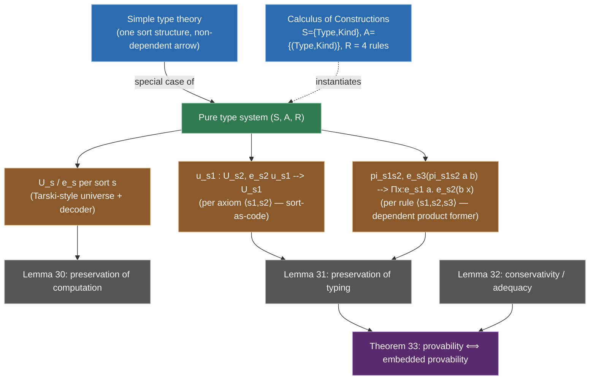

[[book-guidelines|↩ Back to guidelines]]

## Two roads into the same embedding

Sections 4 and 5 of the paper embed predicate logic by carving out a universe `o : Type` of propositions and an `eps : o -> Type` map from a proposition to the type of its proofs — Deduction modulo theory's move for turning "provable" into "inhabited." Section 6 poses a question the earlier material sets up but doesn't answer: what happens once the *logic itself* has an infinite family of types, not just an infinite family of propositions?

Simple type theory (STT), also called Higher-order logic, is exactly this situation. It's the simply-typed λ-calculus used as a logic: two base types, $\iota$ (individuals) and $o$ (propositions), closed under an arrow former, with implication and *quantification over every one of those types* as logical primitives — $\forall_A$ for each simple type $A$. The paper is explicit that there are two independent ways to land this in the $\lambda\Pi$-calculus modulo theory:

1. **Via Deduction modulo theory** (the Section 4.3 route) — treat STT as just another first-order-ish theory with its own rewrite rules, riding on the `eps` machinery already built.
2. **Directly as a Pure type system (PTS)** — treat STT as one instance of a *general* class of typed λ-calculi (Section 8.1), of which the Calculus of Constructions is the other running example in the paper.

Section 6 develops the direct PTS route for STT specifically, because it's small enough to motivate the general PTS machinery concretely before Section 8.1 states it in full generality. This article follows that order: STT's own embedding first, then the PTS abstraction it's secretly an instance of.

## Why STT can't just reuse the `Type`-level trick

Here's the concrete obstacle, and it's worth sitting with because it's the crux of the whole section (Key Question 1 in the guidelines' Topic List). In the predicate-logic embedding, `o` is *one* type, and it's a `Type`-level Dedukti declaration: `o : Type`. That works because predicate logic only ever needs to quantify over *terms*, using a single, fixed underlying domain (or, at most, finitely many typed domains fixed in advance).

STT has no such luxury. Its types are built compositionally — $\iota \to o$, $(\iota \to o) \to o$, $\iota \to \iota \to o$, and so on, unboundedly — and it needs a *quantifier* $\forall_A$ for *every one of them*. If you tried to mirror the predicate-logic approach directly, you'd need one `Type`-level symbol per simple type:

```
forall_iota      : (term_iota -> term_o) -> term_o .
forall_iota_o    : (term_iota_o -> term_o) -> term_o .
forall_iota_iota_o : ... -- and so on, forever
```

**[[Embedding-Predicate-Logic-in-a-Logical-Framework#What breaks|What breaks]] without a fix.** This is not merely inelegant — it's a signature you cannot finitely write down, because the family of simple types is closed under an infinitary-looking recursive construction (any two existing types combine into a new one via `arrow`). Section 2.2.4's "rule scheme" escape hatch (an algorithmically-recognizable *infinite* family of rules, where any one derivation only touches finitely many) helps with infinite theories, but declaring infinitely many distinct `Type`-level *symbols*, each with its own name, is a different and worse problem: there's no way to even parameterize over "which symbol" inside a single rewrite rule, because symbols aren't first-class terms.

The fix is the section's central idea, and it's the same idea that makes dependent type theory's universes work: **stop putting simple types at the `Type` level, and instead represent them as ordinary Dedukti *terms* of one fixed type, `type`.** A single `Type`-level declaration (`type : Type`) now stands for the whole (infinite, but uniformly structured) collection of simple types, and a *single* `forall` symbol can be indexed by an argument of type `type` to stand in for every $\forall_A$ at once.

```
type  : Type .
o     : type .
i     : type .
arrow : type -> type -> type .

def term : type -> Type .
imp    : term o -> term o -> term o .
forall : a : type -> ( term a -> term o ) -> term o .
```

Read this carefully, because the two-level structure is the whole trick:

- `type` is the type of Dedukti *terms that represent* simple types — `o`, `i`, and `arrow a b` are ordinary data, not new `Type`-level formers.
- `term : type -> Type` is a **type-indexed family**: for every representative `a : type`, `term a` is the actual Dedukti `Type` housing STT-terms of that simple type. This is the mechanism the paper's guidelines flag explicitly — a single `term` symbol, indexed by a term-level tag, standing in for infinitely many `Type`-level symbols.
- The bridge between the two levels is a rewrite rule, not a typing rule: `[a, b] term (arrow a b) --> term a -> term b`. This says: "the Dedukti type of STT-functions from `a` to `b` *is*, up to conversion, the ordinary Dedukti function-type `term a -> term b`." Without this rule, `term` would just be an opaque family with no relationship between `term (arrow a b)` and `term a`/`term b` — you'd have representamos of function types with no actual functions living in them.

The paper is careful to flag the naming collision this invites: don't confuse `type` (an ordinary Dedukti term, the object-language's notion of "a type") with `Type` (Dedukti's own sort for object-language *types*, i.e. what classifies `term a`). This is exactly the distinction between an object-level and a meta-level type former, and it's the same distinction a compiler author has to keep straight between "a `TypeId` value in my AST" and "the Rust type that AST node's payload actually has."

**Rust framing.** The `type : Type` / `term : type -> Type` split is precisely the difference between a *runtime type tag* and the actual Rust type it denotes — a distinction any interpreter for a typed language has to represent explicitly, because Rust's own type system can't be indexed by runtime values the way Dedukti's can:

```rust
// `type` (the STT notion) becomes an ordinary Rust *value* type — a tag:
enum STType {
    O,                                  // o
    I,                                  // i
    Arrow(Box<STType>, Box<STType>),    // arrow a b
}

// `term : type -> Type` becomes a function from that tag to an actual
// Rust representation of "terms of this STT-type" — but note Rust can't
// express this as a genuine type-level function the way Dedukti can;
// a real implementation erases to one untyped `Term` enum and checks
// well-typedness as a *predicate*, `has_type(term: &Term, ty: &STType) -> bool`,
// rather than getting `term(arrow a b) = term(a) -> term(b)` as a definitional
// equality the type-checker enforces for free. That equality is exactly
// what Dedukti's rewrite rule buys you and a naive Rust encoding does not.
```

This is a genuinely useful failure mode to notice: Dedukti's rewrite-rule mechanism lets `type`/`term` behave like a real Tarski-style universe (more on this below), with the indexing *computed into* the type-checker's conversion relation. A typed host language without dependent types has to fake this with a runtime `has_type` predicate instead — which is precisely why languages wanting this kind of indexed-family ergonomics (Lean, Idris, and this project's own planned refinement-type compiler) reach for dependent types rather than staying inside plain ADTs.

## The term embedding and its adequacy theorem

With `type`/`term`/`arrow` in place, the syntax of STT gets a completely uniform Dedukti term-language, restated here as **Definition 22**:

$$
\begin{aligned}
|x| &= x, \\
|\Rightarrow| &= \mathtt{imp}, \\
|\forall_A| &= \mathtt{forall}\,|A|, \\
|M\,N| &= |M|\,|N|, \\
|\lambda x{:}A.\,M| &= x{:}(\mathtt{term}\,|A|) \Rightarrow |M|.
\end{aligned}
$$

Notice that variables, application, and abstraction embed *homomorphically* — the interesting content is entirely in how the two logical primitives ($\Rightarrow$ and $\forall_A$) get named, and in `forall` taking its type index as an explicit first argument matching the earlier signature.

As in Section 4.2's predicate-logic embedding, proofs need their own home. The paper reuses the exact same `eps` idiom, now indexed onto `term o` instead of a bare proposition universe:

```
def eps : term o -> Type .

[p, q] eps (imp p q)   --> eps p -> eps q .
[a, p] eps (forall a p) --> x : term a -> eps (p x) .
```

The `eps (forall a p)` rule is the payoff of the whole `type`/`term` construction: it says a proof of $\forall_A\,p$ is a function taking *any* term of the represented type `a` (via `term a`, whatever `a` happens to be) to a proof of `p` applied to it — one rule, uniformly correct for every simple type, because `a` is a bound variable ranging over `type` rather than a fixed choice baked into the rule.

Call this whole signature $\Sigma_{STT}$. For a proposition $A$, define $\|A\| = \mathtt{eps}\,|A|$, and for a context $\Gamma = A_1, \dots, A_n$, define $\|\Gamma\| = h_1 : \|A_1\|, \dots, h_n : \|A_n\|$ for fresh variable names $h_i$. This lets the paper state the section's adequacy result:

> **Theorem 23** (Theorem 5.2.11 and Theorem 6.2.27 in [8]). $\Gamma \vdash A$ is provable in Simple type theory if, and only if, there is a $\lambda$-term $\pi$ such that $\Sigma_{STT}, \|\Gamma\| \vdash \pi : \|A\|$.

And crucially: $\pi$ is not some indirect encoding artifact — it's "a straightforward encoding of the original proof tree." This is the same shape of correctness guarantee Section 4's `Theorem 14`/`18` gave for predicate logic, and it's the promise that makes the whole enterprise trustworthy: checking a Dedukti term of type $\|A\|$ against $\Sigma_{STT}$ really is checking an STT proof, not checking membership in some accidentally-larger or accidentally-smaller language.

**What this buys in practice: HOL Light via HOLiDe (Section 6.2).** The embedding of Section 6.1 extends to classical variants of STT — in particular Q0, which takes equality as a primitive connective and underlies HOL Light. The **HOLiDe** translator ("holiday") builds on the OpenTheory project to translate real HOL Light proof libraries into Dedukti, additionally handling prenex polymorphism and constant/type definitions that the bare Section 6.1 core embedding doesn't cover on its own. The scale point is concrete: a 10 MB OpenTheory standard library becomes a 21.5 MB gzipped Dedukti library — this is the paper's evidence that the adequacy theorem isn't just a paper result but survives contact with a large, independently-developed proof corpus, and that the same translator route works for *any* HOL implementation that can export to the OpenTheory format.

## Generalizing: Pure type systems and Tarski-style universes

Section 8.1 steps back and asks: what was actually special about STT's construction, and what generalizes? A **Pure type system (PTS)** is specified by a triple $(S, A, R)$:

- $S$, a set of **sorts** (STT effectively has one relevant sort structure here, but the Calculus of Constructions, the paper's other running example, has two: $\mathit{Type}$ and $\mathit{Kind}$);
- $A \subseteq S \times S$, a set of **axioms**, each $\langle s_1, s_2\rangle$ saying "the sort $s_1$ itself is classified by $s_2$" (e.g. "$\mathit{Type} : \mathit{Kind}$");
- $R \subseteq S \times S \times S$, a set of **rules**, each $\langle s_1, s_2, s_3\rangle$ saying "a dependent product $\Pi x{:}A\,B$, with $A$ of sort $s_1$ and $B$ (under $x{:}A$) of sort $s_2$, itself has sort $s_3$."

This is precisely the standard PTS presentation from the literature — the paper's contribution (building on prior work, [32]) is showing this whole specification schema translates uniformly into $\lambda\Pi$-calculus-modulo-theory rewrite rules, generalizing the STT-specific `type`/`term`/`arrow` trick above into a **Tarski-style universe** construction indexed by sort.

The generalization is a direct, almost mechanical lift of the STT pattern, sort by sort:

**Per sort** $s \in S$: declare a universe `U_s` (the analogue of `type`, but now one per sort rather than one overall) and a dependent family `e_s` (the analogue of `term`) mapping a representative of `U_s` to the actual `Type` it denotes:

```
U_s   : Type .
def e_s : U_s -> Type .
```

**Per axiom** $\langle s_1, s_2 \rangle \in A$: declare a term `u_s1 : U_s2` — the representative, *inside* the universe of $s_2$, standing for the sort $s_1$ itself — and unfold what it denotes via a rewrite rule:

```
u_s1 : U_s2 .
[ ] e_s2 u_s1 --> U_s1 .
```

This is the Tarski-style universe idiom in its purest form: `u_s1` is a *code* for the sort $s_1$, living as data inside $s_2$'s universe, and `e_s2` is the *decoding* function turning that code into the actual type it names. This is exactly Lean/Agda-style `Type u : Type (u+1)` machinery: a sort is simultaneously a classifier (something things have as their type) and, one level up, an inhabitant of a further classifier — and a Tarski-style universe is what makes that inhabitant *computable back into* the type it stands for, rather than staying purely notional.

**Per rule** $\langle s_1, s_2, s_3\rangle \in R$: declare a dependent-product former `pi_s1s2` targeting `U_s3`, together with the rule that says what type it actually denotes once decoded:

```
pi_s1s2 : a : U_s1 -> b : (e_s1 a -> U_s2) -> U_s3 .
[a, b] e_s3 (pi_s1s2 a b) --> x : e_s1 a -> e_s2 (b x) .
```

Compare this directly against Section 6.1's `[a,b] term (arrow a b) --> term a -> term b`: it's the *same* pattern, generalized to allow the domain and codomain to live in different (or the same) sorts, and to allow the *codomain* to genuinely depend on the bound variable `x` (`b x`, not just `b`) — because a general PTS's products are dependent products, where STT's `arrow` was only ever non-dependent function space. STT turns out to be the special case of one sort with a trivial (non-dependent) product rule — which directly answers the guidelines' framing of STT "as an independent system versus as an instance of a Pure type system."

**Definition 29** collects the embedding exactly as Section 6.1's Definition 22 did, but parametrically in sorts:

$$
\begin{aligned}
|x| &= x, \\
|s| &= u_s, \\
|M\,N| &= |M|\,|N|, \\
|\lambda x{:}A.\,M| &= x{:}\|A\| \Rightarrow |M|, \\
|\Pi x{:}A.\,B| &= \mathtt{pi}_{s_1 s_2}\,|A|\,(x{:}\|A\| \Rightarrow |B|) \quad (\text{when } \Gamma \vdash A : s_1 \text{ and } \Gamma, x{:}A \vdash B : s_2),
\end{aligned}
$$

with $\|A\| = \mathtt{e}_s\,|A|$ when $\Gamma \vdash A : s$, and $\|s\| = \mathtt{U}_s$ when $s$ is a top sort (no $s'$ with $\Gamma \vdash s : s'$) — contexts embed pointwise, $\|\Gamma, x{:}A\| = \|\Gamma\|, x{:}\|A\|$.

### The three correctness results, and why they're stated separately

The paper doesn't just assert this embedding "works" — it isolates three distinct properties, each doing a different job, and this separation is itself worth internalizing as a template for verifying *any* embedding of a source calculus into a target kernel:

> **Lemma 30 (Preservation of computation).** If $\Gamma \vdash M : A$ and $M \longrightarrow_\beta M'$, then there exists $N'$ such that $|M| \longrightarrow_\beta N' \equiv_{\beta\Sigma} |M'|$.

This says the embedding doesn't have to preserve reduction *step-for-step* (the target may take extra unfolding steps of its own rewrite rules), but the two sides always land in the same conversion class. It's a soundness-for-computation guarantee: the embedding can't make two things that were equal in the source become inequal in the target, or vice versa.

> **Lemma 31 (Preservation of typing).** If $\Gamma \vdash M : A$, then $\Sigma, \|\Gamma\| \vdash |M| : \|A\|$.

This is the direction that matters for *checking real proofs*: every well-typed source derivation translates into a well-typed target derivation. Without this, translating a HOL Light or Coq-CIC library into Dedukti (Section 6.2, and later Section 9's Matita work) would be unsound — you could accidentally certify garbage that was never a real proof.

> **Lemma 32 (Conservativity, adequacy).** If $\Sigma, \|\Gamma\| \vdash M' : \|A\|$, then there exists $M$ such that $\Gamma \vdash M : A$ and $|M| \equiv_{\beta\eta\Sigma} M'$.

This is the *converse* direction, and it's the one that's easy to underrate: it says the embedding doesn't accidentally admit *more* proofs than the source system has. Without conservativity, a translated library might be checkable in Dedukti for reasons that have nothing to do with the original system being sound — the embedding could be leaking extra proof power from Dedukti's own ambient machinery. Together, Lemmas 31 and 32 give:

> **Theorem 33.** There exists $M$ such that $\Gamma \vdash M : A$ if, and only if, there exists $M$ such that $\Sigma, \|\Gamma\| \vdash M : \|A\|$.

— provability in the PTS is *equivalent* to provability in the embedding, not merely implied by it in one direction. This preservation/conservativity/equivalence triple is the general pattern the whole paper repeats for every embedding it builds (predicate logic's Theorem 14/18, STT's Theorem 23, and here the fully general PTS version) — and it's worth naming explicitly as the proof obligation any "compile theory X into framework Y" project has to discharge, not just "does it type-check on my test cases."



### Worked instance: the Calculus of Constructions

The paper closes Section 8.1 by instantiating the general schema on a concrete, two-sort PTS — the Calculus of Constructions:

$$
S = \{\mathit{Type}, \mathit{Kind}\}, \quad A = \{(\mathit{Type}, \mathit{Kind})\}, \quad
R = \{(\mathit{Type},\mathit{Type},\mathit{Type}), (\mathit{Type},\mathit{Kind},\mathit{Kind}), (\mathit{Kind},\mathit{Type},\mathit{Type}), (\mathit{Kind},\mathit{Kind},\mathit{Kind})\}
$$

Two sorts means two universes and their decoders:

```
U_Type : Type .
U_Kind : Type .

def e_Type : U_Type -> Type .
def e_Kind : U_Kind -> Type .
```

One axiom, $\langle \mathit{Type}, \mathit{Kind}\rangle$, gives exactly one "sort-as-code" declaration:

```
u_Type : U_Kind .
[ ] e_Kind u_Type --> U_Type .
```

Four rules give four product formers — one per way a $\Pi x{:}A\,B$'s domain-sort/codomain-sort pair can combine (this is precisely what lets the Calculus of Constructions express both ordinary functions, $\mathit{Type}\to\mathit{Type}\to\mathit{Type}$, and polymorphism, where a *type* depends on a *value*, or vice versa — Kind-sorted quantification over Type-sorted arguments):

```
pi_TypeType : a : U_Type -> b : (e_Type a -> U_Type) -> U_Type .
pi_TypeKind : a : U_Type -> b : (e_Type a -> U_Kind) -> U_Kind .
pi_KindType : a : U_Kind -> b : (e_Kind a -> U_Type) -> U_Type .
pi_KindKind : a : U_Kind -> b : (e_Kind a -> U_Kind) -> U_Kind .

[a,b] e_Type (pi_TypeType a b) --> x : e_Type a -> e_Type (b x) .
[a,b] e_Kind (pi_TypeKind a b) --> x : e_Type a -> e_Kind (b x) .
[a,b] e_Type (pi_KindType a b) --> x : e_Kind a -> e_Type (b x) .
[a,b] e_Kind (pi_KindKind a b) --> x : e_Kind a -> e_Kind (b x) .
```

The paper then works a genuinely small but illustrative derivation. Take the context $\Gamma = a{:}\mathit{Type}, b{:}\mathit{Type}, x{:}a, f{:}\Pi p{:}(a\to \mathit{Type})\,(p\,x \to b)$; the term $f\,(\lambda y{:}a.\,a)\,x$ is a proof of $b$. Its Dedukti representation is:

```
a : U_Type .
b : U_Type .
x : e_Type a .
f : ( p : ( e_Type a -> U_Type ) -> e_Type ( p x ) -> e_Type b ) .

def example : e_Type b := f ( y : e_Type a => a ) x .
```

Every piece of the derivation is visible in the translated types: `f`'s type is the pi-rule pattern spelled out concretely (`p : (e_Type a -> U_Type) -> ...`, i.e. `Πp:(a → Type). ...`), and `example`'s declared type `e_Type b` is exactly $\|b\|$ under Definition 29's context-embedding convention. There's no encoding indirection left to squint at by this point — it reads as literally the same derivation, just with $|{\cdot}|$ and $\|{\cdot}\|$ applied uniformly.

**Lean framing.** This Tarski-style `U_s`/`e_s`/`u_s1`/`pi_s1s2` machinery is, almost verbatim, what Lean's own universe hierarchy does under the hood, just with sorts specialized to a linear order of universe levels rather than an arbitrary PTS's $(S,A,R)$: `Sort u` (Lean's `U_s`, parameterized by a level `u` instead of a named sort) classifies types at level `u`; `Type u := Sort (u+1)` is Lean's fixed "axiom," $\langle u, u{+}1\rangle$; and Lean's own $\Pi$-former (`(x : A) → B x`) is exactly `pi_s1s2` with Lean choosing the target level by the max-of-domain-and-codomain rule instead of a general PTS's arbitrary $R$. When Lean reports a universe error ("motive is not type correct" or a `max u v` mismatch), it is, under the hood, failing exactly the side-condition this section's `pi_s1s2 : a : U_s1 -> b : (e_s1 a -> U_s2) -> U_s3` encodes: which sort *is* $s_3$, given $s_1$ and $s_2$, is not free — the PTS's $R$ relation (or Lean's `max`/`imax` rule) pins it down, and getting it wrong is exactly a universe-inconsistency bug.

## Where this leads

Section 6/8.1's construction is the direct template for everything the paper does afterward with types-of-types: Section 8.2 layers inductive types and their eliminators *on top of* this PTS embedding (the Calculus of Inductive Constructions is "CoC plus constructors and `elim_list`-style recursors," reusing `U_Type`/`e_Type` unchanged), and Section 8.3's cumulative universe hierarchy is the same `U_s`/`e_s` pattern indexed by a natural number instead of a fixed finite sort set, with an explicit `lift` operator solving the representation-uniqueness problem that a naive $U_i \subseteq U_{i+1}$ identification would create. Section 9's report on translating Matita's library is a direct empirical test of Theorem 33's conservativity half at scale.

For this project's **type-theory** focus area, this topic is close to load-bearing rather than merely illustrative. The `U_s`/`e_s` Tarski-universe idiom *is* the mechanism a Rust-based elaborator/kernel needs if it wants universe polymorphism to be more than a fixed, closed-world special case — representing a universe level as *data* the kernel computes over (as `u_s1`/`pi_s1s2` do here) rather than as a meta-level parameter hardcoded per instantiation is exactly the difference between "my kernel has three copies of the typing rules, one per hardcoded level" and "my kernel has one indexed family of typing rules." And the preservation/conservativity/equivalence triple (Lemmas 30–32, Theorem 33) is the right shape of correctness statement to demand of *any* elaboration or lowering pass in such a compiler — including the metavariable-elaboration pass itself: an elaborator that inserts implicit arguments and metavariable placeholders is, in exactly this sense, translating a surface-language derivation into a core-language one, and "does elaboration preserve provability, and not manufacture extra provability," is the elaborator's own Theorem-33-shaped soundness obligation.
