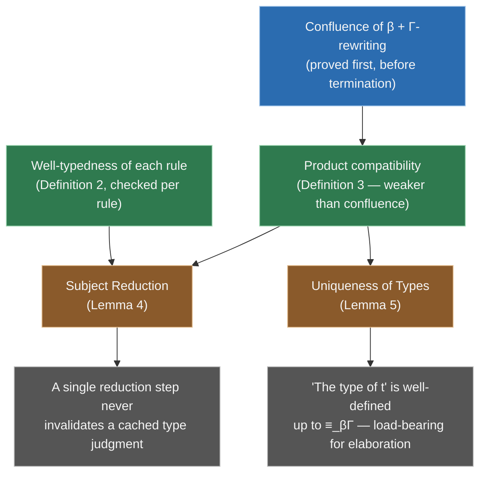

[[book-guidelines|↩ Back to guidelines]]

## Why the λΠ-calculus alone isn't enough

The plain λΠ-calculus (covered in the companion article on [[The-Lambda-Pi-Calculus-and-Its-Typing-Judgments|typing judgments]]) gives you dependent types and one, fixed notion of computation: β-reduction. That's enough to type-check a dependently-typed program, but it is *not* enough to embed an arbitrary theory. Recall the paper's own motivating complaint from Section 1: in plain predicate logic, proving $2 \times 2 = 4$ requires a chain of deduction steps, because predicate logic has no notion of computation at all — multiplication is just a predicate satisfying some axioms, and "unfolding" it is a proof, not a calculation.

The λΠ-calculus modulo theory's answer is blunt: let a *theory* itself extend what counts as "the same term." Concretely, it lets you declare **rewrite rules** — like $2 \times 2 \longrightarrow 4$ — directly in the typing context, so that the calculus's built-in conversion rule (the one that already lets you interchange β-equal types silently) now also treats rewrite-equal terms as interchangeable. Computation and deduction stop being different things; computation is just deduction that the type-checker does for free, without you ever writing a proof step for it.

This is the technical core of *Deduction modulo theory*, and it's also, not coincidentally, exactly the mechanism a refinement-type checker needs. If your surface language lets you write a specification like `Vec { len: n | n > 0 }` and your solver needs to know that `len(append(v, w)) == len(v) + len(w)` computes, you need *some* notion of definitional equality that reaches past pure syntax into domain-specific computation. Section 2.2 of the paper is where that notion gets its formal definition — and where its costs (soundness obligations) get paid.

## 2.2.1 — Global contexts carry rules, local contexts don't

The plain λΠ-calculus has one context, $\Gamma$, holding variable declarations. The λΠ-calculus modulo theory needs to distinguish **two** kinds of context, because rewrite rules bind their own local variables and those variables must never be confused with the "real," typeable variables of the ambient program.

- A **global context** $\Gamma$ holds both variable declarations *and* rewrite rules — it's the entire "world" a derivation can draw on.
- A **local context** $\Delta$ holds *only* object-variable declarations: variables whose type itself has type $\mathit{Type}$ (not $\mathit{Kind}$). $\Delta$ is used exclusively to scope the variables of a single rewrite rule.

The paper introduces a third judgment form, $\Gamma \vdash \Delta \; \mathrm{local}$, meaning "$\Delta$ is a valid local context relative to $\Gamma$," with two rules:

$$
\dfrac{\Gamma \; \mathrm{well\text{-}formed}}{\Gamma \vdash [\,] \; \mathrm{local}}
\qquad\qquad
\dfrac{\Gamma \vdash \Delta \; \mathrm{local} \quad \Gamma, \Delta \vdash A : \mathit{Type}}{\Gamma \vdash \Delta, x{:}A \; \mathrm{local}}
$$

Note the second rule's premise: $A$ must have type $\mathit{Type}$, not $\mathit{Kind}$. That's the entire content of "local contexts only bind object variables" — it rules out a rewrite rule that quantifies over a type family. **Lemma 1** then says the obvious but load-bearing thing: if $\Delta$ is local in $\Gamma$, then $\Gamma, \Delta$ is itself a well-formed global context. So a local context is nothing metaphysically new — it's just a *guarantee* that some tail segment of a context contains no kind-level declarations, which lets the rule's variables be substituted for freely without worrying about kind-level dependencies leaking in.

A **rewrite rule** is then a pair of terms $\langle l, r \rangle$ together with a local context $\Delta$ local in $\Gamma$, written

$$l \longrightarrow_\Delta r$$

where $l$ has the shape $f\,u_1 \dots u_n$ for some variable $f$ (the rule's *head symbol*). Declaring a rule extends the global context:

$$
\dfrac{\Gamma \; \mathrm{well\text{-}formed} \quad \Gamma \vdash \Delta \; \mathrm{local}}{\Gamma, l \longrightarrow_\Delta r \; \mathrm{well\text{-}formed}}
$$

Notice what this rule does *not* require: $l$ and $r$ need not have the same type, or any type at all, to be *declared*. Well-formedness here is purely a syntactic admission check — "the rule's local context is valid" — not a soundness check. The soundness obligations (Section 2.2.3) are deliberately factored out into a separate, stronger judgment. This separation is itself a design lesson: a checker's *parser/elaborator* (which context entries can I even write down?) and its *soundness gate* (which of those entries may I actually trust?) don't have to be the same pass.

**Rust framing.** Think of the global context as a compiler's combined symbol table and rewrite-rule database — the entire persistent state a checker consults:

```rust
enum CtxEntry {
    /// Γ, x : A  — a declared variable (object- or kind-level)
    VarDecl { name: Symbol, ty: Term },
    /// l -->_Δ r, with Δ's bindings recorded alongside the rule
    RewriteRule {
        local_ctx: Vec<(Symbol, Term)>, // Δ: object-level only, by construction
        lhs: Term,                       // f u1 ... un
        rhs: Term,
    },
}

struct GlobalContext(Vec<CtxEntry>);
```

The type of `local_ctx` doing double duty as "Δ" is the whole point: nothing in this representation lets you accidentally bind a *type-family* variable inside a rule's local context — you'd have to smuggle a `Kind`-sorted entry into a `Vec` that's documented (and, in a real implementation, statically enforced) to hold only object-level bindings. That's Lemma 1 turned into an invariant a type-checker's data structures maintain rather than re-derive every time.

## 2.2.2 — Conversion, extended by a user-declared congruence

With rewrite rules sitting in $\Gamma$, the next step is to fold them into the calculus's notion of "the same term." Define the rewriting relation generated by $\beta$-reduction *and* $\Gamma$'s rules, $\to_{\beta\Gamma}$, as the smallest context-closed relation such that:

- if $t$ $\beta$-reduces to $u$, then $t \to_{\beta\Gamma} u$, and
- if $t$ matches some rule's left-hand side $\sigma l$ (for a substitution $\sigma$ binding $\Delta$'s variables) and $u = \sigma r$, then $t \to_{\beta\Gamma} u$.

The **congruence** $\equiv_{\beta\Gamma}$ is the reflexive-symmetric-transitive closure of $\to_{\beta\Gamma}$ — i.e. "convertible," in both directions, by any finite mix of β-steps and rule-steps. The conversion rule is then *exactly* the plain λΠ-calculus's conversion rule with $\equiv_\beta$ replaced by $\equiv_{\beta\Gamma}$:

$$
\dfrac{\Gamma \vdash A : \mathit{Type} \quad \Gamma \vdash B : \mathit{Type} \quad \Gamma \vdash t : A \quad A \equiv_{\beta\Gamma} B}{\Gamma \vdash t : B}
\qquad
\dfrac{\Gamma \vdash A : \mathit{Kind} \quad \Gamma \vdash B : \mathit{Kind} \quad \Gamma \vdash t : A \quad A \equiv_{\beta\Gamma} B}{\Gamma \vdash t : B}
$$

This is a genuinely small edit to the calculus — one relation gets swapped for a bigger one — but its consequences ripple through everything else, because it means *type-checking is now parametric in an arbitrary, user-supplied theory*. Any two terms the theory declares equal are, from the type-checker's point of view, as interchangeable as $(\lambda x.\,x)\,y$ and $y$.

**Lean framing (this is where Lean should be primary, per the source material being exactly type-theoretic).** Lean's kernel already implements a $\to_{\beta\Gamma}$-shaped relation, just with a fixed, closed-world $\Gamma$ instead of an arbitrarily user-extensible one: `whnf`/`isDefEq` normalizes not only by β but also by δ-reduction (unfolding `def`s), ι-reduction (recursor computation), and ζ-reduction (let-unfolding). `rfl` succeeds exactly when both sides are related by this extended congruence:

```lean
def two : Nat := 2
def double (n : Nat) : Nat := n + n

-- Lean's kernel unfolds `two` and `double` (δ) and then computes `2 + 2` (ι/whnf)
-- until both sides land on the same normal form — this *is* ≡_βΓ, with Γ fixed
-- to "every def and instance in scope" instead of an open rewrite-rule set.
example : double two = 4 := by rfl
```

The λΠ-calculus modulo theory generalizes exactly this mechanism: instead of "unfold every `def`," the congruence is "rewrite by every declared rule," and rules need not come from unfolding a definition at all — they can encode a domain theory's own equations directly (Peano arithmetic's $2\times 2 \longrightarrow 4$, or, as later sections show, a logical connective's own computational meaning). For a refinement-type checker's subtyping/equality obligations, this is the mechanism that lets `isDefEq(spec_expr_1, spec_expr_2)` reach past syntax into whatever computation the specification language needs — pattern unification (a later topic) is what makes solving *for* the substitution in this equality tractable when metavariables are involved.

**[[Embedding-Predicate-Logic-in-a-Logical-Framework#What breaks|What breaks]] without it.** Without extending conversion, every equation your theory needs becomes a proof obligation instead of a silent normalization step. Concretely: if $2 \times 2 \longrightarrow 4$ isn't wired into $\equiv_{\beta\Gamma}$, then a term of type `Vec (2*2)` and a term of type `Vec 4` are *not* interchangeable without an explicit coercion/proof term threading them together — exactly the ergonomic disaster dependently-typed programming without good defeq is famous for.

## 2.2.3 — Subject reduction and uniqueness of types are not free

Here's the catch: extending conversion to an arbitrary user-declared relation makes type soundness fall out of your hands. Nothing stops someone from declaring a rewrite rule that rewrites a `Nat` into a `Bool`, or a proof of `True` into a proof of `False`. So the paper isolates exactly the two hypotheses that restore soundness.

**Definition 2 (well-typed rule).** A rule $l \longrightarrow_{\Delta_0} r$ declared in $\Gamma_0$ is *well-typed* for a well-formed extension $\Gamma$ of $\Gamma_0$ if, for every substitution $\sigma$ binding $\Delta_0$'s variables:

$$\text{if } \Gamma \vdash \sigma l : T, \text{ then } \Gamma \vdash \sigma r : T$$

In words: the rule is type-preserving no matter how you instantiate its local variables. This is subject reduction's hypothesis stated *per rule*, before it's proved as a theorem about the whole system.

**Definition 3 (product compatibility).** $\Gamma$ satisfies product compatibility if, for any two well-typed products $\Pi x{:}A_1\,B_1$ and $\Pi x{:}A_2\,B_2$:

$$\text{if } \Pi x{:}A_1\,B_1 \equiv_{\beta\Gamma} \Pi x{:}A_2\,B_2, \text{ then } A_1 \equiv_{\beta\Gamma} A_2 \text{ and } B_1 \equiv_{\beta\Gamma} B_2$$

This is an *injectivity* property for $\Pi$: two convertible products must have convertible domains and convertible codomains, componentwise. The paper is careful to note this follows from confluence of $\to_{\beta\Gamma}$ but is strictly weaker than it — you can have product compatibility without full confluence, which matters because (as the next section shows) confluence for an arbitrary rewrite theory is exactly the hard, undecidable-in-general property you're trying to avoid needing.

From these two hypotheses:

> **Lemma 4 (Subject Reduction).** If $\Gamma$ satisfies product compatibility and all its rewrite rules are well-typed, and $\Gamma \vdash t_1 : T$ with $t_1 \to_{\beta\Gamma} t_2$, then $\Gamma \vdash t_2 : T$.

> **Lemma 5 (Uniqueness of Types).** If $\Gamma$ satisfies product compatibility, and $\Gamma \vdash t : T_1$ and $\Gamma \vdash t : T_2$, then $T_1 \equiv_{\beta\Gamma} T_2$.

Both lemmas are quietly doing a lot of work for anything downstream that wants to call this system a *trusted kernel*. Subject reduction is the type-theoretic half of type soundness ("well-typed programs don't get stuck *or change type* as they run") — without it, a kernel could type-check a term, watch it reduce one step under its own rewrite rules, and now be holding an ill-typed or wrongly-typed term, silently. Uniqueness of types is what makes "the type of $t$" a meaningful phrase at all (up to $\equiv_{\beta\Gamma}$, since syntactically many different-looking types can be the same type) — a bidirectional elaborator that infers a type for a term and later needs to check it against an expected type is implicitly leaning on this lemma every time it treats "the inferred type" as *the* type rather than *a* type.



**Rust framing.** Subject reduction is precisely the invariant that lets a proof-checker's core loop *cache* type judgments instead of re-verifying them after every normalization step:

```rust
// Invariant guaranteed by Lemma 4, given well-typed rules + product compatibility:
//   if check_type(&t1) == Ok(ty) and step(&t1) == Some(t2)
//   then check_type(&t2) == Ok(ty)   // same `ty`, not just "some type"
//
// Without this, a checker could not trust a type it computed before a
// term got reduced (e.g. during unification/normalization inside `isDefEq`)
// — it would have to re-typecheck from scratch after every rewrite step,
// which is both expensive and, worse, not obviously well-founded if the
// rewrite system doesn't terminate.
fn step(t: &Term) -> Option<Term> { /* one β or Γ-rule reduction */ unimplemented!() }
fn check_type(t: &Term) -> Result<Term, TypeError> { unimplemented!() }
```

This is exactly why Dedukti (and any kernel built this way) is trustworthy only *up to* whatever proof obligation discharges Definitions 2 and 3 for its declared theory — the "small trusted kernel checking large libraries" story that motivates the whole paper depends on these two properties holding for every theory anyone plugs in.

**What breaks without it — concretely.** If a rewrite rule is declared without being well-typed (Definition 2 fails), you can, in general, construct a term whose type changes under reduction, and from there derive an inhabitant of any type you like — the entire point of a trusted kernel (checking foreign proofs cheaply and soundly) collapses, because the kernel would be certifying nonsense.

## 2.2.4 — Rule schemes for theories with infinitely many rules

Some theories can't be given a *finite* set of axioms — arithmetic and set theory are the classic examples, needing an axiom *scheme*: an infinite but algorithmically-recognizable family of axioms (e.g. one induction axiom per formula). Predicate logic handles this by relativizing provability: $T \vdash A$ for a scheme $T$ means either the infinite sequent has a proof, or — equivalently, and more usefully — there's some *finite* subset $\Gamma \subseteq T$ such that $\Gamma \vdash A$ has a proof.

The λΠ-calculus modulo theory adopts exactly the same move for symbols and rewrite rules. A theory may declare infinitely many symbols and infinitely many rules — as long as the whole family is recognized by an algorithm — because contexts in the calculus are always finite by construction (they're built by finitely many applications of the context-extension rules). So derivability of $t : A$ is defined as: there exists *some* finite context $\Gamma$ (drawn from the infinite scheme) such that $\Gamma \vdash t : A$ is derivable.

This is a small paragraph in the paper, but it quietly licenses everything from Section 8 onward: a cumulative universe hierarchy $U_0 \subseteq U_1 \subseteq \cdots$ needs infinitely many universe-indexed symbols; the Calculus of Inductive Constructions needs, in principle, an elimination rule shape per inductive type ever declared. None of that is a problem *because any single derivation only ever touches finitely many of them* — the scheme is a generative template, not a context you'd ever have to load in full.

**Rust framing.** This is the same relationship a generic function has to its monomorphized instantiations. `fn map<T, U>(...)` together with a trait bound is, in effect, a rule *scheme* — infinitely many concrete instantiations are licensed by the generic definition, but any one compiled binary only ever monomorphizes finitely many of them, the ones actually reachable from `main`. The scheme lives in the source; only a finite slice of it is ever "in context" for a given compilation. A CSP/constraint-generation front end facing a similarly schema-shaped theory (e.g. "one non-linear-arithmetic lemma per bit-width," or a family of ADT-destructor lemmas indexed by constructor) can use the identical move: keep the generator, materialize only the finitely many instances a given verification condition actually mentions.

## Where this leads

Section 2.2 hands the rest of the paper its single reusable trick: *a theory is nothing more than a set of declarations and rewrite rules in a context* (explicitly echoed in the paper's own closing reframing in Section 10). Every embedding from Section 4 onward — predicate logic's connectives, classical double-negation, Simple type theory, programming-language operational semantics, the Calculus of Inductive Constructions — is executed by writing down rewrite rules and leaning on this section's guarantee that, *provided* those rules are well-typed and product compatibility holds, the resulting system is still sound (subject reduction) and still has a well-defined typing discipline (uniqueness of types).

What Section 2.2 does *not* give you is decidability: nothing here says $\equiv_{\beta\Gamma}$ can actually be checked by an algorithm, only that *if* it holds, typing behaves. That's the subject of the next topic, **[[Decidability-via-Effective-Subsystems|Decidability via Effective Subsystems]]** (Section 2.3, `automated-reasoning` + `type-theory`) — confluence proved before termination, Miller's pattern fragment as the tractable restriction on left-hand sides, and the "most general typing substitution" trick (the `Tail`/`Cons` example) that rescues rules whose left-hand side isn't itself well-typed. That machinery is the direct ancestor of the metavariable unifier this project's elaborator needs: pattern unification is precisely what makes solving *for* a substitution against a rewrite-rule-shaped equation decidable, the same way Definition 2's "for any substitution $\sigma$" here is what a bidirectional checker's unifier has to actually search over at run time, not just quantify over abstractly. And the well-typedness/product-compatibility pairing in 2.2.3 is the direct model for any Hoare-triple or refinement-type kernel's own soundness argument: prove the *primitive* rewrite/computation steps preserve typing, and get "the whole system preserves typing" for free by induction — the same shape of argument this project's trusted kernel will need for its own verification-condition-discharging reductions.
